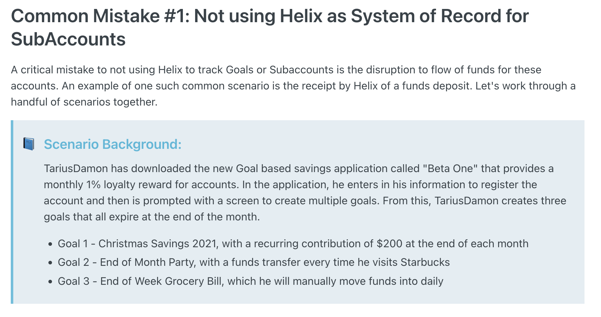

# Banking Core FAQs

|  | Bank License |  |  |
| --- | --- | --- | --- |
| Green Dot | Yes |  |  |
| Q2 |  |  |  |
| Synapse |  |  |  |
| Cross River |  |  |  |
| Galileo |  |  |  |
| Unit |  |  |  |
| Agora |  |  |  |
| Marqeta |  |  |  |
| Bond |  |  |  |
| Treasury Prime |  |  |  |
| Column |  |  |  |
1. [ ]  https://www.greendot.com/business-solutions/developer
    - TODO:
        - [] have to [contact the biz dev department](https://www.greendot.com/business-solutions/contact) in order to see the actual documentation 
        - [] what are "purses"? 
    - _Green Dot handles everything needed to run end-to-end embedded financial BaaS programs, including account origination, payments, compliance and fraud, and card issuance. Green Dot offers Restful APIs for customers and can provide white label apps. The company offers a suite of financial products to consumers and busi- nesses, including debit, prepaid, checking, credit and payroll cards, as well as mon- ey processing services, tax refunds, cash deposits and disbursements._ [cite](https://tearsheet.co/wp-content/uploads/2021/05/BaaS-Guide-2021-Ad-1.pdf)
        - Uber partnered with them to issue debit cards for earn-waged access 
        - Stash partnered with them to do a Stock-based Card that enables spenders to earn rewards in stocks 
    - They appear to have 6 core APIs
        1. Enrollments
            - enrollment + account creation + payment instrument all appear to happen withing a single API call 
            - the arguments are: 
                - user data (name + address + social security + date of birth + email address + phone number) 
                - account information (direct deposit info, account or purse information, account holder information)
        2. Users & Accounts
            - retrieves and update the following
                - personal information 
                - transaction history
                - account details 
                - account balances
                - available statements
                - identity verification
        3. Payment Instruments
            - enables the creation, replacement and activation of both physical and virtual cards
            - includes re-setting a PIN
        4. Transfers
            - enables moving money to and from internal accounts, external accounts, purses 
        5. ATM Locator
            - enables users to find nearby ATMs
        6. Webhooks
            - enables notifications of certain events that happen within a user's account
            - Examples include
                - transactions
                - account updates
                - statement availability 
                - ACH transfers
                - user updates 
                - batch closures 
    - They offer UX testing in a "partner integration environment" (PIE)
2. [Helix by Q2](https://helix.q2.com/developers)
    - _Q2’s cloud-based core allows it to extend favorable economics to its clients. Q2 BaaS tech isn’t middleware that sits on a legacy core._ [cite](https://tearsheet.co/wp-content/uploads/2021/05/BaaS-Guide-2021-Ad-1.pdf)
        - They power Credit Karma, Betterment, Gusto
        - Lorenzo really likes the practical scenarios used to discuss Common Mistakes and suggests we use our own fintech partners as case studies 
            - 
    - API analysis 
        - They don't do webhooks, but instead use Azure Service Bus 
        - Overview 
            - Each object has a customerId and tag and common actions (create, initiate, verify, archive, get, getByTag, list)
            - _"A common mistake we see developers make is attempting to cache-in account and transactional data from Customers as a kind of pseudo-system of record. The critical mistake here is that an account, the balances of that account, the beneficiaries, and other transactional information can all be updated out of band from the application calling the API."_
        - Key Objects
            1. Customer 
                - tracks sensitive info
                    - for humans
                        1. attestation
                        2. driver's license
                        3. foreign documents
                            - DriversLicense
                            - ConsularIdCard
                            - Passport
                            - PermanentResidentCard
                            - EmploymentAuthorizationCard
                            - VoterRegistrationCard
                            - IdentificationCard
                        4. taxId
                            - Social Security Number (SSN)
                            - Individual Taxpayer Identification Number (ITIN)
                    - for businesses 
                        1. attestation 
                        2. business legal name (includes DBA)
                        3. industryClassificationCode
                        4. taxId
                            - Employer Identification Number (EIN)
                    - tracks the legal entity type
                        - Individual
                        - SingleMemberLLC
                        - SCorporation
                        - CCorporation
                        - SoleProprietorship
                        - NonProfit
                        - Association
                        - Partnership
                        - LimitedLiabilityCompany
                        - LimitedLiabilityPartnership
                        - RevocableTrust
                        - IrrevocableTrust
                        - FinancialInstitutionOther
                        - Estate
                        - Trust
                        - Church
                        - Conservator
                        - Guardianship
                        - Government
                        - Cooperative
                        - BCorporation
                        - TottenTrustPOD
                        - LimitedPartnership
                        - GeneralPartnership
                        - GovernmentDepartment
                        - GovernmentAgency
                        - GovernmentAuthority
                        - GovernmentNonCommercialNonUSDepartmentOrAgency
                        - GovernmentOther
                        - RegulatedFinancialInstitution
                        - RegulatedBankLoanHoldingsCompany
                        - RegulatedSavingsAndLoanHoldingCompany
                        - ForeignFinancialInstitutionRegulatorKeepsUBOInfo
                    - the reason the business is exempt from Beneficial Ownership is classified with the followign types 
                        1. UsStockExchangeTradedEntity
                        2. CharityOrNonProfitEntity
                        3. PublicAccountingFirmRegisteredUnderSection102
                        4. UsStateRegulatedBank
                        5. UsRegulatedInsuranceCompany
                        6. UsRegulatedFinancialInstitution
                        7. UsFederalGovernmentAgency
                        8. UsStateGovernmentAgency
                        9. UsLocalGovernmentAgency
                        10. NonUsGovernmentAgency
                        11. BankHoldingCompany
                        12. SavingsAndLoanHoldingCompany
                        13. FinancialMarketUtility
                        14. NonUsEntityOpeningAPrivateBankingAccount
                        15. ForeignFinancialInstitution
                        16. ClassOfSecuritiesIssuer
                        17. SecCurrentRegisteredFirm
                        18. CommodityFuturesTradingCommissionRegisteredEntity
                        19. ExcludedPooledInvestmentVehicle
                        20. NonExludedPooledInvestmentVehicle
                        21. UsStockExchangeMajorityEquityEntity
                - can be accessed through either /`customer/getByTag` (by using an id that is generated by the front-end and passed as a `tag` during customer creation) or through /`customer/Get` (by using the id generated by Helix)
                    - `customerId` is a unique ID assigned by Helix during `/customer/create`
                    - `tag` is the unique identifier assigned by the front-end  
                - tracks the on-boarding status 
                    - if legacy onboarding API endpoints were used  
                        - Initiated
                        - Manual Review
                        - Verified (as opposed to Active)
                    - otherwise
                        - Active    
                    - Denied
                    - Expired
                    - Archived
                    - Deceased
                - security functions
                    1. Fraud status 
                        - Verified
                        - Denied
                        - Automated Review
                        - Manual Review
                        - Null/Blank
                    2. tracks the status of a locked customer, including date and the reason the customer was locked
                    3. Last activity and last contact 
                - compliance functions
                    1. KYB date and status 
                        - Initiated
                        - Manual Review
                        - Verified
                        - Denied
                        - Expired
                        - Deceased
                        - Archived
                        - Automated Review
                    2. KYC date and status
                        - Verified
                        - Denied
                        - Automated Review
                        - Manual Review
                        - Null/Blank
                - tracks whether a user is subject to [backup witholding](https://www.irs.gov/taxtopics/tc307.html)
                                    - _"Helix will withhold the appropriate
                percentage of earned interest and submit these funds
                directly to the IRS. The amount withheld will be reported on the annual 1099-INT generated by Helix."_
                                - supports custom fields to save information otherwise not already included 
            2. Account
                - "Supports concept of a goal via account properties"
                    - it does so through `target` properties which track a user's contribution journey until `availableAmount` reachers a certain point
                - not the same as an External Account (I.E. a bank account with another financial institution)
                - `availableBalance` is the amount that can be immediately withdrawn
                    - for DDA accounts, the credit is immediate
                    - for savings or FBO accounts there maybe be a hold time between when the trasnaction gets settled and when the funds are available
                - `pendingBalance` 
                    - When a deposit transaction is initiated, it doesn’t immediately reflect in the account’s `availableBalance`. Instead, it is marked as "pending" and adds to the pendingBalance. Once the transaction settles (i.e., the funds are fully transferred and verified), `pendingBalance` is decreased by the amount that was pending. 
                    - Immediate deposits, which settle instantly, do not affect this balance.
                - `productId` is the unique ID of the product (from the Program) to which the account is associated
                    - the types of product are
                        1. Checking
                        2. Savings (RegD restrictions apply)
                        3. Prepaid
                        4. ForBenefitOf (A more restrictive dda account)
                - `regDWithdrawalCount` tracks withdrawal on a savings product which will lead to a fee at the end of the month
                - recurring contributions can be setup according to parameters (amount, start date, end date...)
                    - the contributions can come from an External Account
                - primary owners have higher priority over join owners 
                - limits can be put on the account (although it seems limited to ACH)
                    - `stopPay` enables users to set mins and maxes can be applied to payment amounts as well as blacklisting other entities from charging the account
                - locks can be put on an account (by the customer or admin system) for the following reasons 
                    1. UNK: Unknown
                    2. FRD: Fraud investigation
                    3. ADM: Administrative
                    4. TMP: Temporary
                    5. FRZ: Freeze
                    6. SUS: Suspected fraud
                    7. CO: Credits only
                    8. RTN: Return Risk
                    9. REC: Recovery
                    10. DED: Deceased
                    11. DOR: Dorman
            3. External Account
                - Real-time routing number verification via the Federal Reserve
                - Account number verification via Trial Deposits
                - Funds can be transferred between Helix accounts and accounts at other financial institutinos
                    - a customer is limited in the number of external accounts they can have by the `perUserExternalAccountCountMax` set in the Program
                - it saves the account number and routing number from the external bank, and once verified a unique Id is assigned by Helix
                    - verification customer ownership of an external account prior to initiative transfers can be done in 2 ways
                        1. Instant Verification
                            - _"Most programs opt to use an Instant Account Verification (IAV) service such as Plaid"_
                            - customer enters online banking credentials into the IAV service, who then validates and returns account number and routing number that are used to create a new account on Helix
                        2. Micro-deposits
                            - customer enters account and routing info which Helix uses to create an account with "unverified" status 
                        - Helix then sends (through ACH) 2 small deposits (<$0.49) which the customer then enters at a later date (~3 days bc of ACH) to update the account status to "verified" 
                - status options
                    1. Unverified
                    2. VerifyLocked
                    3. Verified
                    4. Denied
                    5. Expired
                    6. Archived
                - types of accounts
                    1. Savings
                    2. Checking
                    3. Business Checking
                    4. Business Savings
                    5. Prepaid
                    6. Loan
            4. Transaction  
                - /transfer/create is the endpoint used to create a transaction
                that includes any movement of funds
                    1. interest paid
                    2. manual adjustments
                    3. debit card transactions
                    4. incoming ACH requests
                - IDs 
                    1. `accountId` links to the Account and `customerId` links to the Customer that owns the bank account
                    2. `cardId` is generated by Helix for the Card that created the transaction 
                        - Will be left empty or 0 if the transaction is not associated with a Card 
                    3. `cardMerchantInfo` contains the meta-data from the merchant  
                        - it includes city, country, location, state, zip code 
                        - `merchantGroupcode` is a super-set of several Merchant Category Codes
                        - `merchantId` identifies the merchant that accepted the card
                    4. Whenever possible `institutionName` records the name of the financial institution that originated the transaction
                    5. `masterId` is a unique identifier created by Helix used to group related transactions together, such as
                        - an ACH withdrawal and a subsequent return. 
                        - A debit card authorization and its corresponding completion(s). 
                        - A mobile check deposit return and its corresponding original mobile check deposit.
                    6. `requestingCustomerId` identifies who requested the transaction if they are not the business costumer who owns the Account 
                    7. `transactionTag` tags a transfer between funds with a tag setup in the Program
                    8. `transactionId` is a unique ID generated by Helix 
                - they record how the transaction state changes through status and dates
                    1. Initiated: Transaction has been created but not yet put into a NACHA file
                        - `createdDate` records the exact date and time in the time zone local to the bank
                    2. Pending: Transaction has been created and put into a NACHA file
                    3. Settled: Transaction has been posted to the account
                        - `settledDate` and `statementDate` record the exact date and time in the time zone local to the bank
                        - `availableDate` records exactly when the funds associated with the transaction became available
                        - `runningAccountBalance` is the `accountBalance` of the Account AFTER settlement occurs
                    4. Voided: Transaction has been voided
                        - `voidedDate` records the exact date the transaction was voided in the bank's local time zone
                            - _"Transactions that are initiated via the /transfer/create route with external bank accounts (or via a recurring contribution) can be voided as long as the ACH request has not yet been delivered to NACHA."_
                        - `returnCode` is a NACHA return code that explains why the transaction was returned
                - they categorize the transaction by the nature of the transaction (`isCredit`, `isEarlyDirectDeposit`, `isSameDaySettle`) and its descriptions and codes
                    1. `description` is the description that must be displayed to the end user by law
                        - _"If transaction was received from a Nacha file (typeCode is UNKWTH, UNKDEP, UNKPRG) this property contains the description verbatim from the Nacha file. "_
                            - `nachaInfo` holds the info from externally-originated ACH deposits 
                        - _"If transaction was received from an ISO-8583 interface (i.e. debit card transaction), this property contains description verbatim from DataElement 43 (Card Acceptor Name/Location) of ISO-8583 interface plus details of any fees or surcharges that may have been incurred."_
                        - _"Otherwise, the transaction was received from a call to Helix API or it was line item in the Bulk Transfer File."_
                    2. `feeCode` and `feeDescription` are formal 
                        - ACH: Same Day ACH Fee
                        - DAF: Dormancy Fee
                        - IAF: Inactivity Fee
                        - ICF: International Card Fee
                        - NSF: Insufficient Funds Fee
                        - RGD: Regulation D Fee
                        - RTN: Return Item Fee
                    3. `friendlyDescription` are generated by Helix through `typeCode`
                        - `subTypeCode` is the Merchant Category Code (which groups merchants of similar kinds of businesses) that generates the `subType` description
                        - `typeCode` is the [Transaction Type](https://docs.helix.q2.com/docs/transaction-types) that then generates `type` which is a human-readable description  
                    4. `purposeCode` is alphanumeric identifier describing the purpose of the transaction that is provided to the third-party fraud and risk vendor 
                        - _"These values are agreed upon by the bank of record and client during onboarding"_
            5. Card
                - "Integrated with debit rails via ISO-8583 interface" 
                - Real-time locking and unlocking 
                - Real-time notifications about success/failure of the transaction
                - Each card is a debit card issuedby Helix that is connected to either a savings or checking Account
                    - "To correlate a specific card in Helix to a specific card record in your system, store your system's unique key in the tag property, or store Helix's cardId in your system."
                - Steps to creating a physical card
                    1. /card/initiate
                    2. Physical card gets printed and shipped to the customer
                    3. Customer is prompted to activate their card, which triggers /card/verify
                    4. Card is activated 
                - Properties 
                    - A single customer can have multiple cards.. A single account can be tied to multiple cards.
                        - `accounts` is an array of Accounts because a single card can be tied to multiple accounts (4 checking, and 4 savings)
                            - beyond the regular Account properties (`accountBalance`, `availableBalance`, `pendingBalance`, `status`, `type`) it also has `cardPriority`(whose values will be between 1 and 4 inclusive) which is not explained in the documentation but I think refers to the scenario where a transaction is attempted and insufficient funds are present in the primary account thus the system attempts to draw funds from the next account in the priority order
                        - `binId`
                            - BIN (Bank Identification Number) is a unique identifier that represents a specific range of card numbers assigned by a card network provider (like Visa or Mastercard). It is used to identify the issuer of the card and the card's type so that the transactions can be routed to the correct network
                            - in Helix, `binId` links to a specific BIN configuration (which includes details like the card's PAN prefix and network provider type) from the Program
                        - `customerId` is the unique id of the customer who called /card/initiate	
                            - the initator must be "verified" and `accessTypeCode` "FULL"
                        - `cardHolderCustomerId` identifies the customer who is in possession of the card (which is why it defaults to `customerId` if the value is null)
                            - the holder must be a "verified" Customer who has `accessTypeCode` of "FULL", "ACCT", or "CARD"
                        - `cardId` is the uniqueId assigned by Helix
                            - `tag` is where the user id from the front-end can be stored to associate the card
                        - `primaryAccountId` is the `acccountId` of the default Account (which must have `type` of "Checking") for the card 
                    - dates track the status of a card
                        - `requestedDate` --> `createdDate` --> `verifiedDate` (or `deniedDate`) --> `archivedDate` 
                        - they can be set to expire through `expireMonth` and `expireYear` --> `expiredDate`
                    - card classification 
                        - `typeCode` defaults to "DBT" (Debit) but can be GPR ("General Purpose Pre-paid")
                        - `vendorTypeCode` is either "VS" (Visa) or "MC" (Mastercard)
                        - `isDigitalOnly` is "true" if the card was created thrugh /card/createDigital or card/initiate with `isCreateDualIssuanceSinglePAN` set to "true" and `IsPhysicalCardOrdered` set to "false"
                        - `isDualIssuanceSinglePAN` tells if the card is functional as a digital card for use with mobile wallets
                            - `digitalWalletTokens` is an array of `digitalWalletToken` which is created when a customer provisions a card into a digital walleter
                    - card locking
                        - `lockTypeCode` tells the type of lock applied to the card
                            - "UNL" is unlocked
                            - "CST" is Customer Locked via /card/unlock
                            - "SYS" is System Locked by the admin console or automated process 
                            - Admin user specifies whether the Customer can unlock the card 
                                - customers can unlock most CST locks but none
of the SYS locks
                        - `lockReasonTypeCode` tells the reason the card was locked
                            - some can be set and removed easily
                                - UNK: Unknown
                                - FRD: Suspected Fraud
                                - DMG: Physical Damage
                                - TMP: Temporary
                            - some are set via /card/hotlist API route only and cannot be subsequently unlocked.
                                - STL: Stolen
                                - LST: Lost
                            - some can be set via Admin Console or background processing only.
                                - ADM: Administrative
                                - PIN: PIN Retries Exceeded
                    - status
                        - Initiated
                        - Pending
                        - PendingVerification
                        - Verified
                        - Denied
                        - Expired
                        - Archived
                        - Reissued
                        - HotListed
                        - ReissuedPendingVerification
                        - AutoReissuedPendingVerification
                        - DigitalActivePhysicalInitiated
                        - DigitalActivePhysicalPending
                        - AutoReissueInitiated
                        - ReissueStaged
                    - limits of purchases and withdrawals
                        - `bankCeiling` is the bank-level `purchaseLimit` and `withdrawalLimit`
                        - `effectiveDailyLimits` is the program-level purchase and withdrawal limit
                        - `programDefault` is the standard limits set for the program, applicable to all users by default.
                        - `limitGroupOverride` is the custom limits applied to a specific card, overriding the default program limits.
                        - `temporaryOverride` is temporary limits which expire after a set period
                    - `cardControl` has `rules` which is an array of `cardControlRule` objects that each contain the rules applied to the debit cards set by a `source` (either "Customer" or "Program")
                        - _"Each cardControlRule object is a rule you’re applying to the targeted Helix debit card, which is how we can support multi-tenancy with any combination of program applied or customer applied rules within the same card control object."_
                        - supports both `domestic` and `international`
                        - `limit` which is the max amount after which the transaction is automatically declined
                        - `entryMethod` is array of allowed PAN entry method(s). 
                            - CP: Card Present
                            - DP: Device Present
                            - CNP: Card Not Present
                            - IAP: In App Purchase
                        - `mccs` are the Merchant Category Codes and `merchantGroups` are teh Merchant Group Codes
            6. Program 
                - it represents each business on Helix, and contains the settings to be applied to all customers, accounts, transactions, and products 
                - an array of accounts is connected to a specific sponsor bank's object
                    - a single customer can have multiple accounts (including external accounts), subject to limits defined in the program
                - an array of products offered by the program
                - daily and monthly and per-transaction limits for deposits and withdrawals 
                    - a fee can be charged when a customer goes over the limit
                - recurring contributions and debit rewards 
                - a list of algorithms approved for use by the program needed by any public key encryption required by the API.
            6. Bank Document
                - it represents a document issued by a bank that a customer must indicate they have read and accepted during customer/account creation
                - supports a variety of document types 
                    1. TermsAndConditions
                    2. PrivacyPolicy
                    3. TruthInSavings
                    4. eStatement
                    5. ConsumerDepositAgreement
                    6. FeeSchedule
                    7. ReferAFriend
                    8. EftInfo
                    9. ProductInfo
                    10. CardInfo
                    11. FeeDisclosure
                - each document has an id and is attached to a program and a bank's unique id  
                - the url for the pdf is saved alongside an html version 
            7. Transfer
                - A `customerId` (the Helix-assigend unique ID for the Customer) initiates the transfer from `fromId` (an `accountId` or `externalAccountId` indicating where the funds are being withdrawn from) to `toId` (also an `accountId` or `externalAccountId` where the funds are deposited)
                - the transaction is classied through `amount`, `tag`, `description` and `purposeCode` (identifier created by the bank that is sent to the 3rd party risk manager)
                - peer-to-peer transfers need be approved by both Q2 and the bank partner
                    - if the receiver of the funds is different from the sender, then `toCustomerId`, `toCustomerTag`, `toTransactionTag` is used to log the transfer
                - TransferResponse
                    - `customerId` for the customer initiating the transfer
                    - `masterId` groups related transactions
                    - `tag` is the frontend label
                    - `transactionId` is a NACHA-compliant unique idnetifier for the single transfer
                - transfers take different times based on the type of transfer
                    - Transfers between accounts owned by the same Customer settle immediately 
                        - the ACH network is not used therefore they have no [Originating Depository Financial Institution](https://en.wikipedia.org/wiki/Originating_Depository_Financial_Institution) 
                        - this is true even for "reserve accounts" (I.E. special-purpose accounts used for activities relating to the Program that need to be kept separate from standard checking and savings, such as managing reserves and operational funds)
                    - an Account "pushing" to an External Account or an Account "pulling" from an External Account settle in a matter of business days
                        - Day 1 is when Helix initiates the transaction (which can be any time), and Day 2 is when Helix submits the ACH via NACHA (which has to be a business day), so everything gets moved in case of a weekend or bank holiday
                        - the ODFI is Helix in this case
                    - Receiving an ACH via NACHA to "pull" funds out of an Account and "push" funds into an Account settles immediately
            8. Statement
                - Helix creates monthly bank statements and yearly tax (1099) of different types
                    1. Monthly
                    2. Quarterly
                    3. Tax1099INT
                    4. Tax1099MISC
                - they each have their own `statementId` and they are connected to a `customerId`
            9. Costumer Due Diligence
                - "/program/questionsList" gets questions from Program
                - "/customer/answerPost" records a Customer's answers that can be retrieved " /customer/answerList" retrivers a Customer's answers
                - DueDiligenceCategory
                    - `categoryDescription`
                    - `categoryId`
                    - `questions` is an array of DueDiligenceQuestion
                        - `questionName` and `questionId`
                        - `answerDate`
                        - `answerType`
                            1. `Single-Select`
                            2. `Multi-Select`
                            3. `Text`
                        - `choices` is an array DueDiligenceChoice 
                            - `choiceId`
                            - `answeredDate`
                            - `choiceDescription` and `choiceName`
                            - `followUpQuestionIds` array of `questionId` to be asked if the customer selects this choice
                    - `followupQuestions` is an array of DueDiliegenceQuestions triggered by answers to `question`
                - DueDiligenceAnswer 
                    - `questionAnswer` if `DueDiligenceQuestion` has `answerType` of "text"
                    - `questionId`
                    - `selectedChoices` is an array of DueDiligenceSelectedChoices
                        - `choiceId` Helix-assigned unique ID for the DueDiligenceChoice
                        - `choiceName` 
            10. Customer Relationship
                - an object that formalizes the relationship between `primaryCustomerId` and `relatedCustomerId`
                    - the `relationshipType` is classified through the following:
                        1. Signer
                        2. Owner
                        3. NonTransactional
                        4. BeneficialOwner
                        5. Trustee
                        6. SuccessorTrustee
                        7. Guardian
                        8. Conservator
                        9. Executor
                        10. Agent
                        11. PowerOfAttorney
                        12. Custodian
                        13. Administrator
                        14. Fiduciary
                    - `isBeneficialOwner` and `beneficialOwnerPercentage` track whether the related Customer owns a company account that is technically under the company's name
                - permission system is based on `isPrimaryContact`, `isControlPerson`, `canOpenAccounts` 
                    - `externalAccountAccessType` clarifies the access `relatedCustomerId` has over the External Accounts of `primaryCustomerId`
                        - FULL
                        - RDLY (Ready-only)
                        - ACH
                        - NONE
            11. Customer Document
                - the document that the Customer uploads to prove their identity 
                - `documentId` and `tag` make it applicable 
                - `documentContent` is a base64-encoded representation of the actual content of the document uplodated through "/customerDocument/upload" 
                - `documentName` requires a file extension that is supported 
                - `documentType` can be: 
                    - for adults
                        - DriversLicense
                        - UtilityBill
                        - BankStatement
                        - NameChangeAffidavit
                        - WrittenStatementOfUnauthorizedDebit
                        - Unspecified
                        - VerificationSummary
                        - DisputeDocumentation
                        - HoldNotice
                        - DriversLicenseBack
                        - PassportFront
                        - PassportBack
                        - UnspecifiedIdCardFront
                        - UnspecifiedIdCardBack
                        - SelfPortrait
                    - for minors
                        - BirthCertificate
                        - SocialSecurityCardFront
                        - SocialSecurityCardBack
                        - SchoolIDFront
                        - SchoolIDBack
                    - for businesses
                        - DBAStatementOfFiling
                        - FictitiousBusinessName
                        - BusinessLicenseShowingCurrent
                        - AttestationDocument
                        - CertificateOfPartnership
                        - PartnershipAgreement
                        - ProofOfAddress
                        - ArticlesOfOrganization
                        - CertificateOfFormation
                        - CertificateOfOrganization
                        - SecretaryOfStateRegistration
                        - ProofOfGoodStanding
                        - CorporateAuthorization
                        - EINLetter
                        - ArticlesOfIncorporation
                        - Charter
                        - TrustDocuments
                        - CurrentSecretaryOfStateRegistration
                        - CourtDocuments
                        - TrustCertificate
                - `reasonType` shows why the document needed to be uploaded
                    -  NameChange
                    - AddressChange
                    - RequestForNewExternalAccount
                    - Unspecified
                    - ManualReview
                    - ReturnOnTransaction
                    - VerificationSummary
                    - DisputeDocumentation
                    - HoldPlaced
                    - AutomatedReview
                    - Remediation Document
                - External Account Document enables Customers to prove their own an External Account 
                    - `documentType` is limited to 
                        - DriversLicense
                        - BankStatement
                    - `reasonType` is limited to
                        - NameChange
                        - AddressChange
                        - Unspecified
            12. Customer Beneficiary 
                - identifies the `customerBeneficiaryId` and `taxId` of who should receive the funds if the `customerId` dies 
                - `createdDate` -> `isDocumentsAccepted` --> `documentsAcceptedDate`
        - Backend processes
            1. ACH Processing Including Same-day ACH
            2. Monthly or Quarterly interest payment (daily accrual)
            3. Daily file generation: Customer Registrations, Customers, Account Balances, and Posted Transactions
            4. Event Notification File - keep your data in sync with Helix's 
            5. Goal target met processing
            6. Bulk Transfers
            7. Monthly statement generation
            8. Quarterly OFAC re-verification
            9. Annual 1099-INT statement generation
            10. Daily Recon and Trial Balance calculation
            11. Monthly RegD fee calculation
        - [Debit Cards Processes](https://docs.helix.q2.com/docs/debit-card-process)
            - Issuance sequence: card/initiate --> card/resetPin --> card/provision/applePay or card/provision/googlePay (if `dualIssuanceSinglePlan` is true) --> card/orderPhysical if `orderPhysicalCard` is set to true, otherwise card/createDigital --> card is received by Customer --> Customer verifies the card with card/verify
            - "Standard renewal" uses the default renewal eligiblity criteria, whereas "Custom renewal" (which requires bank approval) allows for individualized criteria for the card 
                - "Custom renewal" is not available for cards with the following statuses
                    - Archived
                    - AutoReissuedPendingVerification
                    - Denied
                    - Expired
                    - Hotlisted
                    - Initiated
                    - Pending
                    - AutoReissueInitiated
            - A "Projection Report" is generated on the first calendar day of the month prior to the card expiration date, and a CSV file is generated for each program and it's then delivered via SFTP
                - `ExclusionReason` classifies why the card is not eligible for renewal
                    - Already Renewed
                    - Positive Balance Required
                    - Invalid Account Status
                    - Digital Issuance Dual PAN: Invalid Card Status
                    - Digital Issuance Single PAN: Invalid Card Status
                    - Invalid Physical Card Status
                    - Renewal Override: Do Not Renew
                    - Renewal Override: Invalid Card Status
                    - Renewal Override: Invalid Card Status
                - A "Confirmation Report" shows the outcome of the renewal process for each of the cards in the "Projection Report"
                    - `ActualReasonRejected` uses the same options as `ExclusionReason`
            - Immediate Renewal and Renewal Overrides can fail for the following reasons
                1. the Program is not authorized to use the renewal end-points 
                2. the card cannot be renewed before the renewal period (the 1st day of the month prior to the card expiration month)
                3. the card is not longer eligilbe for automatic renewal and thus must be reissued 
                4. the card's status is not verified 
                5. the card is already expired so it must be re-initiated 
                6. the card is already renewed
        - [Batch Processing](https://docs.helix.q2.com/docs/sftp-overview)
            - Helix throttles their API at 15 requests per second per API key
                - As the calls from a single API key reach 80% of the limit, the reponse will include _"a throttle node which contains useful information on how close you are to reaching the call limit."_
            - For bulk changes, the user can send files to Helix (and vice versa) through SFTP with the following delivery frequency 
                - Multiple times a day
                    - Admin Activity Files
                    - Bulk Account Lock Process, Unlcok Process, and Transfer process
                    - Card Event Notification File
                - Once a day 
                    - ACH Transaction File
                    - "Account Balance File"    
                    - Card Transaction File
                    - Customer File and Customer Registration File
        - [] [Event Types](https://docs.helix.q2.com/docs/event-types)
        - [] [Payload Types](https://docs.helix.q2.com/docs/payload-types)
    - Takeaways
        - Here's a list of security measures they adhere to 
            1. Annual PCI Compliance Level 1 Audit
            2. Annual SOC 2 Audit
            3. HTTPS TLS 1.1+ for API
            4. SFTP for file transfer
            5. IP whitelisting for API and SFTP server access
            6. Fully encrypted TLS 1.2 internal network communications
            7. AES-256 encryption for sensitive data at rest
            8. PCI compliant key management (annual key rotations, multiple active keys, key custodians, etc) for PAN and other PCI-sensitive data
            9. Optional PGP encryption for files sitting on SFTP server
3. [Column](https://column.com/docs/guides/getting-started-with-the-column-api)
    - Overview 
        - _"Every account is created with a default_account_number, however you can create multiple account numbers that are associated with this account. You can view them as pointers to that bank account - however, they are all valid account numbers that you can send ACH and Wires from. You can create and remove them without interfering with the underlying bank account."_
            - "A unique aspect of Column is we have decoupled accounts and account numbers. You can think about each account number as a pointer to a bank account. Column does not ledger at the account number level, only the account level. " 
                - "Historically, as banks were tied to legacy cores, their systems linked an account number to a bank account one to one. You can have infinite account numbers point to a single bank account. Our approach allows you to create account numbers at will." 
            - "We're planning on allowing you to set restrictions on these account numbers. These may include send-only or receive-only restrictions, transaction size or total volume limits, or restrictions on name/sender/receiver." 
        - /simulate/* routes simulate production behavior but are not available in prod
        - "You'll receive a webhook to remain updated as the ACH transfer goes through every step of the process and finally settles in the destination account. " 
        - Column uses basic auth where the API key (pre-fixed with either `test_` for sandbox or `live_` for production) serves as the basic password for the API calls 
        - "We do have the ability to whitelist access to the API from specific IP ranges. If this is of interest to you, we're happy to chat." 
        - Their API supports pagination with customizable parameters like `starting_after`, `ending_before`, `limit` 
        - Results of successful requests with `Idempotency-Key` will be saved and returned on every subsequent request with the same `Idempotency-Key`.
        - Errors have several attributes
            - `type` = The overarching category of the error.
                1. "authentication_error" = Issues related to API authentication. 
                2. "bank_account_error" = Issues related to bank accounts.
                3. "dashboard_error" = Issues related to dashboard operations.
                4. "entity_error" = Issues related to entities, KYC/KYB, etc.
                5. "loan_error" = Issues related to loans
                6. "server_error" =	Issues related to Column's systems. 
                7. "transfer_error" = Issues related to transfers.
                8. "validation_error" =	Issues related to request schema, such as missing a parameter
            - `code` =	The specific error as short string that can be handled programmatically. Lots of [codes](https://column.com/docs/workingwithapi/errors) that can be boiled down to general categories
                1. Validation (`account_information_mismatch`, `amount_precision_not_supported`, `bank_account_not_found`, `invalid_account_structure`, `invalid_address`, `invalid_beneficiary_account`, `invalid_cancellation_reason`, `invalid_charge_bearer`, `invalid_country_code`, `invalid_currency_code`, `invalid_date`, `invalid_document_type`, `invalid_email`, `invalid_entity_type`, `invalid_event_type`, `invalid_fdic_insurance_type`, `invalid_field_value`, `invalid_interest_config`, `mandatory_parameter_missing`, `routing_number_not_found`)
                2. Permission (`cancellation_not_allowed`, `deletion_not_allowed`, `drawdown_not_allowed`, `force_settle_not_allowed`)
                    - this includes `entity_not_verified`, `feature_not_enabled`
                3. Support (`country_not_supported`, `currency_not_supported`)
                4. Foreign Exchanges (`fx_quote_book_failed`, `fx_quote_cancel_failed`, `fx_quote_different_amount`, `fx_quote_expired`, `fx_quote_query_failed`, `fx_quote_rate_date_cutoff_missed`, `fx_quote_rate_date_too_far`, `fx_quote_reuse`, )
                5. Funds (`limit_exceeded`, `transfer_non_sufficient_fund`, `overdraft_not_allowed`, `payoff_not_allowed`, )
                6. Transfers (`transfer_invalid_amount`, `transfer_invalid_destination_account`, `transfer_invalid_return_request`, `transfer_return_deadline_passed`, `transfer_no_beneficiary_information`)
            - `message` = a human readable error message meant to be read by a developer, 
            - `documentation_url` = a link to the most appropriate API doc for this error.
            - `details` =	An object with key-value pairs that may provide more details about the error. 
                - Ex.  a parameter validation error will have the list of parameters that are invalid with reasons. 
        - "Only one webhook endpoint on your platform can receive events of the same type. If you create two endpoints, both of which are configured for all ach event types, only the webhook created first will be notified of ACH events. " 
            - "All webhook endpoints must be configured with https URLs that accept POST requests with JSON payloads." 
            - "Our webhook system does NOT guarantee that events will be delivered in the same order as they are created." 
    - API Analysis 
        - `Platform` represents the fintech partner as the company
            - `Root Entity` represents the fintech partner as a user, and it owns `Root Accounts` to run the business as well as any of ther special account needed to run the business
        - `Entity` represent a customer who owns a `Bank Account`
            - Entities can have any number of accounts, with one or multiple account numbers.
        - `Bank Account` 
            - A Demand Deposit Account (DDA) is what we consider a legal bank account. This is a standalone account with one or many account numbers. 
            - A virtual account is not a legal bank account, but an object used for ledgering transactions. 
            - A "For the Benefit of" (FBO) account describes a compilation of entities and account objects under a single root entity.
            - accounts have 3 types of balances
                1. `available_balance` = money available to spend 
                2. `pending_balance` = total amount of transfers that are pending and that will affected `available_balance` upon settlement
                3. `locked_balance` = locked funds in a `Platform` that are held `Root Account` that cannot be withdrawn by `overdraftable` accounts
        - `Loan` is its own object that is connected to an `Entity` at same level as a `Bank Account` 
            - `disbursement` is a transfer of funds from a `Loan` to a `Bank Account` 
                - `principal_balance` starts at 0 and increases with `disbursement` which also results in an increase of a `available_balance`
            - `payment` is a fund transfer from `Bank Account` to `Loan` that reduces `principal_balance` and `balance`
            - "The bank account specified in disbursements and payments must be a Column bank account. This allows Column to automatically handle tricky situations, such as returns and chargebacks. To get funds from a loan to an external bank account or to make a payment from an external bank account to the loan, funds must be first transferred to a Column bank acccount through ACH or Wire." 
        - `Counterparty` stores an external routing number and bank account and can also store additional transaction detail
        - `Transfer` both ledgers events on an account and moves and receives money 
            1. ACH Transfer through FedACH
                - "We plan to enable support for TCH's ACH and RTP system in the future"
            2. Domestic Wire Transfer through FedWire
            3. International Wire Transfer through Swift
            4. Check Transfers 
            5. Book Transfers = ledger event that immediately moves funds between accounts within the same `Platform` 

    - Takeaways
4. [ ] https://api.agoracoretech.com/docs/v2/
5. [ ]  https://www.unit.co/docs/api/
6. [ ]  https://www.lead.bank/baas-partner-platform
7. [ ]  https://www.marqeta.com/docs/developer-guides/
8. [ ]  https://docs.bond.tech/docs/welcome-introduction
9. [ ]  https://docs.treasuryprime.com/docs/getting-started
10. [ ] https://docs.synapsefi.com/
11. [ ] https://www.crossriver.com/developers
12. [ ] https://docs.galileo-ft.com/pro/reference/program-api-intro
13. [ ]  https://www.alkami.com/

---

# what are the relevant regulation/compliance/audit requirements/standards?

we have identified the following requirements and standards:

- requirements
- standards
    - payment card industry data security standard (PCI DSS)
    - statement on standards for attestation engagements (SSAE)
        - system and organization controls (SOC)
    - [open banking](https://www.openbanking.org.uk)
    - [FFIEC IT examination handbook](https://ithandbook.ffiec.gov)
    - [ISO/IEC 27001](https://www.iso.org/standard/27001) (infosec)

we do not mention AML/KYC above, because we consider those requirements to apply broadly beyond the banking core.

---