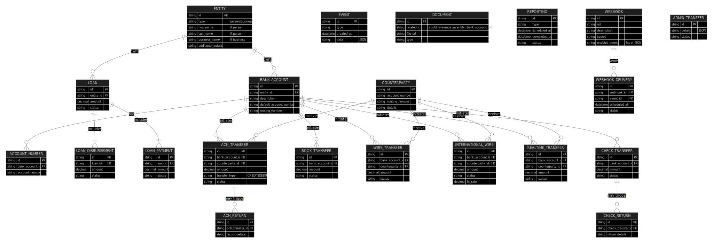

## Textual Diagram

```
Column API
├── Authentication
│   └── Basic Auth (API key: test_/live_) over HTTPS
│
├── Entity
│   ├── Person Entity Object
│   │   ├─ **Parameters:** first_name, last_name, ssn, date_of_birth, email, address (line1, city, state, postal_code, country_code), plus internal fields (e.g. person_details, verification_tags)
│   │   ├─ **Endpoint:** POST /entities/person  (Create a legal person entity)
│   │   └─ **Endpoint:** PUT/PATCH /entities/person  (Update a legal person entity)
│   │
│   ├── Business Entity Object
│   │   ├─ **Parameters:** business_name, registration_number, business_details, verification_tags, etc.
│   │   ├─ **Endpoint:** POST /entities/business  (Create a legal business entity)
│   │   └─ **Endpoint:** PUT/PATCH /entities/business  (Update a legal business entity)
│   │
│   ├─ **Endpoint:** GET /entities/{id}   (Retrieve an entity by ID)
│   ├─ **Endpoint:** DELETE /entities/{id}   (Delete an entity)
│   └─ **Endpoint:** GET /entities   (List all entities)
│       └─ (Also: document submission endpoint for entity-related documents)
│
├── Bank Account
│   ├── Bank Account Object
│   │   ├─ **Parameters:** entity_id, description, default_account_number, routing_number, etc.
│   │   ├─ **Endpoint:** POST /bank-accounts   (Create a new bank account)
│   │   ├─ **Endpoint:** GET /bank-accounts   (List all bank accounts)
│   │   ├─ **Endpoint:** GET /bank-accounts/{id}   (Get a bank account by ID)
│   │   ├─ **Endpoint:** PUT/PATCH /bank-accounts/{id}   (Update a bank account)
│   │   └─ **Endpoint:** DELETE /bank-accounts/{id}   (Delete a bank account)
│   │
│   ├── Bank Account Summary Object
│   │   └─ **Endpoint:** GET /bank-accounts/{id}/summary   (Get bank account summary history)
│   │
│   └── Overdraft Alert Object
│       └─ (Triggers/notifications for overdraft events)
│
├── Account Number
│   ├── Account Number Object
│   │   ├─ **Endpoint:** POST /account-numbers   (Create a new account number)
│   │   ├─ **Endpoint:** GET /account-numbers   (List account numbers for a bank account)
│   │   └─ **Endpoint:** GET /account-numbers/{id}   (Retrieve an account number)
│
├── Loan
│   ├── Loan Object
│   │   ├─ **Endpoint:** POST /loans   (Create a new loan)
│   │   ├─ **Endpoint:** GET /loans   (List all loans)
│   │   ├─ **Endpoint:** GET /loans/{id}   (Retrieve a loan by ID)
│   │   └─ **Endpoint:** PUT/PATCH /loans/{id}   (Update a loan)
│   │
│   ├── Loan Disbursement
│   │   ├─ **Endpoint:** POST /loans/{id}/disbursements   (Create a disbursement)
│   │   ├─ **Endpoint:** PUT/PATCH /loans/{id}/disbursements   (Update/Clear/Cancel disbursement)
│   │   └─ **Endpoint:** GET /loans/{id}/disbursements   (Retrieve disbursement details)
│   │
│   └── Loan Payment
│       ├─ **Endpoint:** POST /loans/{id}/payments   (Create a payment)
│       ├─ **Endpoint:** GET /loans/{id}/payments   (Retrieve payment details)
│       └─ **Endpoint:** GET /loans/{id}/all-payments   (List all payments)
│
├── Counterparty
│   ├── Counterparty Object
│   │   ├─ **Endpoint:** POST /counterparties   (Create a counterparty)
│   │   ├─ **Endpoint:** GET /counterparties   (List all counterparties)
│   │   ├─ **Endpoint:** GET /counterparties/{id}   (Get counterparty by ID)
│   │   └─ **Endpoint:** DELETE /counterparties/{id}   (Delete a counterparty)
│   │
│   ├── Financial Institution Object
│   │   └─ **Endpoint:** GET /financial_institutions   (Retrieve financial institution details)
│   │
│   └── IBAN Validation
│       └─ **Endpoint:** POST /validate-iban   (Validate an IBAN)
│
├── ACH Transfer
│   ├── ACH Transfer Object (includes IAT sub-object)
│   │   ├─ **Endpoint:** POST /transfers/ach   (Create an ACH transfer)
│   │   ├─ **Endpoint:** GET /transfers/ach   (List all ACH transfers)
│   │   ├─ **Endpoint:** GET /transfers/ach/{id}   (Retrieve a specific ACH transfer)
│   │   ├─ **Endpoint:** POST /transfers/ach/{id}/cancel   (Cancel an ACH transfer)
│   │   └─ **Endpoint:** POST /transfers/ach/{id}/reverse   (Reverse an ACH transfer)
│
├── ACH Positive-Pay
│   ├── ACH Positive Pay Rule Object
│   │   ├─ **Endpoint:** POST /ach-positive-pay   (Create a positive pay rule)
│   │   ├─ **Endpoint:** GET /ach-positive-pay/{id}   (Retrieve a rule)
│   │   ├─ **Endpoint:** GET /ach-positive-pay   (List rules)
│   │   └─ **Endpoint:** DELETE /ach-positive-pay/{id}   (Delete a rule)
│
├── ACH Return
│   ├── ACH Return Object
│   │   ├─ **Endpoint:** POST /ach-return   (Create an ACH return)
│   │   ├─ **Endpoint:** GET /ach-return   (List ACH returns)
│   │   └─ **Endpoint:** GET /ach-return/{id}   (Get details of an ACH return)
│
├── Book Transfer
│   ├── Book Transfer Object
│   │   ├─ **Endpoint:** POST /transfers/book   (Create a book transfer)
│   │   ├─ **Endpoint:** GET /transfers/book   (List book transfers)
│   │   ├─ **Endpoint:** GET /transfers/book/{id}   (Retrieve a specific book transfer)
│   │   ├─ **Endpoint:** PUT/PATCH /transfers/book/{id}   (Update a book transfer)
│   │   ├─ **Endpoint:** DELETE /transfers/book/{id}   (Cancel a book transfer)
│   │   └─ **Endpoint:** POST /transfers/book/{id}/clear   (Clear a book transfer)
│
├── Wire Transfer
│   ├── Wire Transfer Object
│   │   ├─ **Endpoint:** POST /transfers/wire   (Create a wire transfer)
│   │   ├─ **Endpoint:** GET /transfers/wire   (List wire transfers)
│   │   ├─ **Endpoint:** GET /transfers/wire/{id}   (Get a wire transfer)
│   │   └─ **Endpoint:** POST /transfers/wire/{id}/reverse   (Reverse an incoming wire transfer)
│
├── Wire Drawdown
│   ├── Wire Drawdown Object
│   │   ├─ **Endpoint:** GET /wire-drawdowns   (List drawdown requests)
│   │   ├─ **Endpoint:** GET /wire-drawdowns/{id}   (Retrieve a drawdown request)
│   │   ├─ **Endpoint:** POST /wire-drawdowns   (Create a drawdown request)
│   │   └─ **Endpoint:** POST /wire-drawdowns/{id}/approve   (Approve a drawdown request)
│
├── International Wire
│   ├── FX Rate Sheet Object
│   │   └─ **Endpoint:** GET /international-wire/fx-rate-sheet   (Get FX rate sheet)
│   │
│   ├── FX Quote Object
│   │   ├─ **Endpoint:** POST /international-wire/fx-quote   (Create an FX quote)
│   │   ├─ **Endpoint:** GET /international-wire/fx-quote/{id}   (Retrieve an FX quote)
│   │   ├─ **Endpoint:** POST /international-wire/fx-quote/{id}/book   (Book an FX quote)
│   │   └─ **Endpoint:** POST /international-wire/fx-quote/{id}/cancel   (Cancel an FX quote)
│   │
│   ├── International Wire Object
│   │   ├─ **Endpoint:** POST /international-wire   (Create an international wire)
│   │   ├─ **Endpoint:** GET /international-wire   (List international wires)
│   │   ├─ **Endpoint:** GET /international-wire/{id}   (Get an international wire)
│   │   ├─ **Endpoint:** POST /international-wire/{id}/return   (Return an international wire)
│   │   └─ **Endpoint:** POST /international-wire/{id}/cancel   (Cancel an international wire)
│   │
│   └── Tracking Object
│       └─ **Endpoint:** GET /international-wire/{id}/tracking   (Retrieve tracking details)
│
├── Realtime Transfer
│   ├── Realtime Transfer Object
│   │   ├─ **Endpoint:** POST /transfers/realtime   (Create a realtime transfer)
│   │   ├─ **Endpoint:** GET /transfers/realtime   (List realtime transfers)
│   │   ├─ **Endpoint:** GET /transfers/realtime/{id}   (Get a realtime transfer)
│   │   └─ **Endpoint:** POST /transfers/realtime/{id}/return   (Return a realtime transfer)
│
├── Check Transfer
│   ├── Check Transfer Object
│   │   ├─ **Endpoint:** POST /transfers/check   (Issue a check)
│   │   ├─ **Endpoint:** GET /transfers/check/{id}   (Get a check transfer)
│   │   ├─ **Endpoint:** GET /transfers/check   (List check transfers)
│   │   ├─ **Endpoint:** POST /transfers/check/preview-pdf   (Retrieve a preview PDF)
│   │   ├─ **Endpoint:** POST /transfers/check/{id}/stop   (Stop a check transfer)
│   │   ├─ **Endpoint:** POST /transfers/check/deposit   (Deposit a check)
│   │   ├─ **Endpoint:** POST /transfers/check/{id}/capture-front   (Capture front image)
│   │   └─ **Endpoint:** POST /transfers/check/{id}/capture-back   (Capture back image)
│
├── Check Return
│   ├── Check Return Object
│   │   ├─ **Endpoint:** POST /check-return   (Create a check return)
│   │   ├─ **Endpoint:** GET /check-return   (List check returns)
│   │   └─ **Endpoint:** GET /check-return/{id}   (Get details of a check return)
│
├── Simulation (Sandbox Only)
│   ├─ **Endpoint:** POST /simulate/receive-ach-credit      (Simulate ACH credit)
│   ├─ **Endpoint:** POST /simulate/receive-ach-debit       (Simulate ACH debit)
│   ├─ **Endpoint:** POST /simulate/receive-wire          (Simulate wire transfer)
│   ├─ **Endpoint:** POST /simulate/receive-international-wire  (Simulate international wire)
│   ├─ **Endpoint:** POST /simulate/receive-wire-drawdown (Simulate wire drawdown request)
│   ├─ **Endpoint:** POST /simulate/receive-realtime      (Simulate realtime transfer)
│   ├─ **Endpoint:** POST /simulate/settle-ach            (Settle ACH transfer)
│   ├─ **Endpoint:** POST /simulate/settle-wire           (Settle wire transfer)
│   ├─ **Endpoint:** POST /simulate/settle-check-deposit  (Settle check deposit)
│   └─ **Endpoint:** POST /simulate/deposit-issued-check  (Deposit an issued check)
│
├── Transfer
│   └─ **Endpoint:** GET /transfers   (List all transfers)
│
├── Events
│   ├── Event Object
│   │   ├─ **Endpoint:** GET /events          (List all events)
│   │   ├─ **Endpoint:** GET /events/{id}       (Get event by ID)
│   │   └─ **Endpoint:** GET /events/webhook    (List webhook events)
│
├── Documents
│   ├── Document Object
│   │   ├─ **Endpoint:** POST /documents/upload   (Upload a document)
│   │   └─ **Endpoint:** GET /documents/{id}        (Retrieve a document)
│
├── Reporting
│   ├── Settlement Report Object
│   │   ├─ **Endpoint:** POST /reporting/schedule-settlement-report   (Schedule a report)
│   │   ├─ **Endpoint:** GET /reporting   (List settlement reports)
│   │   └─ **Endpoint:** GET /reporting/{id}   (Get a specific settlement report)
│
├── Webhooks
│   ├── Webhook Object
│   │   ├─ **Endpoint:** POST /webhook_endpoints        (Create a webhook endpoint)
│   │   ├─ **Endpoint:** GET /webhook_endpoints         (List webhook endpoints)
│   │   ├─ **Endpoint:** GET /webhook_endpoints/{id}      (Retrieve an endpoint by ID)
│   │   ├─ **Endpoint:** PUT/PATCH /webhook_endpoints/{id} (Update an endpoint)
│   │   ├─ **Endpoint:** DELETE /webhook_endpoints/{id}   (Delete an endpoint)
│   │   ├─ **Endpoint:** POST /webhook_endpoints/{id}/verify (Verify an endpoint)
│   │   ├─ **Endpoint:** GET /webhook_deliveries         (List all webhook deliveries)
│   │   └─ **Endpoint:** GET /webhook_deliveries?event=<type> (Filter deliveries by event)
│
└── Admin Transfer
    ├── Admin Transfer Object
    │   └─ **Endpoint:** GET /admin-transfers   (Retrieve admin transfers, e.g. reclaimed lost wires)
```

## Schema 
erDiagram
    ENTITY {
        string id PK
        string type "person|business"
        string first_name "if person"
        string last_name "if person"
        string business_name "if business"
        string additional_details
    }

    BANK_ACCOUNT {
        string id PK
        string entity_id FK
        string description
        string default_account_number
        string routing_number
    }

    ACCOUNT_NUMBER {
        string id PK
        string bank_account_id FK
        string account_number
    }

    LOAN {
        string id PK
        string entity_id FK
        decimal amount
        string status
    }

    LOAN_DISBURSEMENT {
        string id PK
        string loan_id FK
        decimal amount
        string status
    }

    LOAN_PAYMENT {
        string id PK
        string loan_id FK
        decimal amount
        string status
    }

    COUNTERPARTY {
        string id PK
        string account_number
        string routing_number
        string details
    }

    ACH_TRANSFER {
        string id PK
        string bank_account_id FK
        string counterparty_id FK
        decimal amount
        string transfer_type "CREDIT|DEBIT"
        string status
    }

    ACH_RETURN {
        string id PK
        string ach_transfer_id FK
        string return_details
    }

    BOOK_TRANSFER {
        string id PK
        string bank_account_id FK
        decimal amount
        string status
    }

    WIRE_TRANSFER {
        string id PK
        string bank_account_id FK
        string counterparty_id FK
        decimal amount
        string status
    }

    INTERNATIONAL_WIRE {
        string id PK
        string bank_account_id FK
        string counterparty_id FK
        decimal amount
        string status
        decimal fx_rate
    }

    REALTIME_TRANSFER {
        string id PK
        string bank_account_id FK
        string counterparty_id FK
        decimal amount
        string status
    }

    CHECK_TRANSFER {
        string id PK
        string bank_account_id FK
        decimal amount
        string status
    }

    CHECK_RETURN {
        string id PK
        string check_transfer_id FK
        string return_details
    }

    EVENT {
        string id PK
        string type
        datetime created_at
        string data "JSON"
    }

    DOCUMENT {
        string id PK
        string related_id "could reference an entity, bank account, etc."
        string file_url
        string type
    }

    REPORTING {
        string id PK
        string type
        datetime scheduled_at
        datetime completed_at
        string status
    }

    WEBHOOK {
        string id PK
        string url
        string description
        string secret
        string enabled_events "list or JSON"
    }

    WEBHOOK_DELIVERY {
        string id PK
        string webhook_id FK
        string event_id FK
        datetime scheduled_at
        string status
    }

    ADMIN_TRANSFER {
        string id PK
        string details "JSON"
        string status
    }

    %% Relationships
    ENTITY ||--o{ BANK_ACCOUNT : "owns"
    BANK_ACCOUNT ||--o{ ACCOUNT_NUMBER : "has"
    ENTITY ||--o{ LOAN : "owns"
    LOAN ||--|{ LOAN_DISBURSEMENT : "includes"
    LOAN ||--|{ LOAN_PAYMENT : "includes"
    BANK_ACCOUNT ||--o{ ACH_TRANSFER : "initiates"
    COUNTERPARTY ||--o{ ACH_TRANSFER : "receives"
    ACH_TRANSFER ||--o{ ACH_RETURN : "may trigger"
    BANK_ACCOUNT ||--o{ BOOK_TRANSFER : "initiates"
    BANK_ACCOUNT ||--o{ WIRE_TRANSFER : "initiates"
    COUNTERPARTY ||--o{ WIRE_TRANSFER : "receives"
    BANK_ACCOUNT ||--o{ INTERNATIONAL_WIRE : "initiates"
    COUNTERPARTY ||--o{ INTERNATIONAL_WIRE : "receives"
    BANK_ACCOUNT ||--o{ REALTIME_TRANSFER : "initiates"
    COUNTERPARTY ||--o{ REALTIME_TRANSFER : "receives"
    BANK_ACCOUNT ||--o{ CHECK_TRANSFER : "initiates"
    CHECK_TRANSFER ||--o{ CHECK_RETURN : "may trigger"
    WEBHOOK ||--o{ WEBHOOK_DELIVERY : "sends"


## Flowchart Code
stateDiagram-v2
    [*] --> Environment_Selection

    state Environment_Selection {
        [*] --> Choose_Environment: "Select environment (Sandbox/Production)"
        Choose_Environment --> Sandbox: "Sandbox"
        Choose_Environment --> Production: "Production"
        Sandbox --> Simulation: "POST /simulate/receive-wire<br>or simulation endpoints"
        Simulation --> [*]
        Production --> [*]
    }

    Environment_Selection --> Entity_Creation

    state Entity_Creation {
        [*] --> Create_Entity: "POST /entities/person<br>first_name, last_name, ssn, DOB, email, address<br>OR<br>POST /entities/business<br>business_name, registration, details"
        Create_Entity --> KYC_Passed: "KYC Success"
        Create_Entity --> KYC_Failed: "KYC Fail"
        KYC_Passed --> Entity_Active
        KYC_Failed --> [*]
        Entity_Active --> [*]
    }

    Entity_Active --> BankAccount_Creation

    state BankAccount_Creation {
        [*] --> Create_BankAccount: "POST /bank-accounts<br>entity_id, description"
        Create_BankAccount --> BankAccount_Active: "Bank Account Object"
        BankAccount_Active --> [*]
    }

    BankAccount_Active --> Account_Number_Management

    state Account_Number_Management {
        [*] --> Create_Account_Number: "POST /account-numbers<br>bank_account_id, description (optional)"
        Create_Account_Number --> Account_Number_Object: "Account Number Object"
        Account_Number_Object --> [*]
    }

    BankAccount_Active --> Optional_Counterparty

    state Optional_Counterparty {
        [*] --> Create_Counterparty: "POST /counterparties<br>account_number, routing_number, additional details"
        Create_Counterparty --> Counterparty_Created: "Counterparty Object"
        Counterparty_Created --> [*]
    }

    Counterparty_Created --> Transfer_Initiation

    state Transfer_Initiation {
        [*] --> Choose_TransferType: "Select transfer type"
        Choose_TransferType --> ACH: "ACH<br>POST /transfers/ach<br>bank_account_id, counterparty_id, amount, currency, description, type"
        Choose_TransferType --> Wire: "Wire<br>POST /transfers/wire<br>bank_account_id, counterparty_id, amount, currency"
        Choose_TransferType --> Book: "Book<br>POST /transfers/book<br>bank_account_id, amount, description"
        Choose_TransferType --> Realtime: "Realtime<br>POST /transfers/realtime<br>bank_account_id, counterparty_id, amount"
        Choose_TransferType --> IntWire: "International<br>POST /international-wire<br>parameters as required"
        ACH --> Transfer_Process
        Wire --> Transfer_Process
        Book --> Transfer_Process
        Realtime --> Transfer_Process
        IntWire --> Transfer_Process
    }

    state Transfer_Process {
        [*] --> Initiated
        Initiated --> ManualReview: "Flagged for manual review"
        ManualReview --> Submitted: "Approved after review"
        ManualReview --> Canceled: "Denied during review"
        Submitted --> Settled: "Settlement occurs"
        Settled --> Completed: "Return window passed"
        Settled --> Returned: "RDFI returns funds"
        Completed --> [*]
        Returned --> [*]
        Canceled --> [*]
        Returned --> ACH_Return_Process: "Process ACH return"
    }

    state ACH_Return_Process {
        [*] --> ACH_Return: "POST /ach-return<br>parameters"
        ACH_Return --> ACH_Return_Processed: "ACH Return processed"
        ACH_Return_Processed --> [*]
    }

    Transfer_Process --> Webhook_Triggered: "Webhook event triggered<br>(transfer update)"
    Webhook_Triggered --> [*]

    Entity_Active --> Loan_Creation

    state Loan_Creation {
        [*] --> Create_Loan: "POST /loans<br>entity_id, amount, details"
        Create_Loan --> Loan_Created: "Loan Object"
        Loan_Created --> Disbursement: "Optional POST /loans/{id}/disbursements<br>disbursement details"
        Loan_Created --> Payment: "Optional POST /loans/{id}/payments<br>payment details"
        Disbursement --> Loan_Created: "Loan updated"
        Payment --> Loan_Created: "Loan updated"
        Loan_Created --> [*]
    }

    %% Integrate additional side actions into the main flow
    Transfer_Process --> Documents: "Optional: Upload documents<br>POST /documents/upload"
    Transfer_Process --> Reporting: "Optional: Schedule report<br>POST /reporting/schedule-settlement-report"
    Transfer_Process --> Webhooks: "Optional: Manage webhooks<br>POST /webhook_endpoints"
    Transfer_Process --> Admin_Transfer: "Optional: Retrieve admin transfers<br>GET /admin-transfers"

    [*] --> End_State