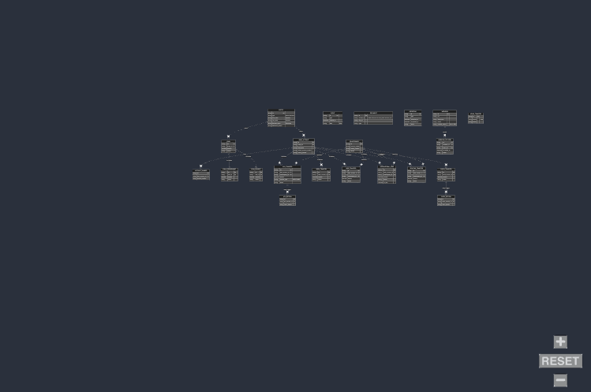

## Textual Diagram

Column API
├── Authentication
│   └── Basic Auth (API key: test_/live_) over HTTPS
│
├── Entity
│   ├── Person Entity Object
│   │   ├─ **Parameters:** first_name, last_name, ssn, date_of_birth, email, address (line1, city, state, postal_code, country_code), plus internal fields (e.g. person_details, verification_tags)
│   │   ├─ **Endpoint:** POST /entities/person  (Create a legal person entity)
│   │   └─ **Endpoint:** PUT/PATCH /entities/person  (Update a legal person entity)
│   │
│   ├── Business Entity Object
│   │   ├─ **Parameters:** business_name, registration_number, business_details, verification_tags, etc.
│   │   ├─ **Endpoint:** POST /entities/business  (Create a legal business entity)
│   │   └─ **Endpoint:** PUT/PATCH /entities/business  (Update a legal business entity)
│   │
│   ├─ **Endpoint:** GET /entities/{id}   (Retrieve an entity by ID)
│   ├─ **Endpoint:** DELETE /entities/{id}   (Delete an entity)
│   └─ **Endpoint:** GET /entities   (List all entities)
│       └─ (Also: document submission endpoint for entity-related documents)
│
├── Bank Account
│   ├── Bank Account Object
│   │   ├─ **Parameters:** entity_id, description, default_account_number, routing_number, etc.
│   │   ├─ **Endpoint:** POST /bank-accounts   (Create a new bank account)
│   │   ├─ **Endpoint:** GET /bank-accounts   (List all bank accounts)
│   │   ├─ **Endpoint:** GET /bank-accounts/{id}   (Get a bank account by ID)
│   │   ├─ **Endpoint:** PUT/PATCH /bank-accounts/{id}   (Update a bank account)
│   │   └─ **Endpoint:** DELETE /bank-accounts/{id}   (Delete a bank account)
│   │
│   ├── Bank Account Summary Object
│   │   └─ **Endpoint:** GET /bank-accounts/{id}/summary   (Get bank account summary history)
│   │
│   └── Overdraft Alert Object
│       └─ (Triggers/notifications for overdraft events)
│
├── Account Number
│   ├── Account Number Object
│   │   ├─ **Endpoint:** POST /account-numbers   (Create a new account number)
│   │   ├─ **Endpoint:** GET /account-numbers   (List account numbers for a bank account)
│   │   └─ **Endpoint:** GET /account-numbers/{id}   (Retrieve an account number)
│
├── Loan
│   ├── Loan Object
│   │   ├─ **Endpoint:** POST /loans   (Create a new loan)
│   │   ├─ **Endpoint:** GET /loans   (List all loans)
│   │   ├─ **Endpoint:** GET /loans/{id}   (Retrieve a loan by ID)
│   │   └─ **Endpoint:** PUT/PATCH /loans/{id}   (Update a loan)
│   │
│   ├── Loan Disbursement
│   │   ├─ **Endpoint:** POST /loans/{id}/disbursements   (Create a disbursement)
│   │   ├─ **Endpoint:** PUT/PATCH /loans/{id}/disbursements   (Update/Clear/Cancel disbursement)
│   │   └─ **Endpoint:** GET /loans/{id}/disbursements   (Retrieve disbursement details)
│   │
│   └── Loan Payment
│       ├─ **Endpoint:** POST /loans/{id}/payments   (Create a payment)
│       ├─ **Endpoint:** GET /loans/{id}/payments   (Retrieve payment details)
│       └─ **Endpoint:** GET /loans/{id}/all-payments   (List all payments)
│
├── Counterparty
│   ├── Counterparty Object
│   │   ├─ **Endpoint:** POST /counterparties   (Create a counterparty)
│   │   ├─ **Endpoint:** GET /counterparties   (List all counterparties)
│   │   ├─ **Endpoint:** GET /counterparties/{id}   (Get counterparty by ID)
│   │   └─ **Endpoint:** DELETE /counterparties/{id}   (Delete a counterparty)
│   │
│   ├── Financial Institution Object
│   │   └─ **Endpoint:** GET /financial_institutions   (Retrieve financial institution details)
│   │
│   └── IBAN Validation
│       └─ **Endpoint:** POST /validate-iban   (Validate an IBAN)
│
├── ACH Transfer
│   ├── ACH Transfer Object (includes IAT sub-object)
│   │   ├─ **Endpoint:** POST /transfers/ach   (Create an ACH transfer)
│   │   ├─ **Endpoint:** GET /transfers/ach   (List all ACH transfers)
│   │   ├─ **Endpoint:** GET /transfers/ach/{id}   (Retrieve a specific ACH transfer)
│   │   ├─ **Endpoint:** POST /transfers/ach/{id}/cancel   (Cancel an ACH transfer)
│   │   └─ **Endpoint:** POST /transfers/ach/{id}/reverse   (Reverse an ACH transfer)
│
├── ACH Positive-Pay
│   ├── ACH Positive Pay Rule Object
│   │   ├─ **Endpoint:** POST /ach-positive-pay   (Create a positive pay rule)
│   │   ├─ **Endpoint:** GET /ach-positive-pay/{id}   (Retrieve a rule)
│   │   ├─ **Endpoint:** GET /ach-positive-pay   (List rules)
│   │   └─ **Endpoint:** DELETE /ach-positive-pay/{id}   (Delete a rule)
│
├── ACH Return
│   ├── ACH Return Object
│   │   ├─ **Endpoint:** POST /ach-return   (Create an ACH return)
│   │   ├─ **Endpoint:** GET /ach-return   (List ACH returns)
│   │   └─ **Endpoint:** GET /ach-return/{id}   (Get details of an ACH return)
│
├── Book Transfer
│   ├── Book Transfer Object
│   │   ├─ **Endpoint:** POST /transfers/book   (Create a book transfer)
│   │   ├─ **Endpoint:** GET /transfers/book   (List book transfers)
│   │   ├─ **Endpoint:** GET /transfers/book/{id}   (Retrieve a specific book transfer)
│   │   ├─ **Endpoint:** PUT/PATCH /transfers/book/{id}   (Update a book transfer)
│   │   ├─ **Endpoint:** DELETE /transfers/book/{id}   (Cancel a book transfer)
│   │   └─ **Endpoint:** POST /transfers/book/{id}/clear   (Clear a book transfer)
│
├── Wire Transfer
│   ├── Wire Transfer Object
│   │   ├─ **Endpoint:** POST /transfers/wire   (Create a wire transfer)
│   │   ├─ **Endpoint:** GET /transfers/wire   (List wire transfers)
│   │   ├─ **Endpoint:** GET /transfers/wire/{id}   (Get a wire transfer)
│   │   └─ **Endpoint:** POST /transfers/wire/{id}/reverse   (Reverse an incoming wire transfer)
│
├── Wire Drawdown
│   ├── Wire Drawdown Object
│   │   ├─ **Endpoint:** GET /wire-drawdowns   (List drawdown requests)
│   │   ├─ **Endpoint:** GET /wire-drawdowns/{id}   (Retrieve a drawdown request)
│   │   ├─ **Endpoint:** POST /wire-drawdowns   (Create a drawdown request)
│   │   └─ **Endpoint:** POST /wire-drawdowns/{id}/approve   (Approve a drawdown request)
│
├── International Wire
│   ├── FX Rate Sheet Object
│   │   └─ **Endpoint:** GET /international-wire/fx-rate-sheet   (Get FX rate sheet)
│   │
│   ├── FX Quote Object
│   │   ├─ **Endpoint:** POST /international-wire/fx-quote   (Create an FX quote)
│   │   ├─ **Endpoint:** GET /international-wire/fx-quote/{id}   (Retrieve an FX quote)
│   │   ├─ **Endpoint:** POST /international-wire/fx-quote/{id}/book   (Book an FX quote)
│   │   └─ **Endpoint:** POST /international-wire/fx-quote/{id}/cancel   (Cancel an FX quote)
│   │
│   ├── International Wire Object
│   │   ├─ **Endpoint:** POST /international-wire   (Create an international wire)
│   │   ├─ **Endpoint:** GET /international-wire   (List international wires)
│   │   ├─ **Endpoint:** GET /international-wire/{id}   (Get an international wire)
│   │   ├─ **Endpoint:** POST /international-wire/{id}/return   (Return an international wire)
│   │   └─ **Endpoint:** POST /international-wire/{id}/cancel   (Cancel an international wire)
│   │
│   └── Tracking Object
│       └─ **Endpoint:** GET /international-wire/{id}/tracking   (Retrieve tracking details)
│
├── Realtime Transfer
│   ├── Realtime Transfer Object
│   │   ├─ **Endpoint:** POST /transfers/realtime   (Create a realtime transfer)
│   │   ├─ **Endpoint:** GET /transfers/realtime   (List realtime transfers)
│   │   ├─ **Endpoint:** GET /transfers/realtime/{id}   (Get a realtime transfer)
│   │   └─ **Endpoint:** POST /transfers/realtime/{id}/return   (Return a realtime transfer)
│
├── Check Transfer
│   ├── Check Transfer Object
│   │   ├─ **Endpoint:** POST /transfers/check   (Issue a check)
│   │   ├─ **Endpoint:** GET /transfers/check/{id}   (Get a check transfer)
│   │   ├─ **Endpoint:** GET /transfers/check   (List check transfers)
│   │   ├─ **Endpoint:** POST /transfers/check/preview-pdf   (Retrieve a preview PDF)
│   │   ├─ **Endpoint:** POST /transfers/check/{id}/stop   (Stop a check transfer)
│   │   ├─ **Endpoint:** POST /transfers/check/deposit   (Deposit a check)
│   │   ├─ **Endpoint:** POST /transfers/check/{id}/capture-front   (Capture front image)
│   │   └─ **Endpoint:** POST /transfers/check/{id}/capture-back   (Capture back image)
│
├── Check Return
│   ├── Check Return Object
│   │   ├─ **Endpoint:** POST /check-return   (Create a check return)
│   │   ├─ **Endpoint:** GET /check-return   (List check returns)
│   │   └─ **Endpoint:** GET /check-return/{id}   (Get details of a check return)
│
├── Simulation (Sandbox Only)
│   ├─ **Endpoint:** POST /simulate/receive-ach-credit      (Simulate ACH credit)
│   ├─ **Endpoint:** POST /simulate/receive-ach-debit       (Simulate ACH debit)
│   ├─ **Endpoint:** POST /simulate/receive-wire          (Simulate wire transfer)
│   ├─ **Endpoint:** POST /simulate/receive-international-wire  (Simulate international wire)
│   ├─ **Endpoint:** POST /simulate/receive-wire-drawdown (Simulate wire drawdown request)
│   ├─ **Endpoint:** POST /simulate/receive-realtime      (Simulate realtime transfer)
│   ├─ **Endpoint:** POST /simulate/settle-ach            (Settle ACH transfer)
│   ├─ **Endpoint:** POST /simulate/settle-wire           (Settle wire transfer)
│   ├─ **Endpoint:** POST /simulate/settle-check-deposit  (Settle check deposit)
│   └─ **Endpoint:** POST /simulate/deposit-issued-check  (Deposit an issued check)
│
├── Transfer
│   └─ **Endpoint:** GET /transfers   (List all transfers)
│
├── Events
│   ├── Event Object
│   │   ├─ **Endpoint:** GET /events          (List all events)
│   │   ├─ **Endpoint:** GET /events/{id}       (Get event by ID)
│   │   └─ **Endpoint:** GET /events/webhook    (List webhook events)
│
├── Documents
│   ├── Document Object
│   │   ├─ **Endpoint:** POST /documents/upload   (Upload a document)
│   │   └─ **Endpoint:** GET /documents/{id}        (Retrieve a document)
│
├── Reporting
│   ├── Settlement Report Object
│   │   ├─ **Endpoint:** POST /reporting/schedule-settlement-report   (Schedule a report)
│   │   ├─ **Endpoint:** GET /reporting   (List settlement reports)
│   │   └─ **Endpoint:** GET /reporting/{id}   (Get a specific settlement report)
│
├── Webhooks
│   ├── Webhook Object
│   │   ├─ **Endpoint:** POST /webhook_endpoints        (Create a webhook endpoint)
│   │   ├─ **Endpoint:** GET /webhook_endpoints         (List webhook endpoints)
│   │   ├─ **Endpoint:** GET /webhook_endpoints/{id}      (Retrieve an endpoint by ID)
│   │   ├─ **Endpoint:** PUT/PATCH /webhook_endpoints/{id} (Update an endpoint)
│   │   ├─ **Endpoint:** DELETE /webhook_endpoints/{id}   (Delete an endpoint)
│   │   ├─ **Endpoint:** POST /webhook_endpoints/{id}/verify (Verify an endpoint)
│   │   ├─ **Endpoint:** GET /webhook_deliveries         (List all webhook deliveries)
│   │   └─ **Endpoint:** GET /webhook_deliveries?event=<type> (Filter deliveries by event)
│
└── Admin Transfer
    ├── Admin Transfer Object
    │   └─ **Endpoint:** GET /admin-transfers   (Retrieve admin transfers, e.g. reclaimed lost wires)

## Flowchart Code
flowchart TD
  %% Data Objects (models)
  subgraph DO[Data Objects]
    A[Entity: Person / Business]:::dataObj
    B[Bank Account]:::dataObj
    C[Loan]:::dataObj
    D[Counterparty]:::dataObj
    E[Document]:::dataObj
    F[ACH Transfer]:::dataObj
    G[Wire Transfer]:::dataObj
    H[Check Transfer]:::dataObj
    I[Event Data]:::dataObj
    J[Settlement Report]:::dataObj
  end

  %% Operation Endpoints (with URL addresses)
  subgraph EP[Endpoints]
    A1["Entity Endpoint\n /entities"]:::endpoint
    B1["Bank Account Endpoint\n /bank_accounts"]:::endpoint
    C1["Loan Endpoint\n /loans"]:::endpoint
    D1["Counterparty Endpoint\n /counterparties"]:::endpoint
    E1["Document Endpoint\n /documents"]:::endpoint
    F1["ACH Transfer Endpoint\n /ach_transfers"]:::endpoint
    G1["Wire Transfer Endpoint\n /wire_transfers"]:::endpoint
    H1["Check Transfer Endpoint\n /check_transfers"]:::endpoint
    I1["Event & Webhook Endpoint\n /events, /webhook_endpoints"]:::endpoint
    J1["Reporting Endpoint\n /settlement_reports"]:::endpoint
    K1["Admin Transfer Endpoint\n /admin_transfers"]:::endpoint
  end

  %% Data Flow Edges with labels
  A1 -- "Creates/Updates" --> A
  A -- "Associates with" --> B1
  B1 -- "Creates/Updates" --> B
  
  B -- "Source for ACH" --> F1
  B -- "Source for Wire" --> G1
  B -- "Source for Check" --> H1
  
  C1 -- "Processes" --> C
  D1 -- "Validates" --> D
  E1 -- "Uploads" --> E
  
  F1 -- "Executes ACH Transfer" --> F
  G1 -- "Executes Wire Transfer" --> G
  H1 -- "Executes Check Transfer" --> H
  
  F -- "Triggers" --> I
  G -- "Triggers" --> I
  H -- "Triggers" --> I
  
  I1 -- "Notifies" --> I
  J1 -- "Generates Report" --> J
  K1 -- "Executes Admin Ops on" --> B

  %% Styling classes for clarity
  classDef dataObj fill:#AED6F1,stroke:#1B4F72,stroke-width:2px;
  classDef endpoint fill:#ABEBC6,stroke:#1E8449,stroke-width:2px;