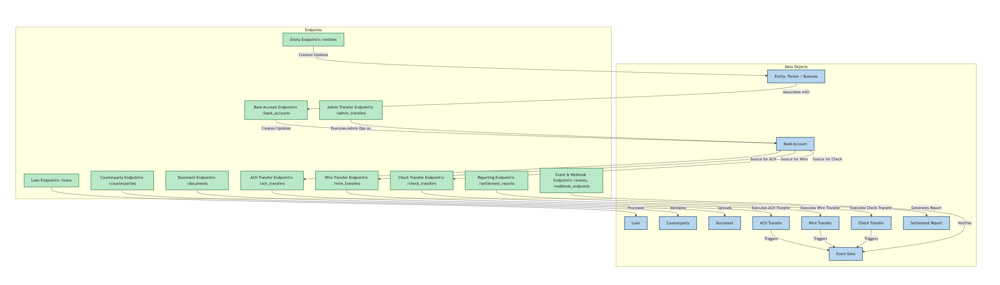

flowchart TD
  %% Data Objects (models)
  subgraph DO[Data Objects]
    A[Entity: Person / Business]:::dataObj
    B[Bank Account]:::dataObj
    C[Loan]:::dataObj
    D[Counterparty]:::dataObj
    E[Document]:::dataObj
    F[ACH Transfer]:::dataObj
    G[Wire Transfer]:::dataObj
    H[Check Transfer]:::dataObj
    I[Event Data]:::dataObj
    J[Settlement Report]:::dataObj
  end

  %% Operation Endpoints (with URL addresses)
  subgraph EP[Endpoints]
    A1["Entity Endpoint\n /entities"]:::endpoint
    B1["Bank Account Endpoint\n /bank_accounts"]:::endpoint
    C1["Loan Endpoint\n /loans"]:::endpoint
    D1["Counterparty Endpoint\n /counterparties"]:::endpoint
    E1["Document Endpoint\n /documents"]:::endpoint
    F1["ACH Transfer Endpoint\n /ach_transfers"]:::endpoint
    G1["Wire Transfer Endpoint\n /wire_transfers"]:::endpoint
    H1["Check Transfer Endpoint\n /check_transfers"]:::endpoint
    I1["Event & Webhook Endpoint\n /events, /webhook_endpoints"]:::endpoint
    J1["Reporting Endpoint\n /settlement_reports"]:::endpoint
    K1["Admin Transfer Endpoint\n /admin_transfers"]:::endpoint
  end

  %% Data Flow Edges with labels
  A1 -- "Creates/Updates" --> A
  A -- "Associates with" --> B1
  B1 -- "Creates/Updates" --> B
  
  B -- "Source for ACH" --> F1
  B -- "Source for Wire" --> G1
  B -- "Source for Check" --> H1
  
  C1 -- "Processes" --> C
  D1 -- "Validates" --> D
  E1 -- "Uploads" --> E
  
  F1 -- "Executes ACH Transfer" --> F
  G1 -- "Executes Wire Transfer" --> G
  H1 -- "Executes Check Transfer" --> H
  
  F -- "Triggers" --> I
  G -- "Triggers" --> I
  H -- "Triggers" --> I
  
  I1 -- "Notifies" --> I
  J1 -- "Generates Report" --> J
  K1 -- "Executes Admin Ops on" --> B

  %% Styling classes for clarity
  classDef dataObj fill:#AED6F1,stroke:#1B4F72,stroke-width:2px;
  classDef endpoint fill:#ABEBC6,stroke:#1E8449,stroke-width:2px;