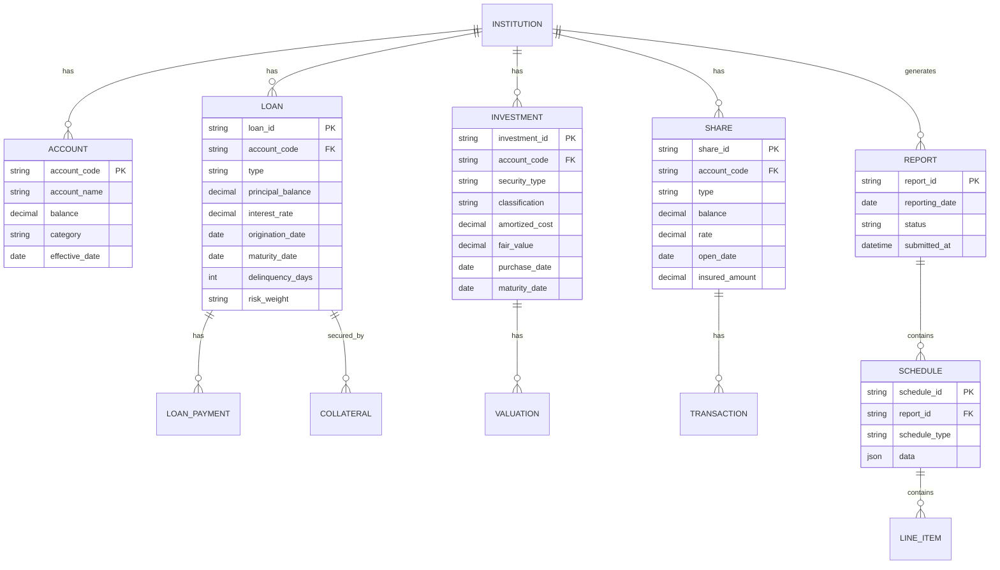

# NCUA Form 5300 Call Report: Banking Core API Requirements Analysis

## Executive Summary
This document provides a comprehensive technical analysis of the NCUA Form 5300 Call Report (March 2025 version) to extract requirements for designing a real-time banking core reporting API. The analysis focuses on data structures, calculation dependencies, reporting schedules, and API design implications.

## 1. Data Structure Requirements

### 1.1 Account Code Hierarchy
The call report uses a hierarchical account numbering system with the following patterns:
- **3-6 character alphanumeric codes** (e.g., 025B, AS0009, 940)
- **Prefix patterns indicating categories**:
  - AS####: Asset accounts
  - LI####: Liability accounts  
  - EQ####: Equity accounts
  - IS####: Income Statement accounts
  - DL####: Delinquent loan accounts
  - CH####: Charge-off/Recovery accounts
  - RB####: Risk-based capital accounts
  - NW####: Net worth related accounts

### 1.2 Calculation Dependencies Map

#### Balance Sheet Dependencies
```
AS0009 (Total Cash) = 730A + 730B + AS0007 + AS0008
  ├── 730A (Cash on Hand) = AS0004 + AS0005
  ├── 730B (Cash on Deposit) = 730B1 + AS0003 + 730B2
  ├── AS0007 (Time deposits)
  └── AS0008 (All other deposits)

AS0013 (Total Investment Securities) = AS0055 + AS0061 + AS0067 + AS0073 - AS0041
  ├── AS0055 (Equity Securities)
  ├── AS0061 (Trading Debt Securities)
  ├── AS0067 (Available-for-Sale Debt Securities)
  ├── AS0073 (Held-to-Maturity Debt Securities)
  └── AS0041 (Allowance for Credit Losses on HTM)

025B (Total Loans & Leases) = Sum of all loan categories
  ├── 396 (Unsecured Credit Card Loans)
  ├── 397A (Payday Alternative Loans)
  ├── 385 (New Vehicle Loans)
  ├── 370 (Used Vehicle Loans)
  ├── 703A (1-4 Family Residential 1st Lien)
  ├── 386A (1-4 Family Residential Jr Lien)
  ├── 718A5 (Commercial RE Secured)
  └── 400P (Commercial Non-RE Secured)

010 (Total Assets) = AS0009 + AS0013 + AS0017 + 003 + 025B - 719 - AS0048 + 798A + 007 + 008 + 794 + AS0036
```

#### Income Statement Dependencies
```
115 (Total Interest Income) = 110 - 119 + 120 + IS0005
350 (Total Interest Expense) = 380 + 381 + 340
IS0010 (Net Interest Income) = 115 - 350
661A (Net Income) = IS0010 - 300 - IS0017 + 117 - 671
```

### 1.3 Conditional Logic Rules
- **Schedule A**: Complete if Account 025B > 0 (has loans)
- **Schedule B**: Complete if AS0067 > 0 OR AS0073 > 0 (has investments)
- **Schedule D**: All credit unions must complete (shares/deposits)
- **Schedule I**: Complete if Account 010 > $500M (Risk-Based Capital)
- **Schedule H**: Complete if Account 010 > $500M AND eligible for CCULR

## 2. Reporting Schedules & Sections

### Core Financial Statements (Always Required)
1. **Statement of Financial Condition** (Pages 1-3)
   - Assets
   - Liabilities
   - Equity
   - **API Endpoints**: `/statements/balance-sheet`

2. **Statement of Income and Expense** (Pages 4-5)
   - Year-to-date amounts
   - **API Endpoints**: `/statements/income`

### Conditional Schedules

#### Schedule A - Loans (Sections 1-8)
**Sections:**
1. Loans and Leases (loan portfolio breakdown)
2. Delinquent Loans (aging buckets: 30-59, 60-89, 90-179, 180-359, ≥360 days)
3. Charge-offs and Recoveries (YTD)
4. Other Loan Information (officials, >15% rates, PCILs, PCD)
5. Indirect Loans
6. Loans Purchased and Sold (701.22/701.23)
7. 1-4 Family Residential RE Loans
8. Commercial Lending

**API Endpoints:**
```
/loans/portfolio
/loans/delinquent
/loans/charge-offs
/loans/indirect
/loans/commercial
/loans/residential
/loans/participations
```

#### Schedule B - Investments (Sections 1-4)
**Sections:**
1. Held-to-maturity and Available-for-sale Securities
2. Trading Securities
3. Investment Maturity Distribution
4. Investment Memoranda

**API Endpoints:**
```
/investments/securities
/investments/trading
/investments/maturity-distribution
/investments/memoranda
```

#### Schedule C - Liquidity (Sections 1-5)
**Sections:**
1. Unfunded Commitments
2. Off-Balance Sheet Exposures
3. Contingent Liabilities
4. Borrowing Arrangements
5. Borrowing Maturity Distribution

**API Endpoints:**
```
/liquidity/commitments
/liquidity/off-balance-sheet
/liquidity/borrowings
```

#### Schedule D - Shares/Deposits
- Maturity distribution
- NCUA insurance computation
**API Endpoints:** `/shares/distribution`

#### Schedule E - Supplemental Information
- Grants, Employees, Branches
- International remittances
- CUSOs
- Money Services Businesses
**API Endpoints:** `/supplemental/info`

#### Schedule F - Derivatives
**API Endpoints:** `/derivatives`

#### Schedule G - Capital Adequacy
**API Endpoints:** `/capital/adequacy`

#### Schedule H - CCULR
**API Endpoints:** `/capital/cculr`

#### Schedule I - Risk-Based Capital
**API Endpoints:** `/capital/rbc`

## 3. Data Domain Categories

### 3.1 Assets Domain
```json
{
  "cash_and_deposits": {
    "cash_on_hand": ["AS0004", "AS0005"],
    "deposits": ["730B1", "AS0003", "730B2"],
    "time_deposits": "AS0007"
  },
  "investments": {
    "equity_securities": "AS0055",
    "trading_debt": "AS0061",
    "available_for_sale": "AS0067",
    "held_to_maturity": "AS0073"
  },
  "loans": {
    "consumer": {
      "unsecured": ["396", "397A", "397"],
      "vehicle": ["385", "370"],
      "other_secured": "698C"
    },
    "real_estate": {
      "first_lien": "703A",
      "junior_lien": "386A",
      "other": "386B"
    },
    "commercial": {
      "re_secured": "718A5",
      "non_re_secured": "400P"
    }
  },
  "other_assets": {
    "foreclosed": "798A",
    "fixed_assets": ["007", "008"],
    "ncua_deposit": "794",
    "intangibles": ["009D2", "779", "AS0032"]
  }
}
```

### 3.2 Liabilities Domain
```json
{
  "accounts_payable": "825",
  "accrued_dividends": "820A",
  "allowance_off_balance": "LI0003",
  "borrowings": "860C",
  "shares_deposits": {
    "member_shares": "013",
    "nonmember_deposits": "880"
  }
}
```

### 3.3 Income/Expense Domain
```json
{
  "interest_income": {
    "loans": "110",
    "investments": "120",
    "other": "IS0005"
  },
  "interest_expense": {
    "dividends": "380",
    "deposits": "381",
    "borrowed_money": "340"
  },
  "non_interest_income": {
    "fees": "131",
    "gains_losses": ["421", "430", "IS0029", "IS0030"]
  },
  "non_interest_expense": {
    "compensation": "210",
    "operations": ["250", "260"],
    "professional": "290"
  }
}
```

### 3.4 Capital Adequacy Domain
```json
{
  "net_worth_components": {
    "undivided_earnings": "940",
    "reserves": "658",
    "net_income": "602",
    "cecl_transition": "NW0004",
    "subordinated_debt": "925A",
    "merger_adjustments": "1004"
  },
  "risk_weights": {
    "categories": ["0%", "20%", "50%", "75%", "100%", "150%", "250%", "300%", "400%", "1250%"],
    "assets_by_weight": "RB####"
  }
}
```

## 4. Real-Time Computation Requirements

### 4.1 Real-Time Calculations
These require immediate recalculation on transaction:
- Total Assets (010)
- Total Loans (025B)
- Total Shares (018)
- Net Worth Ratio (998)
- Current delinquency status
- Available liquidity

### 4.2 Batch/Periodic Calculations
These can be computed periodically:
- YTD totals for income/expense
- Average balances (daily/monthly/quarterly)
- Risk-weighted assets
- CECL provisions
- Derivative valuations

### 4.3 Complex Calculations

#### Net Worth Ratio
```
Net Worth Ratio = Total Net Worth / Total Assets
Where:
- Total Net Worth = 940 + 668 + 658 + 602 + NW0004 + 925A + 1004
- Total Assets = 010 or elected average (010A, 010B, 010C)
```

#### Risk-Based Capital Ratio
```
RBC Ratio = Risk-Based Capital Numerator / Risk-Weighted Assets
Where:
- Numerator = Equity + Additions - Deductions
- Risk-Weighted Assets = Sum(Asset × Risk Weight)
```

#### Delinquency Aging
```
For each loan:
  Days_Delinquent = Current_Date - Last_Payment_Date
  Bucket = CASE
    WHEN Days_Delinquent < 30 THEN 'Current'
    WHEN Days_Delinquent < 60 THEN '30-59'
    WHEN Days_Delinquent < 90 THEN '60-89'
    WHEN Days_Delinquent < 180 THEN '90-179'
    WHEN Days_Delinquent < 360 THEN '180-359'
    ELSE '≥360'
  END
```

## 5. API Design Implications

### 5.1 Core Data Models

```typescript
interface Loan {
  id: string;
  account_code: string; // Maps to NCUA codes
  type: 'consumer' | 'commercial' | 'real_estate';
  subtype: string;
  principal_balance: number;
  interest_rate: number;
  delinquency_days: number;
  delinquency_bucket: string;
  risk_weight: number;
  collateral_type?: string;
  lien_position?: 'first' | 'junior';
  maturity_date: Date;
}

interface Investment {
  id: string;
  account_code: string;
  type: 'equity' | 'debt';
  classification: 'trading' | 'afs' | 'htm';
  amortized_cost: number;
  fair_value: number;
  risk_weight: number;
  maturity_date?: Date;
}

interface Share {
  id: string;
  account_code: string;
  type: 'draft' | 'regular' | 'money_market' | 'certificate';
  balance: number;
  rate: number;
  maturity_date?: Date;
  insured_amount: number;
  uninsured_amount: number;
}
```

### 5.2 API Endpoint Structure

```yaml
/api/v1/ncua-reporting:
  /statements:
    /balance-sheet:
      GET: Point-in-time balance sheet
      parameters:
        - as_of_date
        - asset_election (quarter_end|daily_avg|monthly_avg|quarterly_avg)
    /income:
      GET: Year-to-date income statement
      parameters:
        - start_date
        - end_date
        
  /loans:
    /portfolio:
      GET: Loan portfolio summary by category
    /delinquent:
      GET: Delinquency aging report
    /charge-offs:
      GET: YTD charge-offs and recoveries
    /details/{loan_id}:
      GET: Individual loan details
      
  /investments:
    /securities:
      GET: Investment securities by classification
    /maturity-distribution:
      GET: Investments by maturity bucket
      
  /shares:
    /distribution:
      GET: Share/deposit maturity distribution
    /insurance:
      GET: NCUA insurance computation
      
  /capital:
    /adequacy:
      GET: Net worth calculation
    /rbc:
      GET: Risk-based capital calculation
    /cculr:
      GET: Complex CU leverage ratio
      
  /regulatory:
    /call-report:
      POST: Generate complete call report
      GET: Retrieve generated report
    /validations:
      GET: Run validation rules
```

### 5.3 Event Sourcing Requirements

Critical events to capture for report updates:
```yaml
events:
  - loan_originated
  - loan_payment_received
  - loan_charged_off
  - loan_recovered
  - investment_purchased
  - investment_sold
  - investment_matured
  - share_opened
  - share_closed
  - dividend_posted
  - interest_accrued
```

### 5.4 Query Patterns

```sql
-- Time-range queries for YTD calculations
SELECT SUM(amount) 
FROM transactions 
WHERE type = 'interest_income' 
  AND date >= DATE_TRUNC('year', CURRENT_DATE)
  AND date <= CURRENT_DATE;

-- Point-in-time snapshots for quarter-end
SELECT * FROM account_balances 
WHERE effective_date = DATE_TRUNC('quarter', CURRENT_DATE) + INTERVAL '3 months' - INTERVAL '1 day';

-- Aggregations for portfolio summaries
SELECT 
  loan_type,
  COUNT(*) as count,
  SUM(principal_balance) as total_balance,
  AVG(interest_rate) as avg_rate
FROM loans
WHERE status = 'active'
GROUP BY loan_type;

-- Drill-downs for detailed analysis
SELECT * FROM loans
WHERE commercial = true
  AND delinquency_days >= 60
ORDER BY principal_balance DESC;
```

## 6. Compliance & Validation Rules

### 6.1 Required Field Validations
```yaml
validations:
  - rule: "Total Assets must equal Total Liabilities + Equity"
    formula: "010 == 014"
    
  - rule: "Total Loans must equal sum of loan categories"
    formula: "025B == SUM(all_loan_categories)"
    
  - rule: "Net Income YTD must reconcile"
    formula: "661A == IS0010 - 300 - IS0017 + 117 - 671"
    
  - rule: "Shares must be >= 0"
    formula: "013 >= 0"
```

### 6.2 Conditional Field Requirements
```yaml
conditional_rules:
  - condition: "Account 010 > 500000000"
    required: ["Schedule I - Risk Based Capital"]
    
  - condition: "Account 025B > 0"
    required: ["Schedule A - All Sections"]
    
  - condition: "CECL Adopted"
    required: ["AS0041", "AS0042", "AS0048", "LI0003"]
```

### 6.3 Cross-Schedule Validations
```yaml
cross_validations:
  - "Loans in Schedule A must equal loans on balance sheet"
  - "Investments in Schedule B must equal investments on balance sheet"
  - "Shares in Schedule D must equal shares on balance sheet"
  - "Off-balance sheet in Schedule C must not appear on balance sheet"
```

## 7. Regulatory Thresholds

```yaml
thresholds:
  net_worth_classifications:
    well_capitalized:
      net_worth_ratio: ">= 7%"
      conditions: ["not_new_cu"]
      
    adequately_capitalized:
      net_worth_ratio: ">= 6%"
      
    undercapitalized:
      net_worth_ratio: "< 6%"
      
  complex_cu_threshold:
    assets: "> $500 million"
    
  commercial_loan_limits:
    member_business_loans:
      limit: "< 1.75 × net_worth"
      
  cculr_eligibility:
    assets: "> $500 million"
    net_worth_ratio: ">= 9%"
    off_balance_sheet: "<= 25% of assets"
    trading_assets: "<= 5% of assets"
```

## 8. Temporal & Historical Requirements

### 8.1 Point-in-Time Requirements
```yaml
snapshots_required:
  - quarter_end_balances:
      frequency: "quarterly"
      accounts: ["all balance sheet accounts"]
      
  - month_end_balances:
      frequency: "monthly"
      accounts: ["selected for averaging"]
      
  - daily_balances:
      frequency: "daily"
      accounts: ["cash", "shares", "loans"]
```

### 8.2 Period Calculations
```yaml
period_calculations:
  - ytd_income:
      start: "January 1"
      end: "reporting_date"
      accounts: ["all income/expense"]
      
  - quarterly_average:
      period: "3 months"
      calculation: "average of month-end balances"
      
  - trailing_12_months:
      period: "12 months"
      used_for: ["loan loss ratios", "efficiency ratios"]
```

### 8.3 Historical Comparisons
```yaml
comparisons:
  - prior_quarter:
      accounts: ["all balance sheet"]
      
  - prior_year:
      accounts: ["income statement"]
      
  - rolling_trends:
      periods: "12 quarters"
      metrics: ["net worth ratio", "delinquency rate"]
```

## 9. Dimensional Analysis Requirements

### 9.1 Loan Categorizations
```yaml
dimensions:
  loan_type:
    - consumer_unsecured
    - consumer_secured
    - residential_real_estate
    - commercial_real_estate
    - commercial_other
    
  collateral:
    - unsecured
    - vehicle
    - real_estate
    - other_personal_property
    - business_assets
    
  delinquency_aging:
    - current
    - 30-59_days
    - 60-89_days
    - 90-179_days
    - 180-359_days
    - 360+_days
    
  interest_rate_bands:
    - 0-5%
    - 5-10%
    - 10-15%
    - >15%
```

### 9.2 Investment Categorizations
```yaml
dimensions:
  security_type:
    - us_government
    - federal_agency
    - municipal
    - corporate
    - asset_backed
    - mortgage_backed
    
  classification:
    - trading
    - available_for_sale
    - held_to_maturity
    
  maturity_buckets:
    - less_than_1_year
    - 1_to_3_years
    - 3_to_5_years
    - 5_to_10_years
    - over_10_years
    
  risk_weights:
    - 0%
    - 20%
    - 50%
    - 100%
    - higher_risk
```

### 9.3 Share/Deposit Categorizations
```yaml
dimensions:
  account_type:
    - share_draft
    - regular_shares
    - money_market
    - share_certificates
    - ira_keogh
    
  maturity:
    - demand
    - less_than_1_year
    - 1_to_3_years
    - over_3_years
    
  insurance_status:
    - fully_insured
    - partially_insured
    - uninsured
```

## 10. Performance Considerations

### 10.1 Computational Complexity

```yaml
simple_lookups: # O(1)
  - account_balance
  - current_rate
  - loan_status
  
aggregations: # O(n)
  - portfolio_totals
  - delinquency_counts
  - ytd_calculations
  
complex_calculations: # O(n²) or higher
  - risk_weighted_assets
  - correlation_matrices
  - stress_testing
```

### 10.2 Caching Strategies

```yaml
cache_layers:
  real_time: # No caching
    - current_balance
    - transaction_status
    
  near_real_time: # 1-5 minute cache
    - portfolio_summaries
    - delinquency_reports
    
  periodic: # Daily cache
    - ytd_totals
    - average_balances
    - risk_calculations
    
  static: # Until data changes
    - loan_terms
    - account_configurations
    - regulatory_thresholds
```

### 10.3 Materialized Views

```sql
-- Portfolio summary view
CREATE MATERIALIZED VIEW loan_portfolio_summary AS
SELECT 
  loan_type,
  COUNT(*) as loan_count,
  SUM(principal_balance) as total_balance,
  AVG(interest_rate) as avg_rate,
  SUM(CASE WHEN delinquency_days > 60 THEN principal_balance ELSE 0 END) as delinquent_balance
FROM loans
WHERE status = 'active'
GROUP BY loan_type
WITH DATA;

-- Delinquency aging view
CREATE MATERIALIZED VIEW delinquency_aging AS
SELECT 
  delinquency_bucket,
  COUNT(*) as loan_count,
  SUM(principal_balance) as total_balance
FROM loans
GROUP BY delinquency_bucket
WITH DATA;

-- Risk-weighted assets view
CREATE MATERIALIZED VIEW risk_weighted_assets AS
SELECT 
  asset_category,
  risk_weight,
  SUM(carrying_value) as total_value,
  SUM(carrying_value * risk_weight) as weighted_value
FROM assets
GROUP BY asset_category, risk_weight
WITH DATA;
```

## 11. Integration Points

### 11.1 NCUA Systems
```yaml
ncua_interfaces:
  - call_report_submission:
      protocol: "HTTPS"
      format: "XML/XBRL"
      frequency: "quarterly"
      
  - examiner_access:
      protocol: "API"
      authentication: "OAuth 2.0"
      
  - regulatory_updates:
      protocol: "Webhook"
      events: ["threshold_changes", "new_requirements"]
```

### 11.2 Federal Reserve
```yaml
federal_reserve:
  - discount_window:
      data: "borrowing_capacity"
      
  - ppp_lending_facility:
      data: "ppp_loans"
      
  - payment_systems:
      data: "wire_activity"
```

### 11.3 Third-Party Systems
```yaml
integrations:
  - core_banking_system:
      data: "transactions, balances, rates"
      protocol: "REST API"
      
  - loan_origination_system:
      data: "new_loans, modifications"
      protocol: "Message Queue"
      
  - investment_accounting:
      data: "securities, valuations"
      protocol: "SFTP/API"
      
  - general_ledger:
      data: "trial_balance, journal_entries"
      protocol: "Database Link"
```

### 11.4 Market Data
```yaml
market_data:
  - interest_rates:
      source: "Federal Reserve"
      data: ["prime_rate", "treasury_yields"]
      
  - security_prices:
      source: "Bloomberg/Reuters"
      data: ["bond_prices", "equity_prices"]
      
  - economic_indicators:
      source: "BEA/BLS"
      data: ["gdp", "unemployment", "inflation"]
```

## 12. Implementation Roadmap

### Phase 1: MVP (Months 1-3)
```yaml
core_features:
  - Basic balance sheet generation
  - Simple loan portfolio reporting
  - Share/deposit summaries
  - Net worth calculation
  
endpoints:
  - /statements/balance-sheet
  - /loans/portfolio
  - /shares/distribution
  - /capital/adequacy
```

### Phase 2: Delinquency & Risk (Months 4-6)
```yaml
features:
  - Delinquency aging
  - Charge-off tracking
  - Basic risk weighting
  - Investment reporting
  
endpoints:
  - /loans/delinquent
  - /loans/charge-offs
  - /investments/securities
  - /capital/rbc (simplified)
```

### Phase 3: Advanced Analytics (Months 7-9)
```yaml
features:
  - Full RBC calculation
  - CCULR framework
  - Off-balance sheet tracking
  - Derivative reporting
  
endpoints:
  - /capital/rbc (complete)
  - /capital/cculr
  - /liquidity/off-balance-sheet
  - /derivatives
```

### Phase 4: Automation & Optimization (Months 10-12)
```yaml
features:
  - Automated report generation
  - Real-time validation
  - Performance optimization
  - Historical trending
  
capabilities:
  - Scheduled report generation
  - Validation rule engine
  - Caching layer implementation
  - Time-series analytics
```

## 13. BaaS-Specific Considerations

### 13.1 Multi-Tenancy Requirements
```yaml
tenant_isolation:
  - Separate database schemas per institution
  - Encrypted data at rest
  - Row-level security for shared tables
  - Tenant-specific API keys
  
aggregation:
  - Cross-institution analytics (anonymized)
  - Benchmark comparisons
  - Industry trends
```

### 13.2 White-Label Customization
```yaml
customizable_elements:
  - Report branding/logos
  - Custom account mappings
  - Institution-specific validations
  - Supplemental schedules
  - API response formats
```

### 13.3 Partial Report Generation
```yaml
granular_access:
  - Schedule-level permissions
  - Section-level generation
  - Field-level access control
  - Read-only vs. edit modes
  
use_cases:
  - Department-specific views
  - Examiner access
  - Board reporting packages
  - Public disclosures
```

### 13.4 Compliance Across Jurisdictions
```yaml
multi_state_operations:
  - State-specific regulations
  - Multi-charter support (federal/state)
  - Currency considerations
  - Time zone handling
  
data_residency:
  - Geographic data storage
  - Cross-border restrictions
  - Backup locations
  - Disaster recovery sites
```

## 14. Entity Relationship Model (Mermaid)



## 15. Critical Implementation Notes

### Data Quality Requirements
- **Precision**: All monetary values must support at least 2 decimal places
- **Rounding**: Follow NCUA rounding rules (generally round to nearest dollar)
- **Sign Convention**: Use positive for assets/income, negative for contra-accounts
- **Date/Time**: Store all timestamps in UTC, display in institution's timezone

### Audit Trail Requirements
- Every change to reportable data must be logged
- Maintain before/after values for all updates
- Track user, timestamp, and reason for changes
- Support report regeneration for any historical date

### Performance Targets
- Balance sheet generation: < 2 seconds
- Full call report generation: < 30 seconds
- Real-time balance updates: < 100ms
- Batch processing: Support 1M+ transactions/hour

### Security Requirements
- Encrypt sensitive data at rest (AES-256)
- Encrypt data in transit (TLS 1.3)
- Implement field-level encryption for PII
- Support MFA for all user access
- Maintain detailed access logs

### Disaster Recovery
- RPO (Recovery Point Objective): < 1 hour
- RTO (Recovery Time Objective): < 4 hours
- Daily backups with 90-day retention
- Geographically distributed replicas
- Automated failover capabilities

## Conclusion

This comprehensive analysis of the NCUA Form 5300 Call Report provides the technical foundation for implementing a robust, real-time banking core reporting API. The system must balance complex regulatory requirements with performance demands while maintaining flexibility for multi-tenant BaaS operations.

Key success factors:
1. **Accurate calculation engine** for complex financial computations
2. **Flexible data model** supporting various institution types and sizes
3. **Real-time capabilities** for critical metrics
4. **Robust validation framework** ensuring regulatory compliance
5. **Scalable architecture** supporting growth and multi-tenancy

The implementation should proceed in phases, starting with core financial reporting and progressively adding advanced features like risk-based capital calculations and derivative reporting.