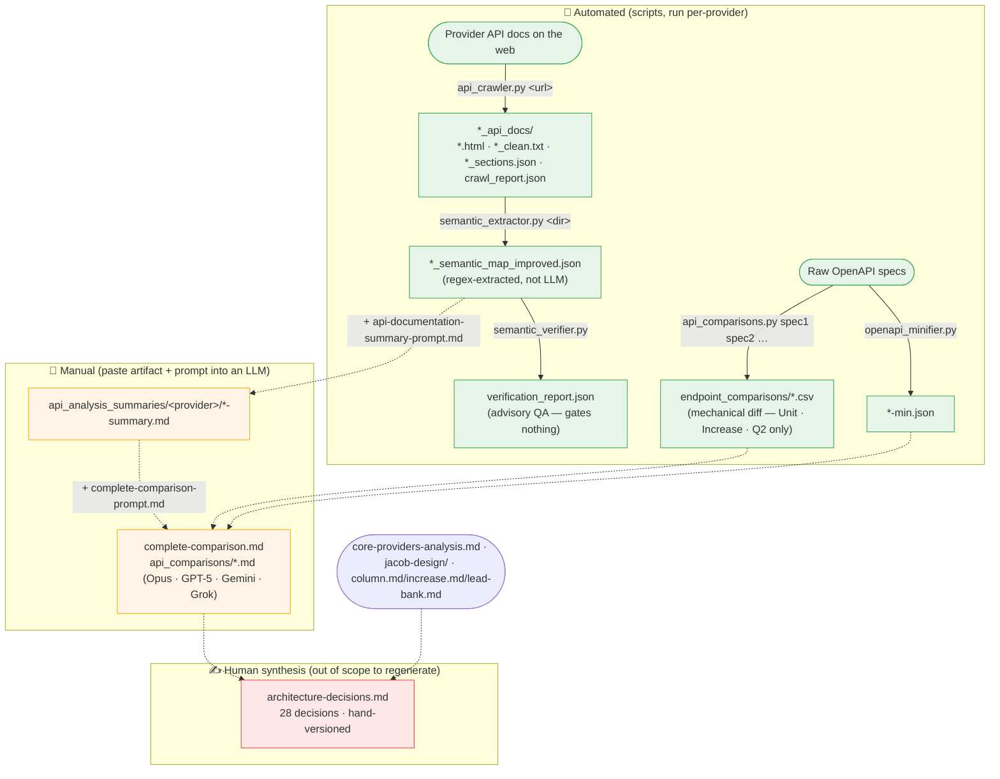

# Research Pipeline

How competitor BaaS/banking APIs are crawled, normalized, and compared to **inform** the
architecture decision log. The pipeline is **automated up to the JSON/CSV artifacts**; everything
past that is a **manual LLM/human step**.

> ⚠️ This pipeline does **not** generate `architecture-decisions.md`. That document is hand-authored
> and hand-versioned. The research artifacts below are *inputs a human reads* when writing it.
> Do not regenerate the decision log from this pipeline.

## Diagram



Solid arrows = automated (file produced by a script). Dotted arrows = manual (a person pastes the
upstream artifact plus a prompt into an LLM, or writes prose by hand).

## Stages

| # | Stage | Script | Command | Input | Output | Automated |
|---|-------|--------|---------|-------|--------|-----------|
| 1 | Crawl | `api_crawler.py` | `python api_crawler.py <doc_url> [out_dir]` | one doc URL | `<provider>_api_docs/` (html, `_clean.txt`, `_sections.json`, `crawl_report.json`) | ✅ |
| 1b | Crawl (Galileo) | `galileo/scrape-galileo.py` | `python galileo/scrape-galileo.py` | hardcoded Galileo URL | `galileo_api_reference_only.json` | ✅ |
| 2 | Extract | `semantic_extractor.py` | `python semantic_extractor.py <docs_dir> [out.json]` | stage-1 dir | `<provider>_semantic_map_improved.json` | ✅ (regex) |
| 2b | Verify (advisory) | `semantic_verifier.py` | `python semantic_verifier.py <docs_dir> <map.json> [out.json]` | stage-1 dir + stage-2 map | `verification_report.json` | ✅ |
| 3 | Minify specs | `endpoint_comparisons/openapi_minifier.py` | `python openapi_minifier.py <spec.json> [-o out]` | raw OpenAPI | `<spec>.min.json` | ✅ |
| 4 | Compare (mechanical) | `endpoint_comparisons/api_comparisons.py` | `python api_comparisons.py <spec1.json> <spec2.json> …` | OpenAPI and/or semantic maps | `endpoint_comparisons/*.csv` | ✅ |
| 5 | Summarize (per provider) | — *(manual)* | paste stage-2 map + `api_analysis_summaries/api-documentation-summary-prompt.md` into an LLM | semantic map | `api_analysis_summaries/<provider>/*-summary.md` | 🧑 |
| 6 | Cross-compare | — *(manual)* | paste summaries + `complete-comparison-prompt.md` into an LLM | stage-5 summaries + stage-4 CSVs | `complete-comparison.md`, `api_comparisons/*.md` | 🧑 |
| 7 | Decision log | — *(human)* | author reads stages 5–6 + hand docs | research outputs | `architecture-decisions.md` | ✍️ not regenerated |

## Reproduce one provider end-to-end

```bash
cd research

# 1. crawl the provider's API docs (one page per run)
python api_crawler.py https://docs.example.com/api ./example_api_docs

# 2. extract a structured semantic map
python semantic_extractor.py ./example_api_docs ./example_semantic_map_improved.json

# 2b. (optional) advisory recall check — does NOT gate
python semantic_verifier.py ./example_api_docs ./example_semantic_map_improved.json

# 4. (if you have OpenAPI specs) mechanical cross-provider diff
python endpoint_comparisons/api_comparisons.py \
    endpoint_comparisons/increase_openapi.json \
    endpoint_comparisons/combined_unit_openapi.json \
    ./example_semantic_map_improved.json

# 5–6. manual: paste the map / CSVs + the matching prompt .md into an LLM
#      (api_analysis_summaries/*-prompt.md, complete-comparison-prompt.md)
```

## Known limitations (see review notes)

- **"Semantic" is regex, not LLM.** `semantic_extractor.py` is heuristic pattern-matching and
  injects default values (e.g. a fabricated `200` response) when none are found — treat maps as
  leads, not ground truth.
- **"Verify" gates nothing.** `semantic_verifier.py` re-runs regex over the same text and always
  "passes"; it is advisory recall, not a correctness check.
- **Coverage is uneven.** Prose summaries exist for 7 providers; the mechanical CSV diff (stage 4)
  was only run for **Unit, Increase, and Q2 Helix**. Green Dot was never crawled; Mambu has a
  summary but no upstream crawl/map.
- **No orchestrator yet.** Stages are run ad hoc; there is no single driver script.
