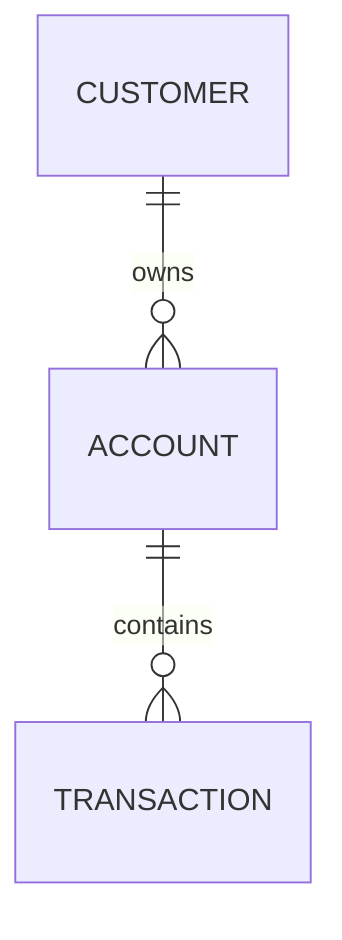
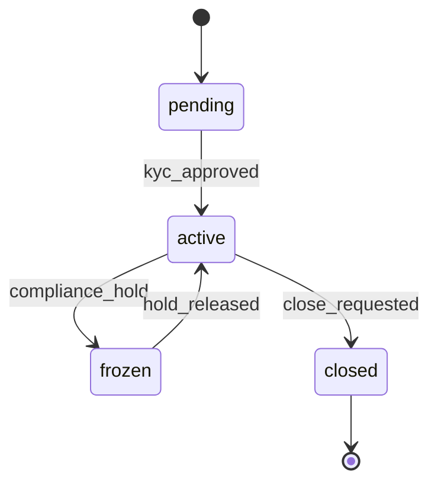
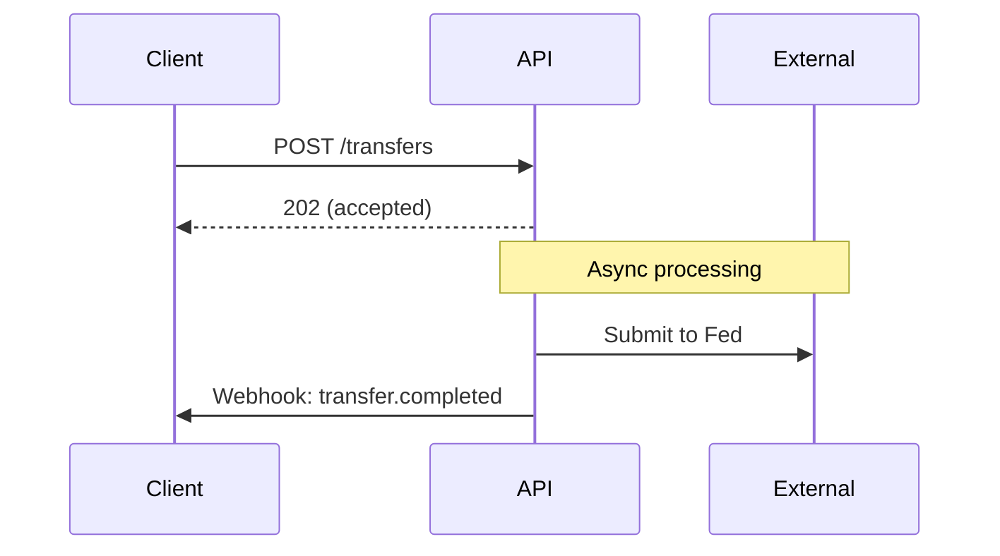

## Your Task

Analyze the API documentation for **[PROVIDER NAME]** and extract the architectural decisions Cassandra needs to understand for building a sponsor bank core.

Documentation is attached

---

## What We Actually Need

### 1. Entity Relationships

**Core Questions:**
- What are the 5-8 main entities? (Customer, Account, Transaction, Card, Transfer, etc.)
- Draw the relationships in a simple Mermaid ER diagram
- For each entity: ID format, 3-5 key attributes, what it connects to

**Specific Questions That Matter for Sponsor Banking:**
- Can an Account have multiple owners (joint accounts)?
- How are sub-accounts/virtual accounts modeled?
- How does a business Customer relate to its beneficial owners?
- How are related transactions linked (original → reversal)?

### 2. State Machines

**Only document these four objects:**

| Object | States | Include state diagram? |
|--------|--------|----------------------|
| Account | All states | Yes |
| Transaction/Payment | All states | Yes |
| Card | All states | Yes |
| Customer/KYC Application | All states | Only if complex |

**For each, answer:**
- What triggers each transition?
- Which states are terminal (no way out)?
- Which states are recoverable?

### 3. Flows

**Only document these flows (in order of priority):**

1. **ACH Origination** (credit and debit) - timing, cutoffs, return handling
2. **Account Opening** - individual first, note differences for business
3. **Card Authorization** - real-time flow, decline scenarios

For each flow:
- Sequence diagram showing API consumer → Provider → External systems
- Timing: sync response SLA, async completion SLA
- What external systems are touched (Fed, networks, KYC vendors)
- What happens on failure

---

## Output Format

### Per-Provider Summary (1-2 pages max)

**Entity Model**
- ER diagram
- Key design decisions (bullet points)
- Notable: [anything unusual or interesting]

**State Machines**
- State diagrams for Account, Transaction, Card
- Transition trigger table

**Critical Flows**
- ACH flow diagram + timing
- Account opening flow + timing
- Card auth flow (if applicable)

**Confidence Notes**
- ✅ Documented explicitly
- 🔶 Inferred from API structure
- ❓ Unclear, needs verification

---

## Cross-Provider Comparison (After All Providers Analyzed)

Produce a single comparison table:

| Decision Point | Unit | Column | Galileo | Q2 | Increase |
|----------------|------|--------|---------|-----|----------|
| Customer model (unified vs. split individual/business) | | | | | |
| Joint account support | | | | | |
| Sub-account model | | | | | |
| Transaction linking approach | | | | | |
| Account states | | | | | |
| ACH same-day cutoff | | | | | |
| Ledger exposure (abstract vs. explicit GL) | | | | | |

---

## What NOT to Include

- Exhaustive attribute lists (just the important ones)
- Every possible flow (start with the 3 critical ones)
- Webhook schemas (unless directly relevant to state transitions)
- Error code catalogs
- Rate limits, pagination details
- Auth/API key management

---

## If You Need to Go Deeper

Only expand into these areas if the core analysis reveals they're important:

- Wire transfers (if provider supports)
- Card settlement flow (if card issuing is a focus)
- FBO account patterns (if explicitly documented)
- Multi-tenant/program separation (if sponsor banking specific docs exist)

---

## Start

Begin with the entity relationship analysis. If documentation is incomplete for a section, note what's missing and move on rather than speculating.