# Column BaaS API: Comprehensive Architecture Reference

**For:** Cassandra Core Banking System  
**Provider:** Column N.A. (Nationally Chartered Bank)  
**Analysis Date:** December 2025  
**Sources:** Live documentation (column.com/docs), semantic API map, URL documentation summary

---

## Executive Summary

Column is unique among BaaS providers as a **nationally chartered bank** (OCC-regulated) rather than a middleware layer. They built their own ledger, core, and direct Fed integration from scratch. Key architectural characteristics:

- **Direct Federal Reserve Access**: ACH, Fedwire, RTP, FedNow, SWIFT all directly integrated
- **Split Entity Model**: Person and Business are separate object types under a unified `enti_` namespace
- **Account Number Abstraction**: Bank Account → Account Number is 1:many (virtual account pattern)
- **4-Balance Model**: available, pending, holding, locked—essential for card programs
- **No Native Card Issuing**: Column provides plumbing (book transfers, loans) for card settlement; BIN sponsorship with third-party processors
- **Platform Hierarchy**: Platform → Root Entity → Customer Entities → Bank Accounts → Account Numbers

---

## 1. Entity Model

### 1.1 Core Entities (8 Primary Objects)

| Entity | ID Prefix | Description | Key Attributes |
|--------|-----------|-------------|----------------|
| **Platform** | `plat_` | Top-level object representing your company | Master settings, billing, reserves |
| **Entity (Person)** | `enti_` | Individual legal person | SSN/ITIN, DOB, address, verification_status |
| **Entity (Business)** | `enti_` | Business/organization | EIN, legal_type, beneficial_owners |
| **Bank Account** | `bacc_` | FDIC-insured deposit account | 4 balance types, status, type, owners[] |
| **Account Number** | `acno_` | Virtual account number pointing to bank account | account_number, routing_number, BIC |
| **Counterparty** | `cpty_` | External account for transfers | routing_number, account_number, wire_details |
| **Loan** | `loan_` | Lending object under entity | principal_balance, status, program_id |
| **Transfer** | varies | Money movement record | amount, status, type, timestamps |

### 1.2 Complete ER Diagram

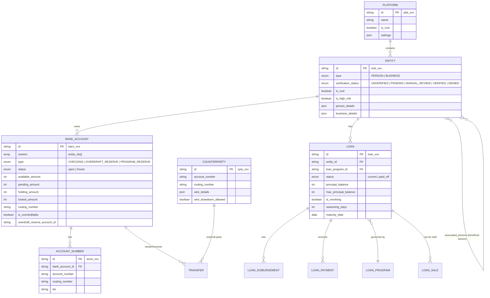

### 1.3 Key Design Decisions

**Unified Entity Model with Type Discriminator**
- Single `/entities` namespace with `type` field (PERSON or BUSINESS)
- Separate create endpoints: `POST /entities/person` and `POST /entities/business`
- Common evidence/verification layer across both types
- `is_root` flag distinguishes platform-level entities from customer entities

**Multi-Owner Account Support (Joint Accounts)**
- `owners` is an **array** of entity_ids on Bank Account
- Add owner via `POST /bank-accounts/{id}/owner`
- Explicitly supports joint accounts with multiple owners

**Virtual Account Pattern (Account Numbers)**
- Multiple Account Numbers can point to a single Bank Account
- Each Account Number has unique routing/account number pair
- Endpoint: `GET /bank-accounts/{bank_account_id}/account-numbers`
- Use case: Give each customer/use-case unique account numbers pointing to same balance

**Associated Persons (Beneficial Ownership)**
- Business entities link to Person entities via `/entities/{biz}/associated-persons`
- Roles: `control_person`, `beneficial_owner`, `account_opener`
- UBO threshold: 25%+ ownership tracked via `beneficial_owner` role

### 1.4 Platform Hierarchy

```
Platform (your company) - plat_xxx
├── Root Entity (your company as entity) ← is_root=true
│   ├── Overdraft Reserve Account (bacc_xxx, type=OVERDRAFT_RESERVE)
│   ├── Program Reserve Account (bacc_xxx, type=PROGRAM_RESERVE)
│   └── Operating Accounts (bacc_xxx, type=CHECKING)
└── Customer Entities (your users) ← is_root=false
    ├── Person Entities (enti_xxx, type=PERSON)
    │   ├── Bank Accounts (bacc_xxx)
    │   │   └── Account Numbers (acno_xxx)
    │   └── Loans (loan_xxx)
    └── Business Entities (enti_xxx, type=BUSINESS)
        ├── Associated Persons → Person Entities
        ├── Bank Accounts (bacc_xxx)
        │   └── Account Numbers (acno_xxx)
        └── Loans (loan_xxx)
```

### 1.5 ID Prefix Reference

| Object | Prefix | Example |
|--------|--------|---------|
| Platform | `plat_` | `plat_2Q1ctiJm1NypVqCt8UBC8e4xTfH` |
| Entity | `enti_` | `enti_2Q1ctiJm1NypVqCt8UBC8e4xTfH` |
| Bank Account | `bacc_` | `bacc_2YHAXVyuS2xcJW12Buh9zsxV7vC` |
| Account Number | `acno_` | `acno_2YHAWG9FTCxtL5emK1oVKCOx7fk` |
| Counterparty | `cpty_` | `cpty_1vX6b45fQ41k62xEXjjIHe5kiRM` |
| ACH Transfer | `acht_` | `acht_1vEdMiRjQWQYqRqaOppMfU7BWr1` |
| Wire Transfer | `wire_` | `wire_2XJUlyL4xJ0BDynRsS0A2MHEtll` |
| International Wire | `swft_` | `swft_2F3BYA9aMdHag8iUtsDE8ji0KOK` |
| Book Transfer | `book_` | `book_xxx` |
| Check Transfer | `chck_` | `chck_xxx` |
| Realtime Transfer | `real_` | `real_xxx` |
| Loan | `loan_` | `loan_xxx` |
| Loan Disbursement | `ldis_` | `ldis_xxx` |
| Loan Payment | `lpay_` | `lpay_xxx` |
| Document | `docu_` | `docu_2zEuexQ1tYgBO92ZHLZa7YV3F0i` |
| Evidence | `evid_` | `evid_2zEueyHBVWyPjzAm8h1Hn3pV4et` |
| Event | `evnt_` | `evnt_1vEdMiZ5pmkmrKZfNZ8LeqF2KFP` |
| FX Quote | `fxqt_` | `fxqt_2F3BY6XCpKQUy5cGCqPgLf3Kit7` |

---

## 2. State Machines

### 2.1 Entity (KYC) Verification States

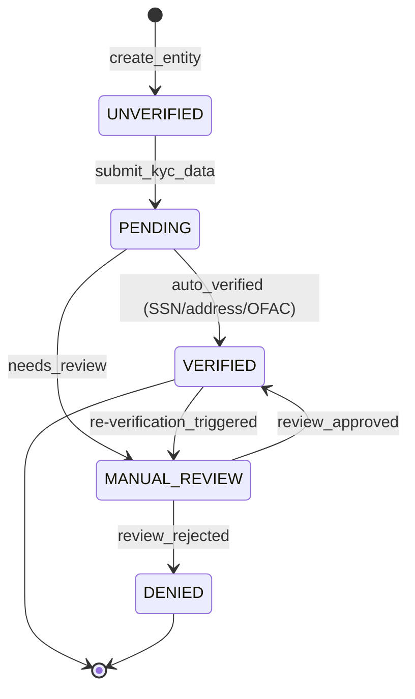

| State | Terminal? | Recoverable? | Trigger |
|-------|-----------|--------------|---------|
| `UNVERIFIED` | No | N/A | Initial state on entity creation |
| `PENDING` | No | N/A | KYC data submitted for verification |
| `MANUAL_REVIEW` | No | Yes | Auto-verification inconclusive |
| `VERIFIED` | Yes* | N/A | KYC approved |
| `DENIED` | Yes | No | KYC rejected |

*Verified can potentially move to MANUAL_REVIEW if re-verification is triggered.

**Auto-Verification Checks**: SSN validation, address verification, OFAC screening

### 2.2 Bank Account States

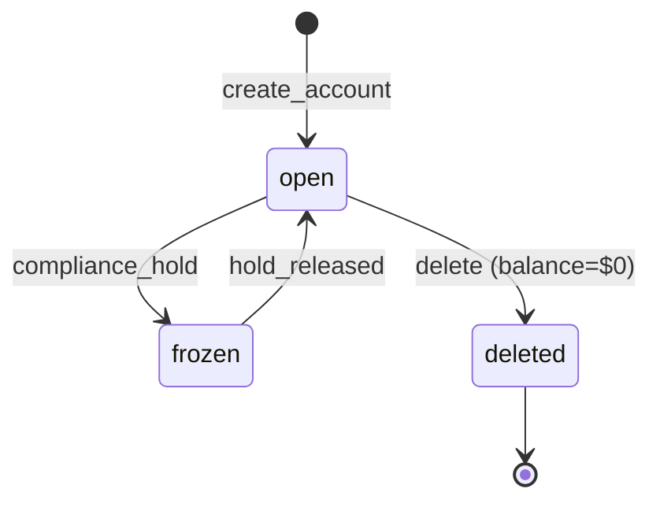

| State | Terminal? | Can Transact? | Notes |
|-------|-----------|---------------|-------|
| `open` | No | Yes | Normal operating state |
| `frozen` | No | No | Compliance hold; wires return "account blocked/frozen" |
| (deleted) | Yes | N/A | Only possible when all balances = $0 |

**Important**: Column uses only 2 active states (open/frozen). No pending/closed distinction. Accounts can only be deleted when they have a $0 balance across all balance types.

### 2.3 ACH Transfer States (Outgoing)

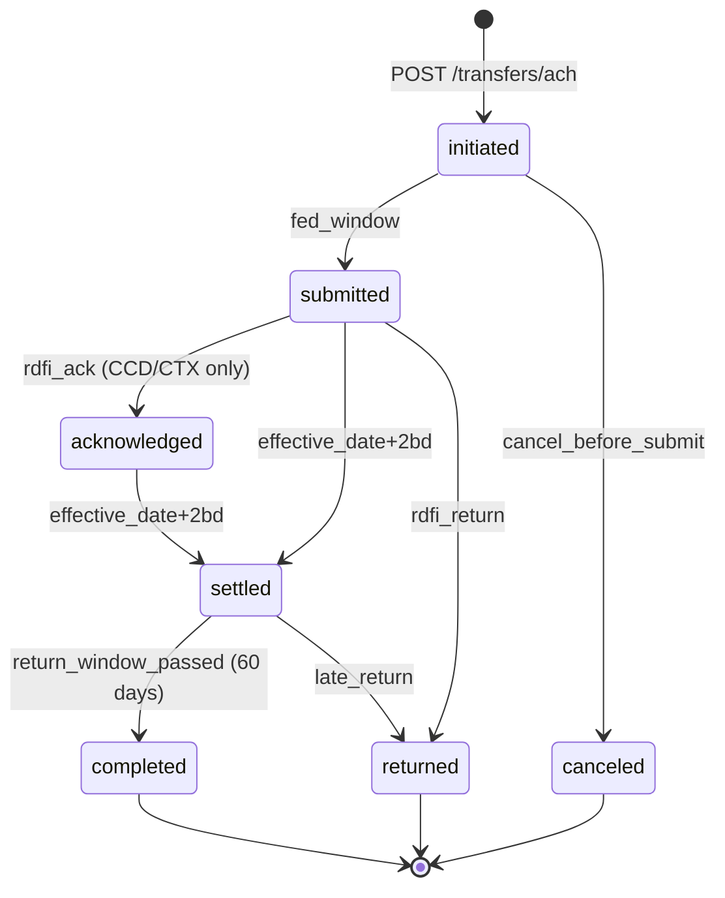

| State | Description | Balance Impact |
|-------|-------------|----------------|
| `initiated` | Received, queued for Fed window | pending_balance adjusted |
| `submitted` | Sent to Fed | No change |
| `acknowledged` | RDFI acknowledged (CCD/CTX corporate only) | No change |
| `settled` | Effective date passed | Debit: pending → available (after 2 BD) |
| `completed` | Return window passed (60 days) | Terminal success |
| `returned` | RDFI returned transfer | Funds credited back |
| `canceled` | Canceled before submission | Pending reversed |

**Timing Details**:
- Standard ACH: Next business day settlement
- Same-day ACH cutoff: **1:30 PM PT** (requires `same_day=true` AND/OR `effective_on=today`)
- Debit funds available: 2 business days after effective date (before 5:30 AM PT)
- Return window: Up to 60 days (unauthorized returns); 2 days for business entities

### 2.4 Wire Transfer States (Outgoing)

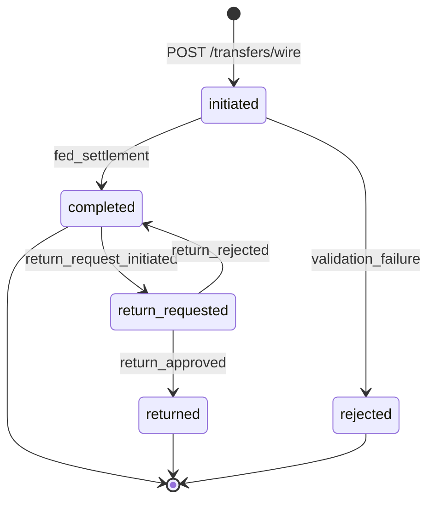

| State | Description | Notes |
|-------|-------------|-------|
| `initiated` | Wire request received | Same-day, often minutes to complete |
| `completed` | Fed settlement complete | Can still request return |
| `rejected` | Validation or Fed rejection | Terminal failure |
| `return_requested` | Return request initiated | Async process |
| `returned` | Return request approved | Terminal |

**Wire Return Requests**: Have their own state machine (pending → approved/rejected). Create via `POST /transfers/wire/{id}/return-request`.

### 2.5 Book Transfer States

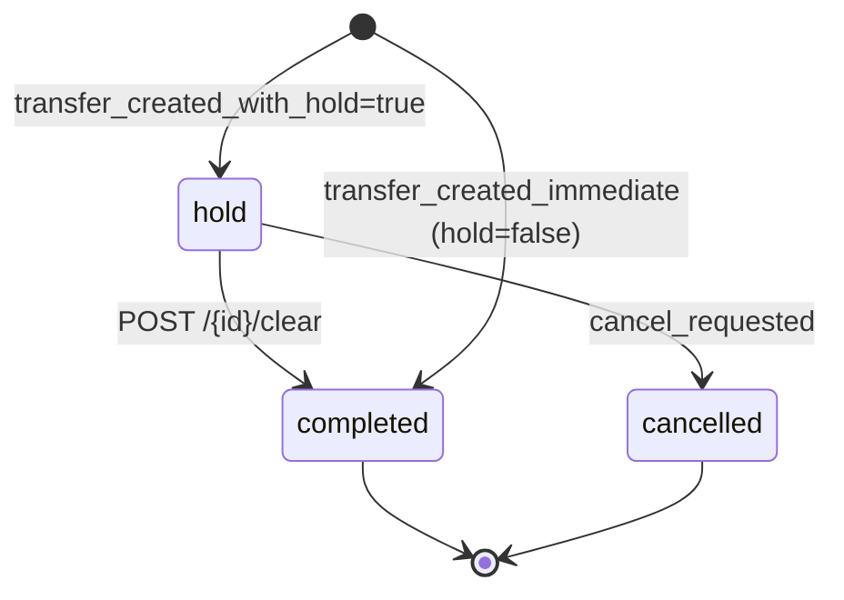

| State | Description | Terminal? |
|-------|-------------|-----------|
| `hold` | Funds held in holding_balance, awaiting clear/cancel | No |
| `completed` | Funds transferred | Yes |
| `cancelled` | Hold released, no transfer | Yes |

**Card Authorization Pattern**: Book transfers with holds enable card-like auth/capture flows:
- Authorization: `POST /transfers/book` with `hold=true`
- Re-auth: `PATCH /transfers/book/{id}` (update amount while in hold)
- Capture: `POST /transfers/book/{id}/clear`
- Void: `POST /transfers/book/{id}/cancel`

### 2.6 Realtime Transfer States (RTP/FedNow)

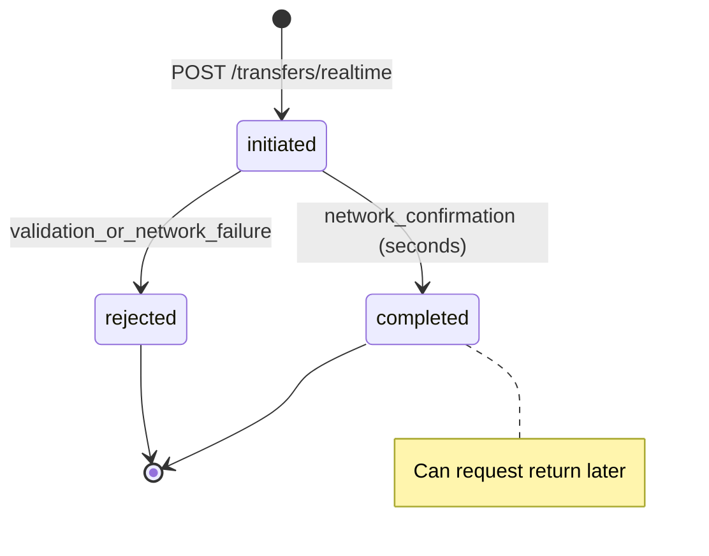

**Timing**: Real-time (seconds) for completion. Return requests are separate async flow via `POST /transfers/realtime/{id}/return-request`.

**Request for Payment (RfP)**: Supported via `/transfers/realtime/request-for-payment` endpoints. Accept/reject incoming RfPs via dedicated endpoints.

### 2.7 Check Transfer States

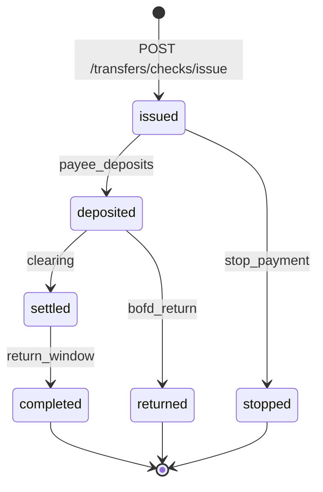

**Delivery States** (when mailed by Column):
`created` → `mailed` → `in_transit` → `in_local_area` → `processed_for_delivery` → `delivered` | `rerouted` | `returned_to_sender` | `failed`

### 2.8 Loan States

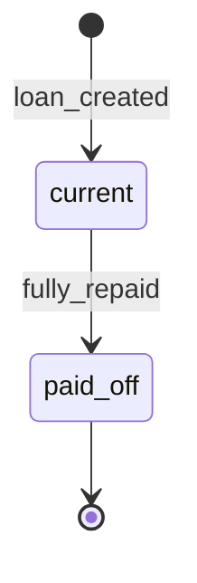

| State | Description | Terminal? |
|-------|-------------|-----------|
| `current` | Active loan with outstanding balance | No |
| `paid_off` | Fully repaid | Yes |

**Disbursement Sub-States**:
- `hold` → Can be updated or cancelled
- `completed` → Funds released to bank account

---

## 3. API Design Patterns

### 3.1 Authentication

Column uses **HTTP Basic Authentication** with API keys:

```bash
curl 'https://api.column.com/entities' \
  -u :<YOUR_API_KEY>
```

- **Sandbox keys**: Prefixed with `test_`
- **Production keys**: Prefixed with `live_` or `prod_`
- Keys are passed as the password in HTTP Basic Auth (username is empty)

### 3.2 Pagination

Column uses **cursor-based pagination** on all list endpoints:

```bash
# Parameters
limit=10                           # 1-100, default 10
starting_after=foo_ZXhhbXBsZQo     # Cursor for next page
ending_before=foo_ZXhhbXBsZQo      # Cursor for previous page

# Time filters
created_at.gt=2022-01-01T00:00:00Z   # Greater than
created_at.gte=2022-01-01T00:00:00Z  # Greater than or equal
created_at.lt=2022-12-31T23:59:59Z   # Less than
created_at.lte=2022-12-31T23:59:59Z  # Less than or equal
```

**Example**:
```bash
curl 'https://api.column.com/bank-accounts?entity_id=enti_xxx&limit=20&starting_after=bacc_lastId' \
  -u :<YOUR_API_KEY>
```

### 3.3 Idempotency

Column supports idempotency for safe request retries:

```bash
curl https://api.column.com/transfers/ach \
  -H "Idempotency-Key: 1zByArFNupaumBTijz3XXTlj9ZL" \
  -u :<YOUR_API_KEY> \
  -d counterparty_id="cpty_xxx" \
  -d bank_account_id="bacc_xxx" \
  -d amount=1000 \
  -d type=CREDIT
```

**Key Rules**:
- Keys can be up to **255 characters**, case-sensitive
- Keys expire after **30 days**
- Duplicate requests with same key return original response (no new resource created)
- Supports: entities, bank accounts, account numbers, loans, all transfers

### 3.4 Error Handling

**Error Response Structure**:
```json
{
  "type": "bank_account_error",
  "code": "bank_account_not_found",
  "message": "Bank account does not exist on this platform.",
  "documentation_url": "https://column.com/docs/api/#bank-account/create",
  "details": null
}
```

**Common Error Codes**:

| Code | Description |
|------|-------------|
| `account_information_mismatch` | Account details do not match records |
| `amount_precision_not_supported` | Amount precision invalid (e.g., EUR 12.345) |
| `bank_account_not_found` | Bank account not found in system |
| `cancellation_not_allowed` | Invalid cancel request for transfer |
| `country_not_supported` | Valid country code, but not supported |
| `currency_not_supported` | Valid currency code, but not supported |
| `transfer_non_sufficient_fund` | Insufficient funds for transfer |
| `overdraft_not_allowed` | Account not enabled for overdraft |
| `permission_denied` | No permission to access resource |
| `resource_not_found` | Requested resource not found |
| `resource_already_exists` | Duplicate resource creation attempt |
| `invalid_date` | Invalid date/datetime format |
| `mutually_exclusive_parameters` | Conflicting parameters specified |
| `fx_quote_expired` | FX quote has expired |
| `fx_quote_reuse` | FX quote already used/canceled |

### 3.5 Webhook Architecture

**Configuration**:
- Multiple endpoints per platform allowed
- HTTPS URLs required, POST requests with JSON payloads
- Each event type can only go to one endpoint per platform

**Event Structure**:
```json
{
  "id": "evnt_1vEdMiZ5pmkmrKZfNZ8LeqF2KFP",
  "created_at": "2021-07-12T23:05:36Z",
  "type": "ach.outgoing_transfer.completed",
  "data": {
    "id": "acht_1vEdMiRjQWQYqRqaOppMfU7BWr1"
    // ... full transfer object
  }
}
```

**Signature Verification**:
- Header: `Column-Signature`
- Algorithm: HMAC-SHA256
- Key: Webhook endpoint's signing secret
- Message: Raw JSON payload (no modifications)
- Additional header: `Webhook-Endpoint-Id`

**Delivery Guarantees**:
- Success: 2XX HTTP response within **10 seconds**
- Retry: Up to **25 times within 3 days** with exponential backoff
- First retry: 1 minute after original failure
- Events may be delivered **multiple times** with same ID (make processing idempotent)
- Events may arrive **out of order**

**Key Event Types**:

| Category | Events |
|----------|--------|
| **ACH Outgoing** | `initiated`, `submitted`, `acknowledged`, `settled`, `completed`, `canceled`, `returned` |
| **ACH Incoming** | `scheduled`, `settled`, `completed`, `returned`, `return_dishonored` |
| **Wire Outgoing** | `submitted`, `rejected`, `completed` |
| **Wire Incoming** | `completed`, `rejected` |
| **Book Transfer** | `completed` |
| **Realtime** | (similar pattern) |
| **Identity** | `verification.pending`, `verification_status.updated` |
| **Bank Account** | `overdraft_alert` |

---

## 4. Critical Operational Flows

### 4.1 Account Opening Flow (Individual)

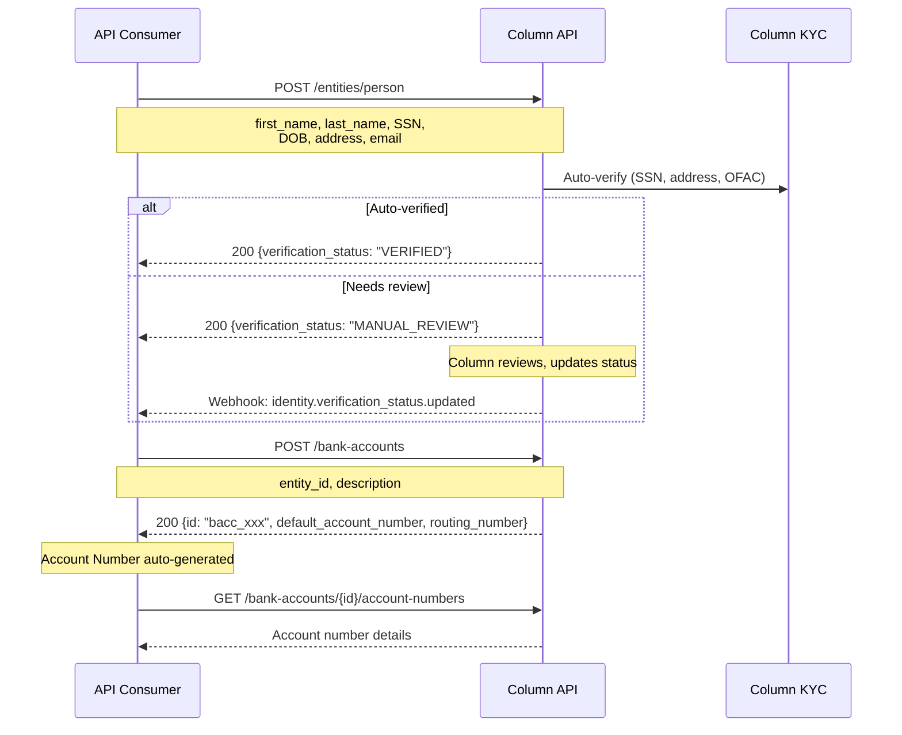

### 4.2 Account Opening Flow (Business)

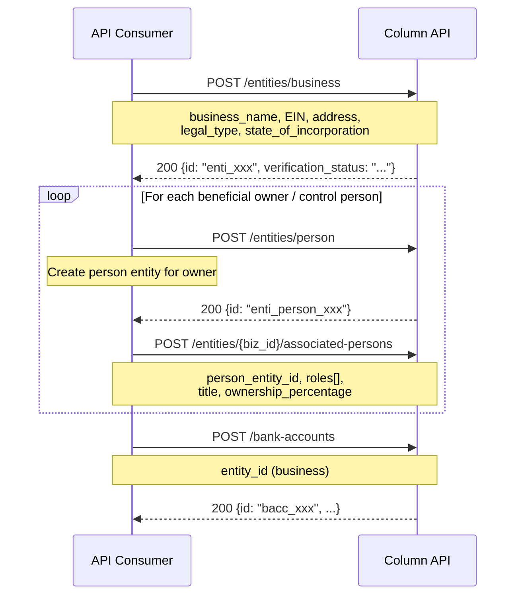

**Required Associated Person Roles**:
- `control_person` (required): Person with significant responsibility
- `beneficial_owner`: Any person with 25%+ ownership
- `account_opener`: Person opening the account (if different)

### 4.3 ACH Origination Flow

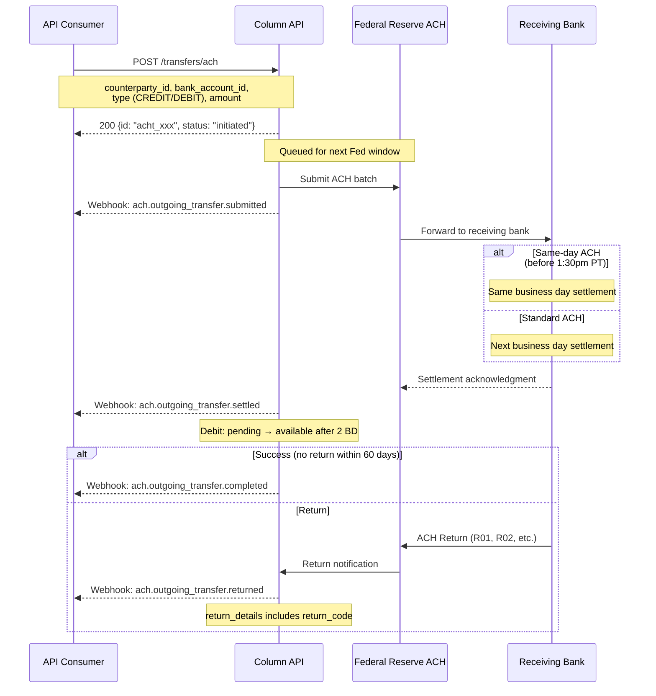

### 4.4 Book Transfer / Card Authorization Flow

Column doesn't issue cards directly but supports card settlement through book transfers with holds:

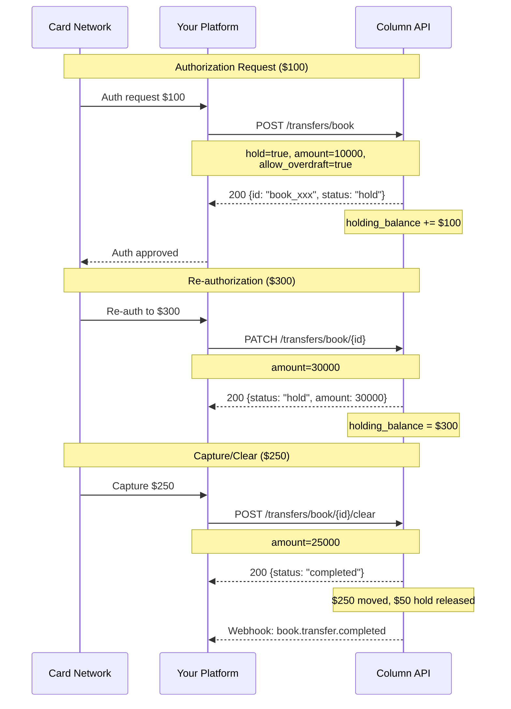

**Balance Types** (critical for card programs):
- `available_amount`: Can be spent
- `pending_amount`: In-flight transfers
- `holding_amount`: Book transfer holds (auth amounts)
- `locked_amount`: Root accounts only (regulatory holds, issued check amounts)

### 4.5 Overdraft Pattern

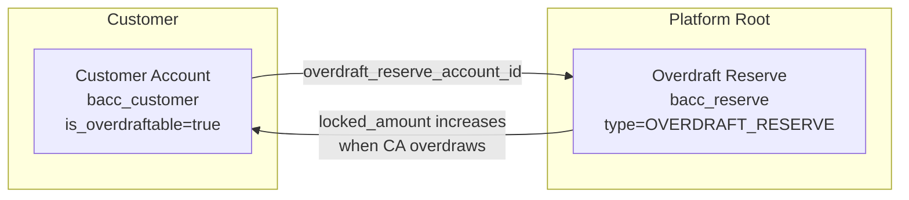

**When customer account overdraws**:
1. Funds locked in Overdraft Reserve account
2. `bank_account.overdraft_alert` webhook fired
3. Customer deposits → locked amount released

### 4.6 Lending Flow

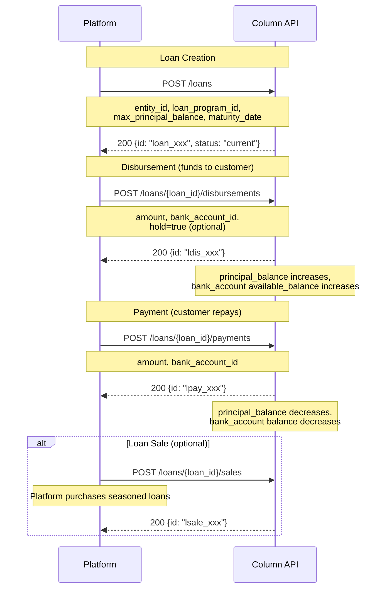

**Loan Key Attributes**:
- `is_revolving`: If true, loan can have multiple disbursements (credit line)
- `max_principal_balance`: Credit limit; disbursements fail if exceeded
- `seasoning_days`: Days before principal receivables can be sold
- `allow_overpayment`: If false, payments exceeding balance are blocked

---

## 5. Payment Rails Summary

| Rail | Endpoint Prefix | Outgoing | Incoming | Same-Day | Timing |
|------|-----------------|----------|----------|----------|--------|
| **ACH** | `/transfers/ach` | ✅ | ✅ | ✅ (1:30pm PT cutoff) | T+1 standard, same-day available |
| **Wire (Fedwire)** | `/transfers/wire` | ✅ | ✅ | ✅ (inherent) | Minutes |
| **Wire Drawdown** | `/transfers/wire/drawdown` | ✅ Request | ✅ Receive | ✅ | Minutes |
| **International Wire (SWIFT)** | `/transfers/international-wire` | ✅ | ✅ | No | 1-5 days |
| **Realtime (RTP/FedNow)** | `/transfers/realtime` | ✅ | ✅ | ✅ (inherent) | Seconds |
| **Request for Payment** | `/transfers/realtime/request-for-payment` | ✅ | ✅ | ✅ | Seconds |
| **Book Transfer** | `/transfers/book` | ✅ | ✅ | ✅ (instant) | Instant |
| **Check Issue** | `/transfers/checks/issue` | ✅ | — | No | Days |
| **Check Deposit** | `/transfers/checks/deposit` | — | ✅ | No | 1-2 days |

---

## 6. Integration Considerations

### 6.1 Sandbox Environment

**Base URL**: `https://api.column.com` (same for sandbox and production)

**Key Differences**:
- Sandbox keys prefixed with `test_`, production with `live_`
- Sandbox respects Fed operating hours by default
- Simulation endpoints available (`/simulate/*`) for testing

**Simulation Endpoints**:
```bash
# Receive incoming transfers
POST /simulate/receive-wire
POST /simulate/receive-ach-credit
POST /simulate/receive-ach-debit
POST /simulate/receive-realtime-transfer
POST /simulate/receive-international-wire

# Settle outgoing transfers immediately
POST /simulate/transfers/wire/settle
POST /simulate/transfers/ach/settle
POST /simulate/settle-check-deposit

# Other simulations
POST /simulate/deposit-issued-check
POST /simulate/receive-a-wire-drawdown-request
POST /simulate/receive-a-wire-return-request
```

**Note**: Simulation endpoints have max 1-minute delay to simulate real-world Fed timing. Not available in production.

### 6.2 Evidence & KYC

**Evidence Types**:
- `file`: Document uploads (PDF, JPG, PNG, TIFF; max 5GB)
- `third_party_json`: Pass-through from external KYC providers
- `signature`: Electronic signature evidence

**Evidence Purposes**:
- `proof_of_address`
- `business_formation`
- `identity_verification`
- `tax_id_confirmation`
- `active_status_certificate`
- `signed_account_agreement`
- `attestation_control_person`
- `attestation_beneficial_ownership`
- `attestation_account_info_truth`
- `attestation_terms_of_service`
- `ofac_screening`
- `adverse_media_screening`
- `pep_screening`
- `complete_customer_file`

### 6.3 Amount Handling

All amounts are in **cents** (smallest currency unit):
- `amount: 10000` = $100.00 USD
- Currency always specified via `currency_code` field

### 6.4 Character Validation

Names and certain fields must adhere to **Fedwire character validation** (alphanumeric + limited special characters).

---

## 7. Confidence Notes

### ✅ Fully Documented

- Entity model (Person/Business split with unified namespace)
- Bank Account → Account Number relationship (virtual accounts)
- All transfer state machines and webhooks
- ACH timing and cutoffs (1:30pm PT same-day)
- Joint account support (owners array)
- Beneficial owner linking (associated_persons with roles)
- Reversal/return linking patterns
- 4 balance types (available, pending, holding, locked)
- Idempotency (255 char keys, 30-day expiry)
- Cursor-based pagination
- Error codes and response structure
- Webhook signature verification (HMAC-SHA256)
- Webhook retry policy (25 retries, 3 days)
- Sandbox simulation endpoints
- Lending lifecycle (Loan → Disbursement → Payment → Sale)
- Evidence upload types and purposes

### 🔶 Partially Documented / Inferred

- Rate limits (mentioned as existing but specifics not documented)
- Platform API access (described as "invite only")
- Exact MANUAL_REVIEW → VERIFIED timeline
- ACH same-day availability for all SEC codes
- Compliance/frozen account behavior for incoming transfers

### ❓ Gaps / Needs Verification

- Explicit rate limit numbers and quotas
- API versioning strategy
- FBO account patterns (not explicitly documented)
- Multi-tenant/program separation architecture details
- Whether frozen accounts can receive incoming transfers
- Webhook IP whitelist (mentioned but not documented in main docs)

---

## 8. Cassandra Design Implications

| Column Pattern | Cassandra Recommendation |
|----------------|-------------------------|
| Unified Entity (Person/Business with type) | Adopt: Single `entities` table with `type` discriminator |
| `owners[]` array on Bank Account | Adopt: Native joint account support in data model |
| Account Number ↔ Bank Account separation | **Strongly recommend**: Enables virtual account patterns |
| 4-balance model | **Adopt**: available/pending/held/locked covers all use cases |
| `reversal_pair_transfer_id` | Adopt: `related_transaction_id` with `relationship_type` enum |
| `is_root` entity flag | Adopt: `account_tier` or `program_type` enum |
| Status: open/frozen | Expand: active/frozen/dormant/suspended/closed |
| Counterparty as first-class object | Adopt: Reusable external account references |
| ACH Positive Pay rules | Adopt: Pre-authorization pattern for incoming debits |
| Book transfer holds | Adopt: Pre-auth holds before settlement for card-like flows |
| Loan as sibling to Bank Account | Adopt: Both under Entity umbrella |
| Evidence abstraction | Adopt: Flexible KYC integration layer supporting multiple providers |
| Webhook HMAC signing | Adopt: Standard security pattern for event delivery |

### Key Architectural Takeaways

1. **Virtual Accounts Without Ledger Complexity**: Account Number abstraction is brilliant—adopt this pattern for Cassandra to support sub-accounts, customer-specific routing numbers, and disposable account numbers all pointing to single ledger entries.

2. **Card Programs Without Card Issuing**: Column's book transfer + hold pattern enables full card authorization/capture lifecycle without being a card issuer. Consider this for Cassandra's card module design.

3. **Direct Fed Access Advantages**: As a chartered bank, Column exposes low-level primitives. Cassandra should abstract these appropriately while preserving access to raw Fed behaviors when needed.

4. **Lending as First-Class Infrastructure**: Column's loan objects with disbursements, payments, and sales provide a complete lending backbone. Consider parallel design for Cassandra's credit products.

---

## Appendix: API Endpoint Reference

### Entities
- `POST /entities/person` - Create person entity
- `POST /entities/business` - Create business entity
- `GET /entities/{id}` - Get entity by ID
- `PATCH /entities/person/{id}` - Update person
- `PATCH /entities/business/{id}` - Update business
- `DELETE /entities/{id}` - Delete entity
- `GET /entities` - List all entities
- `POST /entities/{id}/associated-persons` - Link associated person
- `GET /entities/{id}/associated-persons` - Get associated persons
- `POST /entities/{id}/evidence` - Create evidence
- `GET /entities/{id}/compliance` - Get compliance status

### Bank Accounts
- `POST /bank-accounts` - Create bank account
- `GET /bank-accounts/{id}` - Get bank account
- `GET /bank-accounts` - List bank accounts
- `PATCH /bank-accounts/{id}` - Update bank account
- `DELETE /bank-accounts/{id}` - Delete bank account (requires $0 balance)
- `POST /bank-accounts/{id}/owner` - Add owner (joint account)
- `GET /bank-accounts/{id}/history` - Get daily summary history

### Account Numbers
- `POST /bank-accounts/{id}/account-numbers` - Create account number
- `GET /bank-accounts/{id}/account-numbers` - List account numbers
- `GET /account-numbers/{id}` - Get account number
- `PATCH /account-numbers/{id}` - Update account number

### Transfers
- `POST /transfers/ach` - Create ACH transfer
- `POST /transfers/wire` - Create wire transfer
- `POST /transfers/book` - Create book transfer
- `POST /transfers/realtime` - Create realtime transfer
- `POST /transfers/international-wire` - Create international wire
- `POST /transfers/checks/issue` - Issue check
- `POST /transfers/checks/deposit` - Deposit check
- (Plus GET, list, cancel, return endpoints for each)

### Lending
- `POST /loans` - Create loan
- `POST /loans/{id}/disbursements` - Create disbursement
- `POST /loans/{id}/payments` - Create payment
- `POST /loans/{id}/sales` - Create loan sale
- (Plus GET, list, update endpoints)

### Counterparties
- `POST /counterparties` - Create counterparty
- `GET /counterparties/{id}` - Get counterparty
- `GET /counterparties` - List counterparties
- `DELETE /counterparties/{id}` - Delete counterparty

### Webhooks & Events
- `POST /webhooks` - Create webhook endpoint
- `GET /events` - List all events
- `GET /events/webhook` - List webhook events
- `GET /webhooks/{id}/deliveries` - List delivery history