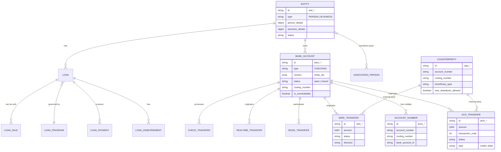
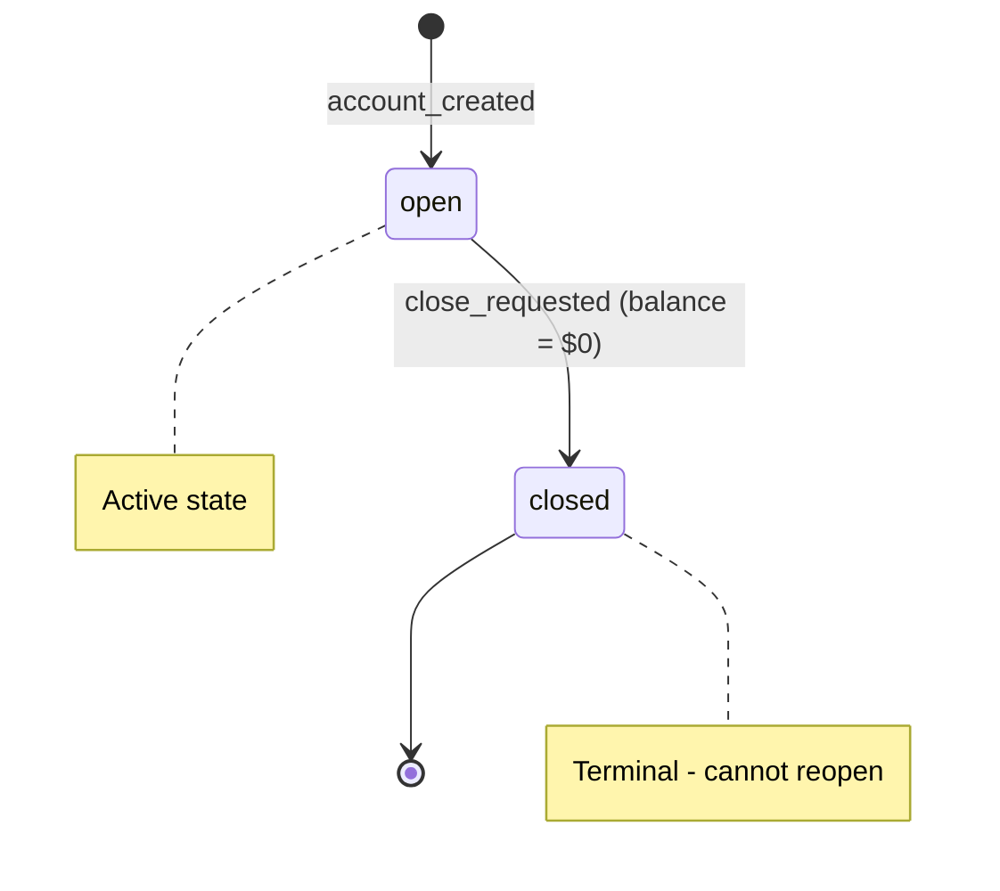
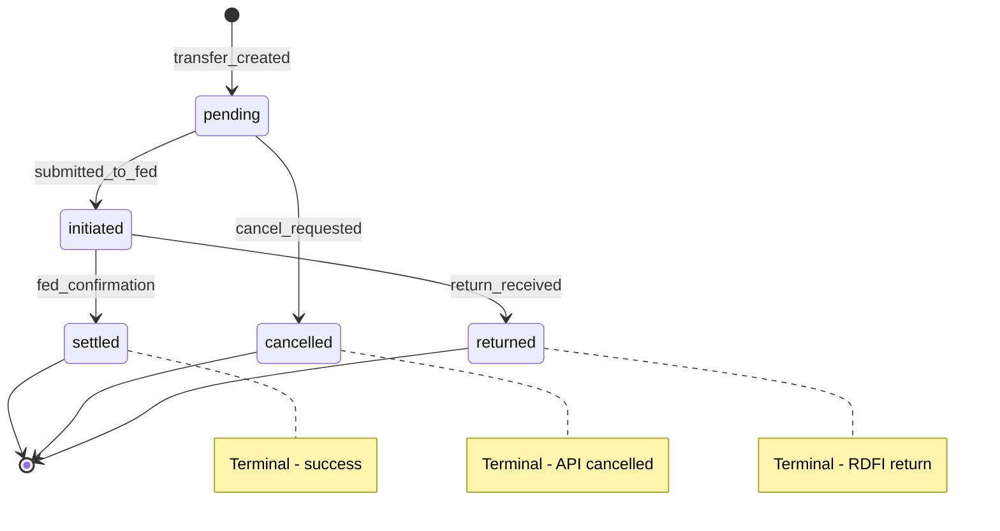
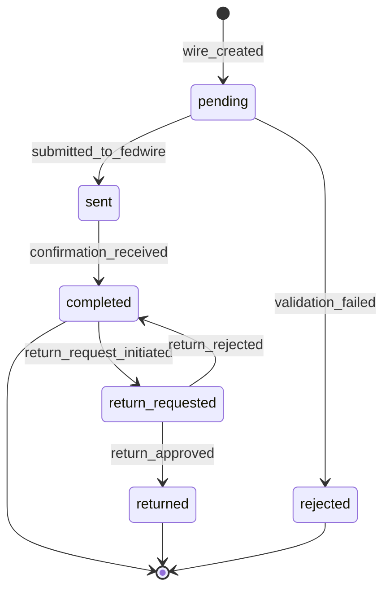
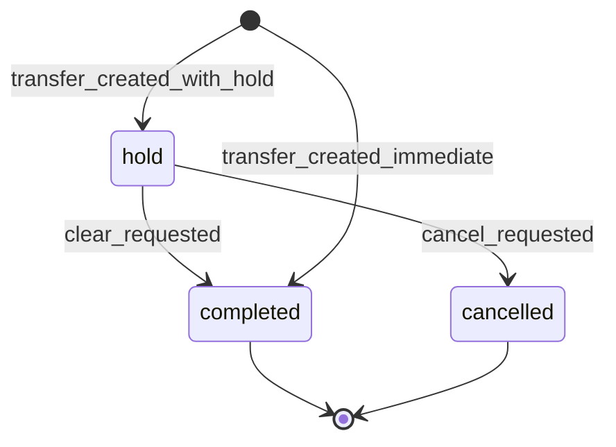
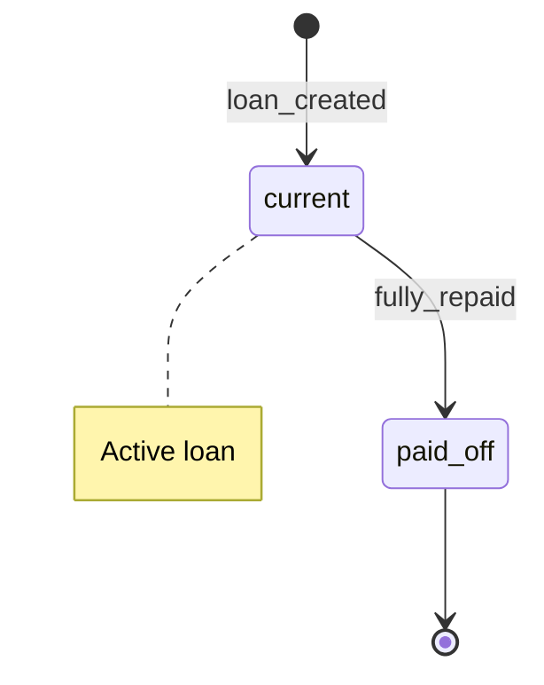
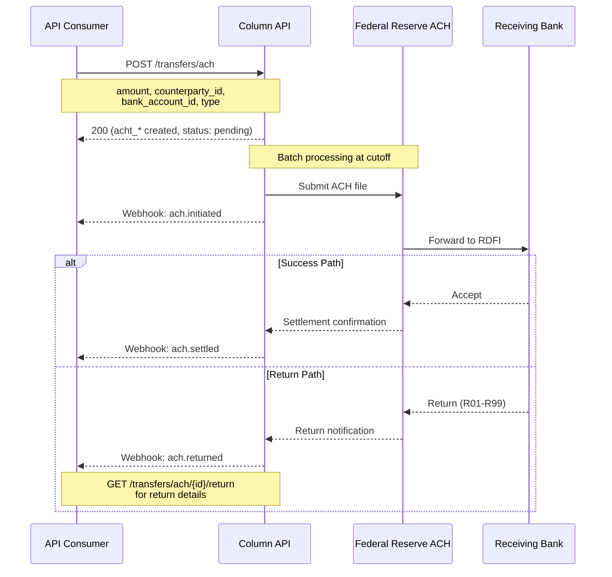
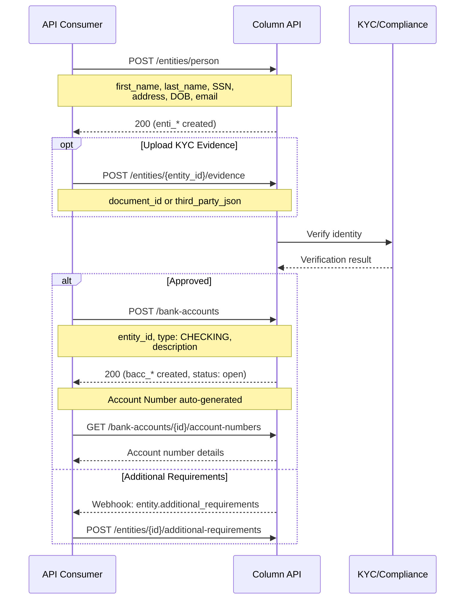
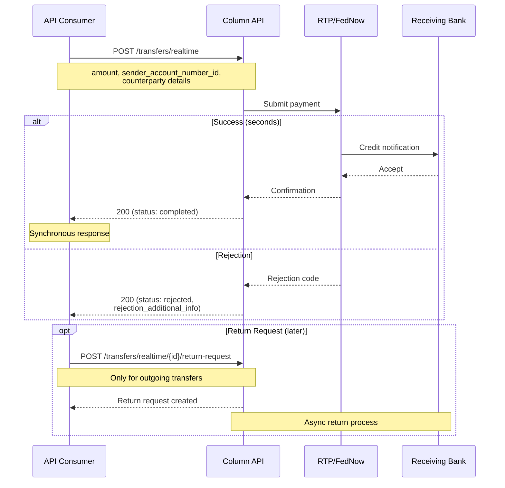

# Column API Architectural Analysis for Cassandra

**Provider:** Column  
**Analysis Date:** December 2025  
**Source:** column_semantic_map_improved.json

---

## Executive Summary

Column is a direct bank charter holder offering Banking-as-a-Service with direct Federal Reserve and payment network access. The API architecture reveals a **ledger-centric, infrastructure-focused** design that exposes low-level banking primitives rather than abstracting them away—a significant differentiator for sponsor banking use cases.

---

## 1. Entity Model

### ER Diagram

### Core Entities (7 Primary)

| Entity | ID Format | Key Attributes | Connections |
|--------|-----------|----------------|-------------|
| **Entity** | `enti_*` | type (PERSON/BUSINESS), person_details, business_details | Bank Accounts, Loans, Associated Persons |
| **Bank Account** | `bacc_*` | type (CHECKING), owners[], status, is_overdraftable, routing_number | Entity (owners), Account Numbers, Transfers |
| **Account Number** | `acno_*` | account_number, routing_number, description | Bank Account (many-to-one) |
| **Counterparty** | `ctpy_*` | account_number, routing_number, beneficiary_type, wire_drawdown_allowed | ACH/Wire Transfers |
| **ACH Transfer** | `acht_*` | amount, transaction_code, status, entry_details | Bank Account, Counterparty, Returns |
| **Wire Transfer** | `wire_*` | amount, status, fi_to_fi_information | Bank Account, Counterparty, Return Requests |
| **Loan** | `loan_*` | status, primary_signer_entity_id, seasoning_days | Entity, Loan Program, Disbursements, Payments |

### Key Design Decisions

**Unified Entity Model (Person + Business)**  
- ✅ Single `/entities` namespace with `type` discriminator (PERSON vs BUSINESS)
- Separate create endpoints: `POST /entities/person` and `POST /entities/business`
- Common evidence/verification layer across both types

**Multi-Owner Account Support (Joint Accounts)**  
- ✅ `owners` is an **array** of entity_ids on Bank Account
- Explicitly supports joint accounts with multiple owners

**Virtual Account / Sub-Account Model**  
- ✅ **Account Numbers as First-Class Objects**
- Multiple Account Numbers can point to a single Bank Account
- Endpoint: `GET /bank-accounts/{bank_account_id}/account-numbers`
- Enables virtual account patterns without creating new ledger accounts

**Business → Beneficial Owner Relationship**  
- ✅ Explicit Associated Persons endpoint: `GET /entities/{business_id}/associated-persons`
- Supports KYC requirements for beneficial ownership

**Transaction Linking Approach**  
- 🔶 Implied through return objects: `GET /transfers/ach/{ach_transfer_id}/return`
- Wire return requests explicitly linked via `wire_transfer_id`
- Realtime transfers: `return_pair_transfer_id` links original and return

---

## 2. State Machines

### Bank Account States

| State | Description | Terminal? | Recoverable? |
|-------|-------------|-----------|--------------|
| `open` | Active account accepting transactions | No | N/A |
| `closed` | Account terminated | Yes | No |

**Transition Rules:**
- ✅ Bank Accounts can only be deleted when they have a $0 balance
- No explicit frozen/suspended states documented (compliance holds likely handled out-of-band)

---

### ACH Transfer States

| State | Trigger | Terminal? | Recoverable? |
|-------|---------|-----------|--------------|
| `pending` | Transfer created, pre-submission | No | Yes (cancel) |
| `initiated` | Submitted to Federal Reserve | No | No |
| `settled` | Funds settled | Yes | No |
| `cancelled` | Cancelled before submission | Yes | No |
| `returned` | Return filed by RDFI | Yes | No |

**Notable:** Returns are handled as separate objects (`AchReturn`) linked to the original transfer.

---

### Wire Transfer States

| State | Trigger | Terminal? |
|-------|---------|-----------|
| `pending` | Wire created | No |
| `sent` | Submitted to Fedwire | No |
| `completed` | Funds delivered | Yes (but can request return) |
| `rejected` | Validation/compliance failure | Yes |
| `returned` | Return request approved | Yes |

**Notable:** Wire return requests have their own state machine (pending → approved/rejected).

---

### Book Transfer States

| State | Description | Terminal? |
|-------|-------------|-----------|
| `hold` | Funds held, awaiting clear/cancel | No |
| `completed` | Funds transferred | Yes |
| `cancelled` | Hold released, no transfer | Yes |

**Notable:**  
- Book transfers can be created with immediate settlement OR with a hold state
- ✅ "Transfer must be in a 'hold' state" to update amount or cancel
- Enables pre-authorization patterns

---

### Loan States

| State | Description | Terminal? |
|-------|-------------|-----------|
| `current` | Active loan with outstanding balance | No |
| `paid_off` | Fully repaid | Yes |

**Disbursement Sub-States:**
- `hold` → Can be updated or cancelled
- `completed` → Funds released

---

## 3. Critical Flows

### 3.1 ACH Origination Flow

**Timing:**
- 🔶 Same-day cutoffs: Not explicitly documented in semantic map
- 🔶 Standard ACH: T+1 to T+2 settlement
- Simulation endpoint processes incoming ACH hourly in sandbox

**Return Handling:**
- Returns accessible via `GET /transfers/ach/{ach_transfer_id}/return`
- Returns can be filed by platform OR received from other RDFIs
- ACH Positive Pay rules can pre-authorize incoming debits

---

### 3.2 Account Opening Flow (Individual)

**Business Account Differences:**
- `POST /entities/business` requires business_details
- Must add Associated Persons for beneficial owners
- Evidence requirements may differ per platform configuration

**Key Points:**
- ✅ Entity must exist before Bank Account creation
- ✅ Evidence can be uploaded documents OR third-party KYC JSON
- 🔶 Additional requirements schema is "configured per platform"

---

### 3.3 Realtime Payment Flow (RTP/FedNow)

**Timing:**
- ✅ Real-time (seconds) for completion
- Return requests are separate async flow
- Request for Payment (RfP) supported via `/transfers/realtime/request-for-payment`

---

## 4. Confidence Notes

### ✅ Documented Explicitly
- Entity model (Person/Business split with unified API)
- Multi-owner bank accounts (owners array)
- Account Numbers as separate objects (virtual account pattern)
- Associated Persons for beneficial ownership
- ACH Positive Pay rules
- Book transfer hold states
- Wire drawdown support
- International wire with FX quotes
- Realtime payments (RTP/FedNow)
- Loan objects with disbursements/payments

### 🔶 Inferred from API Structure
- ACH same-day cutoff times (not explicit in semantic map)
- Exact state machine transitions (inferred from business rules)
- Settlement timing SLAs
- Compliance/frozen account states (likely handled externally)

### ❓ Unclear / Needs Verification
- Explicit ledger/GL exposure (not visible in API surface)
- FBO account patterns (not documented)
- Multi-tenant/program separation architecture
- Webhook delivery guarantees
- Idempotency key handling details

---

## 5. Notable Architectural Patterns

### Direct Infrastructure Access
Column's positioning as a bank charter holder shows in the API:
- Direct Fedwire integration (wire transfers)
- Direct Fed ACH access (origination + receipt)
- Realtime payment network access (RTP/FedNow)
- Check processing via Image Cash Letter (ICL)

### Counterparty as First-Class Object
Unlike some providers that inline external account details, Column treats counterparties as reusable objects:
- Reduces duplication
- Enables wire drawdown permissions at counterparty level
- Supports both domestic and international (IBAN validation)

### Evidence-Based KYC
Flexible evidence model supporting:
- Document uploads (PDF, JPG, PNG, TIFF)
- Third-party JSON blobs (pass-through from external KYC providers)
- Per-platform additional requirements schema

### Lending Infrastructure
Comprehensive loan lifecycle:
- Loan Programs (template configuration)
- Disbursements with hold states
- Payments
- Loan Sales (to platform purchaser)
- Daily summary reporting

---

## 6. Cassandra Design Implications

| Column Pattern | Cassandra Consideration |
|----------------|------------------------|
| Unified Entity (Person/Business) | Consider same approach vs. separate models |
| owners[] array | Native joint account support in data model |
| Account Number ↔ Bank Account separation | Enables virtual account patterns—recommend adopting |
| Counterparty object | Reusable external account references |
| ACH Positive Pay rules | Pre-authorization pattern for incoming debits |
| Book transfer holds | Pre-auth holds before settlement—useful for card-like flows |
| Loan as sibling to Bank Account | Both under Entity umbrella |
| Evidence abstraction | Flexible KYC integration layer |

---

## Appendix: Transfer Type Coverage

| Transfer Type | Endpoint Prefix | Direction |
|--------------|-----------------|-----------|
| ACH | `/transfers/ach` | Originate + Receive |
| Wire | `/transfers/wire` | Originate + Receive |
| Wire Drawdown | `/transfers/wire/drawdown` | Request incoming wire |
| International Wire | `/transfers/international-wire` | Outbound with FX |
| Book Transfer | `/transfers/book` | Internal (instant) |
| Realtime (RTP/FedNow) | `/transfers/realtime` | Originate + Receive |
| Request for Payment | `/transfers/realtime/request-for-payment` | Request incoming RTP |
| Check Deposit | `/transfers/checks/deposit` | Inbound |
| Check Issuance | `/transfers/checks/issuance` | Outbound |