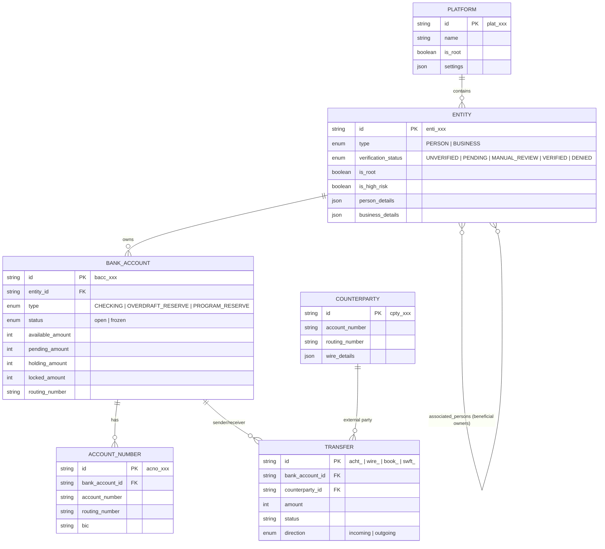
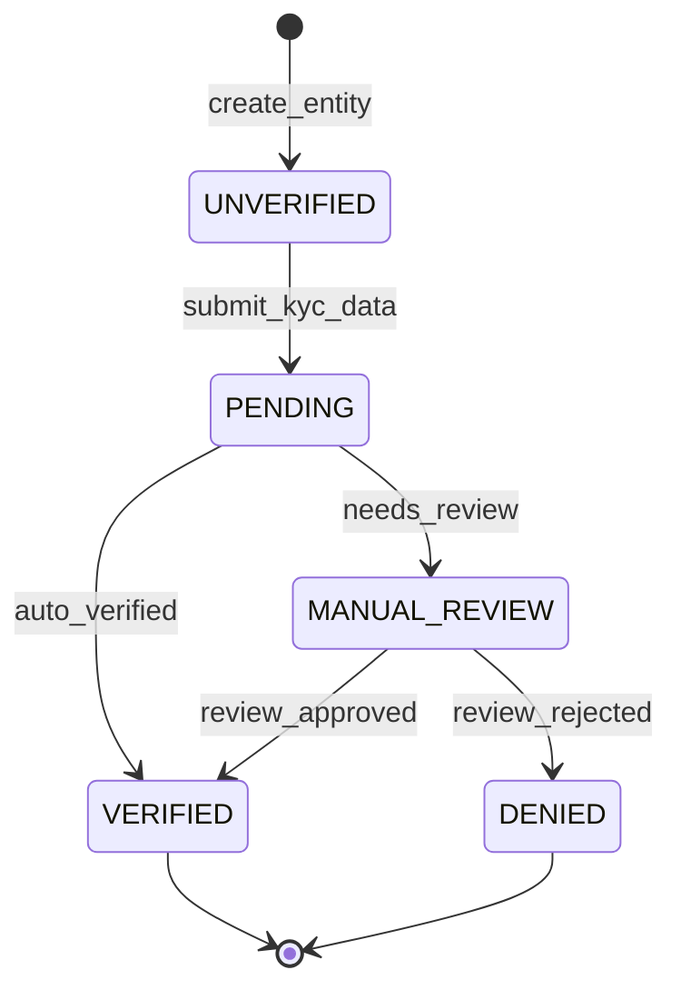
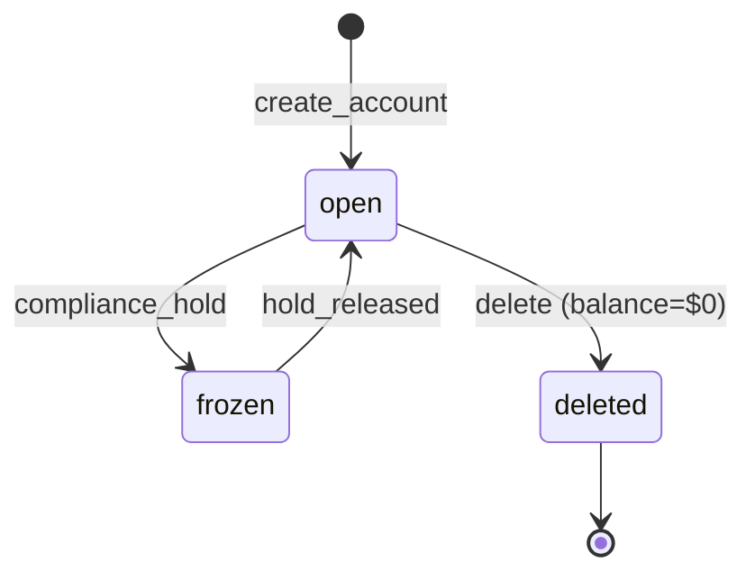
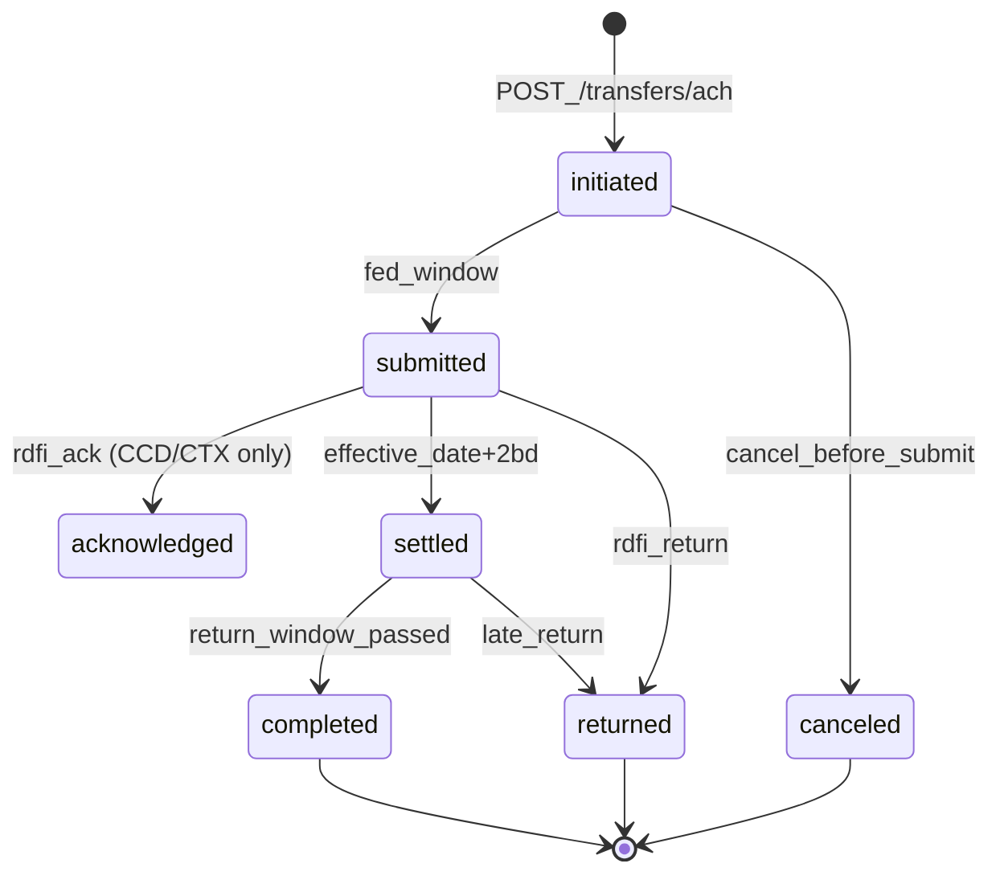
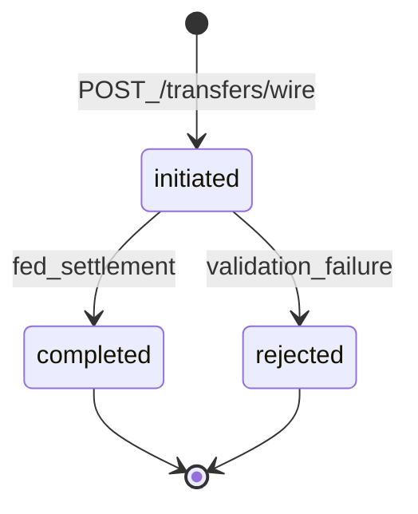
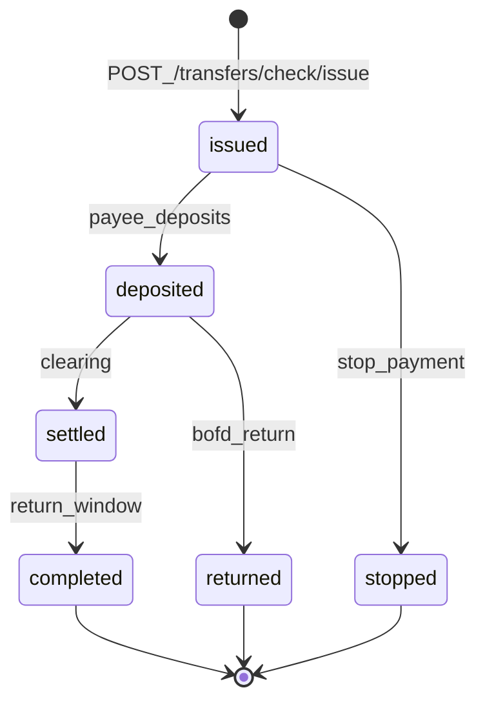
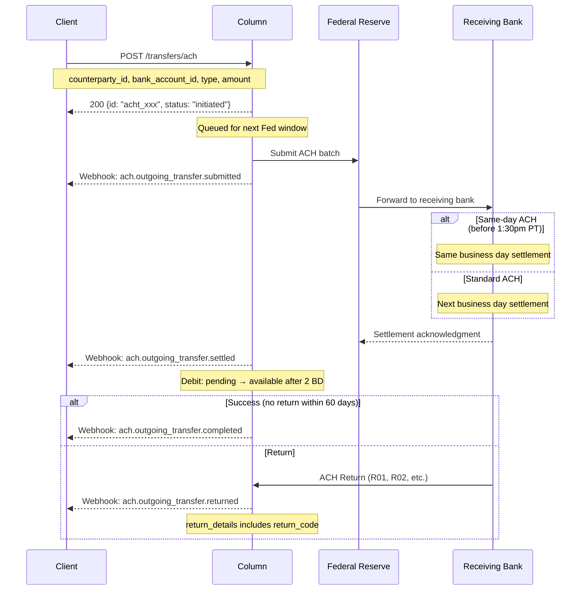
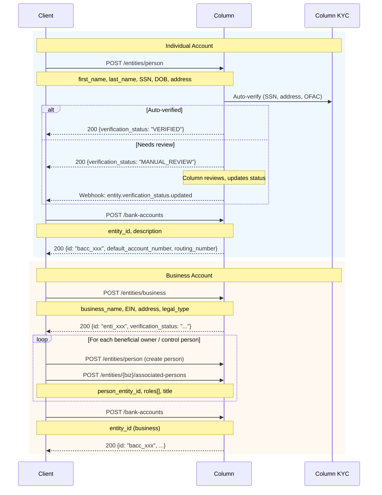
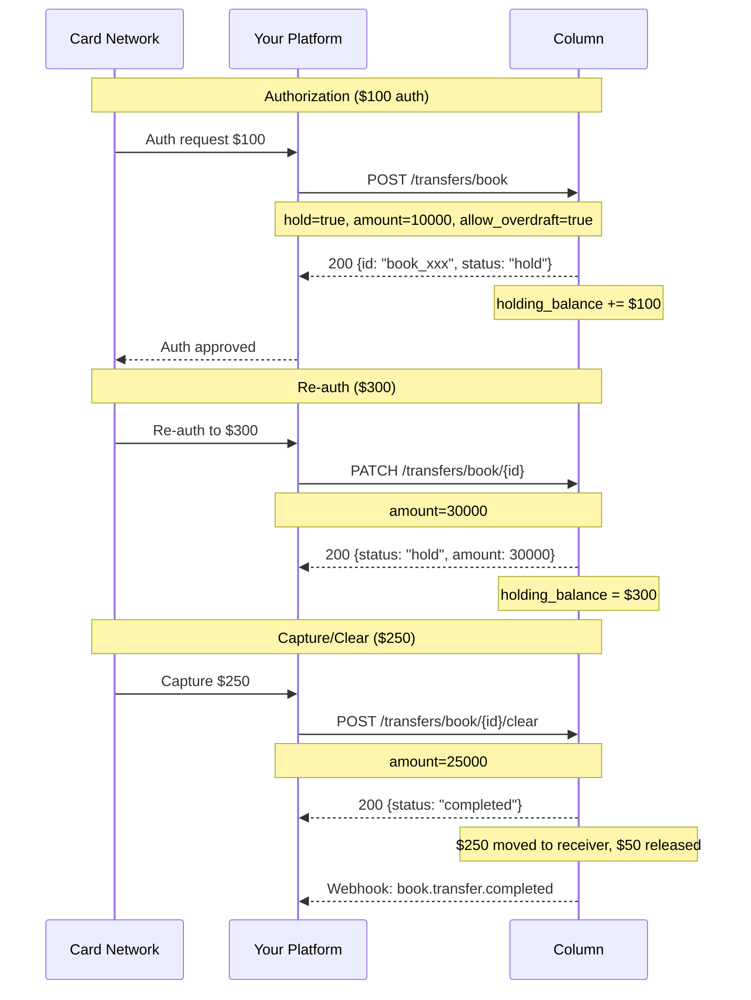
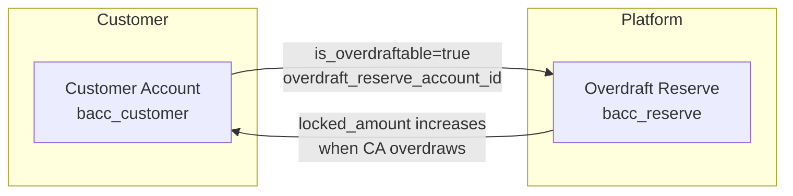

# Column API Architecture Analysis

**For: Cassandra Core Banking System**  
**Provider: Column N.A.**  
**Analysis Date: December 2025**

---

## Executive Summary

Column is unique among BaaS providers as a **nationally chartered bank** (not a middleware layer). They built their own ledger, core, and direct Fed integration. Key architectural decisions:

- **Split Entity Model**: Person and Business are separate object types (not unified Customer)
- **Account Number Abstraction**: Bank Account → Account Number is 1:many (virtual account pattern)
- **No Card Issuing**: Column does not issue cards; they provide the plumbing for card settlement via book transfers
- **Direct Fed Access**: ACH, Fedwire, RTP, SWIFT all directly integrated
- **Platform Hierarchy**: Platform → Entity → Bank Account → Account Number

---

## 1. Entity Model

### Core Entities (7 Primary Objects)

| Entity | ID Prefix | Key Attributes | Relationships |
|--------|-----------|----------------|---------------|
| **Platform** | `plat_` | Master settings, billing, reserves | Top-level; owns all Entities |
| **Entity (Person)** | `enti_` | SSN/passport, DOB, address, verification_status | Can own Bank Accounts |
| **Entity (Business)** | `enti_` | EIN, legal_type, beneficial_owners | Can own Bank Accounts; links to Person entities |
| **Bank Account** | `bacc_` | balances (4 types), status, type | Owned by Entity; has Account Numbers |
| **Account Number** | `acno_` | account_number, routing_number, BIC | Points to Bank Account |
| **Counterparty** | `cpty_` | routing_number, account_number, wire details | External account for transfers |
| **Transfer** | varies | amount, status, type, timestamps | Links Bank Account ↔ Counterparty |

### ER Diagram



### Key Design Decisions

**Entity Model (Split Person/Business)** ✅ Documented explicitly
- Person and Business are distinct types with different required fields
- Business entities link to Person entities via `associated_persons` endpoint
- Roles: `control_person`, `beneficial_owner`, `account_opener`
- UBO (25%+ ownership) tracked via `beneficial_owner` role

**Joint Account Support** ✅ Documented explicitly
- Yes: Bank Account has `owners` array accepting multiple `entity_id`s
- Add owner via `POST /bank-accounts/{id}/owner`

**Sub-Account/Virtual Account Model** ✅ Documented explicitly
- **Account Number** is the virtual account pattern
- One Bank Account → Many Account Numbers
- Each Account Number has unique routing/account number
- Use case: Give each customer/use-case unique account numbers pointing to same balance

**Transaction Linking** ✅ Documented explicitly
- ACH reversals: `reversal_pair_transfer_id` links original ↔ reversal
- Wire reversals: Same pattern via `reversal_pair_transfer_id`
- Returns: `return_details` object on transfer with return code

---

## 2. State Machines

### Entity (KYC) States



| State | Terminal? | Recoverable? | Trigger |
|-------|-----------|--------------|---------|
| UNVERIFIED | No | N/A | Initial state |
| PENDING | No | N/A | KYC data submitted |
| MANUAL_REVIEW | No | Yes | Auto-verification inconclusive |
| VERIFIED | Yes* | N/A | KYC approved |
| DENIED | Yes | No | KYC rejected |

*Verified can potentially move to MANUAL_REVIEW if re-verification triggered

### Bank Account States



| State | Terminal? | Can Transact? | Notes |
|-------|-----------|---------------|-------|
| `open` | No | Yes | Normal operating state |
| `frozen` | No | No | Compliance hold; wires return reason "account blocked/frozen" |
| (deleted) | Yes | N/A | Only possible when balance = $0 |

**Notable**: Column uses only 2 states (open/frozen). No pending/closed distinction.

### ACH Transfer States (Outgoing)



| State | Description | Balance Impact |
|-------|-------------|----------------|
| `initiated` | Received, queued for Fed | pending_balance adjusted |
| `submitted` | Sent to Fed | No change |
| `acknowledged` | RDFI acknowledged (corporate only) | No change |
| `settled` | Effective date passed | Debit: pending → available |
| `completed` | Return window passed | Terminal success |
| `returned` | RDFI returned transfer | Funds credited back |
| `canceled` | Canceled before submission | Pending reversed |

**Timing** (Same-day ACH):
- Cutoff: 1:30 PM PT
- Requires: `same_day=true` AND/OR `effective_on=today`
- Settlement: Same business day

### Wire Transfer States (Outgoing)



**Notable**: Wire states are simple - initiated → completed happens rapidly (same-day, often minutes).

| State | Description |
|-------|-------------|
| `initiated` | Wire request received |
| `completed` | Fed settlement complete |
| `rejected` | Validation or Fed rejection |

### Check Transfer States



**Delivery States** (when mailed by Column):
`created` → `mailed` → `in_transit` → `in_local_area` → `processed_for_delivery` → `delivered`

---

## 3. Critical Flows

### ACH Origination Flow (Credit/Debit)



**Timing**:
- API → initiated: Synchronous (< 1s)
- initiated → submitted: Next Fed window
- submitted → settled: 2 business days after effective_date (for debits)
- Return window: Up to 60 days (unauthorized returns)

**Same-day ACH Cutoffs**:
- Last API deadline: 1:30 PM PT
- Requires: `same_day=true` OR `effective_on=today`

### Account Opening Flow



**Business vs Individual Differences**:
- Business requires: EIN (or registration_id for non-US), legal_type
- Business associates: Control person required; beneficial owners (25%+)
- Root entities: Additional fields (state_of_incorporation, description, payment_volumes)

### Book Transfer / Card Authorization Flow

Column doesn't issue cards but supports card settlement through book transfers with holds:



**Balance Types** (critical for card programs):
- `available_amount`: Can be spent
- `pending_amount`: In-flight transfers
- `holding_amount`: Book transfer holds (auth amounts)
- `locked_amount`: Root accounts only (regulatory holds)

---

## 4. Confidence Notes

### ✅ Documented Explicitly
- Entity model (Person/Business split)
- Bank Account → Account Number relationship
- All transfer state machines
- ACH timing and cutoffs
- Joint account support (`owners` array)
- Beneficial owner linking (associated_persons)
- Reversal/return linking pattern
- Balance types (available, pending, holding, locked)

### 🔶 Inferred from API Structure
- Account state machine (only open/frozen mentioned, deleted implied)
- Verification state machine transitions (states documented, triggers partially)
- Rate limits on certain operations

### ❓ Unclear, Needs Verification
- Same-day ACH availability for all SEC codes
- Exact MANUAL_REVIEW → VERIFIED timeline
- Whether frozen accounts can receive incoming transfers
- FBO account patterns (not explicitly documented)
- Multi-tenant program separation (minimal docs)

---

## 5. Column-Specific Patterns

### Platform Hierarchy

```
Platform (you)
├── Root Entity (your company) ← special is_root=true entity
│   ├── Reserve Accounts
│   │   ├── Overdraft Reserve
│   │   └── Program Reserve
│   └── Operating Accounts
└── Customer Entities (your users)
    ├── Person Entities
    │   └── Bank Accounts
    │       └── Account Numbers
    └── Business Entities
        ├── Associated Persons (beneficial owners)
        └── Bank Accounts
            └── Account Numbers
```

### ID Prefixes

| Object | Prefix | Example |
|--------|--------|---------|
| Entity | `enti_` | `enti_2Q1ctiJm1NypVqCt8UBC8e4xTfH` |
| Bank Account | `bacc_` | `bacc_2YHAXVyuS2xcJW12Buh9zsxV7vC` |
| Account Number | `acno_` | `acno_2YHAWG9FTCxtL5emK1oVKCOx7fk` |
| Counterparty | `cpty_` | `cpty_xxx` |
| ACH Transfer | `acht_` | `acht_1vEdMiRjQWQYqRqaOppMfU7BWr1` |
| Wire Transfer | `wire_` | `wire_2XJUlyL4xJ0BDynRsS0A2MHEtll` |
| International Wire | `swft_` | `swft_xxx` |
| Book Transfer | `book_` | `book_xxx` |
| Check Transfer | `chck_` | `chck_xxx` |
| Document | `docu_` | `docu_2zEuexQ1tYgBO92ZHLZa7YV3F0i` |
| Evidence | `evid_` | `evid_2zEueyHBVWyPjzAm8h1Hn3pV4et` |
| Event | `evnt_` | `evnt_1vEdMiZ5pmkmrKZfNZ8LeqF2KFP` |

### Overdraft Pattern



When customer account overdraws:
1. Funds locked in Overdraft Reserve
2. `bank_account.overdraft_alert` webhook fired
3. Customer deposits → locked amount released

---

## 6. Payment Rails Summary

| Rail | Outgoing | Incoming | States | Same-Day |
|------|----------|----------|--------|----------|
| ACH | ✅ | ✅ | initiated→submitted→settled→completed | ✅ (1:30pm PT cutoff) |
| Wire (Fedwire) | ✅ | ✅ | initiated→completed | ✅ (inherent) |
| International Wire (SWIFT) | ✅ | ✅ | Complex tracking | No |
| RTP | ✅ | ✅ | Near-instant | ✅ (inherent) |
| Checks | ✅ Issue | ✅ Deposit | issued→deposited→settled | No |
| Book Transfer | ✅ | ✅ | initiated→completed (or hold) | ✅ (instant) |

---

## 7. Cassandra Design Implications

### What Column Does Well (Consider Adopting)
1. **Account Number abstraction** - Brilliant for virtual accounts without ledger complexity
2. **4-balance model** - available/pending/holding/locked covers all use cases
3. **Split Entity types** - Cleaner than unified Customer with type field
4. **Associated Persons pattern** - Clean beneficial ownership modeling
5. **Reversal linking** - `reversal_pair_transfer_id` pattern

### Gaps for Sponsor Banking
1. **No Card Issuing** - You'll need Marqeta/Galileo/Lithic for cards
2. **Limited Ledger Exposure** - No GL-level access; Column is the core
3. **No Multi-Program Docs** - Sponsor banking program separation unclear
4. **No Explicit FBO Patterns** - May need custom implementation

### Recommended Cassandra Patterns

| Column Pattern | Cassandra Adaptation |
|----------------|---------------------|
| Entity → Bank Account → Account Number | Consider: Customer → Ledger Account → Virtual Account |
| 4 balance types | Adopt: available/pending/held/restricted |
| `reversal_pair_transfer_id` | Use: `related_transaction_id` with `relationship_type` |
| `is_root` entity flag | Adopt: `account_tier` or `program_type` enum |
| Status: open/frozen | Expand: active/frozen/dormant/closed |