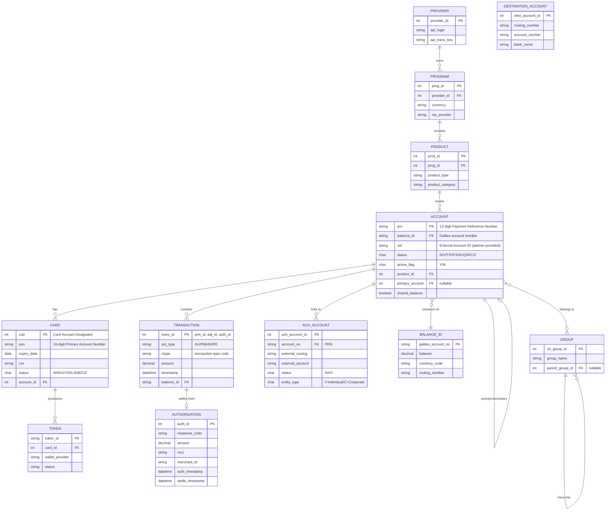
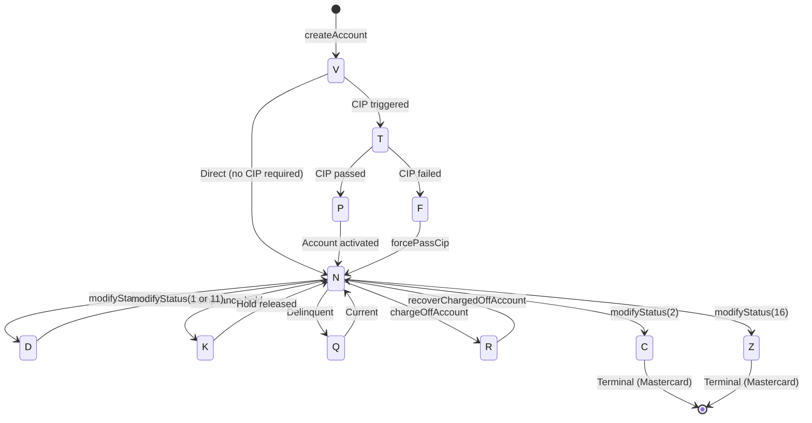
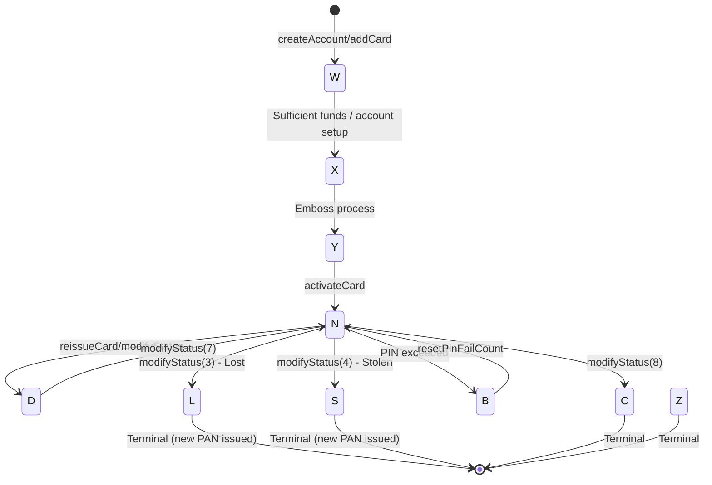
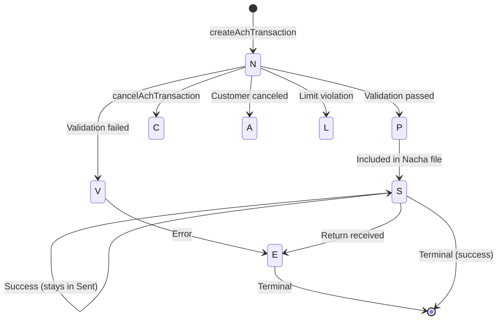
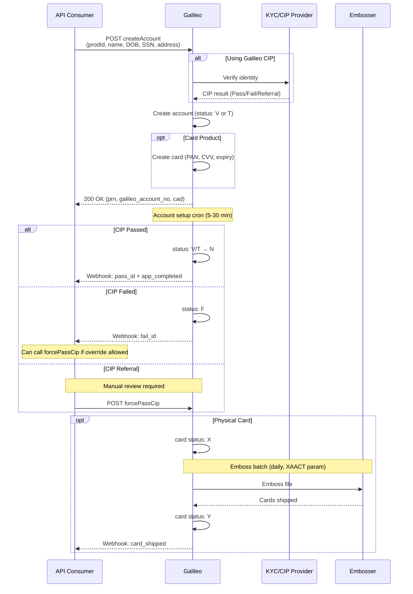
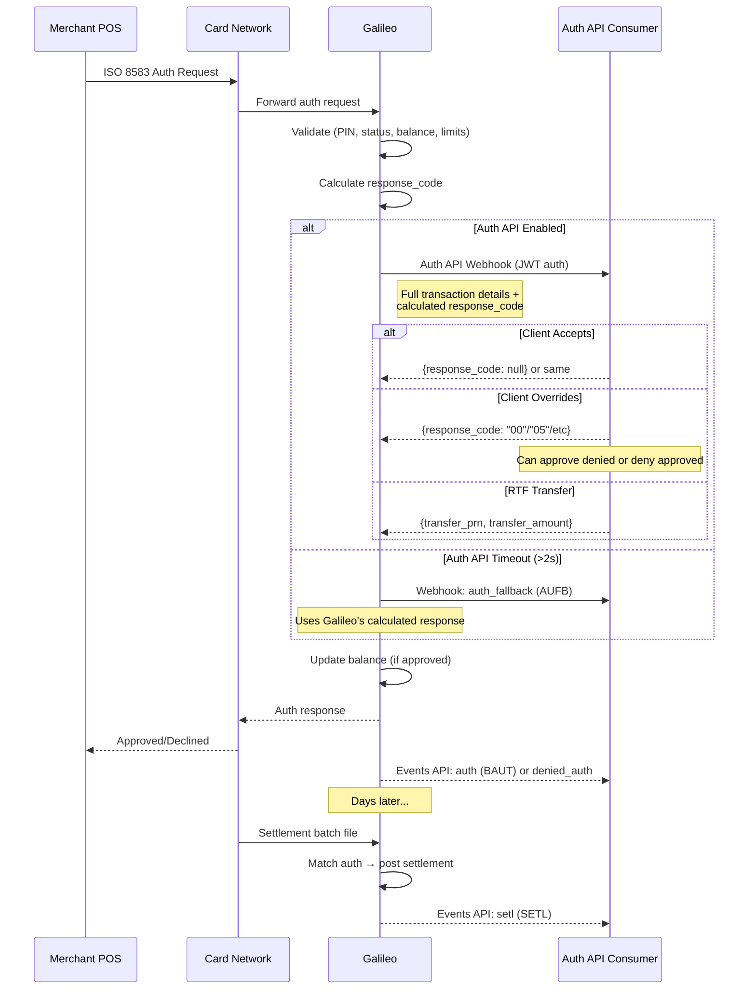
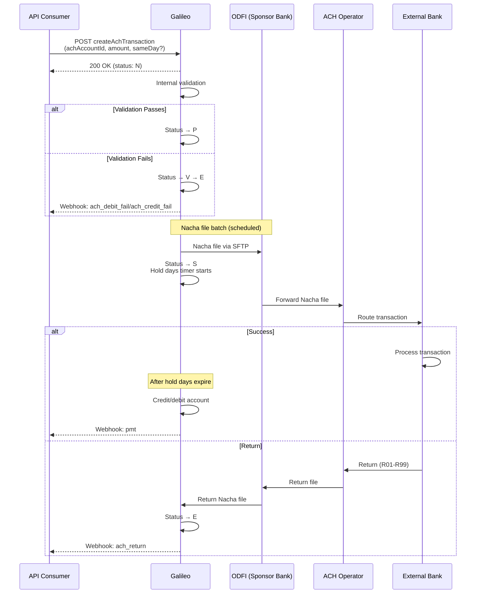

# Galileo BaaS API: Comprehensive Analysis for Cassandra

**Provider:** Galileo Financial Technologies (SoFi Technologies subsidiary)  
**Documentation:** https://docs.galileo-ft.com/pro/reference/program-api-intro  
**API Version:** Program API v4.0  
**Analysis Date:** December 2025

---

## Executive Summary

Galileo is a **processor-centric platform** with card-issuing heritage. Its architecture is heavily influenced by card-network paradigms (ISO 8583), providing real-time authorization control but with ACH as an overlay rather than a first-class primitive.

**Key Characteristics:**
- **Account-Card Centric**: Every account implicitly ties to card issuance concepts
- **Real-Time Auth Control**: Auth API webhook provides full authorization decision control
- **Processor Not Ledger**: Galileo operates as a processor; the sponsor bank holds the actual ledger
- **Product-Program Hierarchy**: Multi-tenant via Provider → Program → Product → Account structure
- **Batch Reconciliation**: No real-time GL API; uses RDF files for reconciliation

---

## 1. Entity Model

### 1.1 Entity Relationship Diagram



### 1.2 Core Entities

| Entity | Primary Key | Key Attributes | Notes |
|--------|-------------|----------------|-------|
| **Provider** | `provider_id` | api_login, api_trans_key | Top-level client identity |
| **Program** | `prog_id` | currency, cip_provider | Groups products, sets program-level params |
| **Product** | `prod_id` | product_type, limits, features | All behavior controlled by product params |
| **Account (PRN)** | 12-digit PRN | status, active_flag, balance_id, xid | Primary/secondary linkage supported |
| **Card** | CAD (internal) | PAN, status, expiry, CVV | Independent status from Account |
| **Balance_ID** | Galileo account number | balance, currency, routing | Multiple PRNs can share one balance_id |
| **ACH_Account** | ach_account_id | routing, account, entity_type | Links external accounts for ACH |
| **Transaction** | pmt_id/adj_id/auth_id | act_type, otype, amount | Different ID sequences per type |
| **Token** | token_id | wallet_provider, status | Digital wallet provisioning |
| **Group** | ch_group_id | group_name, parent_group_id | Corporate hierarchy support |

### 1.3 Account Identifiers (Multiple!)

| Identifier | Format | Purpose | Stable? |
|------------|--------|---------|---------|
| **PRN** | 12-digit (3-digit prefix + 8-digit + checksum) | Primary API identifier | ✅ Never changes |
| **PAN** | 16-digit card number | Card network identifier | ❌ Changes on reissue |
| **CAD** | Integer | Galileo-internal card ID | ✅ |
| **balance_id** | Galileo account number | Internal balance tracking | ✅ |
| **XID** | Partner-defined | External account ID | ✅ |

### 1.4 Key Design Decisions

| Decision | Galileo Approach | Implications |
|----------|------------------|--------------|
| **Customer Model** | Implicit (embedded in Account) | No separate Customer entity in API |
| **Account ≠ Balance** | PRN and balance_id are separate | Multiple accounts can share one balance |
| **Card-Account Independence** | Separate status tracking | Both must be `N` for transactions |
| **Joint Accounts** | Not native; uses "shared balance" pattern | Up to ~3000 secondary accounts per primary |
| **Business vs Individual** | Product-level distinction | businessName required; beneficial owners not explicit |
| **Transaction Linking** | auth_id → settlement matching | Reversals matched within 10-day window |

### 1.5 Sponsor Banking Questions

| Question | Galileo Answer |
|----------|----------------|
| Joint accounts (multiple owners)? | ❌ No true joint accounts. Uses shared balance pattern |
| Sub-accounts/virtual accounts? | ✅ Via secondary accounts with `sharedBalance: 1`, also RTF pattern |
| Business → Beneficial owners? | 🔶 `businessName` field exists; KYB via external provider; beneficial owner structure not explicit in API |
| Transaction linking? | ✅ Via `auth_id` linkage; ACH reversals matched within 10-day window |

---

## 2. API Design Patterns

### 2.1 Authentication

**Method:** API key-based authentication with 4 required parameters per request

| Parameter | Description | Source |
|-----------|-------------|--------|
| `apiLogin` | API login credential | Provided by Galileo during onboarding |
| `apiTransKey` | API transaction key | Provided by Galileo during onboarding |
| `providerId` | Your provider identifier | Provided by Galileo during onboarding |
| `transactionId` | Unique request identifier | Generated by you (max 60 chars, preferably UUID) |

**URI Format:**
```
https://api-{corename}.{env}.gpsrv.com/intserv/4.0/{endPointName}
```

| Environment | `env` value | Notes |
|-------------|-------------|-------|
| Sandbox | sandbox-api | Shared test environment |
| Client Validation (CV) | cv | Your programs/products for testing |
| Production | pd | Live environment |

**Protocol:** HTTPS with TLS 1.2 minimum (TLS 1.3 recommended)

**Auth API Webhook Security:** JSON Web Tokens (JWT) with shared secret
- Token contains: `exp`, `iat`, `iss` ("galileo")
- Must respond within 2 seconds of `timestamp` field

### 2.2 Idempotency

**Program API:**
- Uses `transactionId` parameter for idempotency
- Must be unique per successful API call
- Max 60 characters (preferably UUID)
- **Exception:** Create Adjustment requires 64-bit integer < 9223372036854775807
- Duplicate within 90 days returns `status_code: 24`
- Failed requests can reuse the same `transactionId`
- **No idempotency check** for read-only endpoints (Get Balance, Verify Account, Search Biller Directory)

**Recovery:** Use `Get Call Status` with original `transactionId` to retrieve original response

### 2.3 Pagination

**Method:** Record-set pagination with `recordCnt` parameter

| Parameter | Description | Default |
|-----------|-------------|---------|
| `recordCnt` | Records per page | Max 200 |
| `page` | Current page number | Returned in response |

**Configuration:**
- `MXRPG` parameter: Increase max records per page
- `NOPGE` parameter: Retrieve all records in one page

### 2.4 Rate Limits

| Environment | Limit |
|-------------|-------|
| Sandbox | 1,000 requests per 10 minutes |
| CV/Production | Contact Galileo for limits |

### 2.5 Error Handling & Response Codes

**Global Response Structure:**
```json
{
  "status_code": 0,
  "status": "Success",
  "system_timestamp": "2020-12-08 09:25:31",
  "response_data": { ... },
  "processing_time": 4.492,
  "echo": {
    "transaction_id": "...",
    "provider_transaction_id": "",
    "provider_timestamp": null
  }
}
```

**Common Status Codes:**

| Code | Description |
|------|-------------|
| 0 | Success |
| 24 | Duplicate transaction (idempotency violation) |
| 638-03 | Card status already L or S |
| 638-05 | Replacement card being processed |

**Authorization Response Codes:**

| Code | Description | Notes |
|------|-------------|-------|
| 00 | Approved | |
| 05 | Do not honor | Various reasons |
| 14 | Invalid card number | |
| 51 | Insufficient funds | |
| 55 | Invalid PIN | |
| 61 | Exceeds amount limit | |
| 65 | Exceeds transaction count limit | |
| 78 | Card frozen | |

### 2.6 Webhook/Event Architecture

**Events API Categories:**

| Category | Event Codes | Description |
|----------|-------------|-------------|
| **Account** | app_completed, fail_id, pass_id, account_status_change, card_shipped, card_activated, frozen, unfrozen | Account lifecycle events |
| **Authorization** | auth (BAUT), denied_auth (DAUT), auth_exp, auth_fallback (AUFB), auth_metadata | Real-time auth events |
| **Settlement** | setl (SETL) | Card settlement events |
| **Transaction** | pmt, adj, fee, fee_reversal, ach_return, ach_credit_fail, ach_debit_fail | Money movement events |

**Auth API (Authorization Controller):**
- Real-time webhook for authorization decisions
- Version 3.0 is current (breaking changes from v2)
- JWT authentication with shared secret
- **Must respond within 2 seconds**
- Can override Galileo's calculated response_code
- Fallback to Galileo decision on timeout (AUFB event)

**Decline Event Codes:**

| Code | Event | Description |
|------|-------|-------------|
| DAUT | denied_auth | General denial |
| BNSF | denied_auth_nsf | Insufficient funds |
| PUMP | denied_auth_gas | NSF at gas pump |
| NACT | denied_auth_inactive_card | Card not in status N |
| IPIN | denied_auth_invalid_pin | Invalid PIN |
| BPAN | denied_auth_bad_pan | Invalid card number |

---

## 3. State Machines

### 3.1 Account Status



**Account Status Codes:**

| Status | Description | Network Txns? | Recoverable? | ACH Credit? |
|--------|-------------|---------------|--------------|-------------|
| V | Application Submitted | ❌ | → N | Configurable |
| T | ID Verification In Process | ❌ | → P/F | Configurable |
| P | Passed ID Verification | ❌ | → N | Configurable |
| F | Failed ID Verification | ❌ | → N (force) | Configurable |
| **N** | **Normal (Active)** | ✅ | N/A | Yes |
| D | Disabled | ❌ | → N | Configurable |
| K | Suspended | ❌ | → N | Configurable |
| Q | Delinquent | ❌ | → N | Configurable |
| R | Charged Off | ❌ | Special endpoint | Configurable |
| **C** | **Canceled** | ❌ | ⚠️ **Mastercard penalty risk** | Configurable |
| **Z** | **Canceled Without Refund** | ❌ | ⚠️ **Mastercard penalty risk** | Configurable |

**⚠️ CRITICAL:** As of June 2025, Mastercard considers C and Z as **permanent statuses**. Reactivating closed cards risks Mastercard penalties. Use `D` (Disabled) for temporary closures.

### 3.2 Card Status



**Card Status Codes:**

| Status | Description | Permits Txns? | Terminal? |
|--------|-------------|---------------|-----------|
| W | Waiting for Payment | ❌ | No |
| X | Set to Emboss | ❌ | No |
| Y | Shipped/Ready to Activate | ❌ | No |
| **N** | **Normal (Active)** | ✅ | No |
| D | Disabled/Reissued | ❌ | No |
| L | Lost | ❌ | **Yes** (new PAN issued) |
| S | Stolen | ❌ | **Yes** (new PAN issued) |
| B | Blocked (PIN exceeded) | ❌ | No |
| O | Operations Hold | ❌ | No |
| V | Voided | ❌ | No |
| C | Canceled | ❌ | **Yes** |
| Z | Canceled Without Refund | ❌ | **Yes** |

**Important:** "Frozen" is NOT a status—it's a separate `freeze_info` object with start/end dates. Both account AND card must be status `N` for transactions.

### 3.3 ACH Transaction Status



**ACH Transaction Statuses:**

| Status | Description | Terminal? | Notes |
|--------|-------------|-----------|-------|
| N | Queued for transfer | ❌ | Cancellable |
| P | Validated, ready for Nacha | ❌ | |
| V | Validation failed | ❌ → E | |
| S | Sent in Nacha file | ✅ (success) | |
| C | Canceled via API | ❌ | |
| A | Canceled by account holder | ❌ → E | |
| L | Limit violation | ❌ | |
| E | Error (failed/returned) | ✅ | |
| R | Bad routing number | ✅ | |

### 3.4 Authorization Status

| Code | Description | Balance Impact |
|------|-------------|----------------|
| A | Authorized, not settled | Yes (hold) |
| P | Settled and posted | Yes (final) |
| D | Denied | No |
| E | Expired | Reversed |
| R | Reversed out | Reversed |
| B | Backed out | Reversed |
| V | Pending merchant credit | No (pending) |

---

## 4. Critical Operational Flows

### 4.1 Account Opening



**Timing:**

| Step | SLA | Notes |
|------|-----|-------|
| API Response | Sync (< 2s) | Includes CIP result if integrated |
| CIP Decision | Real-time | Via integrated provider |
| Account Setup Cron | 5-30 min | Transitions V/T → N |
| Card Emboss Batch | Daily | Check XAACT parameter |
| Card Shipment | 3-10 days | Standard mail |
| Card Activation | Real-time | Via activateCard |

**Business Account:**
- Requires `businessName` parameter
- Same endpoint (`createAccount`)
- Use `addACHAccountCorporate` for business ACH
- KYB via external provider (Galileo CIP doesn't verify businesses)
- **Beneficial owner structure not explicit in API**

### 4.2 Card Authorization (Auth API)



**Auth API Override Capabilities:**
- ✅ Approve transactions Galileo would deny
- ✅ Deny transactions Galileo would approve  
- ✅ Override velocity limits (`override_limit` field)
- ✅ Return balance for balance inquiries (`available_balance`)
- ✅ Initiate RTF transfer (`transfer_prn`, `transfer_amount`)

**Timing:**
| Component | SLA |
|-----------|-----|
| Auth API Response | **Must respond within 2 seconds** |
| Settlement | T+1 to T+3 (batch files) |

### 4.3 ACH Origination



**Same-Day ACH Cutoff Times (Eastern Time):**

| Window | Cutoff to Galileo | Settlement | Funds Available |
|--------|-------------------|------------|-----------------|
| Window 1 | Before 09:00 ET | 13:00 ET | 17:00 ET |
| Window 2 | Before 11:45 ET | 16:30 ET | 18:00 ET |
| Window 3 | Before 14:45 ET | 18:00 ET | Next day AM |

*Note: Actual cutoffs may vary by sponsor bank configuration*

**ACH Hold Days:**
- Configurable via `holdDays` parameter
- Recommended: At least 3 banking days + hours
- Timer starts when Nacha file sent to ODFI
- `HDACH=Y`: Banking days (default)
- `HDACH=N`: Calendar days (requires bank approval)

**Common ACH Return Codes:**

| Code | Reason | Return Window |
|------|--------|---------------|
| R01 | Insufficient Funds | 2 banking days |
| R02 | Account Closed | 2 banking days |
| R03 | No Account/Unable to Locate | 2 banking days |
| R05 | Unauthorized Debit (Consumer) | 60 calendar days |
| R10 | Customer Advises Not Authorized | 60 calendar days |

---

## 5. Testing & Environments

### 5.1 Environment Overview

| Environment | Purpose | Data | URL Pattern |
|-------------|---------|------|-------------|
| **Sandbox** | API exploration | Shared test program | `sandbox-api.gpsrv.com` |
| **Client Validation (CV)** | Integration testing | Your programs/products | `api-{core}.cv.gpsrv.com` |
| **Production** | Live operations | Real customer data | `api-{core}.pd.gpsrv.com` |

### 5.2 Sandbox Limitations

- Shared environment with standard program (prog_id: 6914) and product (prod_id: 2769)
- Rate limit: 1,000 requests per 10 minutes
- Limited endpoint availability
- Cannot test custom configurations

### 5.3 Transaction Simulation (CV Only)

**Available Simulation Endpoints:**

| Endpoint | Purpose |
|----------|---------|
| `createSimulatedCardAuth` | Simulate card authorization |
| `createSimulatedCardSettle` | Simulate settlement |
| `createSimulatedIncomingAchTransaction` | Simulate incoming ACH |
| `cancelSimulatedAchTransaction` | Cancel simulated ACH |

**Important Notes:**
- Simulation endpoints only valid in CV
- Cannot simulate Maestro, Interlink, Plus, Allpoint networks
- `merchantName` required for card auth simulation
- ACH-specific events only trigger in Production

---

## 6. Architectural Patterns

### 6.1 Ledger Model

**Galileo is NOT the ledger.** Key implications:

- Galileo is a **processor** that tracks balances
- Sponsor bank holds the actual FBO account and GL
- `balance_id` is Galileo's internal balance tracking
- Multiple accounts can share a `balance_id` (shared balance)
- Real reconciliation happens at the sponsor bank level
- **No GL API exposed** — use RDF files for reconciliation

### 6.2 Program/Product Hierarchy

```
Provider (You)
  └── Program(s) (prog_id)
        ├── Currency
        ├── CIP provider
        ├── Max limits
        └── Product(s) (prod_id)
              ├── Velocity limits
              ├── Features
              └── Account(s) (PRN)
                    └── Card(s) (CAD)
```

**PRN Format:** 3-digit prefix (client-specific) + 8-digit number + checksum

### 6.3 Real-Time vs Batch Operations

| Function | Real-Time | Batch |
|----------|-----------|-------|
| Card Authorization | ✅ Auth API | |
| Card Settlement | | ✅ Clearing files |
| ACH Origination | | ✅ Nacha files |
| ACH Returns | | ✅ Return files |
| Card Embossing | | ✅ Emboss batches |
| Reconciliation | | ✅ RDF files (daily) |

### 6.4 Corporate Banking Patterns

**Real-Time Funding (RTF):**
- Debit BIN products
- Central funding account + spending cards
- Spending draws from funding account balance

**Corporate Credit:**
- Credit BIN products
- Central funding account with credit limit
- Spending charges against credit limit

**Corporate Hierarchy:**
- Nested groups via `ch_group_id`
- Supports Mastercard Smart Data for expense management

---

## 7. Key API Endpoints by Function

### Account Management

| Function | Endpoint(s) |
|----------|-------------|
| Create account | `createAccount`, `createVirtualCardAccount` |
| Add secondary account | `addAccount` |
| Get balance | `getBalance` |
| Update account | `updateAccount` |
| Change status | `modifyStatus` (with type parameter) |
| Force pass CIP | `forcePassCip` |
| Charge off | `chargeOffAccount` |
| Recover charged off | `recoverChargedOffAccount` |

### Card Management

| Function | Endpoint(s) |
|----------|-------------|
| Get cards | `getAccountCards`, `getCard` |
| Activate card | `activateCard` |
| Replace lost/stolen | `replaceLostStolenCard` |
| Reissue card | `reissueCard` |
| Reset PIN fails | `resetCardPinFailCount` |
| Add card | `addCard` |

### Transactions

| Function | Endpoint(s) |
|----------|-------------|
| Transaction history | `getTransHistory`, `getAllTransHistory` |
| Auth history | `getAuthHistory` |
| Create payment | `createPayment` |
| Create adjustment | `createAdjustment` |
| Internal transfer | `createAccountTransfer` |
| Assess fee | `assessFee` |

### ACH

| Function | Endpoint(s) |
|----------|-------------|
| Link external account | `addAchAccount`, `addAchAccountCorporate` |
| Get linked accounts | `getAchAccounts` |
| Originate ACH | `createAchTransaction` |
| Cancel ACH | `cancelAchTransaction` |
| ACH history | `getAchTransHistory` |
| Deposit history | `getDepositHistory` |

### Account Controls

| Function | Endpoint(s) |
|----------|-------------|
| Auth controls | `getAuthControl`, `setAccountLevelAuthControl` |
| MCC controls | `getMccControls`, `setAccountLevelMccControls` |
| Merchant controls | `getMerchantControls`, `setAccountLevelMerchantControl` |
| Account features | `getAccountFeatures`, `setAccountFeature` |

---

## 8. Confidence Assessment

| Area | Confidence | Notes |
|------|------------|-------|
| Account/Card States | ✅ High | Explicitly documented with transitions |
| ACH Flow | ✅ High | Well documented, cutoffs confirmed |
| Auth API Flow | ✅ High | Detailed webhook spec with JWT auth |
| Entity Model | ✅ High | Clear from multiple sources |
| Authentication | ✅ High | Documented in live docs |
| Idempotency | ✅ High | transactionId mechanism documented |
| Pagination | ✅ High | recordCnt with MXRPG/NOPGE options |
| Sandbox/Testing | ✅ High | Environments well documented |
| Same-Day ACH Cutoffs | 🔶 Medium | Documented but may vary by bank |
| Beneficial Owner Model | ❓ Low | Not explicitly documented; KYB external |
| FBO Account Patterns | ❓ Low | Sponsor bank specific |
| Rate Limits (CV/Prod) | ❓ Low | Not publicly documented |

---

## 9. Gaps & Recommendations

### Known Documentation Gaps

1. **Beneficial Owner Structure** — KYB is external; no API structure for beneficial owners
2. **Wire Transfer Details** — Limited functionality, sponsor bank dependent
3. **GL/Ledger Access** — No real-time GL API; RDF files only
4. **Production Rate Limits** — Contact Galileo directly

### Recommendations for Cassandra

1. **Entity Model:**
   - Consider separating Balance from Account like Galileo
   - Evaluate whether explicit Customer entity is needed
   - Plan for multiple account identifiers (PRN-like stable ID + external ID)

2. **State Machines:**
   - Implement Mastercard-compliant terminal states
   - Use "disabled" for temporary closures, not "canceled"
   - Track card and account status independently

3. **Integration:**
   - Plan for 2-second Auth API response requirement
   - Implement idempotency with 90-day window
   - Design for batch ACH with configurable hold days

4. **Testing:**
   - Set up CV environment with your actual program/product config
   - Use simulation endpoints for card and ACH testing
   - Note: ACH-specific events only fire in Production

---

## Appendix: Quick Reference

### Status Code Quick Reference

**Account:** N (active), D (disabled), C/Z (canceled-terminal)  
**Card:** N (active), W (waiting), X/Y (emboss), L/S (lost/stolen-terminal)  
**ACH:** N (queued), P (validated), S (sent), E (error)  
**Auth:** A (authorized), P (posted), D (denied), E (expired)

### Common API Parameters

```
apiLogin=xxx
apiTransKey=xxx
providerId=xxx
transactionId=xxx (UUID, max 60 chars)
accountNo=xxx (PRN)
prodId=xxx (product ID)
```

### Critical Timing Requirements

- **Auth API Response:** ≤ 2 seconds
- **Account Setup Cron:** 5-30 minutes
- **ACH Hold Days:** 3+ banking days recommended
- **Idempotency Window:** 90 days