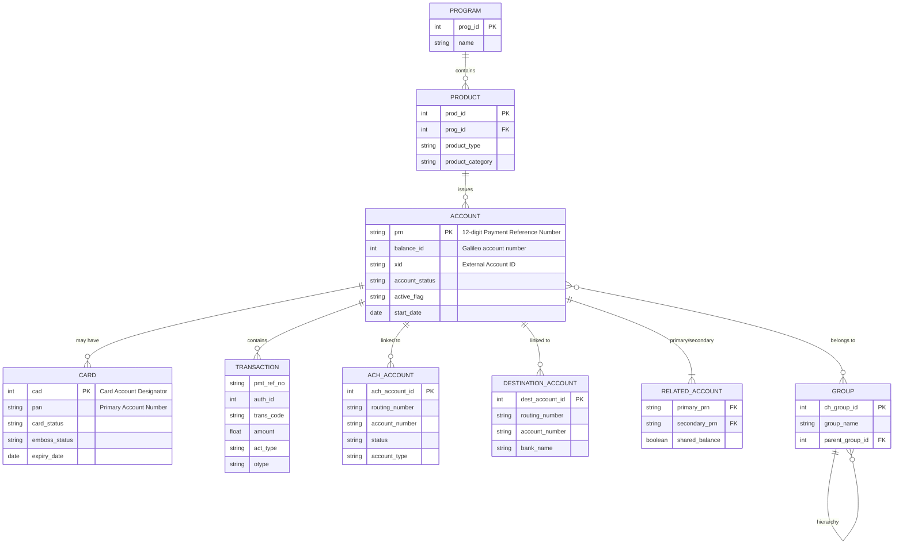
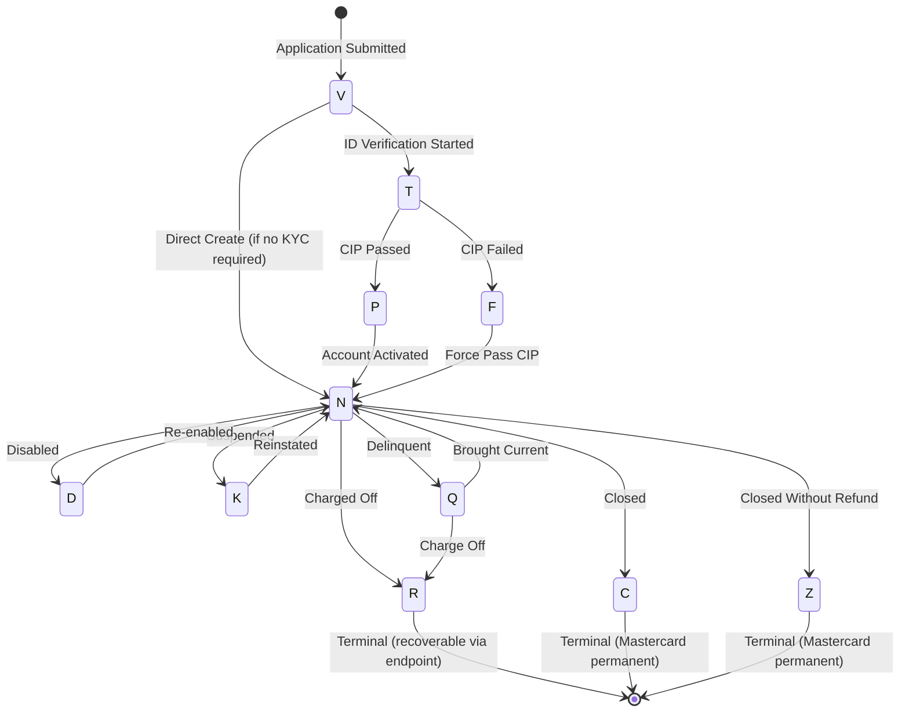
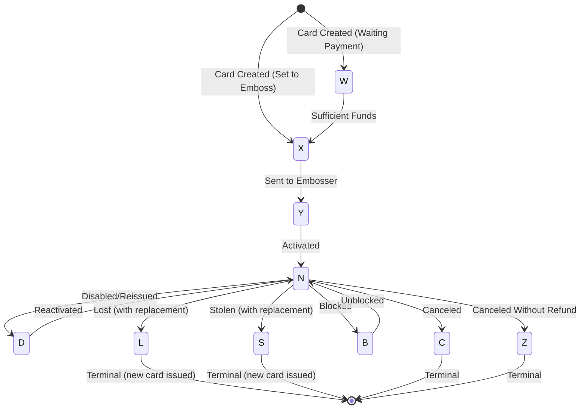
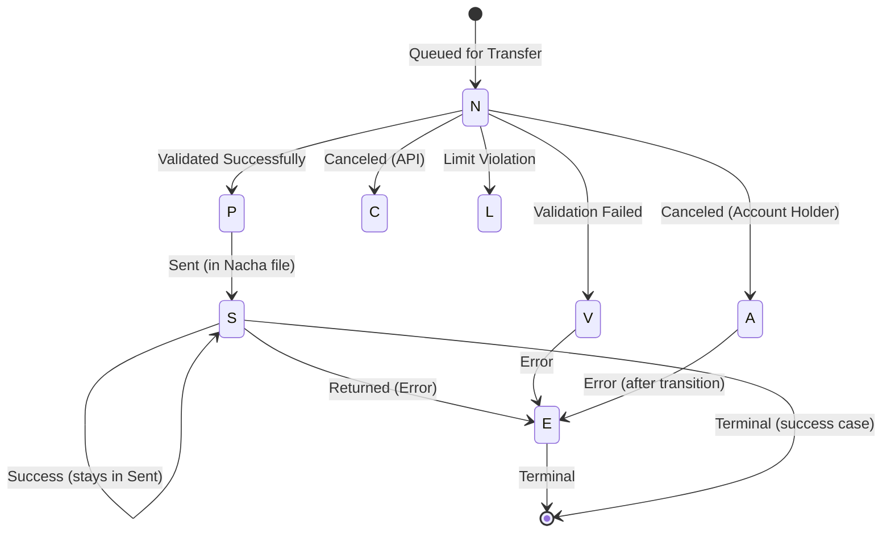
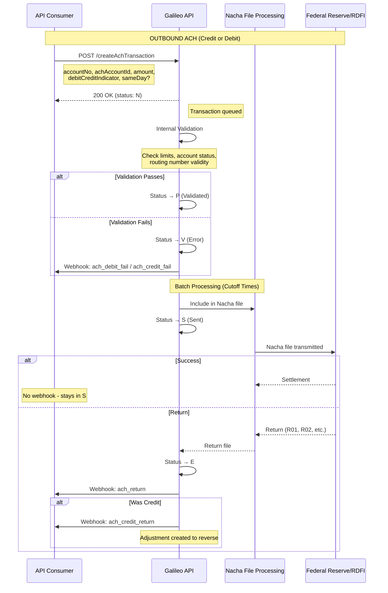
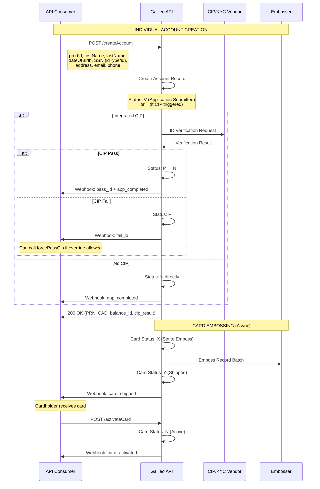
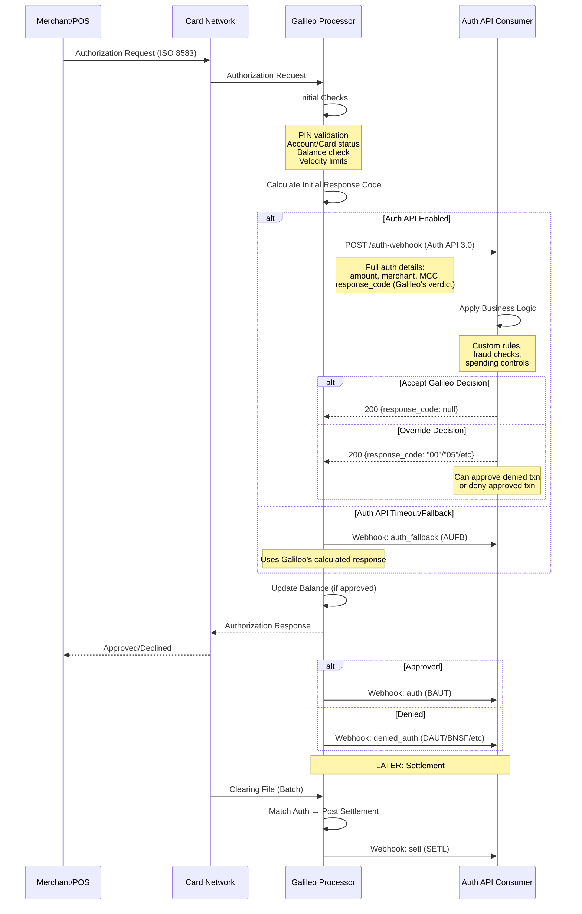

# Galileo API Analysis for Sponsor Banking

**Provider**: Galileo Financial Technologies  
**Documentation Source**: Program API Reference (v4.0)  
**Analysis Date**: December 2025

---

## Executive Summary

Galileo is a processor-centric platform with a card-issuing heritage. Its architecture is heavily influenced by card-network paradigms (ISO 8583), with real-time authorization control but limited native banking rails. Key characteristics:

- **Account-Card Centric**: Every account is implicitly tied to card issuance concepts
- **Real-Time Auth Control**: Auth API webhook gives partners full authorization decision control
- **Processor Not Ledger**: Galileo operates as a processor; the sponsor bank holds the actual ledger
- **ACH as Overlay**: ACH is bolted on rather than being a first-class rails primitive
- **Product-Program Hierarchy**: Multi-tenant via Programs → Products → Accounts structure

---

## 1. Entity Relationships

### Core Entity Model



### Key Design Decisions

| Decision Point | Galileo Approach | Notes |
|----------------|------------------|-------|
| **Primary Identifier** | PRN (12-digit Payment Reference Number) | Not the PAN; more like an internal account ID |
| **Card-Account Relationship** | 1 Account : Many Cards | Multiple cards can share one balance_id |
| **Customer Model** | Implicit via Account | No separate Customer entity; customer info embedded in Account |
| **Joint Account Support** | Via Related Accounts | Primary/Secondary pattern, optional shared_balance |
| **Sub-account Model** | Secondary Accounts (Add Account) | Linked to a primary; can share balance |
| **Business vs Individual** | Product-level distinction | Business products require `businessName`; no separate entity |
| **Beneficial Owners** | ❓ Not explicitly documented | Likely handled via KYC/CIP process |
| **Transaction Linking** | `auth_id` → `pmt_ref_no` | Auth links to settlement via auth_id |

### Notable Entity Details

**Account Identifiers (Multiple!)**:
- `PRN` (Payment Reference Number): 12-digit primary API identifier
- `PAN` (Primary Account Number): Card number, sensitive
- `CAD` (Card Account Designator): Galileo-generated card ID
- `balance_id` / `galileo_account_number`: Internal balance tracking ID
- `XID` / `externalAccountId`: Partner-provided external ID

**Corporate Hierarchy**:
- Groups can be nested (parent → child)
- Accounts link to groups via `ch_group_id`
- Supports "Corporate Credit" model with funding/spending accounts
- RTF (Real-Time Funding) pattern for corporate card programs

**Confidence Notes**:
- ✅ Account/Card/Transaction model documented explicitly
- ✅ Related accounts (primary/secondary) well documented
- 🔶 Customer model inferred (no separate Customer resource)
- ❓ Beneficial owner / KYC data structure unclear

---

## 2. State Machines

### 2.1 Account Status



**Account Status Codes**:
| Status | Description | Permits Network Txns | Recoverable |
|--------|-------------|---------------------|-------------|
| N | Normal (Active) | ✅ | N/A |
| V | Application Submitted | ❌ | → N |
| T | ID Verification In Process | ❌ | → P or F |
| P | Passed ID Verification | ❌ | → N |
| F | Failed ID Verification | ❌ | → N (Force Pass) |
| D | Disabled | ❌ | → N |
| K | Suspended | ❌ | → N |
| Q | Delinquent | ❌ | → N |
| R | Charged Off | ❌ | ⚠️ Special endpoint only |
| C | Canceled | ❌ (Merchant credits only) | ⚠️ Mastercard penalty risk |
| Z | Canceled Without Refund | ❌ (Merchant credits only) | ⚠️ Mastercard penalty risk |

**Critical**: Mastercard considers C and Z as **permanent statuses**. Reactivating closed cards risks Mastercard penalties (as of June 2025). Use `D` (Disabled) for temporary closures.

### 2.2 Card Status



**Card Status Codes**:
| Status | Description | Permits Txns | Notes |
|--------|-------------|--------------|-------|
| N | Normal (Active) | ✅ | Only status permitting auths |
| W | Waiting for Payment | ❌ | Default for new cards |
| X | Set to Emboss | ❌ | Queued for embossing |
| Y | Shipped/Ready to Activate | ❌ | Card is in transit |
| D | Disabled | ❌ | Often means reissued |
| L | Lost | ❌ | Replacement issued with new PAN |
| S | Stolen | ❌ | Replacement issued with new PAN |
| B | Blocked | ❌ | PIN retry exceeded, or pre-sold instant issue |
| O | Operations Hold | ❌ | Embosser issue |
| V | Voided | ❌ | |
| C/Z | Canceled | ❌ | Permanent (Mastercard) |

**Freeze vs Status**: "Frozen" is NOT a status—it's a separate `freeze_info` object with start/end dates. Both account AND card must be in status `N` for transactions.

### 2.3 ACH Transaction Status



**ACH Transaction Statuses**:
| Status | Description | Terminal? |
|--------|-------------|-----------|
| N | Queued for transfer (initial) | ❌ (Cancellable) |
| P | Validated, ready for Nacha file | ❌ |
| V | Validation failed | ❌ → E |
| S | Sent in Nacha file | ✅ (success) |
| C | Canceled via Cancel ACH Transaction | ❌ |
| A | Canceled at account holder's request | ❌ → E |
| L | Canceled due to debit limit violation | ❌ |
| E | Error (failed or returned) | ✅ |
| R | Validation failed (bad routing number) | ✅ |

**Key Transition Triggers**:
- `N → P`: Internal validation passes
- `N → C`: `cancelAchTransaction` API call
- `P → S`: Nacha file batch processing (async)
- `S → E`: Return file received (R01-R99 codes)

### 2.4 Authorization Status

| Code | Description | Balance Impact |
|------|-------------|----------------|
| A | Authorized, not settled | Yes (hold) |
| P | Settled and posted | Yes (final) |
| D | Denied | No |
| E | Expired | Reversed |
| R | Reversed out | Reversed |
| B | Backed out | Reversed |
| V | Pending merchant credit | No (pending) |

---

## 3. Critical Flows

### 3.1 ACH Origination Flow



**ACH Timing**:
| Parameter | Value | Notes |
|-----------|-------|-------|
| Same-Day ACH | `sameDay: Y` | Must meet cutoff |
| Sync Response | Immediate | Status: N (queued) |
| Nacha File Batch | Multiple daily | Partner-specific cutoffs |
| Return Window | 2-60 days | Depends on return code |
| Hold Days | Configurable | `holdDays` parameter |

**Same-Day ACH Cutoffs**: ❓ Not explicitly documented; varies by sponsor bank configuration.

**Return Codes** (partial):
| Code | Reason | Timeframe |
|------|--------|-----------|
| R01 | Insufficient Funds | 2 banking days |
| R02 | Account Closed | 2 banking days |
| R03 | No Account/Unable to Locate | 2 banking days |
| R05 | Unauthorized Debit (Consumer) | 60 calendar days |
| R10 | Customer Advises Not Authorized | 60 calendar days |

### 3.2 Account Opening Flow



**Account Opening Timing**:
| Step | SLA | Notes |
|------|-----|-------|
| API Response | Sync (< 2s typical) | Includes CIP result if integrated |
| CIP Decision | Real-time | Via integrated provider |
| Account Creation | Immediate | Account usable if status: N |
| Card Emboss Batch | Daily | Check XAACT parameter |
| Card Shipment | 3-10 days | Standard mail; express available |
| Card Activation | Real-time | Via activateCard endpoint |

**Business Account Differences**:
- `prodId` must be for a business product
- `businessName` is required
- Same endpoint (`createAccount`), not a separate flow
- ❓ Beneficial owner collection not explicitly documented in API

### 3.3 Card Authorization Flow (Auth API)



**Auth API Timing**:
| Component | SLA | Notes |
|-----------|-----|-------|
| Network → Galileo | Real-time | ISO 8583 |
| Galileo → Auth API | Real-time | Webhook POST |
| Auth API Response | **~300-500ms max** | ❓ Not explicit; needs verification |
| Galileo → Network | Real-time | Must meet network SLAs |
| Settlement | T+1 to T+3 | Batch files |

**Decline Scenarios**:
| Event Code | Reason | Notes |
|------------|--------|-------|
| DAUT | General denial | Various reasons |
| BNSF | NSF (Insufficient funds) | Non-gas transactions |
| PUMP | NSF at gas pump | Special handling |
| NACT | Inactive card | Status not N |
| IPIN | Invalid PIN | PIN retry exceeded → B status |
| BPAN | Bad PAN | Card not issued |

**Auth API Override Power**:
- Client can **approve** transactions Galileo would deny
- Client can **deny** transactions Galileo would approve
- Full transaction context provided for decision
- Fallback to Galileo decision on timeout (APIFB parameter)

---

## 4. Key Architectural Patterns

### 4.1 Ledger Model

**Galileo is NOT the ledger**. Key implications:

- Galileo is a **processor** that tracks balances
- Sponsor bank holds the actual FBO account and GL
- `balance_id` is Galileo's internal balance tracking
- Multiple accounts can share a `balance_id` (shared balance)
- Real reconciliation happens at the sponsor bank level

### 4.2 Program/Product Hierarchy

```
Provider (You)
  └── Program(s) (prog_id)
        └── Product(s) (prod_id)
              └── Account(s) (PRN)
                    └── Card(s) (CAD)
```

- **Program**: Logical grouping, often per use case or partner
- **Product**: Card product configuration (BIN, limits, features)
- **Account**: Individual balance holder
- **Card**: Physical/virtual card linked to account

### 4.3 Real-Time vs Batch

| Function | Real-Time | Batch |
|----------|-----------|-------|
| Card Authorization | ✅ (Auth API) | |
| ACH Origination | | ✅ (Nacha files) |
| ACH Returns | | ✅ (Return files) |
| Card Settlement | | ✅ (Clearing files) |
| Card Embossing | | ✅ (Emboss batches) |
| Wire Transfers | ✅ (limited) | |

### 4.4 Webhook Event Model

Galileo uses a comprehensive webhook system (Events API):

- **Authorization Events**: BAUT, DAUT, AAAU, BEXP
- **Transaction Events**: BPMT, BADJ, BFEE, SETL
- **ACH Events**: ACHC, ACHR, ACRT, FACH
- **Account Events**: ACST, ACCL, ACFC
- **Card Events**: BACT, CSNT, SHIP

Each event has a 4-character code and configurable templates.

---

## 5. Confidence Summary

| Area | Confidence | Notes |
|------|------------|-------|
| Account/Card States | ✅ High | Explicitly documented with transitions |
| ACH Flow | ✅ High | Well documented |
| Auth API Flow | ✅ High | Detailed webhook spec |
| Entity Model | 🔶 Medium | Some IDs/relationships inferred |
| ACH Same-Day Cutoffs | ❓ Low | Not found in reference |
| Beneficial Owner Model | ❓ Low | Not explicitly documented |
| Wire Transfer Details | 🔶 Medium | Limited functionality noted |
| FBO Account Patterns | ❓ Low | Sponsor bank specific |
| Multi-Program Separation | 🔶 Medium | Program/Product hierarchy documented |

---

## 6. Comparison Points (for Cross-Provider Analysis)

| Decision Point | Galileo |
|----------------|---------|
| Customer model | Implicit (embedded in Account) |
| Joint account support | Yes (Related Accounts with shared_balance) |
| Sub-account model | Secondary Accounts linked to Primary |
| Transaction linking | auth_id → settlement matching |
| Account states | N, V, T, P, F, D, K, Q, R, C, Z |
| ACH same-day cutoff | ❓ Sponsor bank specific |
| Ledger exposure | Abstract (Galileo tracks balance, not GL) |
| Business entity model | Product-level distinction only |
| Real-time auth control | ✅ Auth API webhook |
| Wire support | Limited (sponsor bank dependent) |