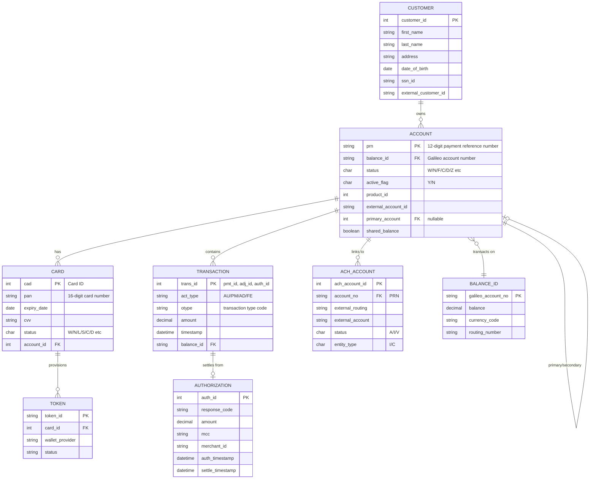
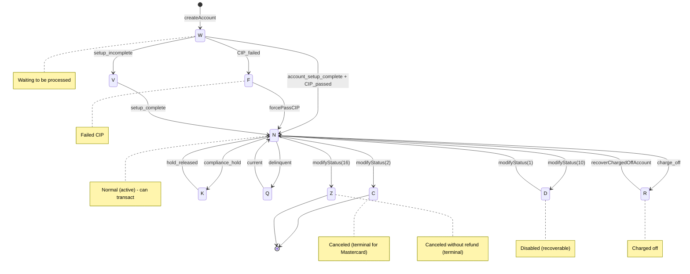
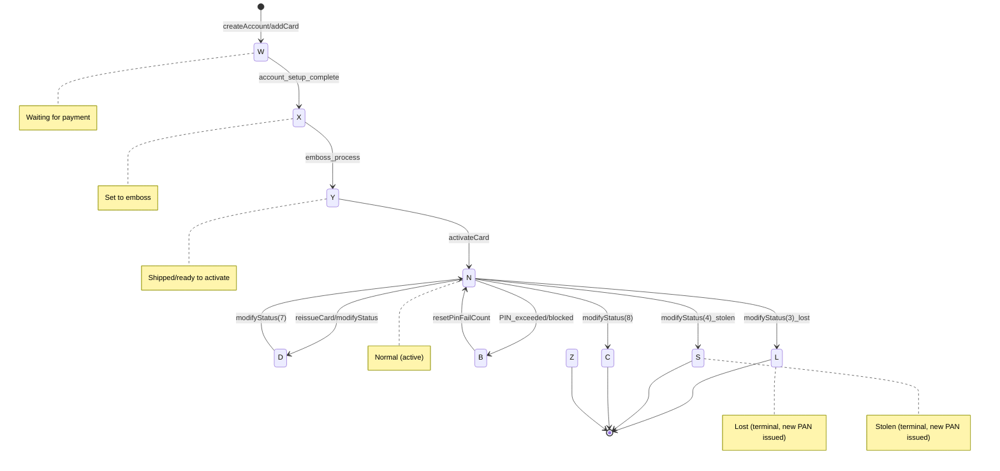
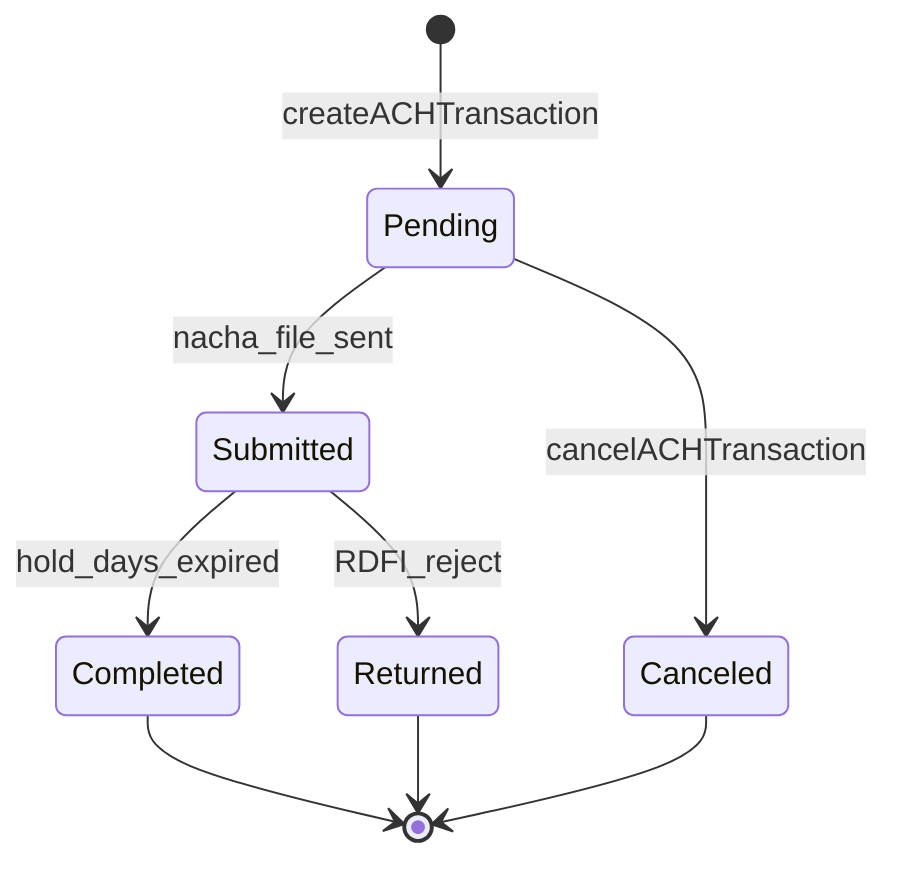
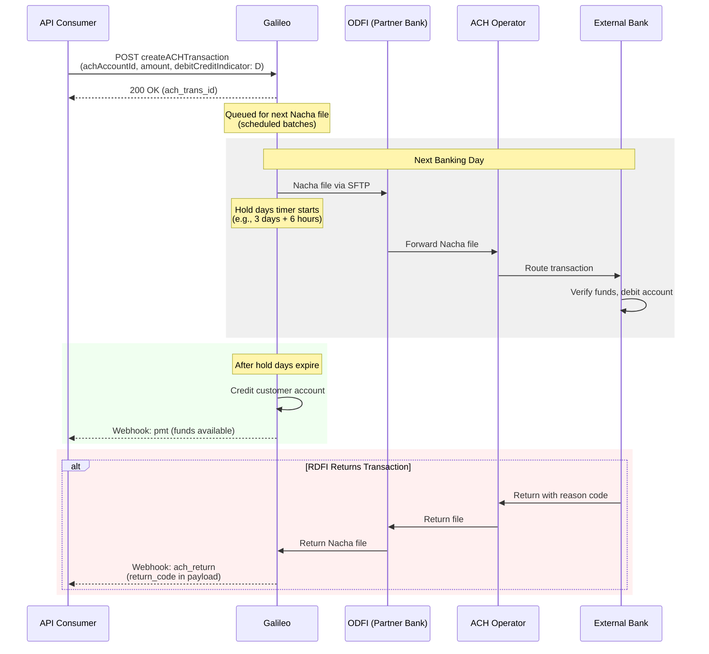
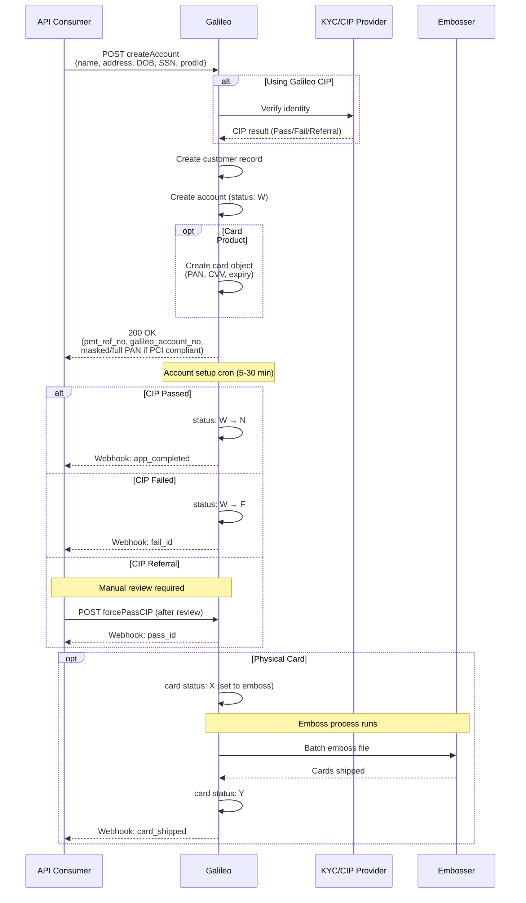
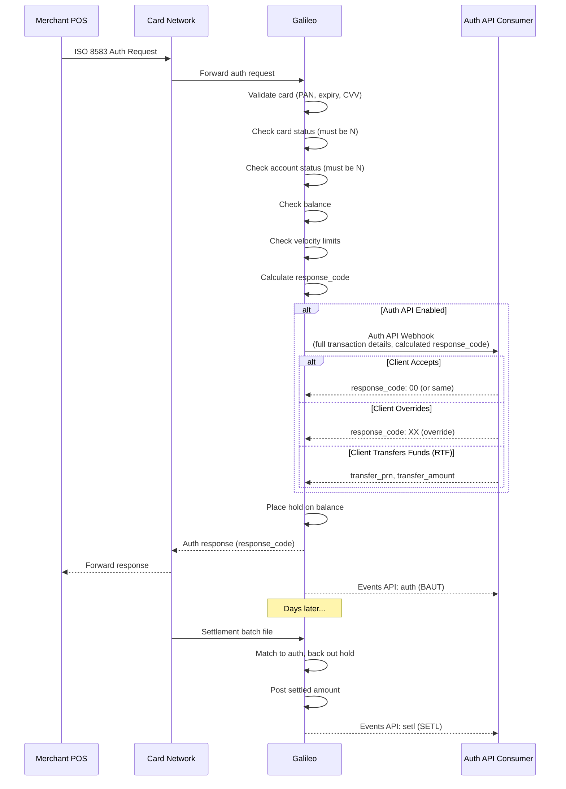

# Galileo API Analysis for Cassandra

**Provider:** Galileo Financial Technologies (SoFi Technologies subsidiary)  
**Documentation URL:** https://docs.galileo-ft.com/pro/reference/program-api-intro  
**Analysis Date:** December 2024

---

## 1. Entity Model

### Entity Relationship Diagram

### Core Entities (6 main entities)

| Entity | ID Format | Key Attributes | Connections |
|--------|-----------|----------------|-------------|
| **Customer** | Internal ID | name, address, DOB, SSN, external_customer_id | → Account (1:many) |
| **Account (PRN)** | 12-digit PRN (3-digit prefix + 8-digit number + checksum) | status, active_flag, product_id, external_account_id | → Customer, → Balance_ID, → Card, → ACH_Account |
| **Card** | CAD (internal), PAN (16-digit) | status, expiry, CVV | → Account |
| **Balance_ID** | Galileo account number | balance, currency_code, routing_number | ← Account(s) |
| **Transaction** | pmt_id, adj_id, auth_id (table-specific) | act_type, otype, amount, timestamp | → Balance_ID |
| **ACH_Account** | ach_account_id | external routing/account, entity_type (I/C), status | → Account |

### Key Design Decisions

- **Account ≠ Balance**: The PRN (Payment Reference Number) is the account identifier, but the `balance_id` (Galileo Account Number) is what holds the actual funds. Multiple PRNs can share one balance_id.
- **Card-Account Separation**: Card status and Account status are independent. Both must be `N` (normal/active) for card transactions to succeed.
- **Product-Driven Configuration**: All behavior is controlled by `prodId` - each product defines velocity limits, allowed features, secondary account rules, etc.
- **Three-Tier Identifier System**: PRN (stable account reference) → PAN (card, can change) → Balance_ID (bank account where funds live)

### Sponsor Banking Questions

| Question | Galileo Answer |
|----------|----------------|
| **Joint accounts (multiple owners)?** | ❌ No true joint accounts. Uses "shared balance" pattern - multiple accounts transact on same balance_id. Up to ~3000 secondary accounts per primary. |
| **Sub-accounts/virtual accounts?** | ✅ Via secondary accounts with `sharedBalance: 1`. Also supports Real-Time Funding (RTF) pattern with funding account + spending accounts |
| **Business Customer → Beneficial owners?** | 🔶 `businessName` field on account, but beneficial owner structure not explicit in API. Business banking features exist but ownership linkage is unclear |
| **Transaction linking (original → reversal)?** | ✅ Via `auth_id` linkage. Reversals reference original via `original_auth_id`, `expired_auth_id`. ACH reversals matched within 10-day window |

---

## 2. State Machines

### Account Status State Machine

**Account Status Codes:**

| Status | Description | Terminal? | Can Receive ACH Credit? |
|--------|-------------|-----------|------------------------|
| W | Waiting to be processed | No | Configurable (ACSTS) |
| N | Normal (active) | No | Yes |
| F | Failed ID verification | No | Configurable |
| D | Disabled | No | Configurable |
| C | Canceled | **Yes** (MC requirement) | Configurable |
| Z | Canceled without refund | **Yes** (MC requirement) | Configurable |
| K | Suspended | No | Configurable |
| Q | Delinquent | No | Configurable |
| R | Charged off | No (special recovery) | Configurable |

**Transition Triggers:**
- `W → N`: Account setup cron (5-30 min interval) + CIP passed
- `N → D`: `modifyStatus` type 10 (recoverable close)
- `N → C`: `modifyStatus` type 2 (permanent close)
- `D → N`: `modifyStatus` type 1 or 11
- `R → N`: Only via `recoverChargedOffAccount` endpoint

---

### Card Status State Machine

**Card Status Codes:**

| Status | Description | Terminal? | Triggers |
|--------|-------------|-----------|----------|
| W | Waiting for payment | No | Initial state |
| X | Set to emboss | No | Account setup complete |
| Y | Shipped/Ready to activate | No | Emboss process |
| N | Normal (active) | No | Card activation |
| D | Disabled | No | Reissue, manual |
| L | Lost | **Yes** | Lost report (new PAN issued) |
| S | Stolen | **Yes** | Stolen report (new PAN issued) |
| C | Canceled | **Yes** | Manual close |
| B | Blocked | No | PIN exceeded, pre-issue block |

---

### ACH Transaction Status (Outgoing)

**Key ACH States:**

| Status | Description | Recoverable? |
|--------|-------------|--------------|
| Pending | Transaction created, awaiting next Nacha file | Yes (cancelable) |
| Submitted | In Nacha file, sent to ODFI | No |
| Completed | Hold days expired, funds available | Terminal (success) |
| Returned | RDFI rejected, return code received | Terminal (failure) |

---

## 3. Critical Flows

### Flow 1: ACH Origination (Outgoing Debit - Pull funds from external account)

**Timing:**
- **Sync response**: Immediate (transaction queued)
- **Nacha file creation**: Next scheduled batch (varies by config, often next banking day)
- **Funds available**: After hold days (configurable, typically 3-4 business days)
- **Same-day ACH**: Supported with specific cutoff windows (11:30 AM, 2:45 PM MST)

**Return Handling:**
- Returns arrive via Nacha file from RDFI
- `ach_return` event fired with return code (R01-R99)
- Funds reversed if already credited

---

### Flow 2: Account Opening (Individual)

**Timing:**
- **Sync response**: Immediate with PRN
- **Account active**: 5-30 minutes (account setup cron)
- **Card embossed**: 1+ days (batch emboss process)
- **Card shipped**: Varies by embosser

**Business Account Differences:**
- Requires `businessName` parameter
- May require `addACHAccountCorporate` for business ACH
- Beneficial owner documentation not explicit in API

---

### Flow 3: Card Authorization (Real-time)

**Timing:**
- **Auth API webhook**: Must respond within timeout (typically 2-5 seconds)
- **Auth response to network**: Real-time
- **Settlement**: 1-3 days typically

**Decline Scenarios:**
- `response_code: 51` - Insufficient funds
- `response_code: 14` - Invalid card number
- `response_code: 55` - Invalid PIN
- `response_code: 61` - Exceeds amount limit
- `response_code: 05` - Do not honor (various reasons)

---

## 4. Notable Design Decisions

### Unique to Galileo

| Decision | Galileo Approach | Impact for Cassandra |
|----------|------------------|---------------------|
| **Balance vs Account separation** | Balance_ID is separate from PRN; multiple accounts can share one balance | Enables flexible shared-balance scenarios but adds complexity |
| **Product-driven everything** | All limits, features, statuses controlled by `prodId` parameters | Heavy configuration layer; behavior is opaque without parameter docs |
| **Auth API opt-in** | Real-time auth decision webhook is optional | Full issuer control possible but requires infrastructure |
| **Card ≠ Account status** | Independent status tracking | Must check both for transaction eligibility |
| **12-digit PRN format** | 3-digit prefix (client-specific) + 8-digit number + checksum | Client isolation built into ID format |
| **No explicit GL** | No general ledger API exposed | Reconciliation via RDF files (daily batch) |

### Multi-Tenant/Program Separation

- **Provider ID**: Top-level isolation
- **Program ID**: Groups products under a provider
- **Product ID**: Specific card/account configuration
- **PRN Prefix**: 3-digit client identifier in account number

---

## 5. Confidence Notes

| Section | Confidence | Notes |
|---------|------------|-------|
| Entity relationships | ✅ Documented | Clear from multiple guide pages |
| Account states | ✅ Documented | Full enumeration with transition rules |
| Card states | ✅ Documented | Full enumeration available |
| ACH states | 🔶 Partial | States documented, but timing relies on product params |
| ACH flow | ✅ Documented | Detailed workflow diagrams in docs |
| Account opening | ✅ Documented | Multiple guides with flowcharts |
| Card auth flow | ✅ Documented | Auth API guide comprehensive |
| Business account model | 🔶 Inferred | `businessName` exists but beneficial owner structure unclear |
| Joint account support | ✅ Documented | Explicitly "not true joint" - uses shared balance |
| Transaction linking | ✅ Documented | auth_id linkage explicit |
| Same-day ACH cutoffs | ❓ Unclear | Mentioned but specific cutoffs not in public docs |
| Ledger/GL exposure | ✅ Confirmed absent | No GL API; uses RDF files for reconciliation |

---

## 6. Key APIs by Function

| Function | Primary Endpoint(s) |
|----------|-------------------|
| Create account | `createAccount`, `createVirtualCardAccount`, `startEnrollment` + `completeEnrollment` |
| Get balance | `getBalance` |
| Account status change | `modifyStatus` (with `type` parameter) |
| Card activation | `activateCard` |
| ACH setup | `addACHAccount`, `addACHAccountCorporate` |
| ACH origination | `createACHTransaction` |
| Internal transfer | `createAccountTransfer` |
| Auth decision | Auth API Webhook (inbound to you) |
| Events | Events API Webhooks (account, authorization, settlement, transaction) |

---

## 7. Summary for Cassandra Architecture

**Strengths for Sponsor Banking:**
- Mature card issuing with full auth control (Auth API)
- Flexible sub-account patterns via shared balance
- Comprehensive event webhooks for real-time notifications
- Strong ACH capabilities with configurable hold days

**Gaps/Considerations:**
- No true joint accounts (shared balance is workaround)
- No explicit beneficial owner entity for business accounts
- Heavy reliance on product parameters (not API-configurable)
- Reconciliation via batch RDF files, not real-time GL API
- Business banking features exist but documentation is sparse

**Entity Model Alignment:**
- Consider whether Cassandra should separate Balance from Account like Galileo
- Transaction ID fragmentation (auth_id, pmt_id, adj_id in separate tables) may complicate unified transaction views
- Card/Account status independence is worth emulating for flexibility