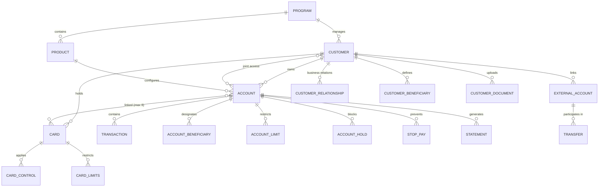
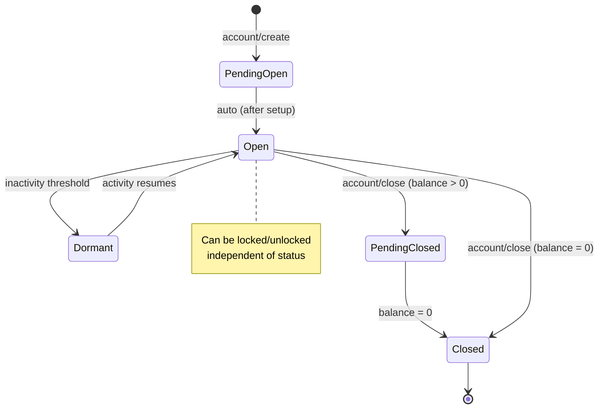
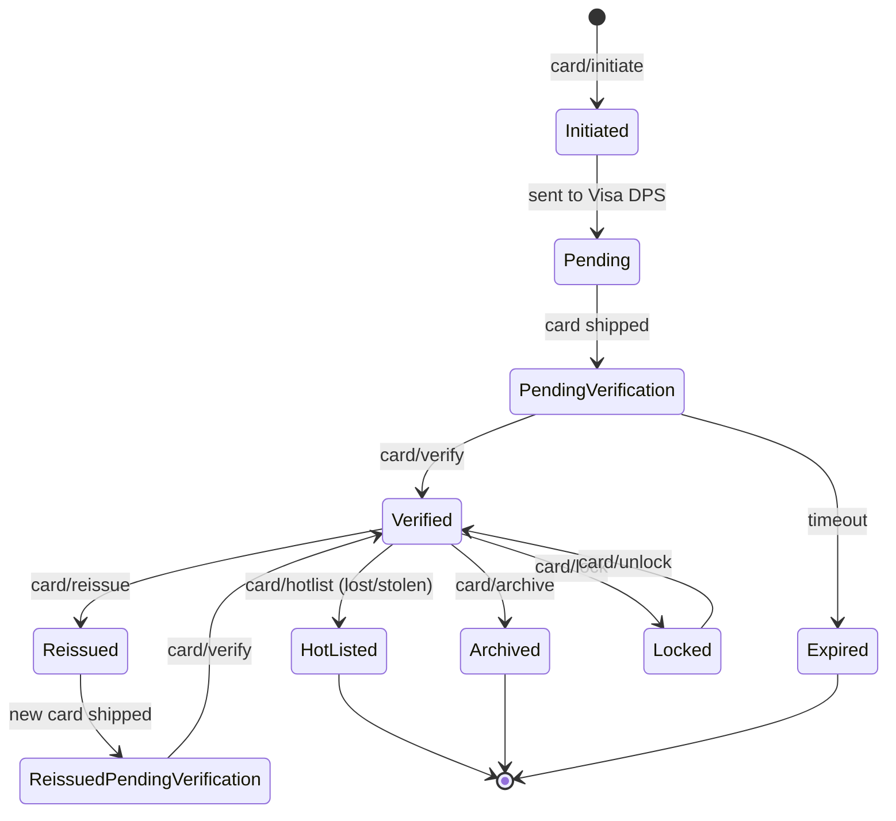
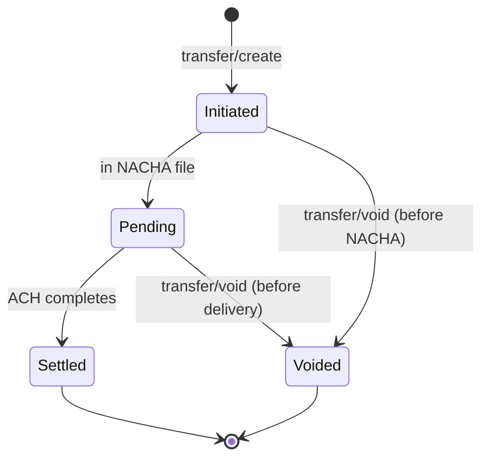
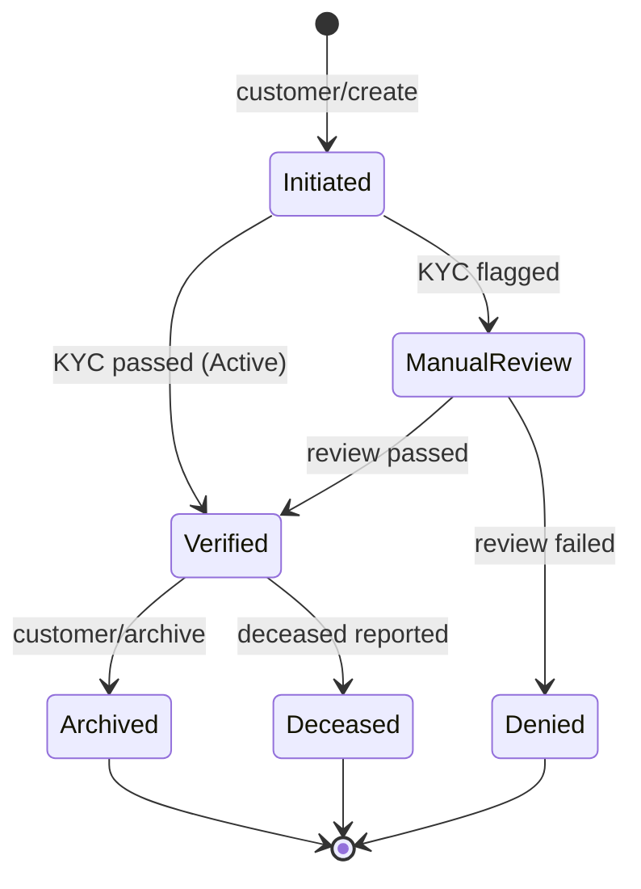
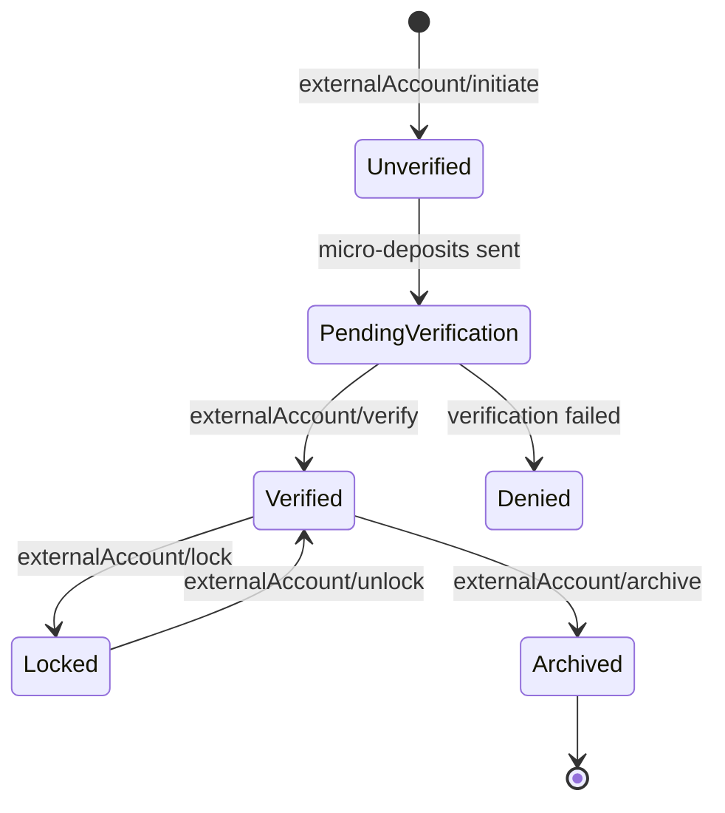
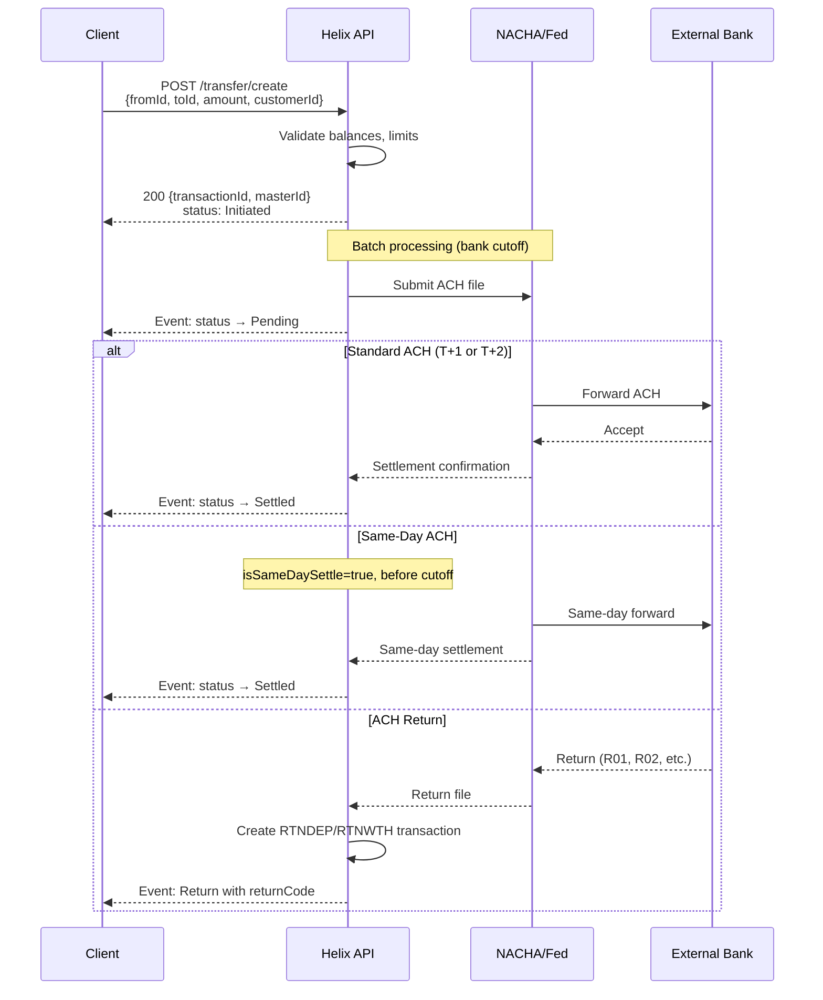
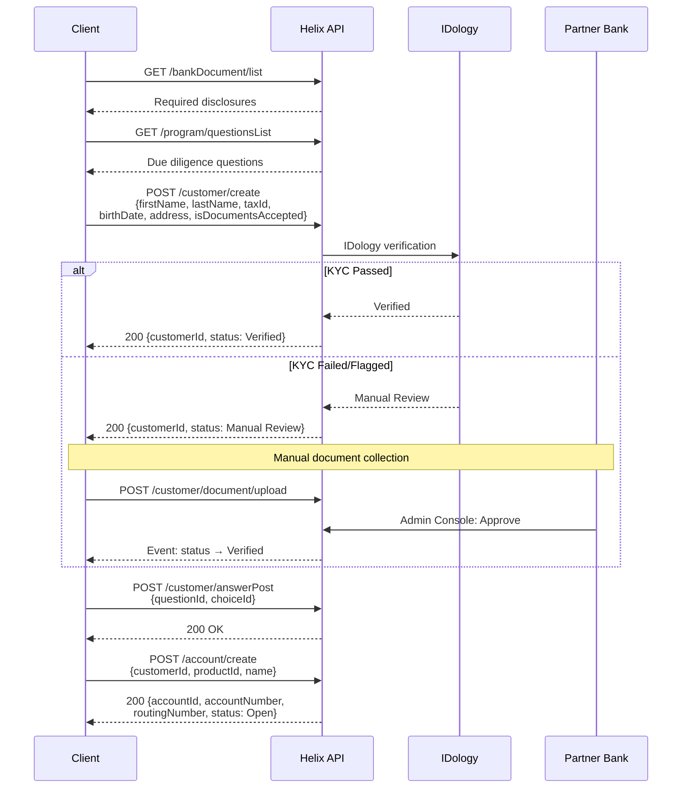
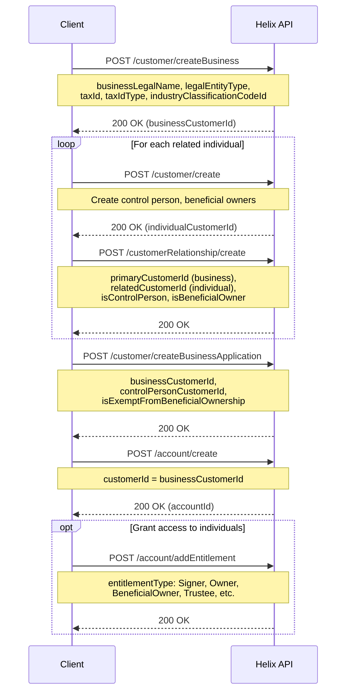
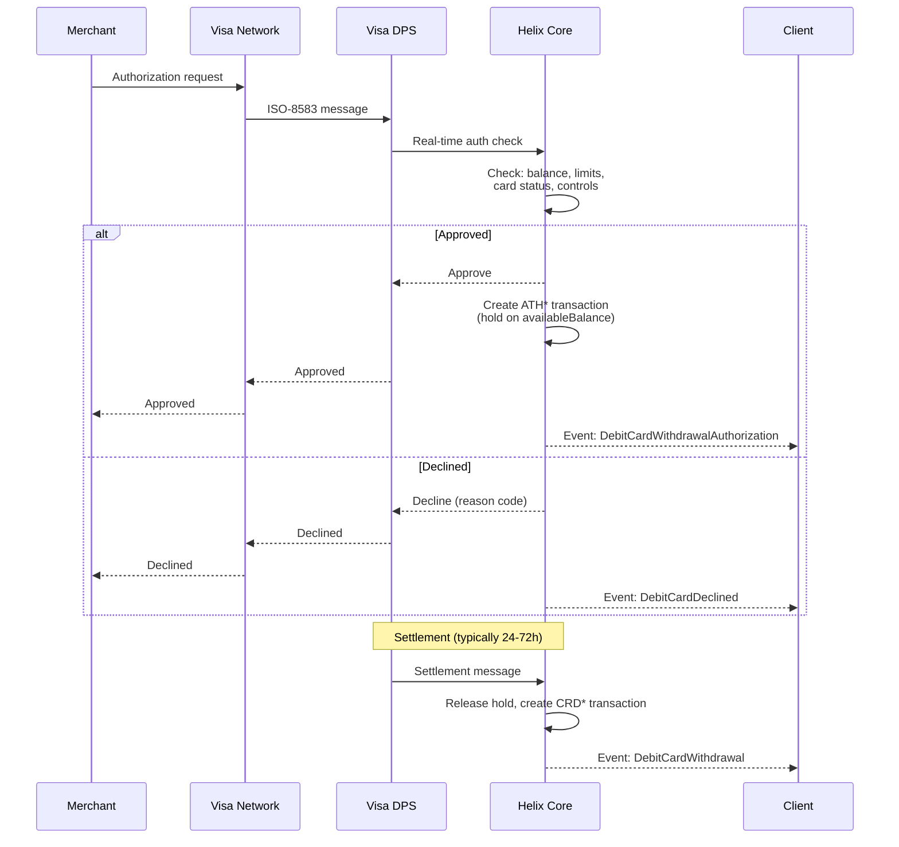

# Q2 Helix BaaS API Architecture - Comprehensive Summary

**Provider:** Q2 Helix (formerly CorePro)  
**API Version:** 3.0.0  
**Analysis Date:** December 2025  
**Sources:** Live documentation (docs.helix.q2.com), uploaded specifications, API reference

---

## Executive Summary

Q2 Helix is a cloud-native, **fully hosted core banking system** (not just a BaaS API layer) with integrated card processing (Visa DPS) and ACH origination. Unlike some BaaS providers that wrap existing bank cores, Helix **IS the ledger** - it acts as the system of record for all customer, account, and transaction data.

**Key Differentiators:**
- Program-centric architecture where your entire business is represented as a "Program"
- Real-time events via **Azure Service Bus** (AMQP 1.0), not HTTP webhooks
- Native joint account support with priority-based ownership
- Integrated debit card processing via Visa DPS with ISO-8583 interface
- Goals/sub-accounts implemented as regular accounts with categorization flags
- FDIC-insured deposits through partner bank relationships

---

## 1. Entity Model

### Entity Relationship Diagram



### Core Entities Reference

| Entity | ID Format | Key Attributes | Notes |
|--------|-----------|----------------|-------|
| **Program** | Integer (system-assigned) | `products[]`, `perUserExternalAccountCountMax`, fee configs | Top-level container, read-only settings |
| **Customer** | `HelixId32` (32-bit int) | `status`, `kycStatus`, `kybStatus`, `isBusiness`, `taxId`, `tag` | Unified model for individuals & businesses |
| **Account** | `HelixId32` (32-bit int) | `status`, `accountBalance`, `availableBalance`, `productId`, `isPrimary`, `isJointAccount` | Linked to Product for configuration |
| **Transaction** | `HelixId64` (64-bit long) | `typeCode`, `status`, `amount`, `masterId`, `cardId`, `tag` | `masterId` groups related transactions |
| **Card** | `HelixId32` (32-bit int) | `status`, `cardNumberMasked`, `accounts[]`, `primaryAccountId` | Links to 1-8 accounts |
| **ExternalAccount** | `HelixId32` (32-bit int) | `status`, `routingNumber`, `accountNumber`, `type` | For ACH with external FIs |
| **Transfer** | N/A (creates Transaction) | `fromId`, `toId`, `amount`, `customerId` | Action object, not persisted |
| **CustomerRelationship** | N/A | `relationshipType`, `isControlPerson`, `isBeneficialOwner` | Links business → individuals |

### Key Design Decisions

**Customer Model:**
- Unified `Customer` entity with `isBusiness` boolean flag
- Separate endpoints: `/customer/create` (individual) vs `/customer/createBusiness`
- Individual customers use `kycStatus`; businesses use `kybStatus`
- Additional business fields: `businessLegalName`, `businessDescription`, `industryClassificationCodeId`

**Joint Account Support:**
- Native via `CustomerRelationship` API with `isJointAccount` boolean on Account
- `customerPriority` (1 = primary owner, 2+ = joint owners)
- `accessTypeCode` per customer: `FULL`, `RDONLY`, `NONE`
- Ownership transfers to next priority on primary death
- `totalCustomers` count on Account entity

**Sub-Account / Goals Model:**
- Goals ARE Accounts - no separate entity type
- `isPrimary` flag designates main account (cannot be closed while customer active)
- Flat structure with `category`/`subCategory` for grouping
- No hierarchical parent-child relationship

**Transaction Linking:**
- `masterId` groups related transactions (original → reversal, auth → settlement)
- `transactionTag` for client-assigned correlation
- Card transactions use `cardId` for additional linking
- ACH returns linked via NACHA `returnCode` (R01, R02, etc.)

**Business Beneficial Owners:**
- `CustomerRelationship` object links individuals to business customers
- Tracks: `isControlPerson`, `isBeneficialOwner`, `beneficialOwnerPercentage`
- 22 exemption types via `exemptFromBeneficialOwnershipReasonType`
- Requires separate KYC for business (`kybStatus`) and beneficial owners

---

## 2. API Design Patterns

### Authentication

**Method:** HTTP Basic Authentication

```
Authorization: Basic <base64(apiKey:apiSecret)>
```

- API Key = username
- API Secret = password
- Credentials available via Helix Admin Console
- **IP Whitelisting required** for both API and SFTP access
- Access from middleware only - end user devices not supported

### Environments

| Environment | API Domain | Notes |
|-------------|------------|-------|
| **Sandbox** | `https://sandbox-api.helix.q2.com` | Test data, hourly ACH settlement |
| **Production** | `https://api.helix.q2.com` | Real money, daily ACH cutoffs |

**Sandbox-specific behaviors:**
- Magic routing number `123456789` for external accounts (sets name to "COREPRO SANDBOX BANK")
- Trial deposits hardcoded to $0.18 and $0.28 (can verify immediately)
- Multiple customers can share same `taxId`
- No limit on failed customer registrations
- `tag` uniqueness not enforced
- Debit card transactions not supported
- ACH settles hourly (not daily cutoff)

### Idempotency

**Tag-based pattern:**
- Most entities support a `tag` field (50 character max) for client-assigned unique identifiers
- Dual lookup: `/get/{id}` and `/getByTag/{tag}` endpoints
- In production, `tag` uniqueness enforced for customers with status: `Active`, `Initiated`, `Manual Review`, `Verified`

### Rate Limiting

| Limit | Value | Notes |
|-------|-------|-------|
| Default rate | **15 requests/second** per API key | Monitored over sample period |
| Throttle warning | At 80% (12 req/s) | Response includes `throttle` node |
| Exceeded response | HTTP 429 | Key blocked for remainder of period |
| Persistent abuse | Permanent block | Fee may apply to unblock |

### HTTP Status Codes

| Code | Description |
|------|-------------|
| `200` | OK - Request successful |
| `400` | Bad Request - Malformed syntax or validation failure |
| `401` | Unauthorized - Invalid or insufficient credentials |
| `404` | Not Found - Resource doesn't exist |
| `405` | Method Not Allowed - Wrong HTTP verb |
| `429` | Too Many Requests - Rate limit exceeded |
| `500` | Server Error - Internal Helix issue |
| `503` | Service Unavailable - Maintenance window |

### Error Code Ranges

| Range | HTTP Status | Meaning |
|-------|-------------|---------|
| 1-50000 | 500 | Hard errors - report to Helix support with `requestId` |
| 50001-50999 | 401-505 | Connectivity, malformed request, auth issues |
| 59000-59899 | 400 | Feature misconfigured, disabled, or contract-limited |
| 59900-59999 | 400 | Invalid JSON payload |
| 60000+ | 400 | Validation errors (e.g., negative transfer amount) |

### Response Format

```json
{
  "data": { /* entity or array */ },
  "errors": [
    {
      "code": 62001,
      "message": "Only one external account is allowed."
    }
  ],
  "requestId": "54128665-e29d-4934-97fe-bc2912c146d8",
  "status": 200
}
```

---

## 3. State Machines

### Account States



| State | Description | Terminal? |
|-------|-------------|-----------|
| `PendingOpen` | Account created, awaiting activation | No |
| `Open` | Active account | No |
| `Dormant` | Inactive (configurable threshold) | No (auto-recovers) |
| `PendingClosed` | Closure requested, balance > 0 | No |
| `Closed` | Permanently closed | **Yes** |

**Lock Mechanism** (orthogonal to status):
- `isLocked` boolean with `lockTypeCode`: `UNL` (unlocked), `CST` (customer/API), `SYS` (system)
- `lockReasonTypeCode`: `UNK`, `FRD`, `ADM`, `TMP`, `FRZ`, `SUS`, `CO`, `RTN`, `REC`, `DED`, `DOR`
- CST locks reversible via API; SYS locks may require admin escalation

**Account Close Reasons:**
`FirstPartyFraud`, `ThirdPartyFraud`, `SyntheticIdFraud`, `AccountTakeoverFraud`, `NonActivity`, `CustomerRequest`, `BankDiscretion`, `Other`

### Card States



| State | Description | Terminal? |
|-------|-------------|-----------|
| `Initiated` | Virtual card created | No |
| `Pending` | Sent to card vendor | No |
| `PendingVerification` | Shipped, awaiting activation | No |
| `Verified` | Active, usable card | No |
| `Reissued` | Replacement requested | No |
| `ReissuedPendingVerification` | Replacement shipped | No |
| `AutoReissuedPendingVerification` | Auto-renewal shipped | No |
| `DigitalActivePhysicalInitiated` | Digital active, physical ordered | No |
| `DigitalActivePhysicalPending` | Digital active, physical shipping | No |
| `HotListed` | Permanently disabled (fraud/lost/stolen) | **Yes** |
| `Archived` | Deactivated | **Yes** |
| `Expired` | Never verified in time | **Yes** |
| `Denied` | Card creation rejected | **Yes** |

**Card Lock Reasons:**
`UNK`, `STL` (stolen-permanent), `LST` (lost-permanent), `FRD`, `DMG`, `ADM`, `TMP`, `PIN`

**Reissue Reasons:**
`DMG` (damage), `REN` (renewal), `FRD` (fraud), `LST` (lost), `STL` (stolen), `NCN` (new card number), `CMP` (compliance)

### Transaction States



| State | Description | Terminal? |
|-------|-------------|-----------|
| `Initiated` | Created, not yet in NACHA file | No (can void) |
| `Pending` | In NACHA file, processing | No (can void before delivery) |
| `Settled` | Posted to account | **Yes** |
| `Voided` | Cancelled before settlement | **Yes** |

**Note:** Internal transfers (account-to-account within Helix) settle **instantly** - skip Initiated/Pending.

### Customer/KYC States



**KYC Status Values:**
`Initiated`, `Automated Review`, `Manual Review`, `Verified`, `Denied`, `Expired`

**Additional Screening:**
- `fraudStatus` - Separate fraud verification
- `ofacStatus` - OFAC screening status
- `kybStatus` - Business KYC (separate from individual `kycStatus`)

**Dormancy Status:** `Active` → `Inactive` → `Dormant` (tracked via `setLastContact` endpoint)

### External Account States



---

## 4. Critical Flows

### ACH Origination Flow



**ACH Parameters:**

| Parameter | Description |
|-----------|-------------|
| `direction` | `Credit` (push) or `Debit` (pull) |
| `standardEntryClassCode` | SEC code: PPD, CCD, WEB, etc. |
| `isPrenote` | Zero-dollar test transaction |
| `isReversal` | Reversal of prior transaction |
| `effectiveEntryDate` | Scheduled date (optional) |
| `isSameDaySettle` | Enable same-day ACH (additional fee) |
| `receiverAccountType` | `Checking`, `Savings`, `Loan`, `General Ledger` |

**Timing:**
- **Standard ACH:** 1-2 business days settlement
- **Same-Day ACH:** Same day if before bank-defined cutoff (typically early afternoon ET)
- **Internal Transfers:** Instant settlement
- **Void Window:** Until NACHA file delivered (`/transfer/void`)

**ACH Return Handling:**
- Returns create reversal transaction linked via `masterId`
- `returnCode` contains NACHA return reason (R01=NSF, R02=Account Closed, etc.)
- Transaction types: `RTNDEP` (return of deposit), `RTNWTH` (return of withdrawal)

### Account Opening Flow (Individual)



**Required Fields (Individual):**
- `firstName`, `lastName`, `birthDate`
- `taxId` (SSN/ITIN)
- `address` (type=Residence)
- `emailAddress`, `phone` (type=Mobile)
- `isDocumentsAccepted: true`

**Timing:**
- KYC: Real-time (seconds)
- Manual Review: Hours to days (bank-dependent)
- Account Creation: Instant after customer verified
- Some programs require 10+ business day waiting period before withdrawals

### Business Account Opening Flow



**Entitlement Types:**
`Signer`, `Owner`, `NonTransactional`, `BeneficialOwner`, `Trustee`, `SuccessorTrustee`, `Guardian`, `Conservator`, `Executor`, `Agent`, `PowerOfAttorney`

### Card Authorization Flow



**Authorization Timing:**
- Auth response: Real-time (sub-second)
- Hold duration: 72 hours default (or merchant-specified)
- Settlement: 24-72 hours typical

**Decline Scenarios:**
- Insufficient `availableBalance`
- Card locked (`isLocked: true`)
- Card status not `Verified`
- Card controls block transaction (MCC, geographic, amount)
- Account locked or closed
- Daily/transaction limits exceeded

---

## 5. Event/Webhook Architecture

### Overview

**Helix does NOT use HTTP webhooks.** Instead, events are delivered via:

1. **Azure Service Bus** (primary) - Near real-time via AMQP 1.0
2. **Event Notification File** (backup) - SFTP upload every 15 minutes

### Azure Service Bus Integration

- PCI compliant messaging service
- Connect using AMQP 1.0 protocol
- SDKs available in multiple languages
- Requires separate setup with Q2

### Event Types (Partial List)

| Payload Type ID | Description |
|-----------------|-------------|
| 1 | Common Payload |
| 200 | Customer Account Deposit |
| 201 | Customer Account Transfer |
| 202 | Customer Account Withdrawal |
| 203 | Transaction Modified |
| 204 | Account Modified |
| 300 | Program Account Deposit |
| 302 | Program Account Withdrawal |
| 400 | Debit Card Deposit |
| 401 | Debit Card Transfer |
| 402 | Debit Card Withdrawal |
| 403 | Debit Card Withdrawal Authorization |
| 404 | Debit Card Declined |
| 405 | Debit Card Account Balance Inquiry |
| 406-409 | Debit Card Reversals |
| 500+ | Check events |
| 600+ | Digital wallet, fraud, card renewal events |

### Event Notification Files (SFTP Backup)

- Generated at most every 15 minutes
- Uploaded to `sftp.corepro.io`
- Contains same events as Azure Service Bus
- File pattern: `yyyyMMddhhmm_EVENTNOTIFICATION.TXT`

---

## 6. Sandbox & Testing

### Test Environment Setup

| Setting | Sandbox Value |
|---------|---------------|
| Domain | `https://sandbox-api.helix.q2.com` |
| Example API Key | `example1` |
| Example Secret | `example1` |
| Magic Routing # | `123456789` |
| Trial Deposits | $0.18 and $0.28 (hardcoded) |

### Mock Card Endpoints

| Endpoint | Purpose |
|----------|---------|
| `/card/mock/withdrawal/purchase/authorize` | Simulate card authorization |
| `/card/mock/withdrawal/purchase/complete` | Simulate card settlement |
| `/card/mock/decline/purchase/authorize` | Simulate declined transaction |
| `/card/mock/deposit/purchase/return` | Simulate merchandise return |
| `/card/mock/deposit/purchase/returnReversal` | Return reversal |
| `/card/mock/withdrawal/cardCash` | ATM withdrawal |
| `/card/mock/admin/falconFraud` | Falcon fraud message |

### Sandbox Limitations

- Debit card transactions not supported (use mock endpoints)
- ACH settles hourly (not daily cutoff like production)
- `productId` values differ from production
- Product ID changes via `/account/update` are instant (production: up to 24 hours)

---

## 7. Additional Capabilities

### Digital Wallet Provisioning

- Apple Pay: `/card/provision/applePay`
- Google Pay: `/card/provision/googlePay`
- VDE details: `/card/provision/cardDetail`
- Triggers Digital Wallet Token events

### Card Controls

- Created via `/cardControl/create` with rules array
- Control types: MCC blocks, geographic restrictions, amount limits
- Real-time enforcement during authorization
- Can be managed via `tag` for client-side identification

### Fraud Management

- Integrated Visa DPS Falcon fraud detection
- Real-time fraud text alerts (opt-in/opt-out)
- Risk factor API for custom risk scoring
- Card lock reasons support fraud flags

### Statements & Reporting

- Monthly/quarterly statement generation
- 1099-INT annual tax statements
- Trial Balance File via SFTP
- Posted Transaction File (daily)
- Account Balance File (daily)
- Customer Registration File (daily)

### Fee Engine

- Fee configuration via `/fee/config/list/{feeEngineExecutionTypeId}`
- Transaction fees via `/transaction/createFee`
- Same-day ACH additional per-transaction fee
- RegD fee calculation (monthly)

---

## 8. Integration Checklist

### Pre-Launch Requirements

- [ ] IP whitelist configured for API and SFTP
- [ ] API credentials obtained via Helix Admin Console
- [ ] Azure Service Bus connection established (for events)
- [ ] Bank documents and disclosures integrated
- [ ] Due diligence questions implemented
- [ ] KYC flow tested (including Manual Review path)
- [ ] ACH tested with trial deposits
- [ ] Card issuance flow validated (if applicable)
- [ ] Error handling for all HTTP status codes
- [ ] Rate limiting handling (throttle node, 429 responses)

### Security Checklist

- [ ] HTTPS TLS 1.1+ for API calls
- [ ] SFTP for file transfers
- [ ] PGP encryption for SFTP files (optional)
- [ ] Sensitive data encrypted at rest (AES-256)
- [ ] API access from middleware only (not end-user devices)

---

## 9. Remaining Gaps & Questions

| Area | Status | Notes |
|------|--------|-------|
| Same-day ACH cutoff times | Bank-specific | Not in public docs; coordinate with partner bank |
| Multi-program API access | Unknown | Can one credential access multiple programs? |
| RTP/Real-time payments | Available | Transaction types exist (ATHRTW, RTPWTH) but limited docs |
| FBO reconciliation | Unclear | ForBenefitOf account patterns not documented |
| Pagination | Not documented | No standard pagination pattern visible |
| API versioning | Implicit | OpenAPI spec v3.0.0 but no URL versioning |

---

## 10. API Endpoint Quick Reference

### Customer Endpoints
- `POST /customer/create` - Create individual customer
- `POST /customer/createBusiness` - Create business customer
- `POST /customer/createBusinessApplication` - Submit business CDD
- `GET /customer/get/{customerId}` - Get customer details
- `GET /customer/getByTag/{tag}` - Get customer by tag
- `POST /customer/archive` - Archive customer
- `POST /customer/answerPost` - Submit due diligence answers

### Account Endpoints
- `POST /account/create` - Create account
- `GET /account/get/{customerId}/{accountId}` - Get account
- `POST /account/lock` - Lock account
- `POST /account/unlock` - Unlock account
- `POST /account/close` - Close account
- `POST /account/placeHold` - Place fund hold
- `POST /account/releaseHold` - Release fund hold
- `POST /account/addEntitlement` - Add joint access

### Transfer Endpoints
- `POST /transfer/create` - Create ACH transfer
- `POST /transfer/achOrigination/create` - ACH origination with SEC codes
- `POST /transfer/void` - Void pending transfer
- `POST /transfer/wire/create` - Create wire transfer

### Card Endpoints
- `POST /card/initiate` - Initiate new card
- `POST /card/createDigital` - Create digital-only card
- `POST /card/verify` - Verify/activate card
- `POST /card/lock` - Lock card
- `POST /card/unlock` - Unlock card
- `POST /card/hotlist` - Permanently disable card
- `POST /card/reissue` - Reissue card
- `POST /cardControl/create` - Create spending control

### Program Endpoints
- `GET /program/get` - Get program details and products
- `GET /program/questionsList` - Get due diligence questions
- `GET /bankDocument/list` - Get required disclosures

---

*Document synthesized from Q2 Helix live documentation (docs.helix.q2.com), uploaded API specifications, and API reference materials. December 2025.*