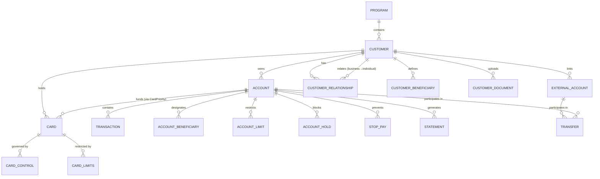
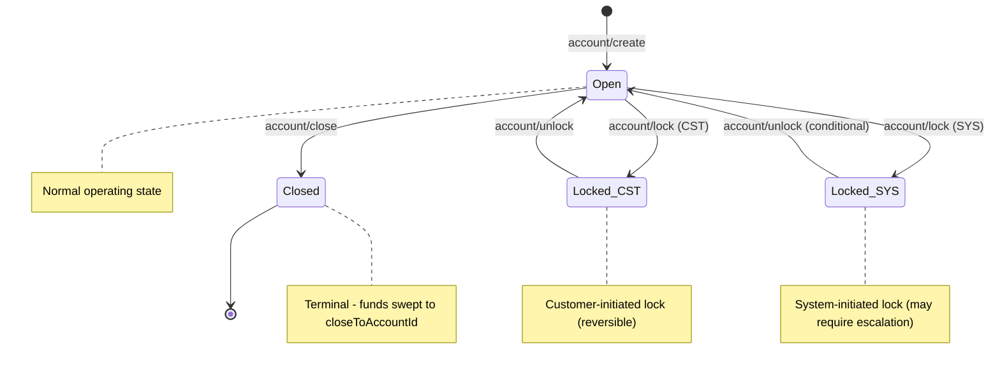
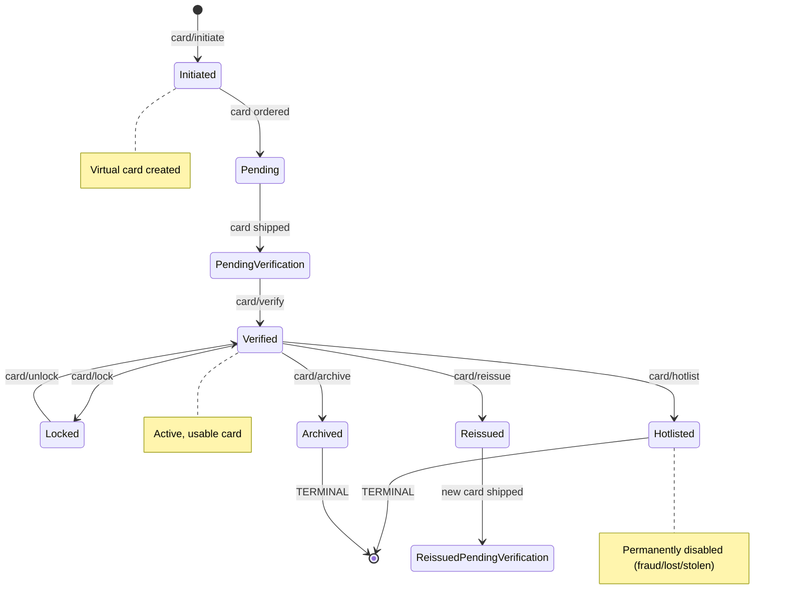
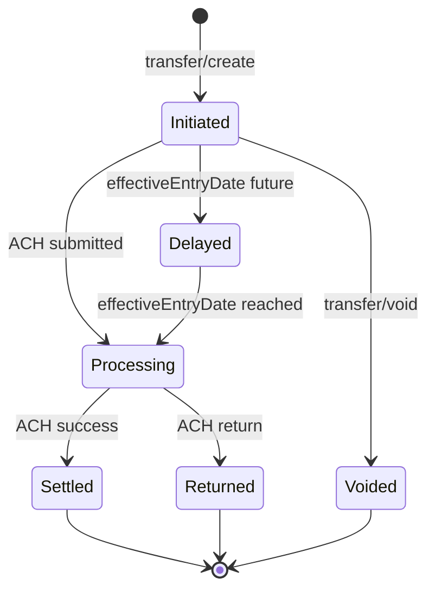
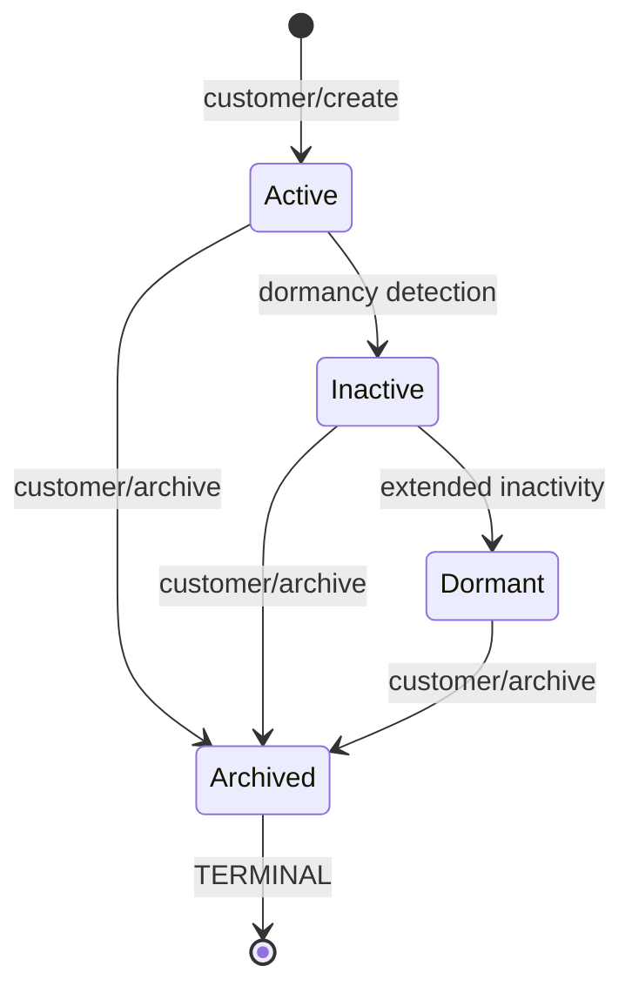
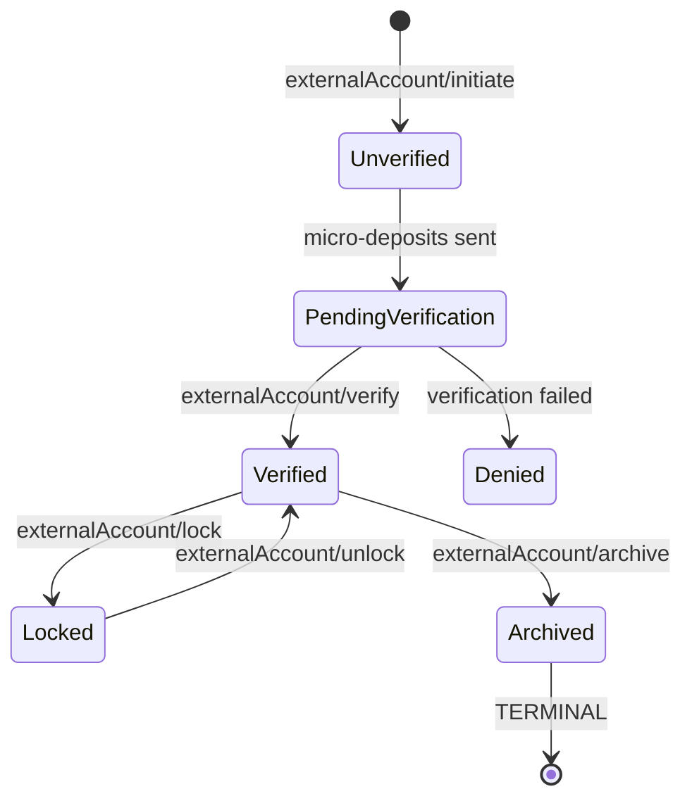
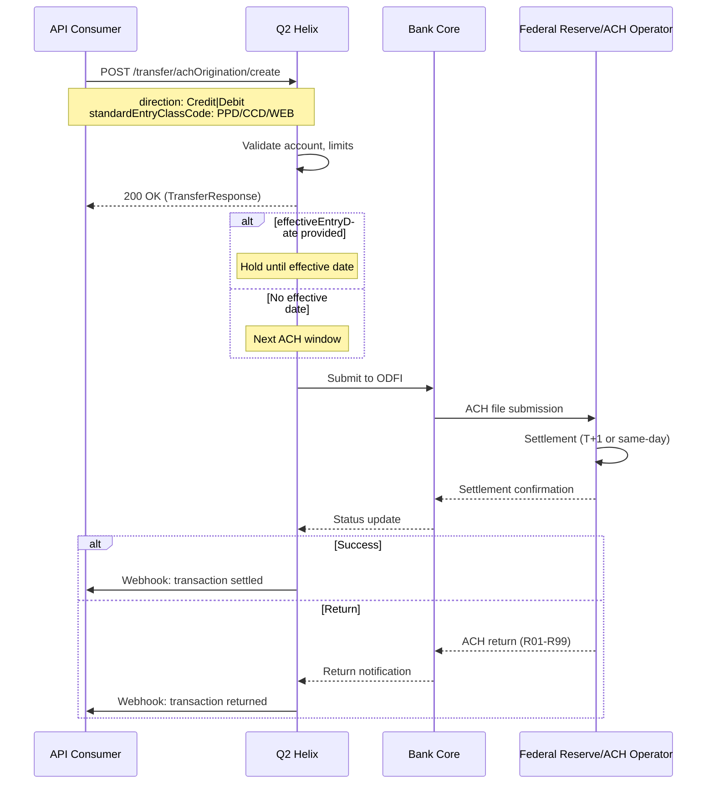
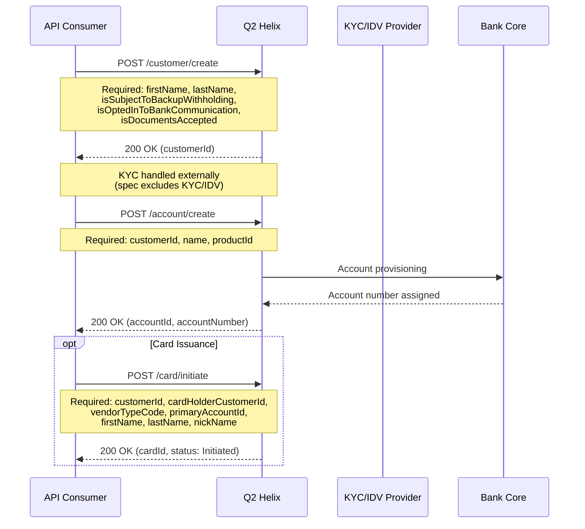
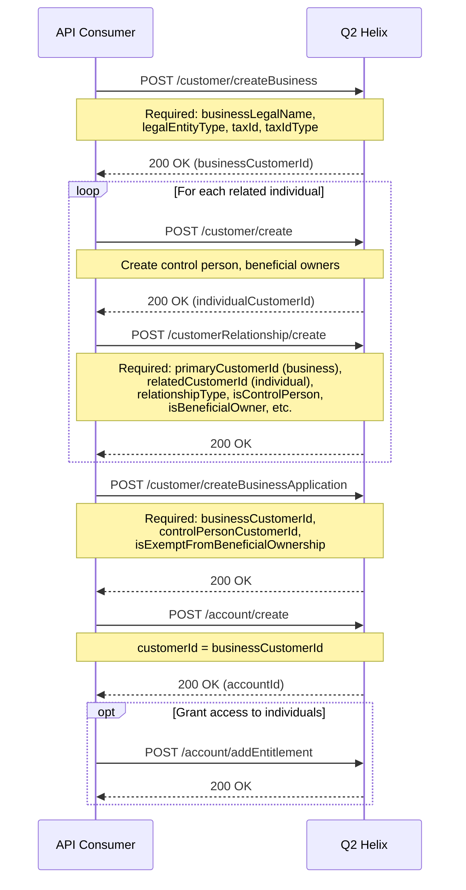
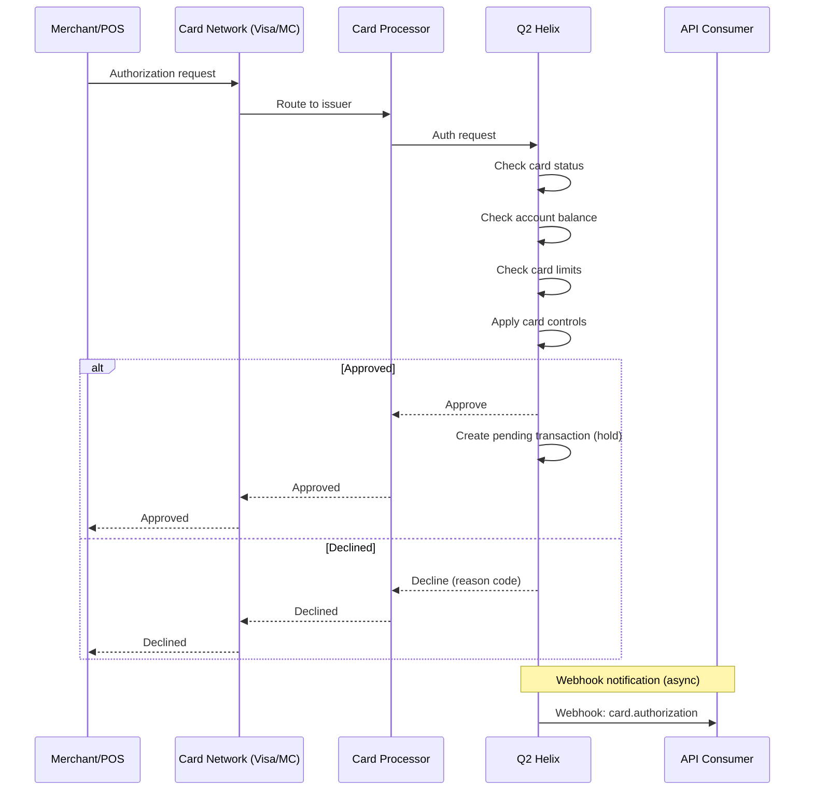

# Q2 Helix API Architecture Analysis

**Provider:** Q2 Helix (BaaS Platform)  
**API Version:** 3.0.0  
**Analysis Date:** December 2025

---

## 1. Entity Relationships

### Entity Relationship Diagram

### Core Entities

| Entity | ID Format | Key Attributes | Connects To |
|--------|-----------|----------------|-------------|
| **Customer** | `HelixId32` (int) | `firstName`, `lastName`, `taxId`, `emailAddress`, `status`, `tag` | Account, Card, ExternalAccount, CustomerRelationship |
| **Account** | `HelixId32` (int) | `productId`, `name`, `balance`, `status`, `lockTypeCode`, `tag` | Customer, Transaction, Card, Statement |
| **Transaction** | `HelixId64` (bigint) | `amount`, `type`, `status`, `settledDate`, `availableDate`, `tag` | Account |
| **Card** | `HelixId32` (int) | `cardNumber`, `status`, `vendorTypeCode`, `primaryAccountId`, `tag` | Customer, Account(s), CardControl |
| **ExternalAccount** | `HelixId32` (int) | `routingNumber`, `accountNumber`, `status`, `tag` | Customer, Transfer |
| **Transfer** | via `tag` | `fromId`, `toId`, `amount`, `status`, `isSameDaySettle` | Account, ExternalAccount |
| **CustomerRelationship** | N/A | `relationshipType`, `isPrimaryContact`, `isControlPerson`, `isBeneficialOwner` | Customer (business) → Customer (individual) |

### Key Design Decisions

- **Unified Customer Model with Type Differentiation**: Both individual and business customers use the same `Customer` entity but are created via different endpoints (`/customer/create` vs `/customer/createBusiness`)
- **Tag-Based Idempotency**: Most entities support a `tag` field for client-assigned unique identifiers, enabling lookup via `getByTag` endpoints
- **Entitlement-Based Access Control**: Business accounts use an entitlement system to grant access to related individuals (`addEntitlement`, `editEntitlement`, `removeEntitlement`)
- **Program-Scoped Multi-Tenancy**: All operations occur within a `Program` context (sponsor bank program)

### Sponsor Banking-Specific Patterns

**Joint Accounts / Multi-Owner:**
- ✅ Supported via `Entitlement` system
- Business accounts can grant access to related customers with specific entitlements: `Signer`, `Owner`, `NonTransactional`, `BeneficialOwner`, `Trustee`, `SuccessorTrustee`, `Guardian`, `Conservator`, `Executor`, `Agent`, `PowerOfAttorney`

**Sub-Account / Virtual Account Model:**
- 🔶 Not explicitly documented as a hierarchy
- Accounts are flat; no parent-child relationship apparent
- Savings goals may use `category`/`subcategory` fields

**Business → Beneficial Owner Relationship:**
- ✅ Explicit via `CustomerRelationship` entity
- `createBusinessApplication` endpoint handles control person and beneficial ownership attestation
- Tracks: `isControlPerson`, `isBeneficialOwner`, `beneficialOwnerPercentage`, `isExemptFromBeneficialOwnership`

**Transaction Linking (Original → Reversal):**
- ✅ ACH origination supports `isReversal` flag
- 🔶 Linked transactions retrieved via `/transaction/get/{customerId}/{transactionId}` returns array (implies related transactions)
- `tag` field can be used for client-side correlation

---

## 2. State Machines

### Account States

**Account Lock Types:**
| lockTypeCode | Description | Reversible |
|--------------|-------------|------------|
| `CST` | Customer-initiated | ✅ Yes |
| `SYS` | System-initiated | Conditional |

**Account Lock Reasons:**
- `lockReasonTypeCode` captures why the lock was placed (fraud, compliance, etc.)
- Close reasons: `FirstPartyFraud`, `ThirdPartyFraud`, `SyntheticIdFraud`, `AccountTakeoverFraud`, `NonActivity`, `CustomerRequest`, `BankDiscretion`, `Other`

**Account Holds** (separate from locks):
- `placeHold` / `releaseHold` - Indefinite fund holds with `holdAmount`, `holdDescription`, `expirationDate`
- Holds have their own status: tracked via `AccountHold` entity with `AccountHoldStatusType`

### Card States

**Full Card Status Enum:**
`Default`, `All`, `Archived`, `Denied`, `Expired`, `Hotlisted`, `Initiated`, `Pending`, `PendingVerification`, `Reissued`, `ReissuedPendingVerification`, `AutoReissuedPendingVerification`, `Verified`

**Card Lock Reasons:**
- `UNK` - Unknown
- `FRD` - Fraud
- `DMG` - Damage
- `TMP` - Temporary

**Reissue Reasons:**
- `DMG` - Physical Damage
- `REN` - Renewal
- `FRD` - Fraud
- `LST` - Lost
- `STL` - Stolen
- `NCN` - New Card Number
- `CMP` - Compliance

**Terminal States:**
- `Hotlisted` - One-way, cannot be undone
- `Archived` - One-way, cannot be unarchived

### Transaction/Transfer States

**Transfer/Transaction Status Values:**
- `initiated` - Created, pending submission
- `delayed` - Scheduled for future effective date
- `voided` - Cancelled before submission

**Key Timing:**
- `isSameDaySettle` flag controls same-day ACH
- `effectiveEntryDate` for scheduled ACH (if not provided, next available window)
- `setAvailableDate` endpoint allows manual control of when funds become available

### Customer States

**Dormancy Status:** `Active`, `Inactive`, `Dormant`
- Tracked via `setLastContact` endpoint with `CustomerLastContactType`

**Terminal State:**
- `Archived` - One-way, cannot be unarchived

### External Account States

**External Account Status Values:**
`Default`, `All`, `Archived`, `Denied`, `Expired`, `Hotlisted`, `Initiated`, `Pending`, `PendingVerification`, `Reissued`, `ReissuedPendingVerification`, `AutoReissuedPendingVerification`, `Verified`

---

## 3. Critical Flows

### ACH Origination Flow

**ACH Key Parameters:**
| Parameter | Description |
|-----------|-------------|
| `direction` | `Credit` (push) or `Debit` (pull) |
| `standardEntryClassCode` | SEC code: PPD, CCD, WEB, etc. |
| `isPrenote` | Zero-dollar test transaction |
| `isReversal` | Reversal of prior transaction |
| `effectiveEntryDate` | Scheduled date (optional) |
| `receiverAccountType` | `Checking`, `Savings`, `Loan`, `General Ledger` |

**Timing:**
- ✅ Same-day ACH supported (via transfer/create `isSameDaySettle`)
- 🔶 Cutoff times not documented in spec
- `effectiveEntryDate` for future-dated transactions

### Account Opening Flow (Individual)

**Account Opening Key Points:**
- KYC/IDV is **not** part of Helix API (external)
- `productId` determines account type (configured at program level)
- Custom account numbers supported via `accountNumber` parameter
- Optional: `legalName1`, `legalName2` for joint account display names

### Account Opening Flow (Business)

### Card Authorization Flow

**Card Controls:**
- Created via `/cardControl/create` with rules array
- Controls applied in real-time during authorization
- Can be managed via `tag` for client-side identification

**Mock Endpoints (Sandbox):**
- `/card/mock/withdrawal/purchase/authorize` - Simulate auth
- `/card/mock/withdrawal/purchase/complete` - Simulate settlement
- `/card/mock/decline/purchase/authorize` - Simulate decline
- `/card/mock/deposit/purchase/return` - Simulate return

---

## 4. Notable Design Patterns

### ID Strategy
- **Internal IDs**: `HelixId32` (32-bit integer) for most entities, `HelixId64` (64-bit) for transactions
- **Client-Assigned IDs**: `tag` field (50 char string) for idempotency and external reference
- **Dual Lookup**: Most entities support both `/get/{id}` and `/getByTag/{tag}` endpoints

### Multi-Tenancy
- **Program-Level Isolation**: All data scoped to `Program`
- **Product Configuration**: Account types, limits, fees configured at program level
- **Industry Classification**: `industryClassificationCodeId` for business customers (program-specific codes)

### Compliance Features
- **Due Diligence Questions**: `/program/questionsList` returns KYC questions by category
- **Customer Documents**: Upload/status tracking for compliance docs
- **Beneficial Ownership**: Full CDD support via `CustomerRelationship` + `createBusinessApplication`

### Fee Engine
- Fee configuration via `/fee/config/list/{feeEngineExecutionTypeId}`
- Transaction fees via `/transaction/createFee`

---

## 5. Confidence Assessment

| Area | Confidence | Notes |
|------|------------|-------|
| Entity Relationships | ✅ Documented | Clear from endpoint structure |
| Account States | 🔶 Inferred | Lock types documented, full lifecycle inferred |
| Card States | ✅ Documented | Full status enum available |
| Transaction States | 🔶 Inferred | Limited enum, flow inferred from endpoints |
| ACH Flow | 🔶 Partial | Parameters clear, timing/cutoffs not documented |
| Account Opening | ✅ Documented | Endpoints clear, KYC external |
| Business Onboarding | ✅ Documented | Full beneficial ownership support |
| Card Auth Flow | 🔶 Inferred | Mock endpoints suggest flow, real-time details unclear |
| Webhooks | ❓ Missing | Not documented in spec |
| Ledger Model | ❓ Missing | No GL exposure in public API |

---

## 6. Key Gaps / Questions for Verification

1. **Webhook Events**: What events are available? What's the payload structure?
2. **ACH Cutoff Times**: What are the same-day and next-day cutoff times?
3. **ACH Return Handling**: How are returns surfaced? Via webhook? Transaction status?
4. **Ledger/GL Access**: Is there a program-level GL or FBO account visible?
5. **Real-time Balance**: Is balance real-time or batch-updated?
6. **Card Settlement Flow**: Settlement timing, interchange, disputes?
7. **Wire Transfer Status**: The wire endpoint is marked "under development"
8. **Rate Limits**: Not documented in spec

---

## 7. Comparison Data Points (for Cross-Provider Analysis)

| Decision Point | Q2 Helix |
|----------------|----------|
| Customer model | Unified entity, separate create endpoints (individual/business) |
| Joint account support | ✅ Via Entitlement system |
| Sub-account model | ❌ Not apparent (flat account structure) |
| Transaction linking | `tag` + array return on transaction get |
| Account states | Open → Locked (CST/SYS) → Closed |
| Card states | Initiated → Pending → Verified → (Locked/Hotlisted/Archived) |
| ACH same-day | ✅ Supported (`isSameDaySettle`) |
| ACH cutoff | ❓ Not documented |
| Ledger exposure | ❌ Abstract (no explicit GL) |
| ID format | 32-bit integers + client `tag` |
| KYC integration | External (not in API) |
| Beneficial ownership | ✅ Full CDD support |