# Q2 Helix API Analysis for Cassandra Core Banking System

## Executive Summary

Q2 Helix (formerly CorePro) is a cloud-native BaaS core designed for embedded finance. It follows a **Program-centric model** where the API consumer's business is represented as a "Program" containing all configuration, products, customers, and accounts. Helix is **not a traditional sponsor bank API** but rather a complete hosted core banking system with integrated card processing (Visa DPS) and ACH origination.

**Key Differentiators:**
- Fully hosted core (you don't build the ledger—Helix IS the ledger)
- Tightly coupled with partner bank (bank approval required for many features)
- Real-time events via Azure Service Bus (not webhooks)
- Joint accounts supported natively with priority-based ownership
- Goals/SubAccounts are simply Accounts with different categorization

---

## 1. Entity Model

### Entity Relationship Diagram

### Core Entities

| Entity | ID Format | Key Attributes | Relationships |
|--------|-----------|----------------|---------------|
| **Program** | Integer (system-assigned) | `products[]`, `perUserExternalAccountCountMax`, fee configs | Top-level container for all entities |
| **Customer** | Integer `customerId` | `status`, `kycStatus`, `isBusiness`, `taxId`, `tag` | Owns Accounts, ExternalAccounts, Cards |
| **Account** | Integer `accountId` | `status`, `accountBalance`, `availableBalance`, `type`, `productId`, `isPrimary`, `isJointAccount` | Belongs to Customer, linked to Product |
| **ExternalAccount** | Integer `externalAccountId` | `status`, `routingNumber`, `accountNumber`, `type` | Linked to Customer for ACH transfers |
| **Card** | Integer `cardId` | `status`, `cardNumberMasked`, `accounts[]`, `primaryAccountId` | Links to 1-8 Accounts, owned by Customer |
| **Transaction** | Long Integer (64-bit) `transactionId` | `typeCode`, `status`, `amount`, `masterId`, `cardId` | Posted to Account |
| **Transfer** | N/A (creates Transaction) | `fromId`, `toId`, `amount`, `customerId` | Action object, not persisted |

### Key Design Decisions

**Customer Model:**
- ✅ **Unified Customer**: Single `customer` entity with `isBusiness` boolean flag
- Business customers have additional fields: `businessLegalName`, `businessDescription`, `industryClassificationCodeId`, `kybStatus`
- Individual customers use `kycStatus`; business uses `kybStatus`
- Separate endpoints: `/customer/create` (individual) vs `/customer/createBusiness`

**Joint Account Support:**
- ✅ **Native joint accounts** via `CustomerRelationship` API
- `isJointAccount` boolean on Account
- `customerPriority` (1 = primary owner, 2+ = joint owners)
- `totalCustomers` count on Account
- `accessTypeCode` per customer: `FULL`, `RDONLY`, `NONE`
- Ownership transfer on primary death to next priority customer

**Sub-Account / Goals Model:**
- 🔶 **Goals ARE Accounts** - no separate entity
- Conceptually treated as sub-accounts but use same `account` object
- `isPrimary` flag designates main account
- Primary account cannot be closed while customer is active
- No hierarchical parent-child relationship—flat structure with `category`/`subCategory` for grouping

**Business Beneficial Owners:**
- 🔶 **CustomerRelationship** object links individuals to business customers
- `exemptFromBeneficialOwnershipReasonType` enum (22 exemption types)
- `isExemptFromBeneficialOwnership` boolean
- Requires separate KYC for business (`kybStatus`) and beneficial owners

**Transaction Linking:**
- ✅ **`masterId`** groups related transactions (original → reversal, auth → settlement)
- `transactionTag` for client-assigned correlation
- Card transactions use `cardId` for linking
- ACH returns linked via `returnCode` (NACHA return codes)

---

## 2. State Machines

### Account States

| State | Description | Recoverable? |
|-------|-------------|--------------|
| `PendingOpen` | Account created, awaiting activation | Yes |
| `Open` | Active account | Yes |
| `Dormant` | Inactive account (configurable threshold) | Yes (auto-recovers) |
| `PendingClosed` | Closure requested, balance > 0 | Yes (if balance deposited) |
| `Closed` | **Terminal** - Cannot be reopened | No |
| `Inactive` | Deprecated state | N/A |

**Lock Mechanism** (orthogonal to status):
- `isLocked` boolean with `lockTypeCode`: `UNL` (unlocked), `CST` (customer/API), `SYS` (system)
- `lockReasonTypeCode`: `UNK`, `FRD`, `ADM`, `TMP`, `FRZ`, `SUS`, `CO`, `RTN`, `REC`, `DED`, `DOR`

### Transaction States

| State | Description | Terminal? |
|-------|-------------|-----------|
| `Initiated` | Created, not yet in NACHA file | No (can void) |
| `Pending` | In NACHA file, processing | No (can void before delivery) |
| `Settled` | Posted to account | **Yes** |
| `Voided` | Cancelled before settlement | **Yes** |

**Note:** Internal transfers (account-to-account within Helix) settle **instantly** - skip Initiated/Pending.

### Card States

| State | Description | Terminal? |
|-------|-------------|-----------|
| `Initiated` | Request created | No |
| `Pending` | Sent to card vendor | No |
| `PendingVerification` | Shipped, awaiting activation | No |
| `Verified` | Active card | No |
| `Reissued` | Replacement requested | No |
| `ReissuedPendingVerification` | Replacement shipped | No |
| `AutoReissuedPendingVerification` | Auto-renewal shipped | No |
| `HotListed` | **Terminal** - Lost/Stolen, permanently disabled | **Yes** |
| `Archived` | **Terminal** - Deactivated | **Yes** |
| `Expired` | **Terminal** - Never verified in time | **Yes** |
| `Denied` | **Terminal** - Card creation rejected | **Yes** |
| `DigitalActivePhysicalInitiated` | Digital active, physical ordered | No |
| `DigitalActivePhysicalPending` | Digital active, physical shipping | No |

**Card Lock Mechanism:**
- `lockTypeCode`: `UNL`, `CST` (API unlockable), `SYS` (admin only)
- `lockReasonTypeCode`: `UNK`, `STL` (stolen-permanent), `LST` (lost-permanent), `FRD`, `DMG`, `ADM`, `TMP`, `PIN`

### Customer/KYC States

| Status | kycStatus/kybStatus | Terminal? |
|--------|---------------------|-----------|
| `Initiated` | N/A | No |
| `Manual Review` | `Manual Review` | No |
| `Verified` / `Active` | `Verified` | No |
| `Denied` | `Denied` | **Yes** |
| `Archived` | N/A | **Yes** |
| `Deceased` | N/A | **Yes** |
| `Expired` | `Expired` | **Yes** |

**Additional KYC Statuses:**
- `Automated Review` - in queue for automated verification
- `fraudStatus` - separate fraud verification status
- `ofacStatus` - OFAC screening status

---

## 3. Critical Flows

### 3.1 ACH Origination Flow

```mermaid
sequenceDiagram
    participant Client
    participant Helix as Helix API
    participant NACHA as NACHA/Fed
    participant ExtBank as External Bank
    
    Client->>Helix: POST /transfer/create<br/>{fromId, toId, amount, customerId}
    Helix->>Helix: Validate balances, limits
    Helix-->>Client: 200 {transactionId, masterId}<br/>status: Initiated
    
    Note over Helix,NACHA: Batch processing (bank cutoff)
    
    Helix->>NACHA: Submit ACH file
    Helix-->>Client: Event: status → Pending
    
    alt Standard ACH (T+2)
        NACHA->>ExtBank: Forward ACH
        ExtBank-->>NACHA: Accept
        NACHA-->>Helix: Settlement confirmation
        Helix-->>Client: Event: status → Settled
    else Same-Day ACH
        Note over Helix: Submitted before cutoff
        NACHA->>ExtBank: Same-day forward
        ExtBank-->>NACHA: Accept
        NACHA-->>Helix: Same-day settlement
        Helix-->>Client: Event: status → Settled
    else ACH Return
        ExtBank-->>NACHA: Return (R01, R02, etc.)
        NACHA-->>Helix: Return file
        Helix->>Helix: Create RTNDEP/RTNWTH transaction
        Helix-->>Client: Event: Return with returnCode
    end
```

**Timing:**
- **Standard ACH:** 1-2 business days settlement
- **Same-Day ACH:** Same day if submitted before bank-defined cutoff (additional fee)
- **Internal Transfers:** Instant settlement
- **Void Window:** Until NACHA file delivered (`/transfer/void`)

**ACH Return Handling:**
- Returns create reversal transaction linked via `masterId`
- `returnCode` contains NACHA return reason (R01=NSF, R02=Account Closed, etc.)
- `RTNDEP` = return of deposit, `RTNWTH` = return of withdrawal

**Same-Day ACH:**
- Specified via `isSameDaySettle` in transfer request
- Cutoff time: Bank-specific, typically early afternoon ET
- Additional per-transaction fee

### 3.2 Account Opening Flow

```mermaid
sequenceDiagram
    participant Client
    participant Helix as Helix API
    participant KYC as KYC Vendor
    participant Bank as Partner Bank
    
    Client->>Helix: GET /bankDocument/list
    Helix-->>Client: Required disclosures
    
    Client->>Helix: GET /program/questionsList
    Helix-->>Client: Due diligence questions
    
    Client->>Helix: POST /customer/create<br/>{firstName, lastName, taxId,<br/>birthDate, address, isDocumentsAccepted}
    Helix->>KYC: IDology verification
    
    alt KYC Passed
        KYC-->>Helix: Verified
        Helix-->>Client: 200 {customerId, status: Verified}
    else KYC Failed
        KYC-->>Helix: Manual Review
        Helix-->>Client: 200 {customerId, status: Manual Review}
        Note over Client,Bank: Manual document collection
        Client->>Helix: POST /customer/document/upload
        Bank->>Helix: Admin Console: Approve
        Helix-->>Client: Event: status → Verified
    end
    
    Client->>Helix: POST /customer/answerPost<br/>{questionId, choiceId}
    Helix-->>Client: 200 OK
    
    Client->>Helix: POST /account/create<br/>{customerId, productId, name}
    Helix-->>Client: 200 {accountId, accountNumber,<br/>routingNumber, status: Open}
```

**Required Fields (Individual):**
- `firstName`, `lastName`, `birthDate`
- `taxId` (SSN/ITIN)
- `address` (type=Residence)
- `emailAddress`, `phone` (type=Mobile)
- `isDocumentsAccepted: true`

**Business Customer Differences:**
- Use `/customer/createBusiness` endpoint
- Additional: `businessLegalName`, `businessDescription`, `industryClassificationCodeId`
- KYB process via `kybStatus` (separate from KYC)
- Beneficial ownership collection via `CustomerRelationship`

**Timing:**
- KYC: Real-time (seconds)
- Manual Review: Hours to days (bank-dependent)
- Account Creation: Instant after customer verified
- Some programs require 10+ business day waiting period before withdrawals

### 3.3 Card Authorization Flow

**Authorization Timing:**
- Auth response: Real-time (sub-second)
- Hold duration: 72 hours default (or merchant-specified)
- Settlement: 24-72 hours typical

**Decline Scenarios:**
- Insufficient `availableBalance`
- Card locked (`isLocked: true`)
- Card status not `Verified`
- Card controls block transaction
- Account locked or closed
- Daily/transaction limits exceeded

**Card Controls:**
- `CardControl` entity with `cardControlRule[]`
- Rules: MCC blocks, geographic restrictions, amount limits
- Real-time enforcement during auth

---

## 4. Notable Design Patterns

### Program-Centric Architecture
Everything in Helix is scoped to a Program. The Program contains:
- Products (account configurations)
- Customers, Accounts, Cards
- Fee configurations
- Limits and settings
- No multi-tenant/white-label concept visible at API level

### Events over Webhooks
Helix uses **Azure Service Bus** (AMQP 1.0) for real-time events instead of HTTP webhooks:
- Near-instant delivery
- PCI compliant
- Event types numbered: 200-series (deposits), 400-series (cards), etc.
- Backup: SFTP Event Notification File (15-minute batches)

### Ledger Abstraction
Helix abstracts the GL completely:
- No exposed ledger entries
- `accountBalance`, `availableBalance`, `pendingBalance` as derived values
- Program accounts (Reserve, Settlement, Petty Cash) exist but limited exposure
- Trial Balance File available via SFTP

### Transaction Type System
Extensive `typeCode` system (100+ codes) encoding:
- Source/destination (UNK=unknown external, RSV=reserve, etc.)
- Action (DEP=deposit, WTH=withdrawal, XFR=transfer)
- Channel (CRD=card, ATH=auth, REV=reversal)

---

## 5. Confidence Assessment

| Area | Confidence | Notes |
|------|------------|-------|
| Entity relationships | ✅ Documented | Clear object model in docs |
| Account states | ✅ Documented | States listed, transitions inferred |
| Transaction states | ✅ Documented | Clear lifecycle |
| Card states | ✅ Documented | Extensive state list |
| Customer/KYC states | 🔶 Partial | kycStatus vs status distinction unclear |
| ACH flow | ✅ Documented | Transaction types + timing clear |
| Card auth flow | 🔶 Inferred | ISO-8583 mentioned, flow reconstructed |
| Joint accounts | ✅ Documented | CustomerRelationship API clear |
| Sub-accounts/Goals | 🔶 Inferred | Philosophy documented, implementation less clear |
| Same-day ACH cutoff | ❓ Bank-specific | "Bank-defined cutoff" - not in public docs |
| Wire transfer flow | 🔶 Partial | Exists but less documented |
| FBO patterns | ❓ Unclear | ForBenefitOf account type exists, patterns not documented |

---

## 6. Gaps & Questions for Verification

1. **Same-Day ACH Cutoff:** What is the actual cutoff time? (Bank-partner specific)
2. **KYC Vendors:** IDology mentioned, but is Socure also supported? (Ruby SDK mentions it)
3. **Beneficial Ownership:** Is there a `/beneficialOwner` endpoint or only via CustomerRelationship?
4. **Transaction Limits:** Where are daily/monthly limits configured? (Product level?)
5. **Multi-Program:** Can one API credential access multiple programs?
6. **RTP Support:** Real-time payments mentioned (ATHRTW, RTPWTH types) - availability?
7. **FBO Reconciliation:** How do ForBenefitOf accounts reconcile with Program accounts?

---

## 7. Comparison Notes (for Cross-Provider Matrix)

| Decision Point | Q2 Helix |
|----------------|----------|
| Customer model | Unified (isBusiness flag) |
| Joint account support | ✅ Native (CustomerRelationship) |
| Sub-account model | Accounts with isPrimary/category |
| Transaction linking | masterId groups related txns |
| Account states | 6 states + lock mechanism |
| ACH same-day cutoff | Bank-specific (not in docs) |
| Ledger exposure | Abstract (no GL API) |
| Event delivery | Azure Service Bus (AMQP) |
| Card processor | Visa DPS (integrated) |
| Wire support | ✅ Incoming + Outgoing |