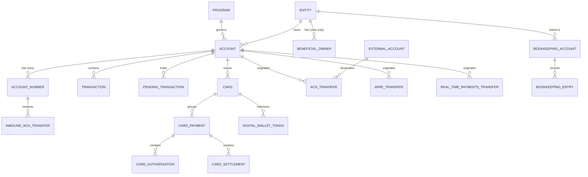
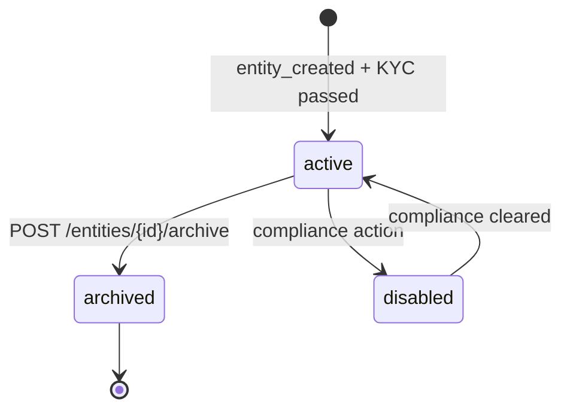
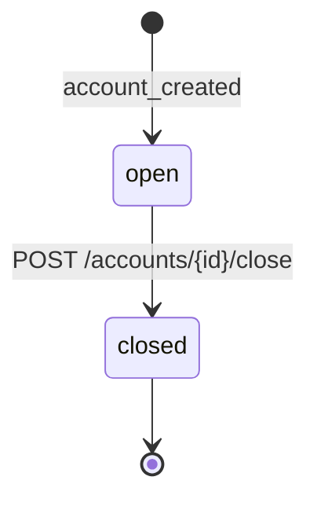
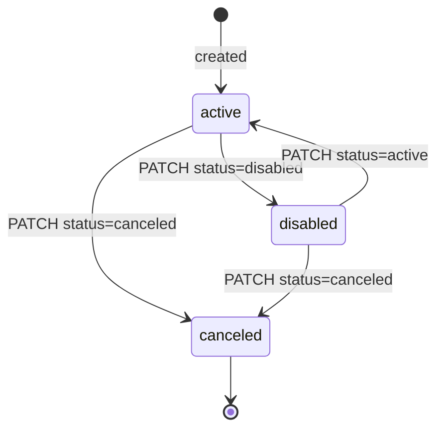
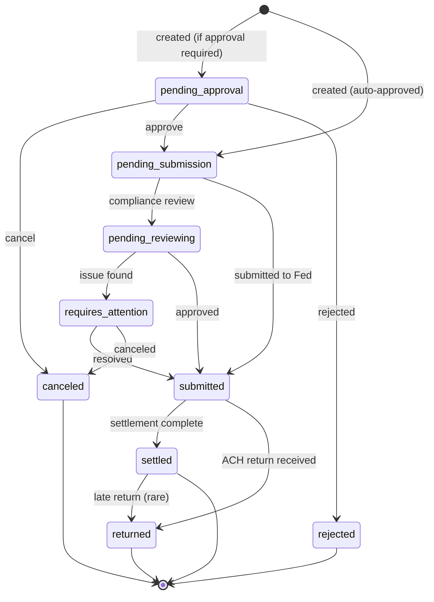
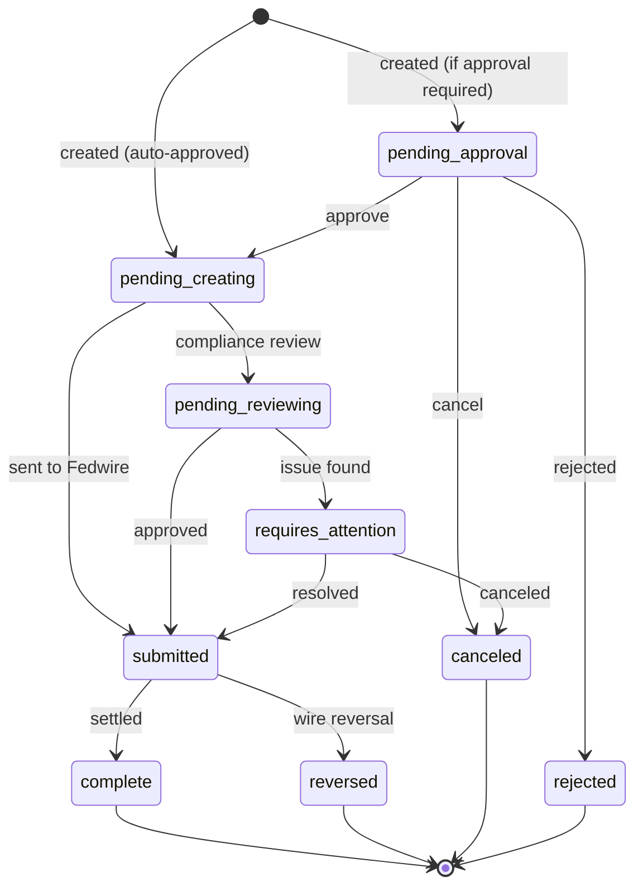
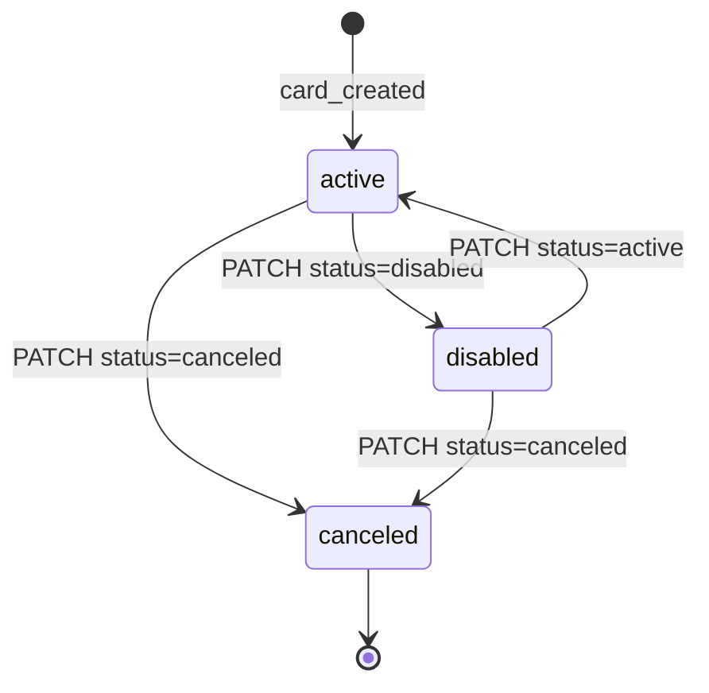
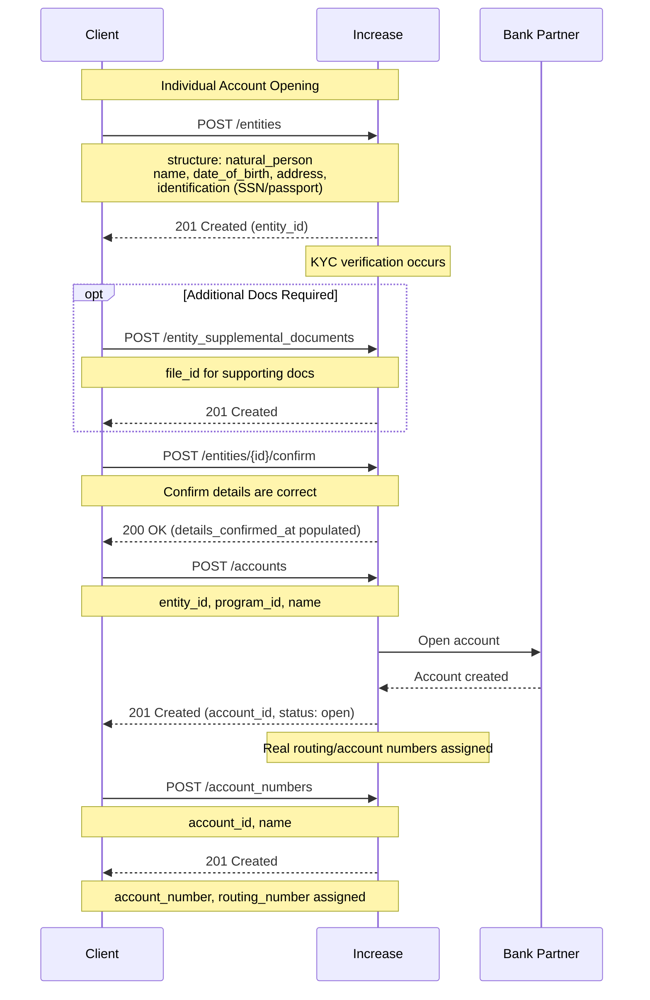
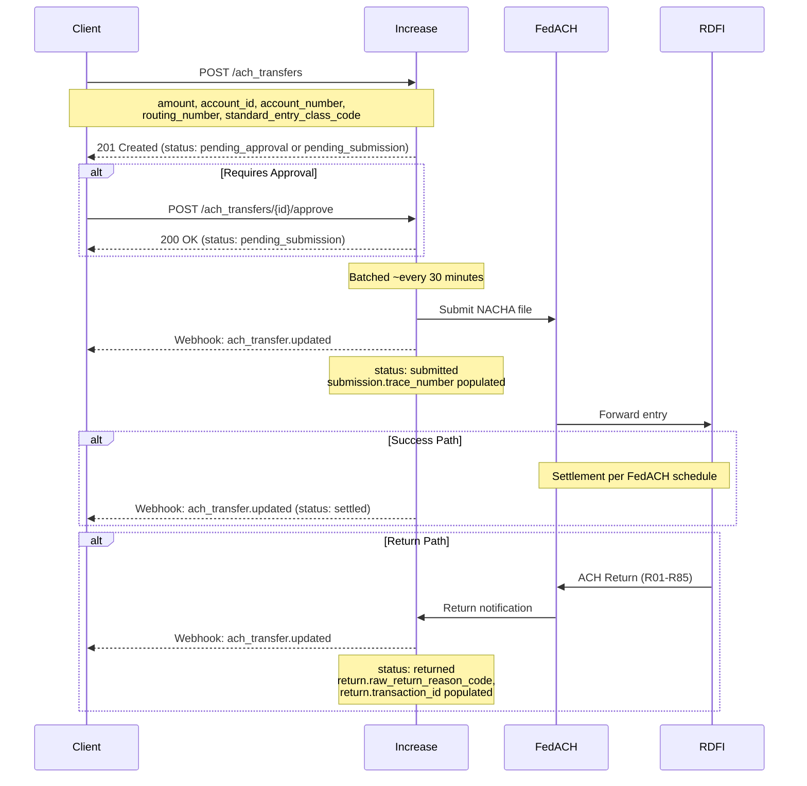
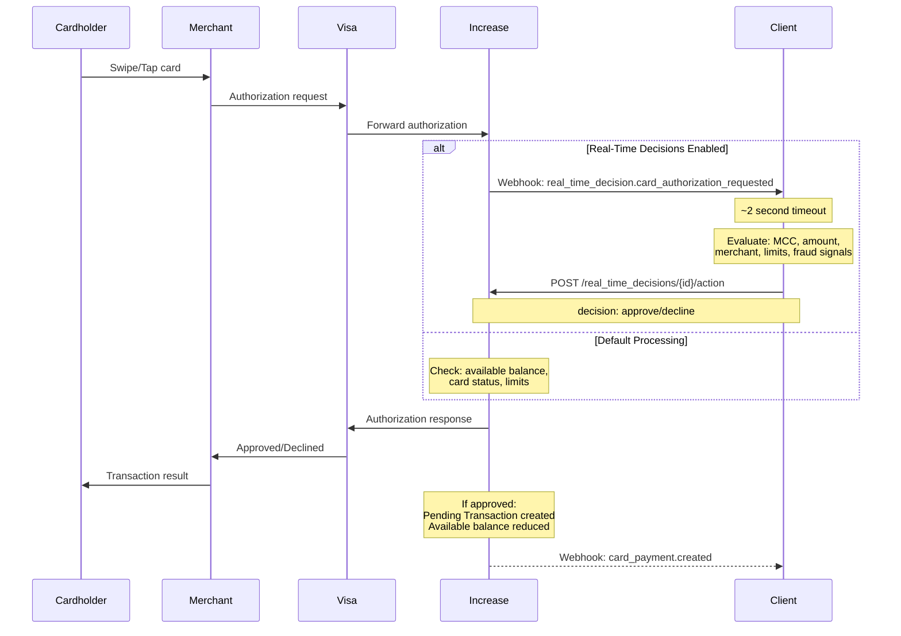

# Increase BaaS API: Comprehensive Documentation Summary

**Analysis Date:** December 12, 2025  
**Purpose:** Consolidated reference for Cassandra core banking system development  
**Sources Combined:**
- Source A: Live Documentation analysis (`increase-url-summary.md`)
- Source B: OpenAPI Specification analysis (`increase-summary.md`)
- Source C: Live documentation site (https://increase.com/documentation/)

---

## Executive Summary

Increase operates as a **parallel core** for sponsor bank partners, providing direct API access to Federal Reserve rails (FedACH, Fedwire, FedNow), The Clearing House (RTP), and Visa. Their philosophy is "no abstractions"—they expose the full complexity of underlying financial networks rather than simplifying away details.

**Bank Partners:** Grasshopper Bank, N.A. (Member FDIC) and First Internet Bank of Indiana (Member FDIC)

**Key Differentiators:**
- Direct Federal Reserve connections (not through legacy cores)
- Real Accounts with real routing/account numbers (not virtual abstractions)
- Real-time card authorization decisioning via webhook (~2 second timeout)
- Unlimited Account Numbers per Account for reconciliation
- Same-day ACH at every Fed window (~30 minute batches)
- Explicit Bookkeeping API for compliance-grade FBO ledger tracking

---

## 1. Core Banking Entities

### Entity Relationship Diagram



### Entity Reference Table

| Entity | ID Format | Key Attributes | Relationships |
|--------|-----------|----------------|---------------|
| **Entity** | `entity_*` | structure (corporation/natural_person/joint/trust/government_authority), status, details_confirmed_at, risk_rating | Owns Accounts, has Beneficial Owners (if corp) |
| **Account** | `account_*` | bank, status, currency, interest_rate, program_id, informational_entity_id | Belongs to Entity, governed by Program |
| **Account Number** | `account_number_*` | account_number, routing_number, status, inbound_ach.debit_status | Belongs to Account |
| **Transaction** | `transaction_*` | amount, currency, source (polymorphic ~30 categories), route_id/route_type | Belongs to Account, immutable |
| **Pending Transaction** | `pending_transaction_*` | amount, status, source | Belongs to Account, mutable |
| **Card** | `card_*` | status, last4, expiration_month/year, billing_address, type (virtual/physical) | Belongs to Account, optionally to Entity |
| **Card Payment** | `card_payment_*` | state (amounts), elements[] | Groups card interactions |
| **ACH Transfer** | `ach_transfer_*` | status, amount, standard_entry_class_code, submission, return | Originates from Account |
| **Wire Transfer** | `wire_transfer_*` | status, amount, routing_number, message_to_recipient | Originates from Account |
| **Real-Time Payments Transfer** | `real_time_payments_transfer_*` | status, amount | Originates from Account |
| **External Account** | `external_account_*` | routing_number, account_number, status, funding | Stores counterparty details |
| **Program** | `program_*` | bank, interest_rate, name, default_digital_card_profile_id, billing_account_id | Governs multiple Accounts |
| **Bookkeeping Account** | `bookkeeping_account_*` | compliance_category (commingled_cash/customer_balance), entity_id, account_id | T-account for FBO compliance |

### Key Design Patterns

**Unified Entity Model:**
Single `Entity` resource with `structure` discriminator supporting: `natural_person`, `corporation`, `joint`, `trust`, `government_authority`. Beneficial owners are nested within corporation entities.

**Joint Account Support:**
Joint accounts are modeled at the Entity level via `structure: joint` with an `individuals[]` array containing exactly two persons. The joint entity then owns accounts.

**Sub-Account / Virtual Account Model:**
Implemented through `Account Number` resource. Each Account can have **unlimited** Account Numbers with distinct routing numbers. This enables per-vendor account numbers for reconciliation.

**Informational Entity:**
Accounts support an `informational_entity_id` for associating activity with an entity that doesn't own the account—useful for FBO patterns.

**Transaction Linking:**
Transactions link to their source via a polymorphic `source` object with a `category` discriminator (~30+ categories). Returns create new transactions with source category referencing the original.

---

## 2. API Design Patterns

### Authentication

**Model:** Bearer Token Authentication

```bash
curl --url "https://api.increase.com/accounts" \
  -H "Authorization: Bearer ${INCREASE_API_KEY}"
```

API keys are managed at: https://dashboard.increase.com/developers/api_keys

**Environments:**
- Production: `https://api.increase.com`
- Sandbox: `https://sandbox.increase.com`

### Idempotency

**Header:** `Idempotency-Key`
**Max Length:** 200 characters
**Scope:** POST requests only (PATCH, GET, DELETE are inherently idempotent)

**Behavior:**
- Same key + same arguments → Returns original object with `Idempotent-Replayed: true` header
- Same key + different arguments → HTTP 409 Conflict with `type: idempotency_key_already_used_error`
- Unique per object across Increase

**Example:**
```bash
curl -X POST https://api.increase.com/ach_transfers \
  -H "Idempotency-Key: invoice_12345" \
  -d '{"account_id": "account_1", "amount": 10000, ...}'
```

**Retrieval by Idempotency Key:**
```bash
GET https://api.increase.com/ach_transfers?idempotency_key=invoice_12345
```

### Pagination

**Type:** Cursor-based pagination

**Parameters:**
- `cursor` — Return the page of entries after this one
- `limit` — Size of list returned (default and maximum: 100)

**Filters Available:**
- `created_at.after` / `created_at.before` — ISO 8601 timestamp filters
- `created_at.on_or_after` / `created_at.on_or_before`
- `idempotency_key` — Filter by specific idempotency key
- Resource-specific filters (e.g., `account_id`, `status`)

**Example:**
```bash
GET /ach_transfers?account_id=account_123&limit=50&created_at.after=2025-01-01T00:00:00Z
```

### Error Handling

**Error Response Format:**
```json
{
  "status": 409,
  "type": "idempotency_key_already_used_error",
  "title": "The idempotency key submitted has already been used.",
  "detail": null,
  "resource_id": "account_transfer_abc123"
}
```

**Common Error Types:**
- `idempotency_key_already_used_error` — 409 Conflict
- Standard HTTP status codes (400, 401, 403, 404, 500, etc.)

### Versioning

**Strategy:** Unversioned API with backwards compatibility guarantee

**Backwards-Compatible Changes (not breaking):**
- Adding new API resources
- Adding new optional request parameters
- Adding new properties to existing responses
- Changing order of properties in responses
- Changing length/format of opaque strings (object IDs, error messages)
- Adding new Event categories

**Breaking Changes:** Never made without explicit customer contact first

### Webhook / Event Architecture

**Setup:** Create Event Subscription via dashboard or API

**Event Structure:**
```json
{
  "id": "event_123abc",
  "created_at": "2020-01-31T23:59:59Z",
  "category": "transaction.created",
  "associated_object_type": "transaction",
  "associated_object_id": "transaction_abc123",
  "type": "event"
}
```

**Webhook IPs:** `34.83.67.223`, `35.247.122.129`

**Retry Policy (Production):** Up to 7 retries with exponential backoff for non-2xx responses

**Security:** HMAC-SHA256 signature in `Increase-Webhook-Signature` header
```
Increase-Webhook-Signature: t=2022-01-31T23:59:59Z,v1=7ebfbadaa1856b9f...
```

**Event Retention:** 30 days

**Real-Time Webhooks:**
- Zero-latency delivery for card authorization decisions
- Single Event Subscription per real-time category
- ~2 second timeout for response
- No retry on timeout (authorization auto-declined)

**Key Event Categories:**
- `entity.created`, `entity.updated`
- `account.created`, `account.updated`
- `ach_transfer.created`, `ach_transfer.updated`
- `wire_transfer.created`, `wire_transfer.updated`
- `card.created`, `card.updated`
- `card_payment.created`, `card_payment.updated`
- `real_time_decision.card_authorization_requested`
- `transaction.created`

---

## 3. State Machines

### Entity States



| State | Description | Terminal? |
|-------|-------------|-----------|
| `active` | Can transact | No |
| `disabled` | Compliance hold | No (recoverable) |
| `archived` | Permanently archived | Yes |

**Note:** Entity has `details_confirmed_at` timestamp for when KYC was confirmed. All accounts must be closed before Entity can be archived.

### Account States



| State | Description | Terminal? |
|-------|-------------|-----------|
| `open` | Active account, can transact | No |
| `closed` | Account closed, `closed_at` populated | Yes |

**Note:** Extremely simple model—no frozen/suspended state. Controls happen at Entity, Account Number, or Card level.

### Account Number States



| State | Description | Terminal? |
|-------|-------------|-----------|
| `active` | Can receive payments | No |
| `disabled` | Temporarily blocked | No (recoverable) |
| `canceled` | Permanently deactivated | Yes |

**Sub-control:** `inbound_ach.debit_status` (allowed/blocked)

### ACH Transfer States



| State | Description | Terminal? |
|-------|-------------|-----------|
| `pending_approval` | Awaiting approval | No |
| `pending_submission` | Queued for Fed submission | No |
| `pending_reviewing` | Under compliance review | No |
| `requires_attention` | Manual intervention needed | No |
| `submitted` | Sent to FedACH | No |
| `settled` | Funds transferred | Yes |
| `returned` | ACH return received | Yes |
| `canceled` | Canceled before submission | Yes |
| `rejected` | Rejected by compliance | Yes |

**Submission Details:**
- Batch submission: ~30 minutes to Fed window
- `submission` object contains: `effective_date`, `expected_funds_settlement_at`, `trace_number`
- Return window: Up to 2 business days (60 days for unauthorized)

### Wire Transfer States



### Card States



| State | Description | Terminal? |
|-------|-------------|-----------|
| `active` | Can make payments | No |
| `disabled` | Temporarily blocked | No (recoverable) |
| `canceled` | Permanently deactivated | Yes |

**Digital Wallet Token States:** `active`, `inactive`, `suspended`, `deactivated`

### Card Payment Element Lifecycle

1. `card_authorization` — Initial hold
2. `card_increment` — Additional amount (e.g., tip)
3. `card_reversal` — Partial/full reversal before settlement
4. `card_authorization_expiration` — Auth expires without settlement
5. `card_settlement` — Final clearing
6. `card_refund` — Post-settlement refund
7. `card_fuel_confirmation` — Gas pump amount confirmation

---

## 4. Critical Operational Flows

### Account Opening Flow



**Entity Requirements:**

| Type | Required Fields |
|------|-----------------|
| Individual | name, date_of_birth, address, identification (SSN/passport) |
| Corporation | name, address, tax_identifier, incorporation_state, website, beneficial_owners[] (1-5), industry_code |
| Trust | name, address, trustees, beneficiaries, formation details |
| Joint | individuals[] (exactly 2) |

**Timing:**
- Entity creation: Synchronous (immediate 201)
- KYC verification: Async (webhook when complete)
- Account creation: Synchronous (instant)
- Account Numbers: Unlimited, instant creation

### ACH Origination Flow



**Timing SLAs:**

| Phase | SLA |
|-------|-----|
| API Response | Synchronous (< 1 sec) |
| Batch Submission | ~30 minutes to Fed window |
| Same-Day Settlement | Hours (hits every Fed window) |
| Standard Settlement | 1-2 business days |
| Return Window | Up to 2 days (60 days for unauthorized) |

**SEC Codes Supported:** CCD (Corporate), PPD (Prearranged), WEB (Internet-initiated)

### Card Authorization Flow (Real-Time Decisions)



**Real-Time Decision Response:**
```json
POST /real_time_decisions/{id}/action
{
  "card_authorization": {
    "decision": "approve"  // or "decline"
  }
}
```

**Data Available in Authorization:**
- `presentment_amount`, `settlement_amount`
- `merchant_category_code` (MCC)
- `merchant_acceptor_id`, `merchant_descriptor`
- `merchant_city`, `merchant_country`
- CVV result (`match`, `not_match`, `not_checked`)
- AVS result (multiple granular results)
- Network risk score

**Timeout Behavior:** If no response within ~2 seconds, authorization is automatically declined.

---

## 5. Bookkeeping / Ledger System

Increase exposes an explicit **Bookkeeping API** for compliance-grade ledger annotation:

**Resources:**
- **Bookkeeping Account:** T-accounts linked to Accounts and/or Entities
  - `compliance_category`: `commingled_cash` or `customer_balance`
- **Bookkeeping Entry Set:** Transactional batch of entries that must balance
  - Can link to a Transaction via `transaction_id`
- **Bookkeeping Entry:** Individual debit/credit with amount and account

**Example: Setting up FBO tracking**
```bash
# Create customer balance account
POST /bookkeeping_accounts
{
  "name": "John Funds",
  "compliance_category": "customer_balance",
  "entity_id": "entity_456"
}

# Create commingled cash account
POST /bookkeeping_accounts
{
  "name": "FBO Account",
  "compliance_category": "commingled_cash",
  "account_id": "account_abc"
}

# Record customer deposit
POST /bookkeeping_entry_sets
{
  "date": "2020-01-31T23:59:59Z",
  "transaction_id": "transaction_123",
  "entries": [
    {"bookkeeping_account_id": "bookkeeping_account_123", "amount": -10000},
    {"bookkeeping_account_id": "bookkeeping_account_456", "amount": 10000}
  ]
}
```

---

## 6. Sandbox & Testing

**Sandbox URL:** `https://sandbox.increase.com`

**Features:**
- Every API and dashboard feature available
- Simulation APIs for testing external effects
- No webhooks retry in sandbox (to avoid queueing issues)

**Simulation Endpoints:**
- `POST /simulations/inbound_ach_transfers` — Simulate incoming ACH
- `POST /simulations/ach_transfers/{id}/return` — Simulate ACH return
- `POST /simulations/card_authorizations` — Simulate card authorization
- `POST /simulations/card_settlements` — Simulate card settlement

**Example: Fund sandbox account**
```bash
# Create account number for ACH
POST /account_numbers
{"account_id": "account_...", "name": "Card payments"}

# Simulate inbound ACH
POST /simulations/inbound_ach_transfers
{"account_number_id": "account_number_...", "amount": 100000}
```

---

## 7. SDKs

**Available Languages:**
- Python (`pip install increase`)
- Node.js (`npm install increase`)
- Ruby (`gem install increase`)
- Go (`go get github.com/increase/increase-go`)
- Java (Maven Central: `com.increase.api:increase-java`)
- Kotlin (Maven Central: `com.increase.api:increase-kotlin`)

**SDK Features:**
- Pagination helpers
- Serialization
- Timeouts and retries
- Error handling
- Full type definitions

**Note:** SDKs are pre-1.0 and may have type-checking changes on upgrade, but API is always backwards compatible.

---

## 8. Data Formatting

**Dates:** ISO-8601 format (`YYYY-MM-DD`)
- Example: January 31, 2023 → `2023-01-31`

**Timestamps:** ISO-8601 at UTC offset (`YYYY-MM-DD'T'HH:mm:ss'Z'`)
- Example: January 31, 2023 at 7:05:22 Pacific → `2023-02-01T03:05:22Z`

**Object IDs:** Prefixed strings (treat as opaque)
- Example: `account_123abc000`, `entity_n8y8tnk2p9339ti393yi`

**Currency:** Integer in minor units (cents)
- Example: $100.00 → `10000`

---

## 9. Program Model

Programs define compliance and commercial terms for multi-tenant operations:

| Field | Description |
|-------|-------------|
| `bank` | Bank relationship (grasshopper_bank, first_internet_bank) |
| `interest_rate` | Account interest rate |
| `default_digital_card_profile_id` | Default card artwork |
| `billing_account_id` | Account for billing |

Multiple programs enable sponsor banking with different terms per customer segment.

---

## 10. Additional Features

### IntraFi Integration (Extended FDIC Insurance)
- `IntraFi Account Enrollment` — enrollment status
- `IntraFi Balance` — swept balances across network banks
- `IntraFi Exclusion` — exclude specific institutions

### External Account Verification
- ACH prenotification support
- States: `pending_submitting` → `submitted` → `returned`/`requires_attention`

### Payment Rails Supported
| Rail | Direction | Settlement |
|------|-----------|------------|
| ACH (FedACH) | Send/Receive | 1-2 days (same-day available) |
| Wire (Fedwire) | Send/Receive | Real-time during Fed hours |
| Real-Time Payments (RTP) | Send/Receive | Seconds, 24/7/365 |
| FedNow | Send/Receive | Seconds, 24/7/365 |
| Visa Push-to-Card | Send | Seconds |
| Checks | Send/Deposit | Days |

---

## 11. Remaining Questions / Gaps

Even with combined sources, some details are not publicly documented:

1. **Rate Limits:** No documented rate limits found
2. **ACH Same-Day Cutoffs:** References FedACH schedule but no provider-specific windows
3. **Account Closure Requirements:** Can accounts with non-zero balances be closed?
4. **Multi-Currency:** Schema shows CAD, CHF, EUR, GBP, JPY, USD but actual support unclear
5. **Inbound Funds Hold Periods:** Exact hold durations not specified
6. **KYC Vendor Integrations:** What integrates natively vs `third_party_verification_id`?

---

## Quick Reference: Common Operations

### Create Entity (Individual)
```bash
POST /entities
{
  "structure": "natural_person",
  "natural_person": {
    "name": "Ian Crease",
    "date_of_birth": "1970-01-31",
    "address": {"line1": "33 Liberty Street", "city": "New York", "state": "NY", "zip": "10045"},
    "identification": {"method": "social_security_number", "number": "078051120"}
  }
}
```

### Create Account
```bash
POST /accounts
{
  "entity_id": "entity_...",
  "program_id": "program_...",
  "name": "Operating Account"
}
```

### Create ACH Transfer
```bash
POST /ach_transfers
-H "Idempotency-Key: invoice_12345"
{
  "account_id": "account_...",
  "amount": 10000,
  "routing_number": "121000358",
  "account_number": "987654321",
  "statement_descriptor": "Payment",
  "standard_entry_class_code": "ppd"
}
```

### Create Card
```bash
POST /cards
{
  "account_id": "account_...",
  "description": "Card for Ian Crease",
  "billing_address": {
    "line1": "33 Liberty Street",
    "city": "San Francisco",
    "state": "CA",
    "postal_code": "94132"
  }
}
```

---

**Document Version:** 2.0 (Combined Sources)  
**Confidence Level:** High for documented topics; gaps identified for rate limits and some operational details