# Increase API Analysis for Cassandra

**Provider:** Increase  
**Analysis Date:** December 2025  
**API Version:** Based on OpenAPI specification

---

## Executive Summary

Increase is a developer-focused BaaS platform with a notably minimalist entity model. Key architectural characteristics include: a unified Entity model covering individuals, corporations, joints, trusts, and government authorities; a clean separation between Accounts and Account Numbers (enabling multi-tenant account number virtualization); explicit Bookkeeping APIs for compliance-grade ledger annotation; and comprehensive Real-Time Decisions infrastructure for card authorization.

---

## 1. Entity Relationships

### ER Diagram

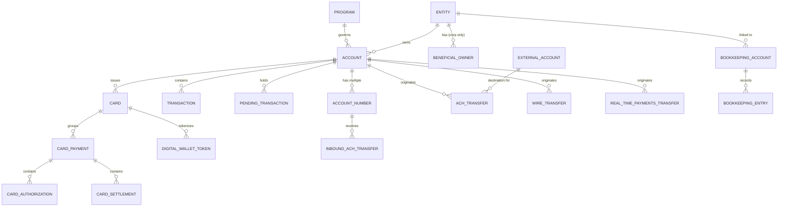

### Core Entities

| Entity | ID Format | Key Attributes | Relationships |
|--------|-----------|----------------|---------------|
| **Entity** | `entity_*` | structure (corporation/natural_person/joint/trust/government_authority), status, details_confirmed_at | Owns Accounts, has Beneficial Owners (if corp) |
| **Account** | `account_*` | bank, status, currency, interest_rate, program_id | Belongs to Entity, governed by Program |
| **Account Number** | `account_number_*` | account_number, routing_number, status, inbound_ach.debit_status | Belongs to Account |
| **Transaction** | `transaction_*` | amount, currency, source (polymorphic), route_id/route_type | Belongs to Account |
| **Card** | `card_*` | status, last4, expiration_month/year, billing_address | Belongs to Account, optionally to Entity |
| **Card Payment** | `card_payment_*` | state (amounts), elements[] | Groups card interactions |
| **ACH Transfer** | `ach_transfer_*` | status, amount, standard_entry_class_code, submission, return | Originates from Account |
| **Program** | `program_*` | bank, interest_rate, name | Governs multiple Accounts |

### Key Design Decisions

**Unified Entity Model:** Increase uses a single `Entity` resource with a `structure` discriminator rather than separate Customer types. This supports: natural_person, corporation, joint, trust, government_authority. ✅ *Documented explicitly*

**Joint Account Support:** Joint accounts are modeled at the Entity level via `structure: joint` with an `individuals[]` array containing exactly two persons. The joint entity then owns accounts. This differs from some providers that model joint ownership at the account level. ✅ *Documented explicitly*

**Sub-Account / Virtual Account Model:** Increase implements virtual account numbers through the `Account Number` resource. Each Account can have multiple Account Numbers with distinct routing numbers. This enables per-vendor account numbers for reconciliation. ✅ *Documented explicitly*

**Business to Beneficial Owner Relationship:** Corporation entities have a `beneficial_owners[]` array embedded within the entity. Each beneficial owner has a `beneficial_owner_id`, `company_title`, `prongs[]` (control/ownership), and `individual` details. ✅ *Documented explicitly*

**Transaction Linking:** Transactions link to their source via a polymorphic `source` object with a `category` discriminator. Related transactions (original → return) are linked via IDs embedded in the source object (e.g., `transfer_id`, `transaction_id`). Returns create new transactions with source category referencing the original. 🔶 *Inferred from structure*

**Informational Entity:** Accounts support an `informational_entity_id` for associating activity with an entity that doesn't own the account—useful for FBO patterns. ✅ *Documented explicitly*

---

## 2. State Machines

### Account States

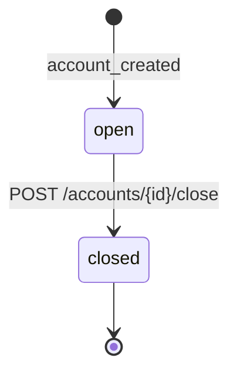

| State | Description | Terminal? |
|-------|-------------|-----------|
| `open` | Active account, can transact | No |
| `closed` | Account closed, `closed_at` populated | Yes |

**Notable:** Increase has an extremely simple account state model with only two states. There is no "frozen" or "suspended" state at the Account level—controls are likely handled at the Entity or Account Number level. ✅ *Documented explicitly*

### Account Number States

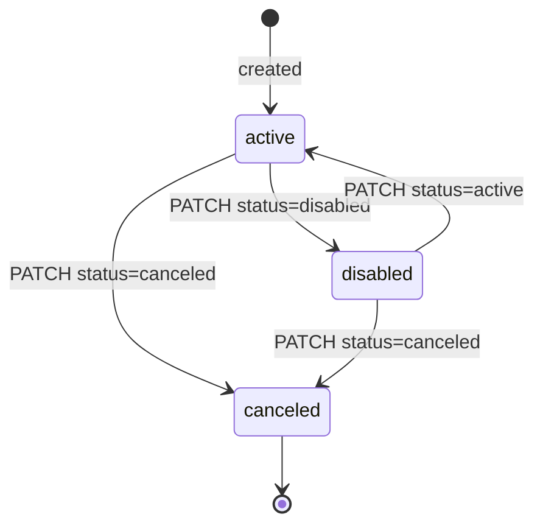

| State | Description | Terminal? |
|-------|-------------|-----------|
| `active` | Can receive payments | No |
| `disabled` | Temporarily blocked | No (recoverable) |
| `canceled` | Permanently deactivated | Yes |

**Notable:** Account Numbers also have `inbound_ach.debit_status` (allowed/blocked) as a sub-control. ✅ *Documented explicitly*

### ACH Transfer States

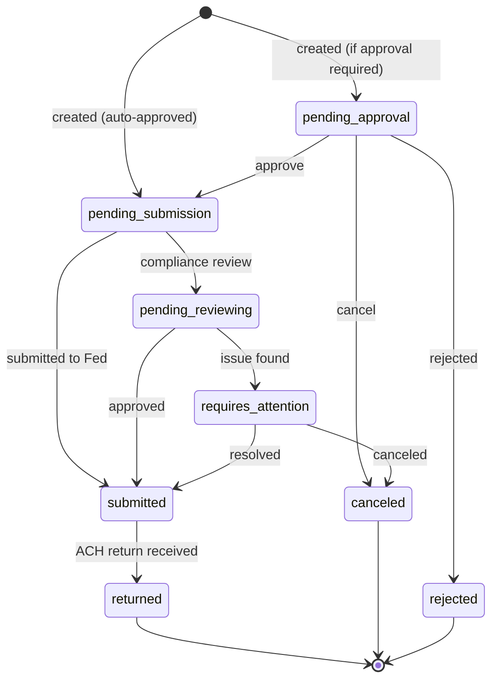

| State | Description | Terminal? | Triggers |
|-------|-------------|-----------|----------|
| `pending_approval` | Awaiting approval | No | Transfer created with approval workflow |
| `pending_submission` | Queued for Fed submission | No | Approved or auto-approved |
| `pending_reviewing` | Under compliance review | No | Compliance trigger |
| `requires_attention` | Manual intervention needed | No | Compliance issue |
| `submitted` | Sent to FedACH | No | Fed batch submission (~30 min batches) |
| `returned` | ACH return received | Yes | R-code from receiving bank |
| `canceled` | Canceled before submission | Yes | User/system cancel |
| `rejected` | Rejected by compliance | Yes | Compliance rejection |

**ACH Submission Details:** Increase batches and submits to FedACH roughly every 30 minutes. The `submission` object contains `effective_date`, `expected_funds_settlement_at`, `expected_settlement_schedule`, and `trace_number`. ✅ *Documented explicitly*

**ACH Returns:** Returns populate a `return` object with `raw_return_reason_code` (R01-R85), `return_reason_code` (enum), `trace_number`, and `transaction_id` for the reversal transaction. ✅ *Documented explicitly*

### Wire Transfer States

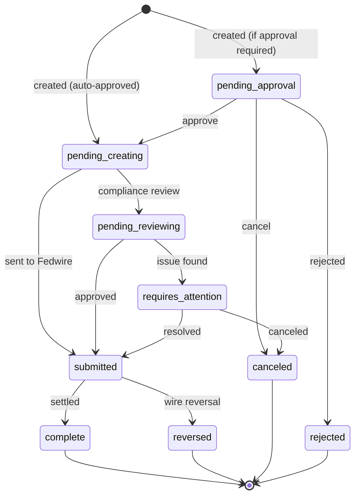

| State | Description | Terminal? |
|-------|-------------|-----------|
| `pending_approval` | Awaiting approval | No |
| `pending_creating` | Being created | No |
| `pending_reviewing` | Compliance review | No |
| `requires_attention` | Manual intervention | No |
| `submitted` | Sent to Fedwire | No |
| `complete` | Successfully settled | Yes |
| `reversed` | Wire reversed | Yes |
| `canceled` | Canceled | Yes |
| `rejected` | Rejected | Yes |

### Card States

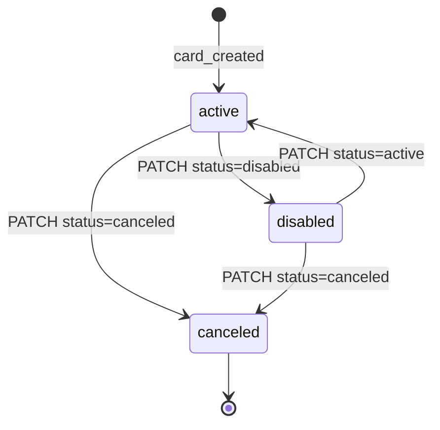

| State | Description | Terminal? |
|-------|-------------|-----------|
| `active` | Can make payments | No |
| `disabled` | Temporarily blocked | No (recoverable) |
| `canceled` | Permanently deactivated | Yes |

**Physical Card:** Has same states (`active`, `disabled`, `canceled`) plus shipment tracking. ✅ *Documented explicitly*

**Digital Wallet Token States:** `active`, `inactive`, `suspended`, `deactivated` ✅ *Documented explicitly*

### Entity States

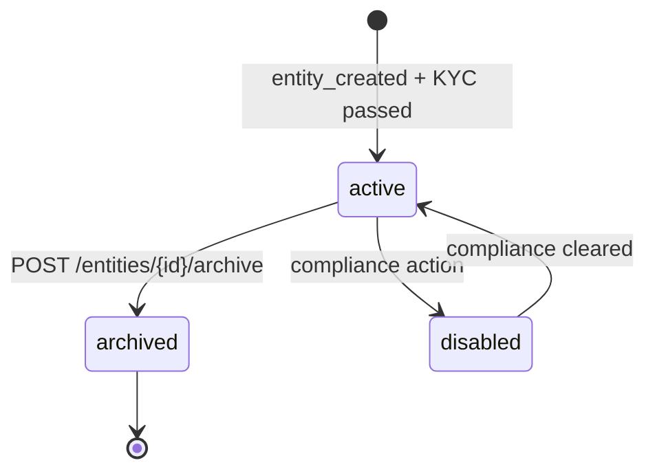

| State | Description | Terminal? |
|-------|-------------|-----------|
| `active` | Can transact | No |
| `disabled` | Compliance hold | No (recoverable) |
| `archived` | Permanently archived | Yes |

**Notable:** Entity has `details_confirmed_at` timestamp for when KYC was confirmed. The `/entities/{id}/confirm` endpoint confirms entity details are correct. ✅ *Documented explicitly*

---

## 3. Critical Flows

### ACH Origination Flow

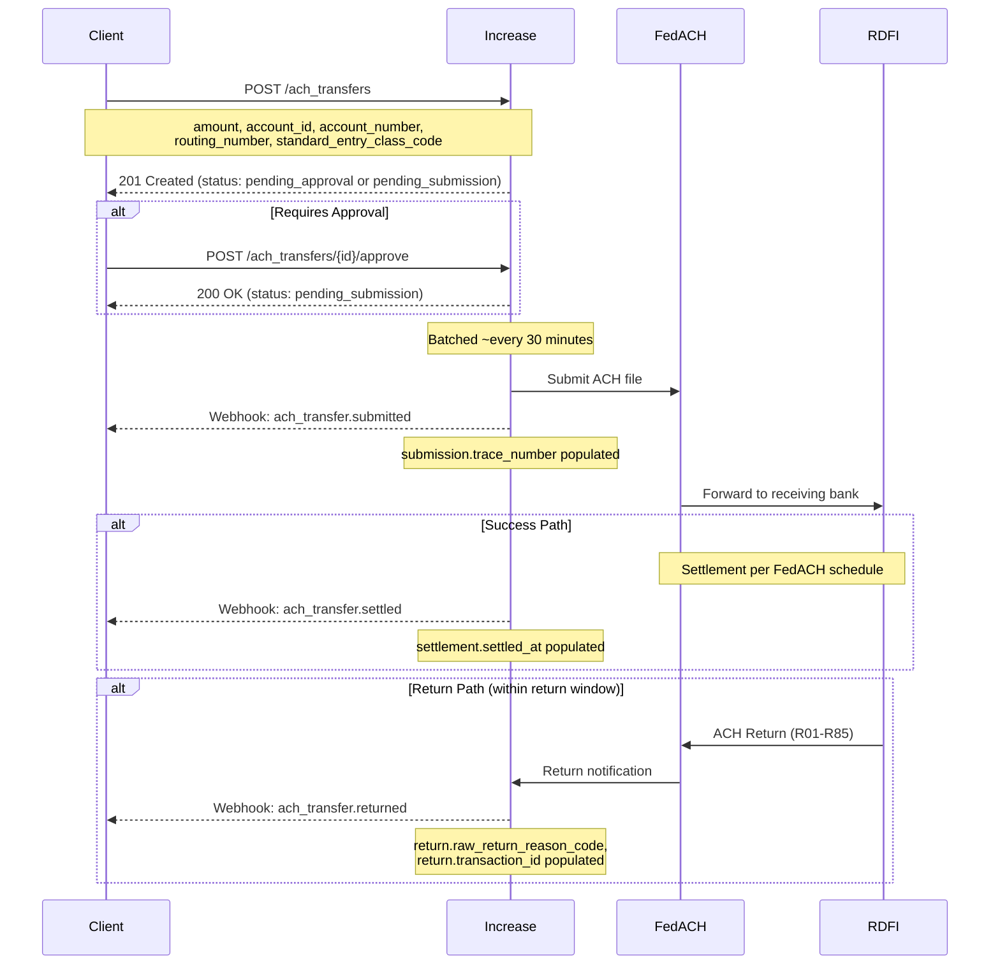

**Timing:**
- Sync response: Immediate (201 Created)
- Batch submission: ~30 minutes
- Settlement: Per [FedACH schedule](https://www.frbservices.org/resources/resource-centers/same-day-ach/fedach-processing-schedule.html)
- Same-day ACH: Supported via `preferred_effective_date`
- Return window: Up to 60 days for some return codes

**Standard Entry Class Codes Supported:** ✅ *Documented explicitly*
- CCD (Corporate Credit/Debit)
- PPD (Prearranged Payment/Deposit)
- WEB (Internet-initiated)
- And others

**Inbound ACH Handling:** Account Numbers can be configured with `inbound_ach.debit_status` (allowed/blocked) and `inbound_checks.status`. Inbound transfers hit the Inbound ACH Transfer resource with states: `pending` → `accepted`/`declined`/`returned`. ✅ *Documented explicitly*

### Account Opening Flow

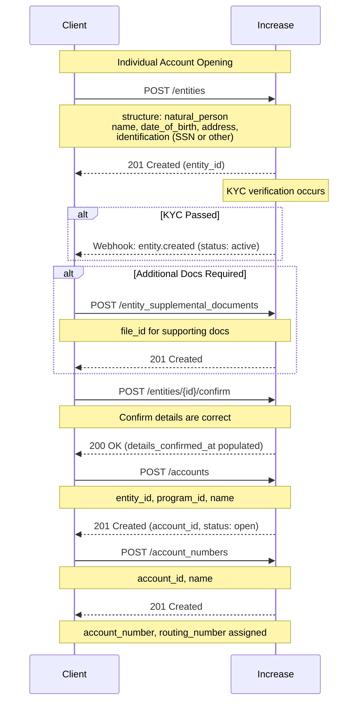

**Business Account Differences:**
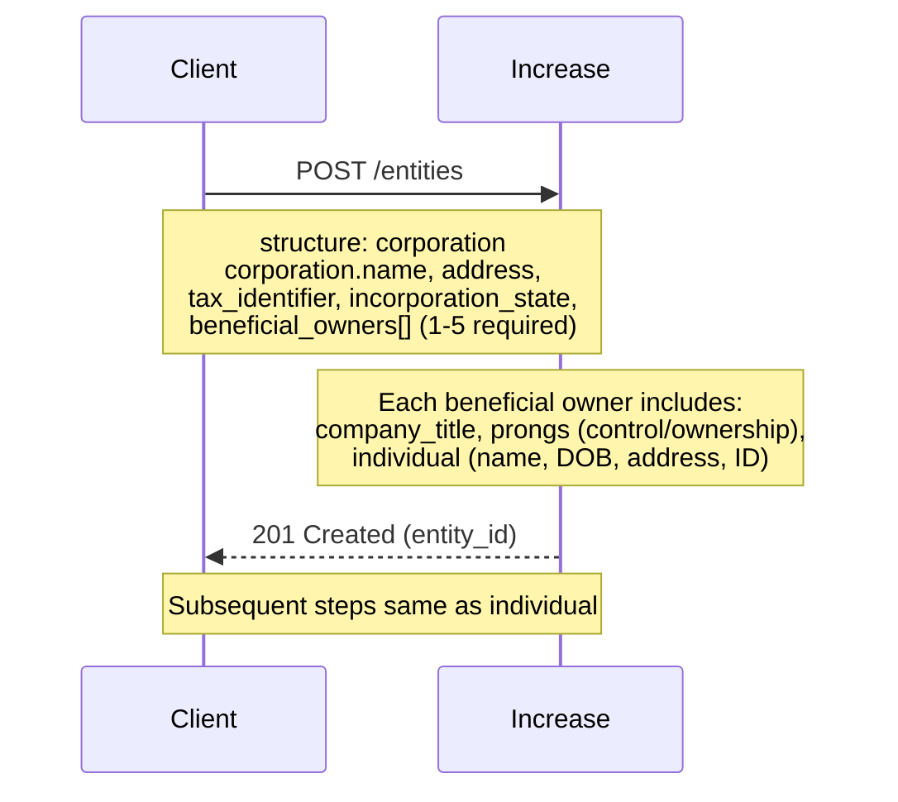

**Timing:**
- Entity creation: Sync (immediate 201)
- KYC verification: Async (webhook when complete)
- Account creation: Sync (immediate 201)
- Account number assignment: Sync (immediate)

**Beneficial Owner Management:** Can add/remove beneficial owners post-creation via `/entities/{id}/create_beneficial_owner` and `/entities/{id}/archive_beneficial_owner`. ✅ *Documented explicitly*

### Card Authorization Flow

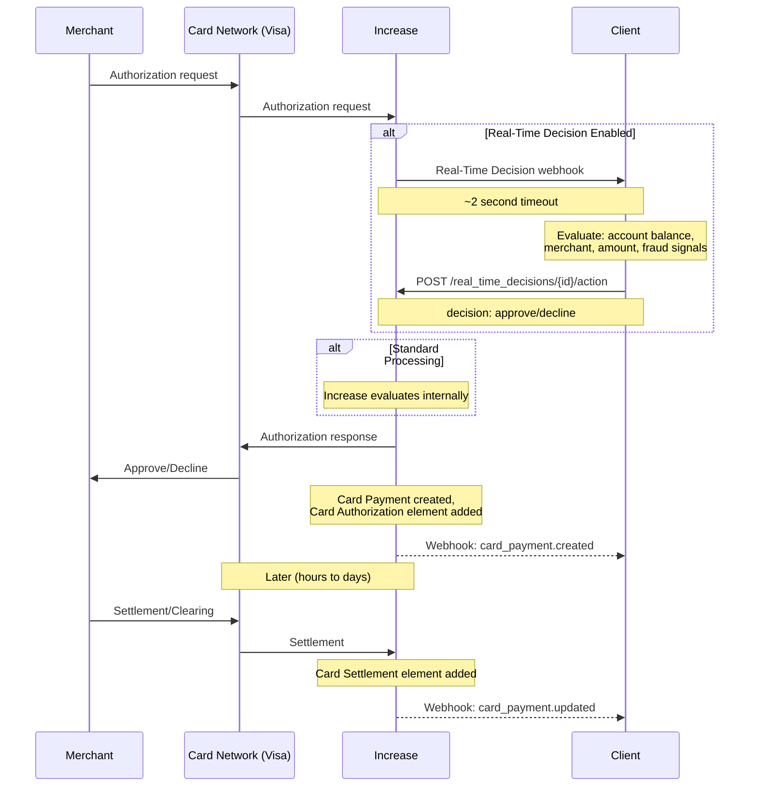

**Real-Time Decision Details:**
- Timeout: ~2 seconds for response
- Decision options: `approve`, `decline`
- Decline reasons available for granular control
- Categories: `card_authorization_requested`, `digital_wallet_token_requested`, `digital_wallet_authentication_requested`

**Card Payment Elements Lifecycle:**
1. `card_authorization` - Initial hold
2. `card_increment` - Additional amount (e.g., tip)
3. `card_reversal` - Partial/full reversal before settlement
4. `card_authorization_expiration` - Auth expires without settlement
5. `card_settlement` - Final clearing
6. `card_refund` - Post-settlement refund
7. `card_fuel_confirmation` - Gas pump amount confirmation

**Verification Data Available:**
- CVV result (`match`, `not_match`, `not_checked`)
- AVS result (multiple granular results)
- Network risk score
- Merchant details (MCC, location, terminal)

✅ *Documented explicitly*

---

## 4. Additional Architectural Notes

### Bookkeeping / Ledger System

Increase exposes an explicit **Bookkeeping API** for compliance-grade ledger annotation:

- **Bookkeeping Account:** T-accounts that can be linked to Accounts and/or Entities. Has `compliance_category` (commingled_cash, customer_balance).
- **Bookkeeping Entry Set:** Transactional batch of entries that must balance. Can link to a Transaction.
- **Bookkeeping Entry:** Individual debit/credit with amount and account.

This is valuable for sponsor banking where regulatory requirements demand explicit FBO ledger tracking. ✅ *Documented explicitly*

### Program Model

Programs define compliance and commercial terms:
- Bank relationship (core_bank, first_internet_bank, grasshopper_bank)
- Interest rate
- Default digital card profile
- Billing account

Multiple programs enable multi-tenant sponsor banking with different terms per customer segment. ✅ *Documented explicitly*

### IntraFi Integration

Built-in support for IntraFi sweep network for extended FDIC insurance:
- `IntraFi Account Enrollment` - enrollment status
- `IntraFi Balance` - swept balances across network banks
- `IntraFi Exclusion` - exclude specific institutions

✅ *Documented explicitly*

### External Account Verification

External Accounts (counterparties) support:
- ACH prenotification (`ach_prenotification` with states: `pending_submitting`, `submitted`, `returned`, `requires_attention`)
- Status tracking (`active`, `archived`)

### Real-Time Payments

Full RTP support with similar state machine to ACH:
`pending_approval` → `pending_submission` → `submitted` → `complete`

Also supports inbound RTP via `Inbound Real-Time Payments Transfer`.

---

## 5. Confidence Summary

| Area | Confidence | Notes |
|------|------------|-------|
| Entity model (structures, beneficial owners) | ✅ Documented | Clear polymorphic structure |
| Account/Account Number relationship | ✅ Documented | Well-defined virtualization |
| Transaction linking | 🔶 Inferred | Via source object references |
| ACH flow & timing | ✅ Documented | Explicit submission/return objects |
| Card authorization flow | ✅ Documented | Real-Time Decisions well-specified |
| Account states | ✅ Documented | Minimal (open/closed) |
| Transfer states | ✅ Documented | Comprehensive state enums |
| Bookkeeping/ledger | ✅ Documented | Explicit T-account API |
| Joint account model | ✅ Documented | Via Entity.joint structure |
| FBO patterns | 🔶 Inferred | Via informational_entity_id |
| ACH cutoff times | ❓ Unclear | References FedACH schedule, no provider-specific cutoffs documented |

---

## 6. Notable / Unusual Design Decisions

1. **Extremely Simple Account States:** Only `open` and `closed`. No frozen/suspended state—suggests controls happen at other levels (Entity, Account Number, Card).

2. **Account Number as First-Class Resource:** Unlike some providers where account numbers are just attributes, Increase treats them as independent resources with their own lifecycle and controls. This is excellent for multi-tenant reconciliation.

3. **Explicit Bookkeeping API:** Unusual to see double-entry ledger primitives exposed directly. Likely designed for sponsor bank compliance requirements.

4. **Card Payment Grouping:** The `Card Payment` resource that groups related card interactions (auth → settlement → refund) is a clean abstraction not all providers offer.

5. **Polymorphic Transaction Source:** Single Transaction resource with ~30+ source categories. Enables uniform transaction handling while preserving source-specific details.

6. **Real-Time Decisions as Webhook-Driven:** The 2-second synchronous webhook pattern for card authorization decisions is well-suited for sponsor banks needing custom approval logic.

---

## 7. Questions for Verification

1. **ACH Same-Day Cutoffs:** What are Increase's specific same-day ACH cutoff times? Documentation references FedACH schedule but doesn't specify provider processing windows.

2. **Account Closure Process:** Can accounts with pending transactions or non-zero balances be closed? What's the flow?

3. **Entity Disabled State:** What triggers an entity moving to `disabled`? Is this always a compliance action?

4. **Multi-Currency:** The schema shows CAD, CHF, EUR, GBP, JPY, USD. What's the actual multi-currency support beyond USD?

5. **Inbound Funds Hold:** The `inbound_funds_hold` resource suggests automatic holds for return windows. What are the exact hold periods?