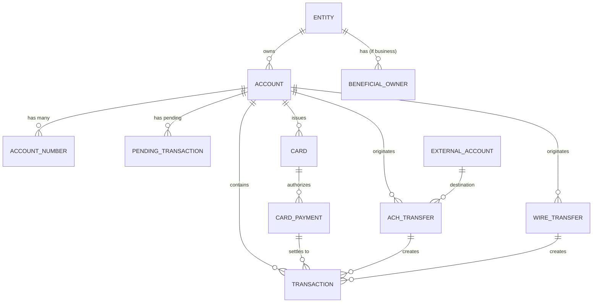
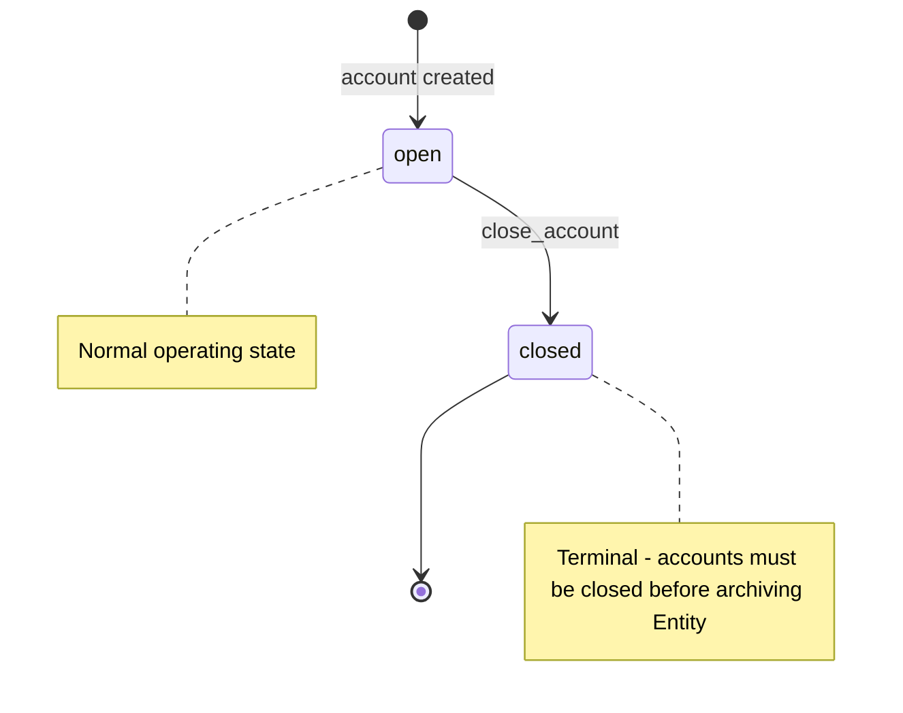
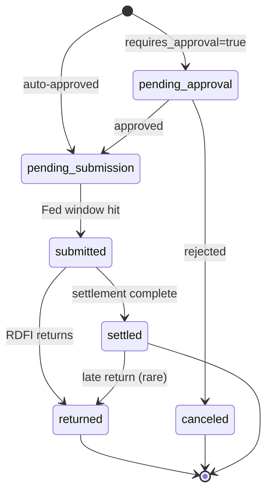
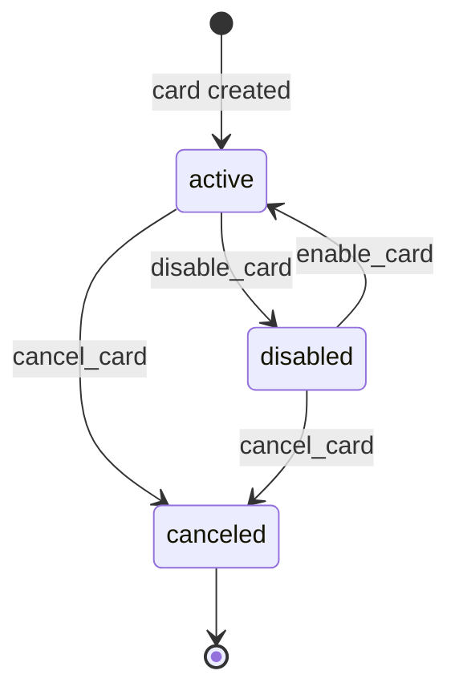
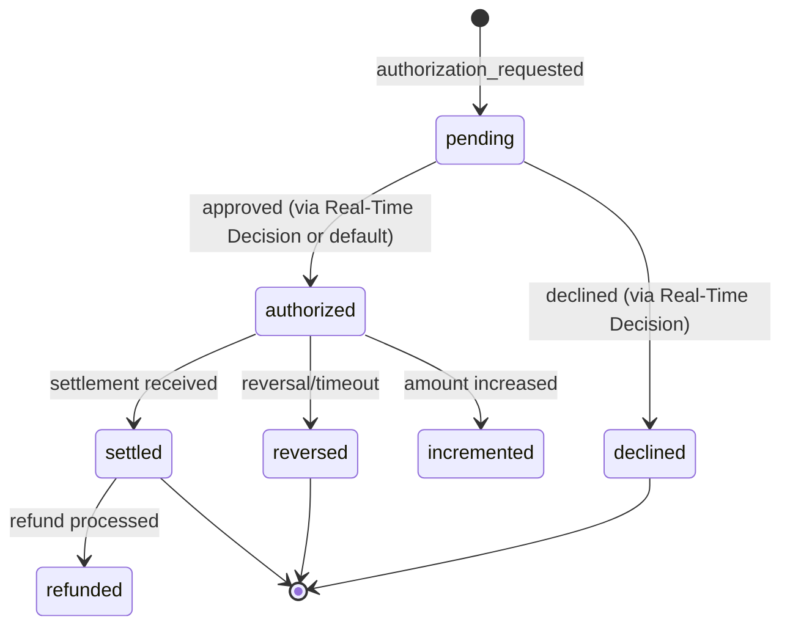
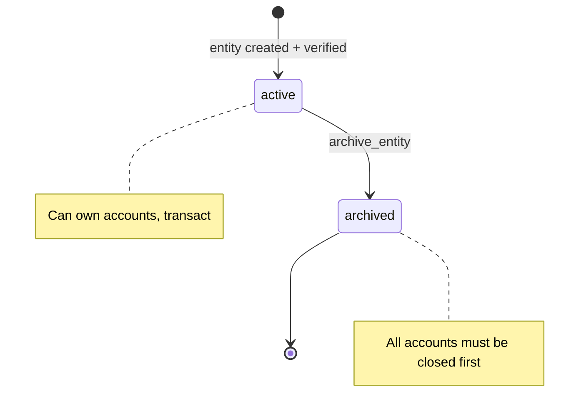
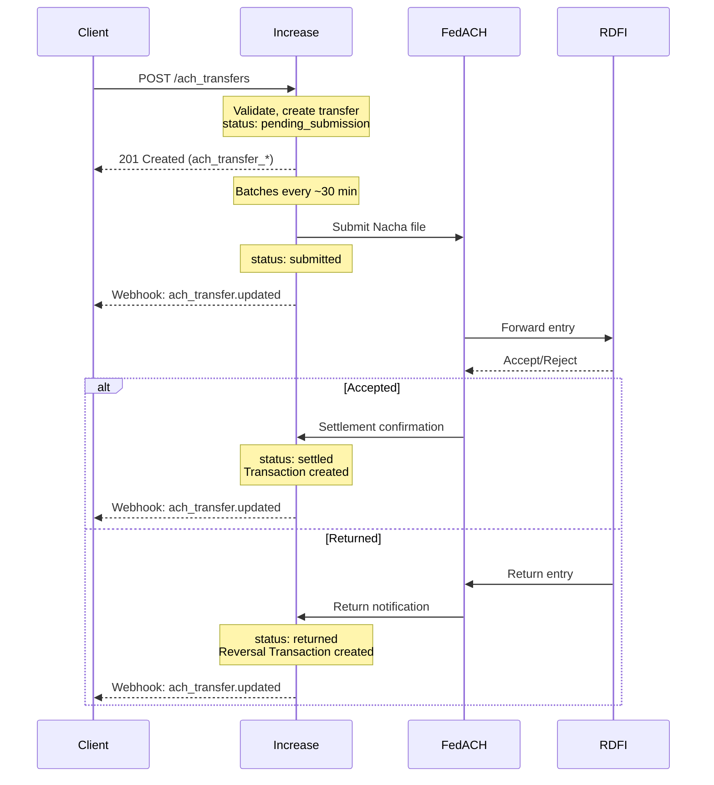
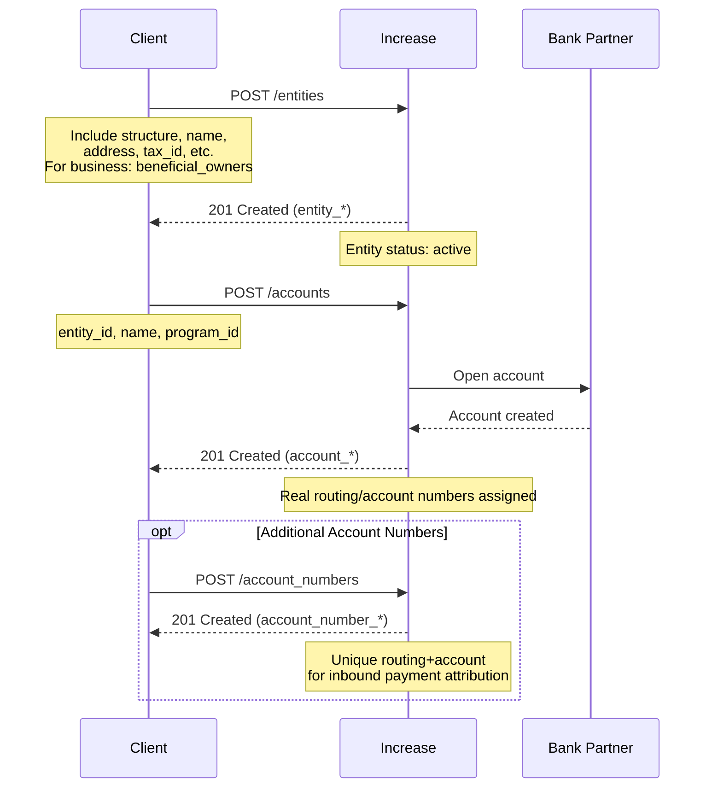
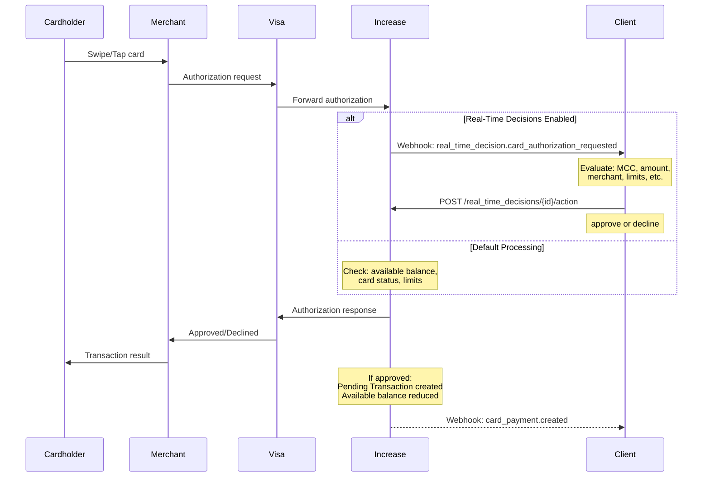

# Increase API Analysis for Cassandra Core Banking

**Analysis Date:** December 11, 2025  
**Provider:** Increase  
**Documentation Source:** https://increase.com/documentation/

---

## Executive Summary

Increase operates as a **parallel core** for sponsor bank partners, providing direct API access to Federal Reserve rails (FedACH, Fedwire, FedNow) and Visa. Their philosophy is "no abstractions" — they expose the full complexity of underlying financial networks rather than simplifying away details. This makes them uniquely suited for sponsor banking use cases where deep network-level control is required.

**Key Differentiators:**
- Direct Federal Reserve connections (not through legacy cores)
- Real Accounts with real routing/account numbers (not virtual abstractions)
- Real-time card authorization decisioning via webhook
- Unlimited Account Numbers per Account
- Same-day ACH at every Fed window

---

## 1. Entity Relationships

### ER Diagram

### Core Entities

| Entity | ID Format | Key Attributes | Relationships |
|--------|-----------|----------------|---------------|
| **Entity** | `entity_*` | structure (corporation, natural_person, trust, government_authority, partnership), status, risk_rating, third_party_verification_id | Owns Accounts, has Beneficial Owners |
| **Account** | `account_*` | name, currency (USD), status, entity_id, balance, informational_entity_id | Belongs to Entity, has Account Numbers, Transactions, Cards |
| **Account Number** | `account_number_*` | account_number, routing_number, name, status | Belongs to Account (many-to-one) |
| **Transaction** | `transaction_*` | amount, date, description, source (polymorphic), account_id | Immutable ledger entry |
| **Pending Transaction** | `pending_transaction_*` | amount, status, source | Mutable, affects available balance |
| **Card** | `card_*` | status, type (virtual/physical), description, account_id | Belongs to Account, has Card Payments |
| **ACH Transfer** | `ach_transfer_*` | amount, status, routing_number, account_number, direction, sec_code | Creates Transactions |
| **Wire Transfer** | `wire_transfer_*` | amount, status, routing_number, account_number, message_to_recipient | Creates Transactions |
| **External Account** | `external_account_*` | routing_number, account_number, description, funding | Stores counterparty details |

### Key Design Decisions

**Entity Structure (Unified Model)**
- ✅ Single Entity object handles all legal entity types
- Supported structures: `corporation`, `natural_person`, `trust`, `government_authority`, `partnership`
- Corporations have nested beneficial owner data (25%+ ownership per FinCEN rules)
- Third-party verification ID field for KYC provider integration

**Account Model**
- Accounts are **real bank accounts** with their own routing/account numbers
- Each Account can have **unlimited Account Numbers** (unique routing+account pairs)
- `informational_entity_id` allows associating accounts with entities for display without formal ownership
- Status field controls account lifecycle

**Transaction Linking**
- Transfers are **one-to-many** with Transactions
- Original ACH Transfer → Return Transaction linked via transfer reference
- Pending Transactions are separate from settled Transactions
- Declined Transactions stored separately for audit trail

### Sponsor Banking Questions Answered

| Question | Increase Approach |
|----------|-------------------|
| **Joint accounts?** | 🔶 Not explicitly documented. Entity owns Account — likely need multiple Entities with program-level logic |
| **Sub-accounts/virtual accounts?** | ✅ Account Numbers serve this purpose — unlimited per Account, each with unique routing/account number |
| **Business → Beneficial Owner relationship?** | ✅ Nested in Entity creation for corporations (25%+ owners) |
| **Transaction linking (original → reversal)?** | ✅ Returns correlated automatically via trace identifiers |

---

## 2. State Machines

### Account States

**Account Status Values:**
- `open` - Active, can transact
- `closed` - Terminal state, no further activity

**Confidence:** 🔶 Inferred from API structure. Documentation mentions accounts must be closed before Entity can be archived. Limited explicit state documentation found.

---

### ACH Transfer States

**ACH Transfer Status Values:**
- `pending_approval` - Awaiting manual approval
- `pending_submission` - Queued for next Fed window
- `submitted` - Sent to FedACH
- `settled` - Funds transferred
- `returned` - Returned by receiving bank
- `canceled` - Canceled before submission

**Transition Triggers:**
| From | To | Trigger |
|------|-----|---------|
| pending_approval | pending_submission | Dashboard/API approval |
| pending_approval | canceled | Rejection |
| pending_submission | submitted | Fed window processing (~30 min batches) |
| submitted | settled | RDFI acceptance |
| submitted | returned | RDFI return (insufficient funds, invalid account, etc.) |

**Terminal States:** `settled`, `returned`, `canceled`

**Confidence:** ✅ Documented explicitly. Returns automatically correlated via trace identifiers.

---

### Card States

**Card Status Values:**
- `active` - Can authorize transactions
- `disabled` - Temporarily blocked, can be re-enabled
- `canceled` - Terminal, cannot be reactivated

**Confidence:** 🔶 Inferred from API patterns and industry standards. Explicit status documentation not found.

---

### Card Payment States (Authorization Lifecycle)

**Key Points:**
- Real-Time Decisions API allows programmatic approve/decline
- Authorizations create Pending Transactions (affect available balance)
- Settlements create Transactions (affect current balance)
- Authorization → Settlement is most common flow
- Increments possible for pre-auth scenarios

**Confidence:** ✅ Well-documented in programmatic card processing guide.

---

### Entity/KYC States

**Entity Status Values:**
- `active` - Can own accounts
- `archived` - Terminal, accounts closed

**KYC Re-confirmation:** Documentation mentions periodic re-confirmation may be required depending on program.

**Confidence:** 🔶 Inferred. Full KYC workflow details likely program-specific.

---

## 3. Critical Flows

### ACH Origination Flow

**Timing:**
| Phase | SLA |
|-------|-----|
| API Response | Synchronous (< 1 sec) |
| Batch Submission | ~30 minutes to Fed window |
| Same-Day Settlement | Hours (hits every Fed window) |
| Standard Settlement | 1-2 business days |
| Return Window | Up to 2 days (60 days for unauthorized) |

**Key Features:**
- Same-day ACH by default
- Submits at every Fed window
- Returns auto-correlated via trace ID
- Settlement tracking from Fed directly
- SEC codes supported: PPD, CCD, WEB, etc.

**Confidence:** ✅ Well-documented

---

### Account Opening Flow

**Individual vs Business:**
| Type | Requirements |
|------|--------------|
| Individual | name, date_of_birth, address, identification (SSN/passport) |
| Corporation | name, address, tax_id, incorporation_state, beneficial_owners (25%+), industry_code |
| Trust | name, address, trustees, beneficiaries, formation details |

**Timing:**
- Entity creation: Synchronous
- Account creation: Synchronous (instant)
- Account Numbers: Unlimited, instant creation

**Confidence:** ✅ Documented explicitly

---

### Card Authorization Flow

**Real-Time Decision SLA:** Must respond within timeout (typically 2-3 seconds)

**Decline Reasons Available:**
- `webhook_declined` - Client declined via Real-Time Decision
- `insufficient_funds`
- `card_not_active`
- Various network-level decline codes

**Data Available in Authorization:**
- `amount`
- `merchant_category_code`
- `merchant_descriptor`
- `merchant_city`
- `merchant_country`
- `merchant_acceptor_id`

**Confidence:** ✅ Thoroughly documented with code examples

---

## 4. Additional Observations

### Ledger Philosophy
- **No explicit GL exposure** — Transactions are the ledger
- Transactions are immutable line items
- Pending Transactions are mutable (can be updated/expired)
- `current_balance` = sum of settled Transactions
- `available_balance` = current_balance - pending debits

### Multi-tenant / Program Separation
- Programs are first-class concept at onboarding
- Entity → Account hierarchy provides program isolation
- Account Numbers enable payment attribution per customer

### Webhook Events
Key event categories:
- `entity.created`, `entity.updated`
- `account.created`, `account.updated`
- `ach_transfer.created`, `ach_transfer.updated`
- `wire_transfer.created`, `wire_transfer.updated`
- `card.created`, `card.updated`
- `card_payment.created`, `card_payment.updated`
- `real_time_decision.card_authorization_requested`
- `transaction.created`

---

## 5. Confidence Summary

| Section | Confidence | Notes |
|---------|------------|-------|
| Entity model | ✅ Explicit | Well-documented entity types and structures |
| Account model | ✅ Explicit | Clear documentation on Account vs Account Number |
| Account states | 🔶 Inferred | Limited explicit state machine documentation |
| ACH states | ✅ Explicit | Well-documented lifecycle |
| Card states | 🔶 Inferred | Standard patterns, limited explicit docs |
| Card auth flow | ✅ Explicit | Detailed guide with code examples |
| Transaction linking | ✅ Explicit | Returns auto-correlated |
| Beneficial owners | ✅ Explicit | FinCEN-compliant structure |
| Joint accounts | ❓ Unclear | Not explicitly addressed |
| FBO patterns | 🔶 Inferred | Account Numbers suggest FBO-friendly design |

---

## 6. Questions for Verification

1. **Joint Account Support:** Does Increase support multiple Entities owning a single Account, or is joint account logic program-level?
2. **Account States:** Are there intermediate states (frozen, restricted) not documented publicly?
3. **Entity Verification:** What KYC vendors integrate natively vs requiring `third_party_verification_id`?
4. **Card States:** Is there a `pending` state for physical cards awaiting activation?
5. **Return Handling:** Can clients programmatically dispute or challenge ACH returns?

---

## 7. Comparison Points for Cross-Provider Analysis

| Decision Point | Increase |
|----------------|----------|
| Customer model | Unified Entity with structure field (corporation, natural_person, trust, etc.) |
| Joint account support | ❓ Unclear |
| Sub-account model | Account Numbers (unlimited per Account) |
| Transaction linking | Auto-correlated via trace ID |
| Account states | open, closed |
| ACH same-day cutoff | Every Fed window (~30 min batches) |
| Ledger exposure | Implicit (Transactions are ledger entries) |
| Real-time card auth | Yes, via Real-Time Decisions webhook |
| Wire support | Yes, Fedwire + FedNow + RTP |
| Physical cards | Yes, custom fulfillment |