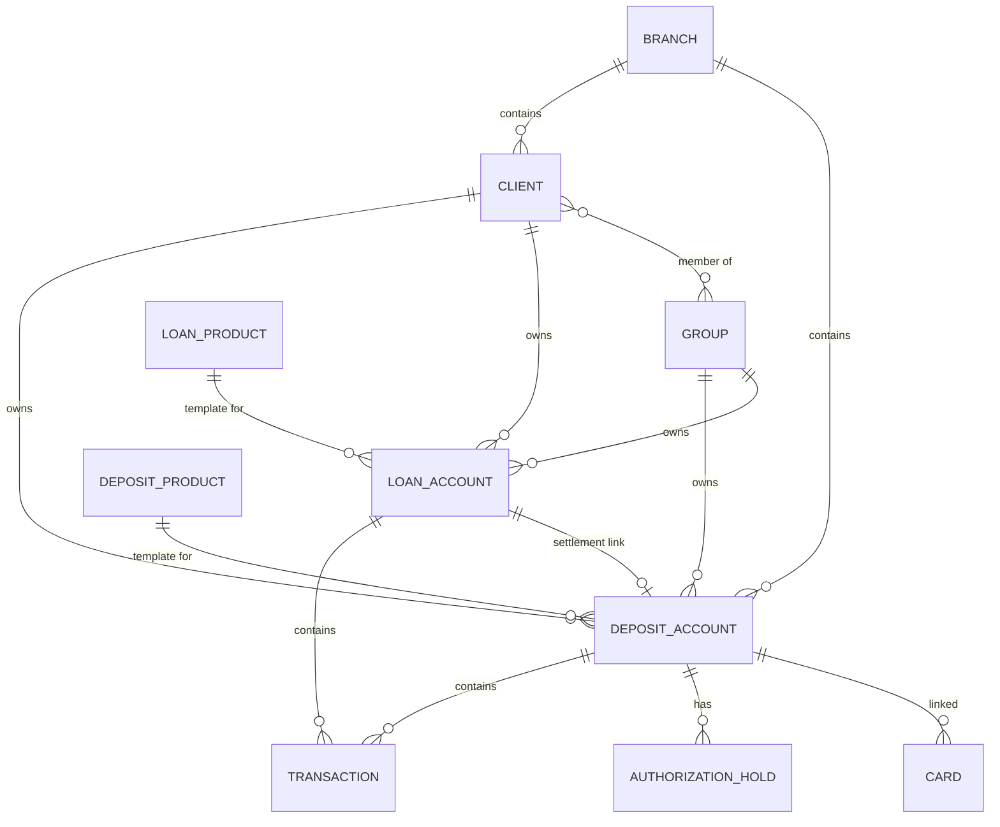
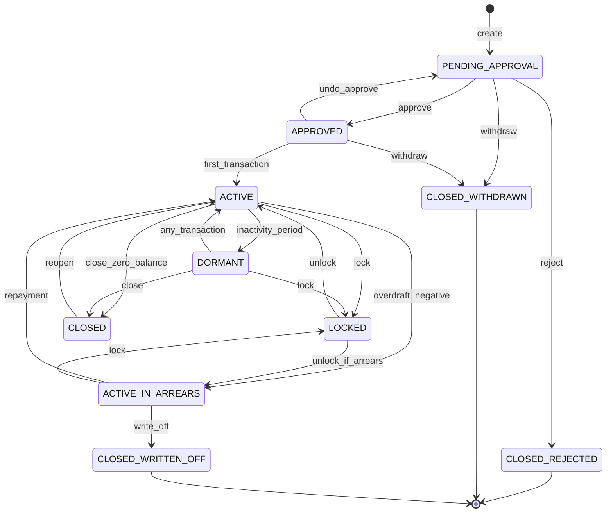
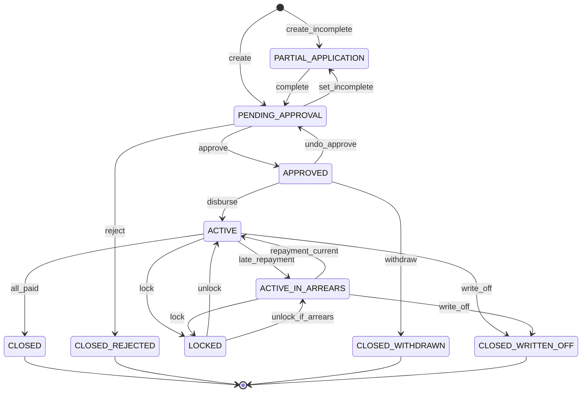
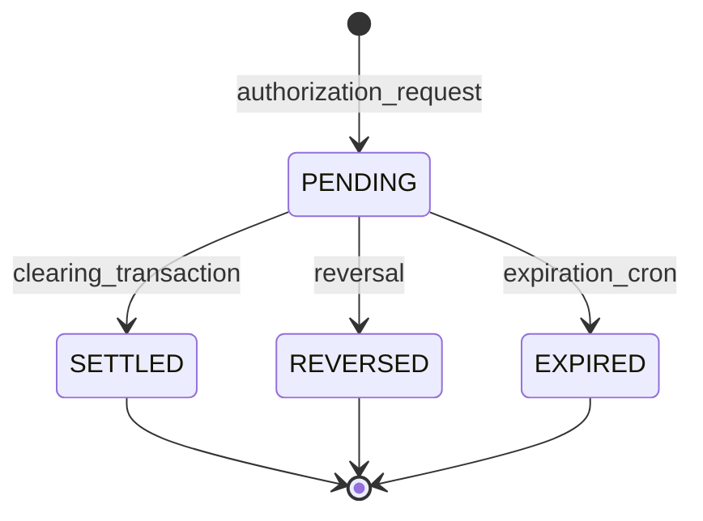
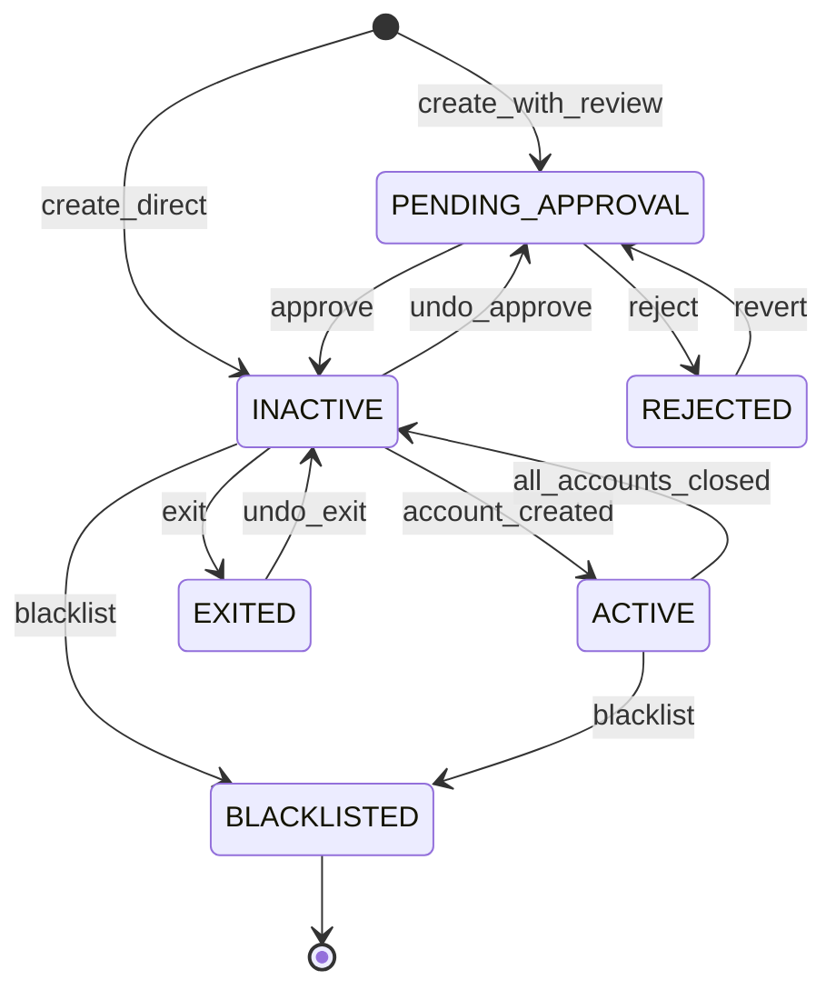
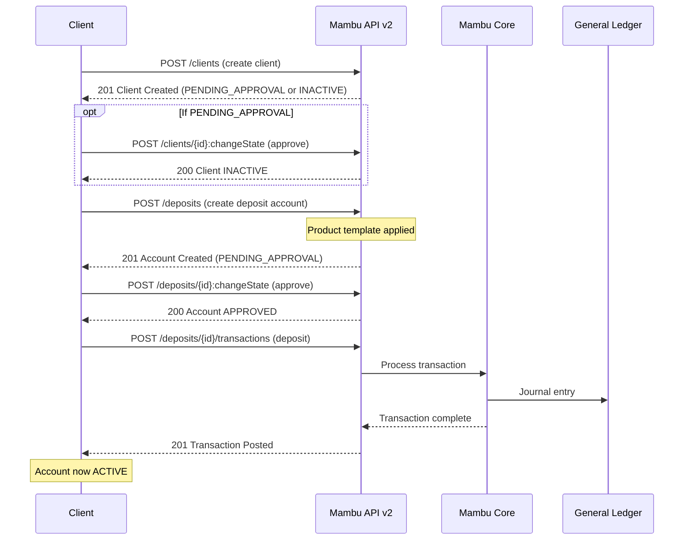
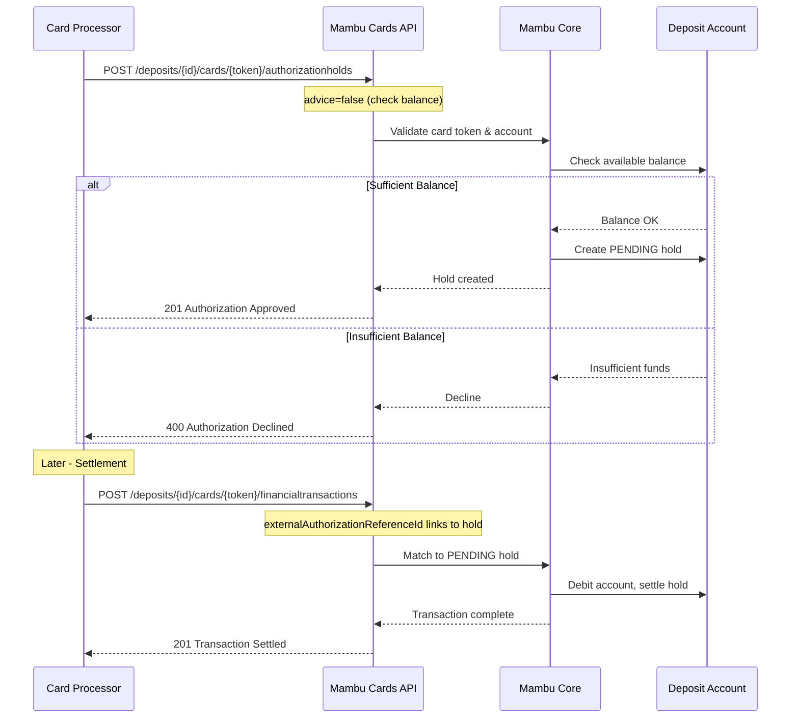

# Mambu API Architectural Analysis for Cassandra

## Executive Summary

Mambu is a **cloud-native core banking engine** built on a composable architecture. Unlike BaaS providers that focus primarily on US sponsor bank patterns (ACH, Fed integration), Mambu is a **global lending and deposit platform** primarily serving microfinance institutions, neo-banks, and embedded finance providers. It provides robust loan servicing, deposit management, and a general ledger—but does **not** natively handle US payment rails (ACH, wire, RTP).

**Key Insight for Cassandra**: Mambu's architecture reveals a fundamentally different design philosophy than US-focused BaaS providers like Unit, Column, or Increase. It's a configurable **ledger-first core** with flexible product templates, rather than a payment-rail-integrated platform. Understanding these patterns is valuable for designing flexible account and transaction state machines.

---

## 1. Entity Relationships

### Core Entities

| Entity | ID Format | Key Attributes | Relationships |
|--------|-----------|----------------|---------------|
| **Client** | `encodedKey` (UUID) | firstName, lastName, state, clientType | Owns → Accounts, Groups |
| **Group** | `encodedKey` (UUID) | groupName, state | Contains → Clients, Owns → Accounts |
| **Deposit Account** | `encodedKey` (UUID) | accountState, balance, productKey | Belongs to → Client/Group, Has → Transactions |
| **Loan Account** | `encodedKey` (UUID) | accountState, balance, productKey | Belongs to → Client/Group, Has → Transactions, Links → Settlement Account |
| **Transaction** | `encodedKey` (UUID) | type, amount, valueDate, entryDate | Belongs to → Account |
| **Product** | `encodedKey` (UUID) | name, type, interestSettings | Template for → Accounts |
| **Branch** | `encodedKey` (UUID) | name, address | Contains → Clients, Accounts |

### ER Diagram

### Sponsor Banking-Specific Questions

| Question | Mambu Answer | Confidence |
|----------|--------------|------------|
| **Joint accounts?** | Yes - via "Group" entity. Groups can own accounts and contain multiple Clients. | ✅ Documented |
| **Sub-accounts/virtual accounts?** | Not native. Mambu uses separate accounts with settlement links. Custom fields can add metadata for virtual account patterns. | 🔶 Inferred |
| **Business → Beneficial owners?** | Groups can represent businesses; member Clients can be beneficial owners. Relationship modeling is flexible but not KYC-specialized. | 🔶 Inferred |
| **Transaction linking (original → reversal)?** | Reversals reference original via `externalAuthorizationReferenceId` for card transactions. General transactions use adjustment endpoints with original reference. | ✅ Documented |

### Key Design Decisions

- **Unified Client/Group model**: Individual clients and businesses (Groups) use separate entities but follow the same patterns for account ownership
- **Product-based configuration**: All accounts derive behavior from Products (templates). Products define interest rates, fees, states, and accounting rules
- **Settlement account linking**: Loan accounts can link to deposit accounts for automatic repayment transfers
- **`encodedKey` as primary identifier**: All entities use UUIDs (`encodedKey`), with optional user-friendly `id` fields

---

## 2. State Machines

### Deposit Account States

| Transition | Trigger | Terminal? | Recoverable? |
|------------|---------|-----------|--------------|
| PENDING_APPROVAL → APPROVED | `approve` API call | No | Yes (undo_approve) |
| APPROVED → ACTIVE | Any transaction posted | No | Yes (undo_activate if no txns) |
| ACTIVE → DORMANT | Inactivity period (product config) | No | Yes (auto on transaction) |
| ACTIVE → LOCKED | `lock` API call (compliance hold) | No | Yes (unlock) |
| ACTIVE → CLOSED | Close request + zero balance | No | Yes (reopen) |
| CLOSED_REJECTED | Reject during approval | **Yes** | No |
| CLOSED_WRITTEN_OFF | Write-off (bad debt) | **Yes** | No |

### Loan Account States

### Authorization Hold States (Card Transactions)

| State | Description | Terminal? |
|-------|-------------|-----------|
| PENDING | Active hold, decreases available balance | No |
| SETTLED | Released during clearing/settlement | Yes |
| REVERSED | Reversal instruction processed | Yes |
| EXPIRED | Automatic expiration via cron job | Yes |

### Client States

---

## 3. Critical Flows

### ⚠️ ACH Origination

**Mambu does NOT natively support ACH.** It is a global platform without built-in US payment rail integration.

For ACH-like functionality, Mambu customers:
1. Integrate with external payment processors (Stripe, Plaid, etc.)
2. Use Mambu Payment Gateway (MPG) for SEPA in Europe
3. Use Mambu Process Orchestrator (MPO) to build custom payment workflows

**For Cassandra**: This is a significant architectural difference from US BaaS providers. Mambu provides the ledger/core, but payment rails must be integrated separately.

### Deposit Account Opening Flow

**Timing**:
- All operations synchronous
- No external KYC vendor integration (Mambu is ledger-only)
- State transitions immediate upon API response

**Confidence**: ✅ Documented explicitly

### Card Authorization Flow

**Key Features**:
- **Dual Message Schema**: Authorization → Clearing (separate requests)
- **Single Message Schema**: ATM/PIN debits in one request
- **Authorization advice**: `advice=true` bypasses balance check (for processor-initiated)
- **Hold expiration**: Configurable per MCC, hourly cron job
- **Partial clearing**: Multiple settlements against one authorization

**Confidence**: ✅ Documented explicitly

---

## 4. Notable Architectural Patterns

### Product Template System
Mambu's accounts derive all behavior from Product definitions:
- Interest calculation rules
- Fee structures
- State machine configurations
- Accounting rules (GL mappings)
- Overdraft settings

**Implication for Cassandra**: Consider a product-based configuration layer for account behavior rather than hardcoded rules.

### Transaction Channel Abstraction
All transactions flow through "channels" that define:
- Permissions
- Fee application
- Accounting treatment
- Audit attributes

**Implication for Cassandra**: Transaction channels provide clean separation between payment rails and core ledger operations.

### Settlement Account Linking
Loan accounts link to deposit accounts for automatic repayment:
- One-to-many: deposit → multiple loans
- Many-to-one: loan → single settlement account
- Configurable transfer behavior (full only, partial, manual)

**Implication for Cassandra**: Built-in account linking patterns useful for automated sweep/funding flows.

### General Ledger Integration
Mambu exposes explicit GL journal entries:
- Every transaction creates GL entries
- Chart of accounts configurable per product
- Double-entry accounting enforced

**Implication for Cassandra**: Consider explicit ledger exposure vs. abstract balance model.

---

## 5. Confidence Summary

| Area | Confidence | Notes |
|------|------------|-------|
| Entity model | ✅ High | Well-documented in data dictionary and API reference |
| Account states | ✅ High | Explicit lifecycle documentation |
| Transaction types | ✅ High | API reference with examples |
| Card authorization | ✅ High | Detailed Cards API documentation |
| ACH/Payment rails | ❌ Not applicable | Mambu doesn't provide US payment rails |
| Multi-tenant/program separation | ❓ Unclear | Branch-based separation exists; program manager patterns not documented |
| FBO patterns | ❓ Unclear | Not explicitly documented; likely via product/branch configuration |

---

## 6. Key Takeaways for Cassandra

1. **Mambu is NOT a direct BaaS comparison**: It's a configurable core banking engine, not a US payment-rail-integrated BaaS

2. **Strong patterns to consider**:
   - Product template system for account behavior
   - Explicit state machines with undo capabilities
   - Transaction channel abstraction
   - Settlement account linking
   - Authorization hold lifecycle (PENDING → SETTLED/REVERSED/EXPIRED)

3. **Gaps relative to US sponsor banking**:
   - No native ACH, wire, or RTP support
   - No KYC vendor integration
   - No FBO account patterns documented
   - Limited sub-account/virtual account support

4. **Authentication approach**: API keys via API Consumers (OAuth-like abstraction) with rotation and grace periods

5. **ID strategy**: UUIDs (`encodedKey`) everywhere with optional human-readable `id` fields