# Moov BaaS API - Comprehensive Architecture Summary

**Provider:** Moov Financial  
**API Version:** v2025.07.00 (stable)  
**Analysis Date:** December 2024  
**Sources:** OpenAPI Specifications + Live Documentation (docs.moov.io)

---

## Executive Summary

Moov is a money movement platform operating as an **intermediary facilitator** where all funds flow through Moov wallets before reaching external destinations. This "wallet-centric" architecture is the defining characteristic of their system.

### Key Architectural Highlights

- **Unified Account Model** - Single entity for individual/business/guest with capability-based feature enablement
- **Wallet-Centric Architecture** - All external rails land in/originate from Moov Wallet
- **Payment Method Abstraction** - `paymentMethodID` identifies source/destination across all rails
- **Capability-Based Permissions** - Progressive KYC unlocks specific money movement abilities
- **Facilitator Model** - Platform takes fees via `facilitatorFee` on transfers

---

## 1. Entity Relationships

### ER Diagram

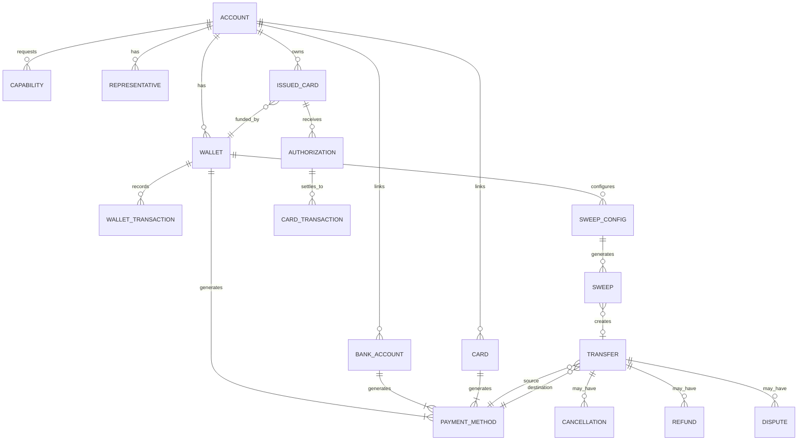

### Core Entities

| Entity | ID Format | Key Attributes | Notes |
|--------|-----------|----------------|-------|
| **Account** | UUID | `accountType` (individual/business/guest), `profile`, `verification.status`, `mode` (sandbox/production), `foreignID` | Parent entity for all customer resources |
| **Wallet** | UUID | `availableBalance`, `currency`, `status` | Multiple wallets per account supported; hub for all money movement |
| **BankAccount** | UUID | `fingerprint`, `status`, `holderType`, `routingNumber`, `statusReason` | External bank account link |
| **Card** | UUID | `fingerprint`, `brand`, `cardType`, `bin`, `expiration`, `cardVerification` | Linked external cards for acquiring |
| **IssuedCard** | UUID | `state`, `controls`, `walletID`, `authorizedUser` | Virtual cards issued by platform (beta) |
| **Transfer** | UUID | `source`, `destination`, `amount`, `status`, `facilitatorFee`, `moovFee` | Core money movement entity |
| **PaymentMethod** | UUID | `paymentMethodType` (discriminated union) | Abstraction over funding sources |
| **Capability** | String enum | `status`, `requirements.currentlyDue`, `disabledReason` | Feature enablement flags |
| **Representative** | UUID | `name`, `isController`, `isOwner`, `ownershipPercentage` | Business beneficial owners |
| **WalletTransaction** | UUID | `transactionType`, `status`, `sourceID` | Ledger entries for wallet |

### Key Design Decisions

**Account Model**
- Unified account type: `individual`, `business`, `guest`
- Profile contains either `IndividualProfile` or `BusinessProfile`
- Business accounts require Representatives for beneficial ownership
- `ownersProvided` flag signals all beneficial owners submitted
- Maximum 7 representatives per account

**Wallet Model**
- Multiple wallets per account supported
- Each wallet generates its own `moov-wallet` PaymentMethod
- Wallet is the source of truth for available funds
- All external rails land in/originate from wallet

**Joint Accounts**
- ❓ **No explicit support** - Single-owner model only

**Transaction Linking**
- Transfer Groups via `groupID`
- Parent-child linking via `source.transferID`
- `refunds[]`, `cancellations[]`, `disputes[]` on Transfer
- `sweepID`, `scheduleID`, `occurrenceID` for automated origins

---

## 2. State Machines

### Account Verification Status

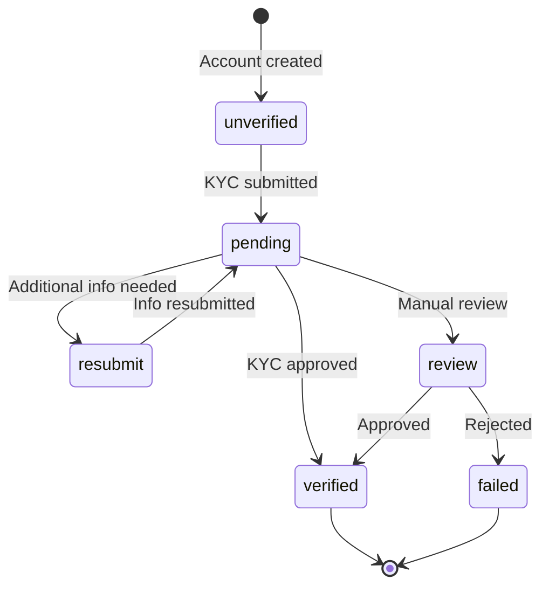

| Status | Terminal? | Recoverable? |
|--------|-----------|--------------|
| `unverified` | No | - |
| `pending` | No | - |
| `resubmit` | No | Yes |
| `review` | No | - |
| `verified` | Yes | - |
| `failed` | Yes | No |

### Transfer Status

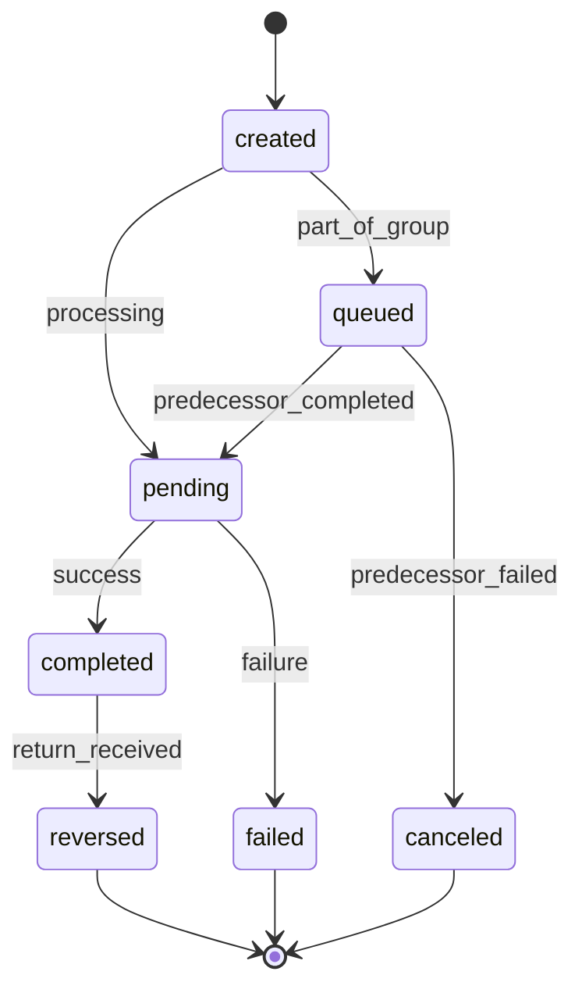

| Status | Terminal? | Notes |
|--------|-----------|-------|
| `created` | No | Initial state |
| `queued` | No | Waiting for preceding transfer (grouped) |
| `pending` | No | In-flight |
| `completed` | Semi | Can transition to `reversed` within 60 days |
| `failed` | Yes | Check `failureReason` |
| `reversed` | Yes | Via return or reversal |
| `canceled` | Yes | Pre-completion cancellation |

**Failure Reasons:** `source-payment-error`, `destination-payment-error`, `wallet-insufficient-funds`, `rejected-high-risk`, `processing-error`

### Bank Account Status

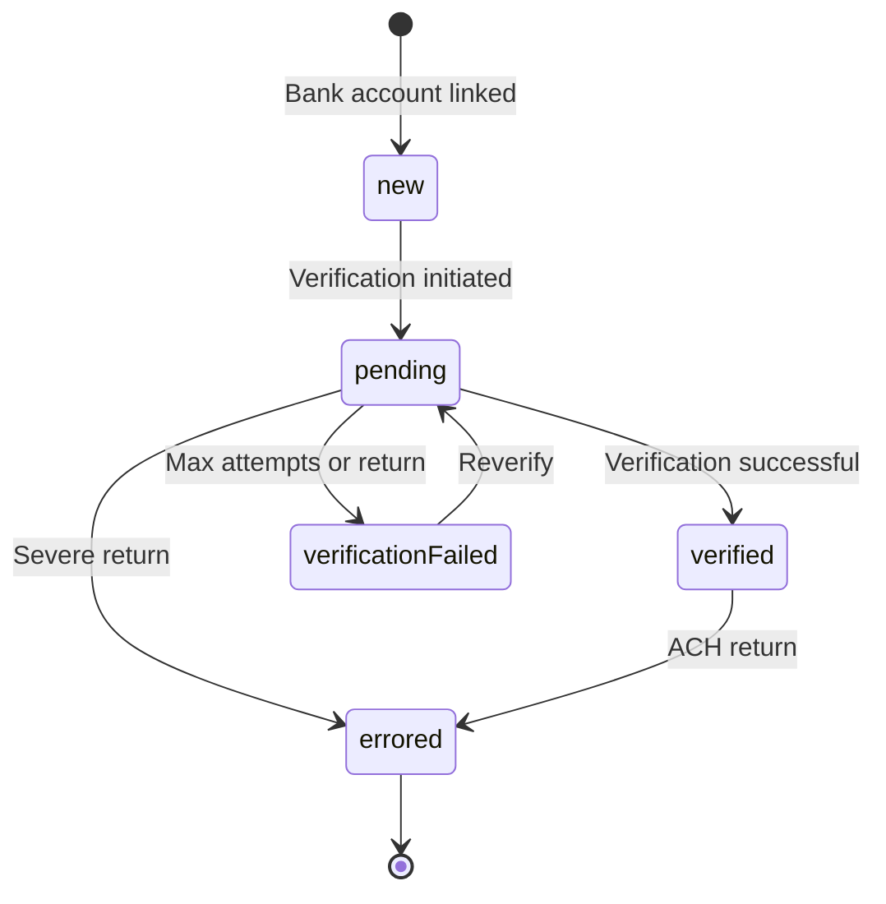

| Status | Terminal? | Recoverable? | Notes |
|--------|-----------|--------------|-------|
| `new` | No | - | Can receive funds, not verified for debits |
| `pending` | No | - | Verification in progress |
| `verified` | No | - | Verified for ACH debit |
| `verificationFailed` | No | Yes | Can reverify |
| `errored` | Yes | No | New bank account required |

**Status Reasons:** `bank-account-created`, `verification-initiated`, `verification-successful`, `micro-deposit-expired`, `micro-deposit-return`, `micro-deposit-attempts-exceeded`, `ach-debit-return`, `ach-credit-return`, `rtp-credit-failure`

### Capability Status

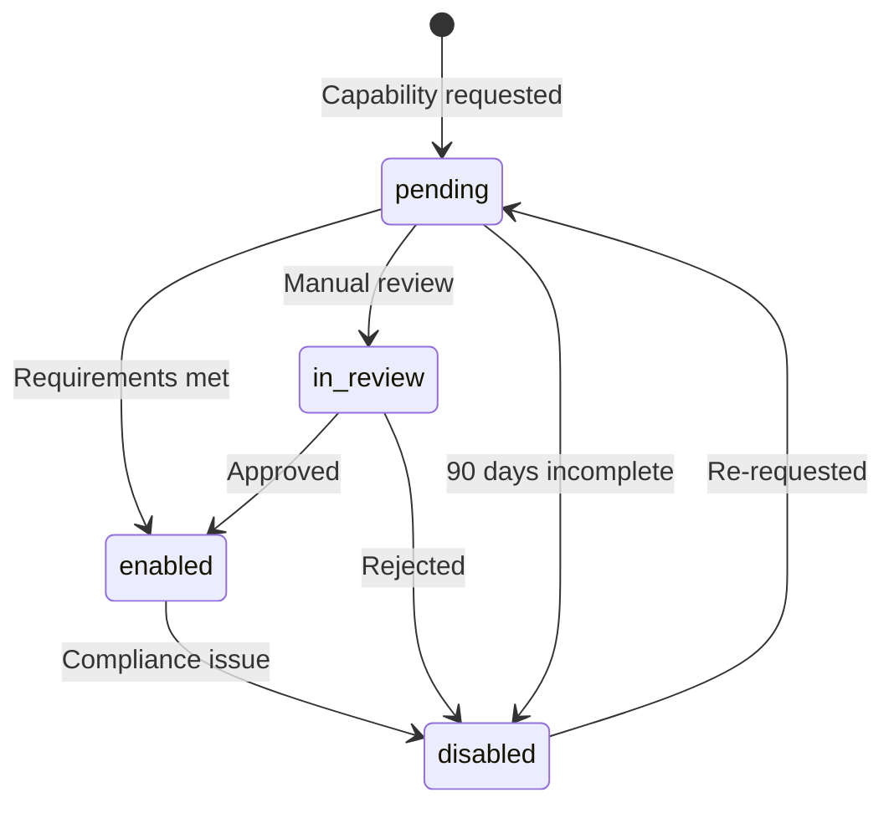

**Available Capabilities:** `transfers`, `send-funds`, `send-funds.push-to-card`, `send-funds.ach`, `send-funds.rtp`, `collect-funds`, `collect-funds.card-payments`, `collect-funds.ach`, `wallet`, `wallet.balance`, `card-issuing`

### Issued Card State

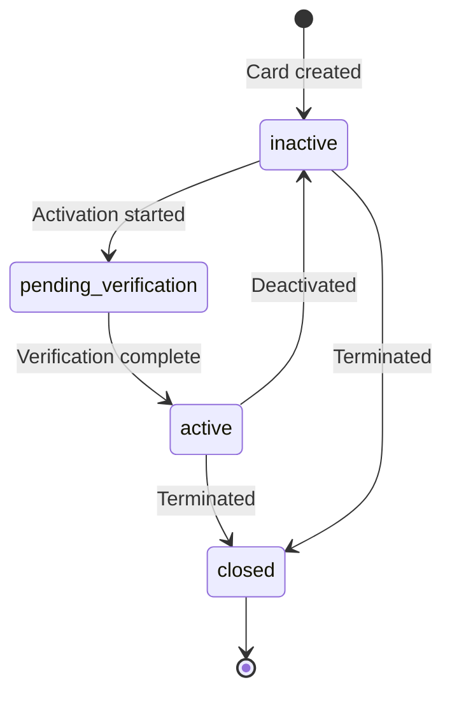

### Card Authorization Status (Issuing)

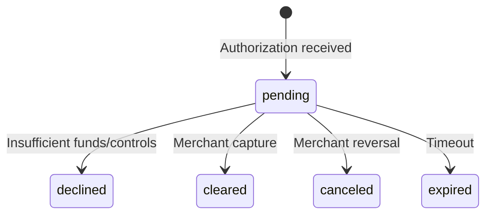

---

## 3. Critical Flows

### ACH Origination Flow

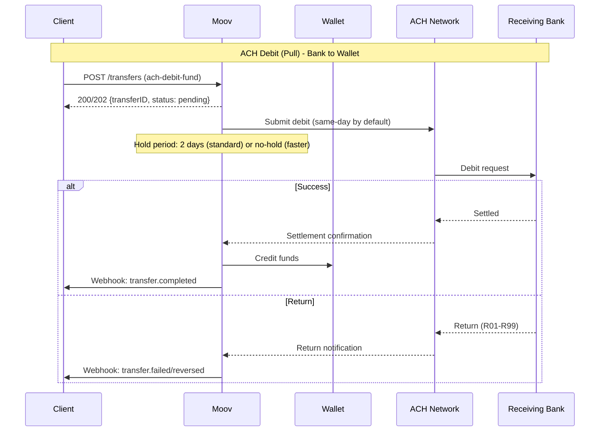

**ACH Timing - Standard Processing:**

| Processing | Cutoff (ET) | Debit Completes | Credit Completes |
|------------|-------------|-----------------|------------------|
| Standard (2-day hold) | 4:15 PM | ~2 banking days | Next morning |
| Same-Day | 4:15 PM | Same day | Same day |

**ACH Timing - Faster Processing (requires approval):**

| Created By | Debit Completes |
|------------|-----------------|
| 10:00 AM ET | ~1:00 PM ET |
| 2:15 PM ET | ~4:00 PM ET |
| 4:15 PM ET | ~6:00 PM ET |
| 5:30 PM ET | ~7:00 AM ET (+1) |

**Debit Hold Periods:** `no-hold`, `1-day`, `2-days`

**SEC Codes Supported:** `WEB`, `PPD`, `CCD`, `TEL`

**ACH Return Handling:**
- Returns can occur up to 60 days post-completion
- Wallet is debited for reversals
- Bank account status may change to `errored` on return
- Return codes: R01-R39 documented

### Account Opening Flow

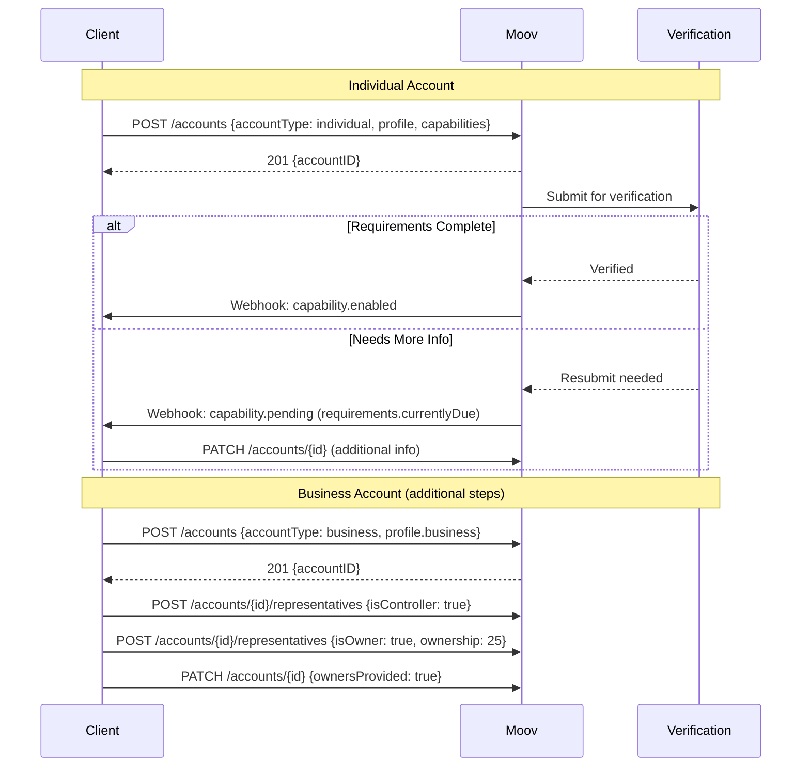

**Individual Requirements:**
- Name, email/mobile, birthdate
- Address, SSN (last 4 or full)
- TOS acceptance

**Business Requirements:**
- Legal name, EIN, entity type
- Address, phone
- At least 1 controller
- All owners ≥25% (or `ownersProvided: true`)
- Description or website

**Business Types:** `soleProprietorship`, `llc`, `partnership`, `privateCorporation`, `publicCorporation`, `trust`, `unincorporatedAssociation`, `unincorporatedNonProfit`, `incorporatedNonProfit`, `governmentEntity`

### Bank Account Verification

**Methods:**
1. **Instant (RTP)** - Real-time for RTP-enabled banks
2. **Same-day ACH** - Fallback for non-RTP banks
3. **Traditional micro-deposit** - 3-5 business days

**Process:**
- $0.01 credit sent with 4-digit verification code
- User has 14 days and 5 attempts to submit code
- Verification can be attempted 3 times per bank account

### Card Authorization Flow (Acquiring)

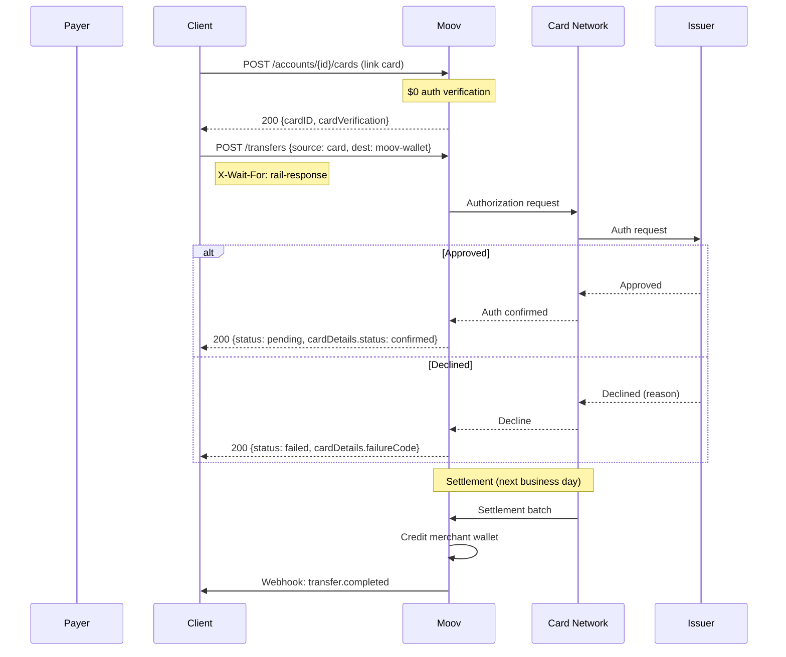

**Card Payment Status:** `initiated` → `confirmed` → `settled` → `completed`

**Card Settlement Cutoffs:**

| Network | Cutoff (ET) |
|---------|-------------|
| Visa | 9:45 PM |
| Mastercard | 11:00 PM |
| Discover | 7:00 PM |
| Amex | 7:00 PM |

**Settlement Timing:**
- Sales: Credited to wallet by 1:00 PM ET next banking day
- Refunds: Immediately debited from wallet
- Chargebacks: Immediately debited from wallet

**Decline Codes:** `call-issuer`, `do-not-honor`, `processing-error`, `invalid-transaction`, `invalid-amount`, `cvv-mismatch`, `lost-or-stolen`, `insufficient-funds`, `invalid-card-number`, `expired-card`, `incorrect-pin`, `suspected-fraud`, `amount-limit-exceeded`, `velocity-limit-exceeded`, etc.

### Card Issuing Authorization Flow

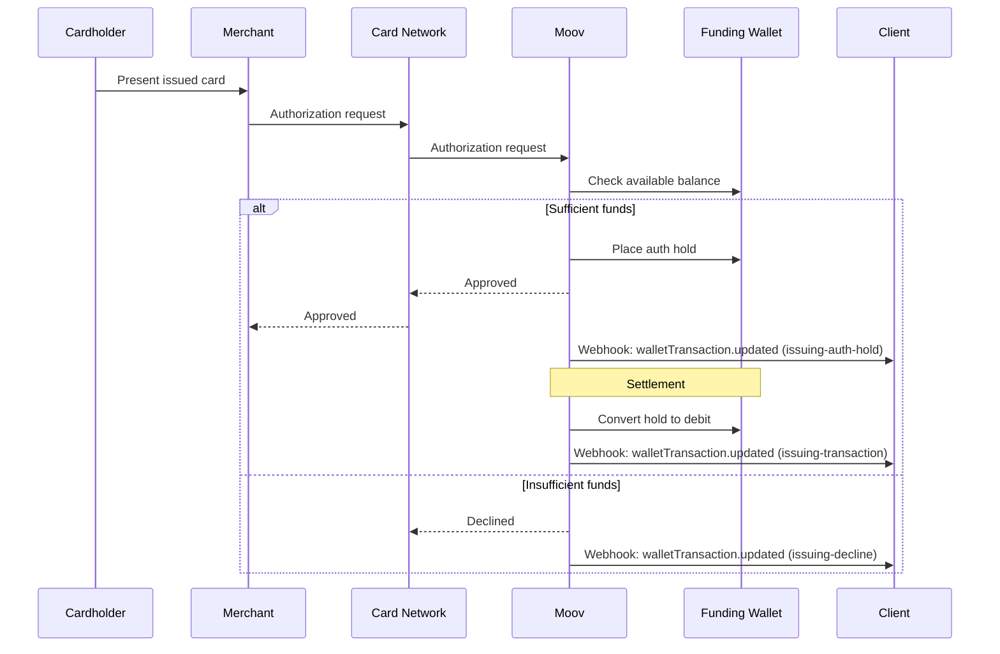

**Wallet Transaction Types for Issuing:**
- `issuing-auth-hold` - Funds reserved
- `issuing-auth-release` - Held funds released
- `issuing-transaction` - Funds moved from wallet

**Card Controls:**
- `singleUse` - Card closes after first successful auth
- `velocityLimits` - Per-transaction spending limits

---

## 4. API Design Patterns

### Authentication & Authorization

**OAuth2 Protocol:**
- Access tokens via `POST /oauth2/token`
- Scoped access tokens per account
- Some scopes unrestricted (e.g., `/accounts.write`, `/ping.read`)
- Most scopes account-restricted (e.g., `/accounts/{accountID}/transfers.write`)

**Key Scopes:**

| Scope | Description |
|-------|-------------|
| `/accounts.write`, `/accounts.read` | Create/view accounts |
| `/accounts/{accountID}/bank-accounts.read/write` | Bank account access |
| `/accounts/{accountID}/cards.read/write` | Card access |
| `/accounts/{accountID}/capabilities.read/write` | Capability management |
| `/accounts/{accountID}/transfers.read/write` | Money movement |
| `/accounts/{accountID}/wallets.read/write` | Wallet access |
| `/accounts/{accountID}/representatives.read/write` | Business representatives |
| `/fed.read` | Institution lookup |

### Idempotency

- **Required** for all transfer creation: `X-Idempotency-Key` header
- UUID v4 format
- Keys **never expire**
- Duplicate requests return 409 error

### Rate Limits

- **40 requests per second per account ID per IP address**
- 429 status code when exceeded
- Contact Moov to increase limits

### X-Wait-For Header Pattern

Enables synchronous responses from async operations:

```
X-Wait-For: rail-response    # Wait for payment rail response
X-Wait-For: payment-method   # Wait for PaymentMethod generation
```

### API Versioning

- Format: `vYYYY.QQ.BB` (e.g., `v2025.07.00`)
- Sent via `x-moov-version` header
- Default: `v2024.01.00`
- `latest` always beta

### Error Responses

| Code | Description |
|------|-------------|
| 400 | Invalid syntax |
| 401 | Missing/expired authentication |
| 403 | Not authorized |
| 404 | Resource not found |
| 409 | Conflict (e.g., duplicate idempotency key) |
| 422 | Validation failed |
| 429 | Rate limited |
| 500 | Unexpected error |
| 504 | Downstream service timeout |

### Pagination

- List endpoints return 200 results at a time
- Use `skip` parameter to paginate
- Filter by `StartDateTime`/`EndDateTime` for performance

---

## 5. Webhook Events

### Configuration
- HTTPS endpoint required
- 5 second timeout for 2xx response
- Retry for up to 24 hours on failure
- Webhook disabled after final retry returns 404

### Signature Verification
- HMAC-SHA512 signature
- Headers: `X-Signature`, `X-Timestamp`, `X-Nonce`, `X-Webhook-ID`

### Event Types

| Event | Description |
|-------|-------------|
| `account.created/updated/deleted` | Account lifecycle |
| `capability.requested/updated` | Capability changes |
| `bankAccount.created/updated/deleted` | Bank account lifecycle |
| `transfer.created/updated` | Transfer status changes |
| `walletTransaction.updated` | Wallet transaction status |
| `balance.updated` | Wallet balance change |
| `dispute.created/updated` | Chargeback events |
| `refund.created/updated` | Refund lifecycle |
| `cancellation.created/updated` | Cancellation lifecycle |
| `paymentMethod.enabled/disabled` | Payment method availability |
| `representative.created/updated/disabled` | Business rep changes |
| `sweep.created/updated` | Sweep events |

### Rail-Specific Transfer Statuses (via webhook)

**ACH:**
- `source.initiated` → `source.originated` → `source.corrected` → `source.completed`
- `destination.initiated` → `destination.originated` → `destination.corrected`
- Error: `source.returned`, `destination.returned`

**Card:**
- `source.initiated` → `source.confirmed` → `source.settled` → `source.completed`
- Error: `source.canceled`, `source.failed`

**Wallet:**
- `source.completed` → `destination.completed`

---

## 6. Payment Methods & Rails

### Payment Method Types

| Type | Direction | Rail |
|------|-----------|------|
| `moov-wallet` | Both | Internal wallet |
| `ach-debit-fund` | Source | ACH pull (fund wallet) |
| `ach-debit-collect` | Source | ACH pull (collect) |
| `ach-credit-standard` | Destination | ACH push (standard) |
| `ach-credit-same-day` | Destination | ACH push (same-day) |
| `rtp-credit` | Destination | Real-time payments |
| `card-payment` | Source | Card acquiring |
| `push-to-card` | Destination | Card disbursement |
| `pull-from-card` | Source | Card funding |
| `apple-pay` | Source | Apple Pay |

### Transfer Request Structure

```json
{
  "source": { "paymentMethodID": "..." },
  "destination": { "paymentMethodID": "..." },
  "amount": { "value": 10000, "currency": "USD" },
  "facilitatorFee": { "total": 100 },
  "metadata": { "key": "value" }
}
```

---

## 7. Sweeps (Automated Settlement)

Sweeps automate daily wallet → bank account settlement.

**Sweep Configuration:**
- Linked to wallet and bank account
- Push via ACH or RTP
- Statement descriptor included

**Sweep States:** `accruing` → `pushed` | `failed`

**Wallet Transaction Types:**
- Subtotals by type: push, pull, dispute, refund, fee amounts

---

## 8. Integration Considerations

### Sandbox/Testing
- `mode: sandbox` vs `production`
- Separate API keys required
- ACH transfers complete faster in test mode
- Test card data available with specific CVV/postal verification scenarios

### Required Headers

| Header | Purpose |
|--------|---------|
| `Authorization` | Bearer token |
| `x-moov-version` | API version |
| `X-Idempotency-Key` | Transfer deduplication (UUID v4) |
| `X-Wait-For` | Synchronous response control |

### Client Libraries

Official SDKs: Go, TypeScript, Python, Ruby, Java, PHP, .NET

### Moov.js (Client-Side)

- Handles PII securely without touching your servers
- Drops: Pre-built UI components
- Requires scope configuration

---

## 9. Sponsor Banking Considerations

### What Moov Provides Well
1. **Multi-rail money movement** - ACH, RTP, card networks, push-to-card
2. **Capability-based progressive KYC** - Tiered account access
3. **Unified payment method model** - Consistent API across rails
4. **Wallet-centric design** - Clear fund accounting
5. **Transfer groups** - Parent-child transaction linking
6. **Comprehensive webhooks** - Granular state transitions
7. **Sweep configuration** - Automated wallet-to-bank movement
8. **Card issuing (beta)** - Virtual Visa cards

### Gaps for Sponsor Banking
1. **No explicit FBO/omnibus account modeling** - Would need custom abstraction
2. **No joint account support** - Individual accounts only
3. **Limited GL/ledger exposure** - WalletTransaction closest to ledger entries
4. **No wire transfer support** - Not documented in current API
5. **Multi-program segregation unclear** - Partner hierarchy exists but not detailed

### Architectural Implications for Cassandra
- Moov's facilitator model aligns well with BaaS sponsor banking
- Would need to build FBO layer on top
- Capability model could map to Cassandra's program-level permissions
- Transfer groups provide foundation for complex transaction chains
- Wallet balance tracking handles fund availability
- Wallet-centric model suitable for payment facilitation but may not align with traditional core banking requiring explicit ledger control

---

## 10. Confidence Matrix

| Area | Confidence | Source |
|------|------------|--------|
| Entity relationships | ✅ High | Spec + Docs |
| Account verification states | ✅ High | Docs |
| Transfer states | ✅ High | Both |
| Webhook sub-states | ✅ High | Docs |
| ACH timing/cutoffs | ✅ High | Docs |
| Card settlement timing | ✅ High | Docs |
| Authentication/scopes | ✅ High | Docs |
| Rate limits | ✅ High | Docs |
| Card issuing flow | ✅ High | Both |
| Sweep configuration | ✅ High | Both |
| Joint accounts | ❓ Not supported | Both |
| FBO account model | ❓ Not documented | Both |
| Wire transfers | ❓ Not available | Both |
| Multi-program model | ❓ Unclear | Both |

---

## Appendix A: Quick Reference

### Common Endpoints

| Operation | Endpoint |
|-----------|----------|
| Create account | `POST /accounts` |
| Request capability | `POST /accounts/{id}/capabilities` |
| Link bank account | `POST /accounts/{id}/bank-accounts` |
| Verify bank account | `POST /accounts/{id}/bank-accounts/{id}/verify` |
| Link card | `POST /accounts/{id}/cards` |
| Create transfer | `POST /transfers` |
| Get wallet balance | `GET /accounts/{id}/wallets/{id}` |
| List payment methods | `GET /accounts/{id}/payment-methods` |
| Get transfer options | `POST /accounts/{id}/transfer-options` |

### Environment URLs

| Environment | Base URL |
|-------------|----------|
| Production | `https://api.moov.io` |
| Documentation | `https://docs.moov.io` |
| Status | `https://status.moov.io` |