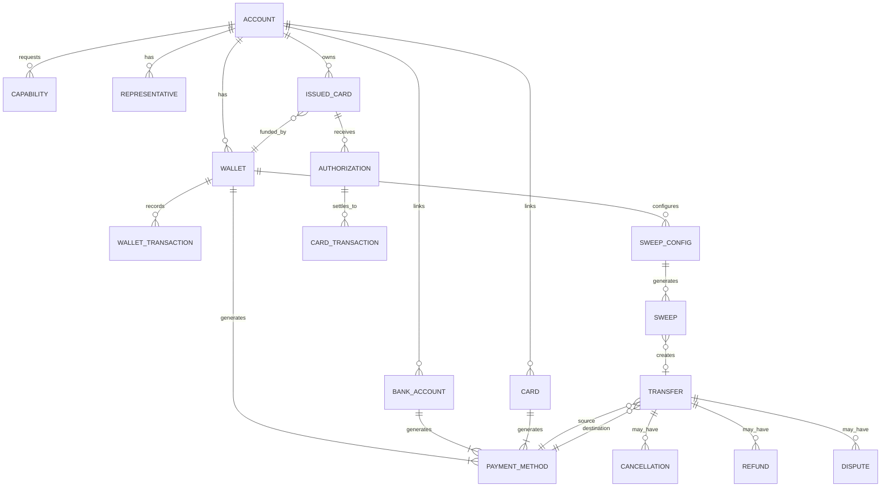
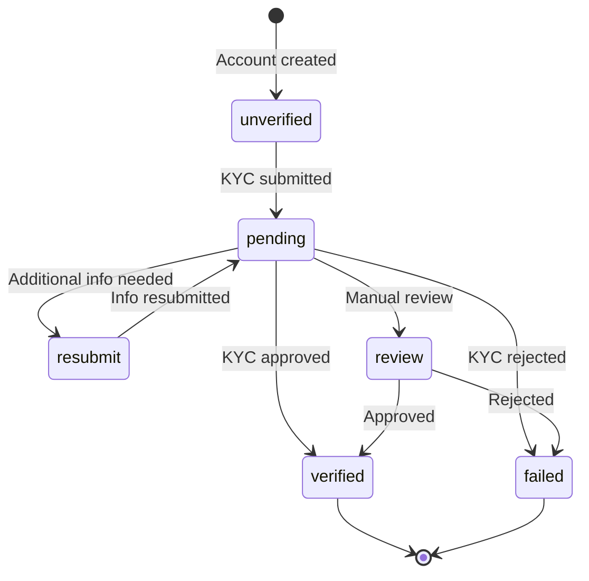
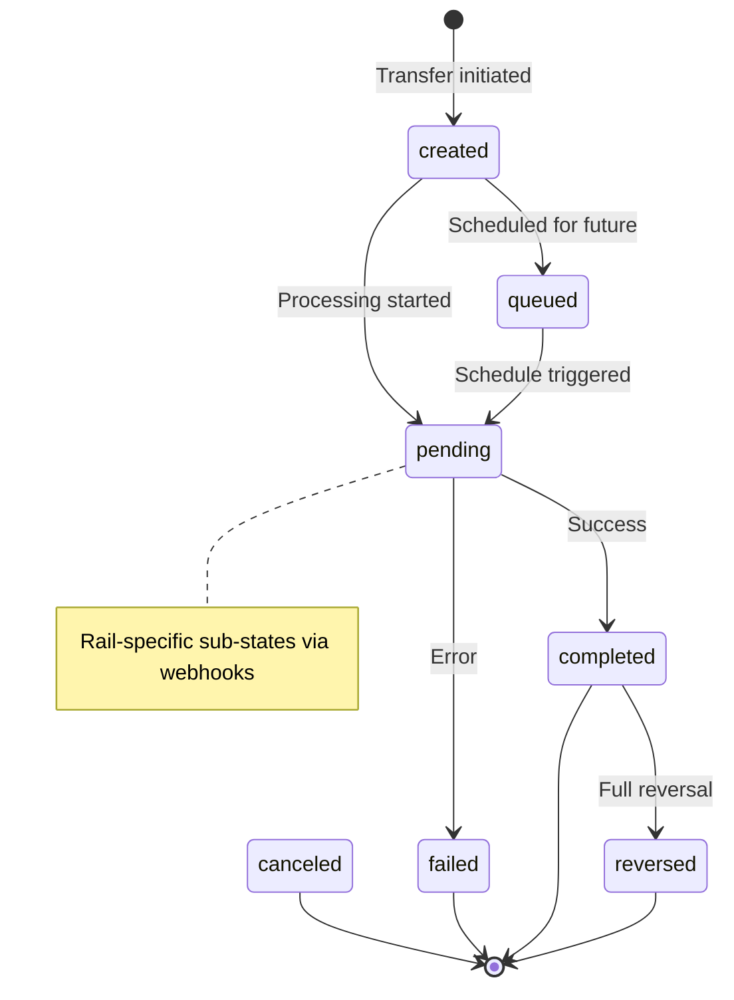
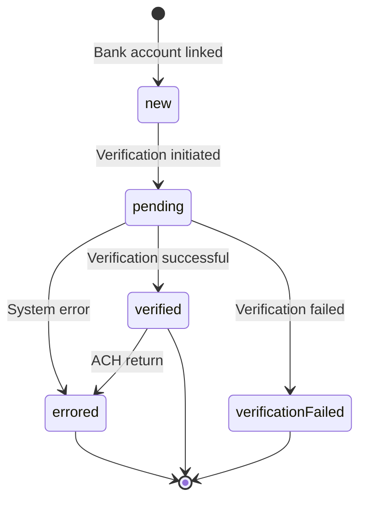
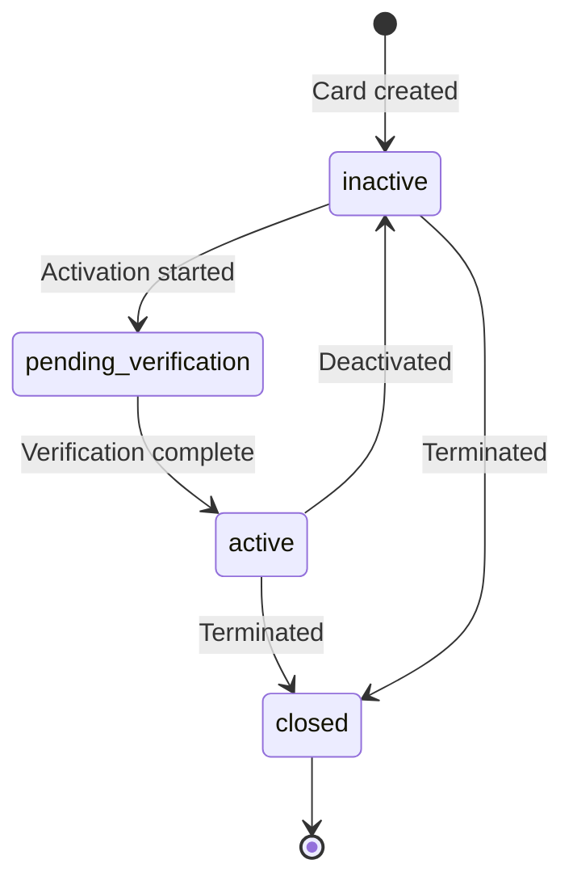
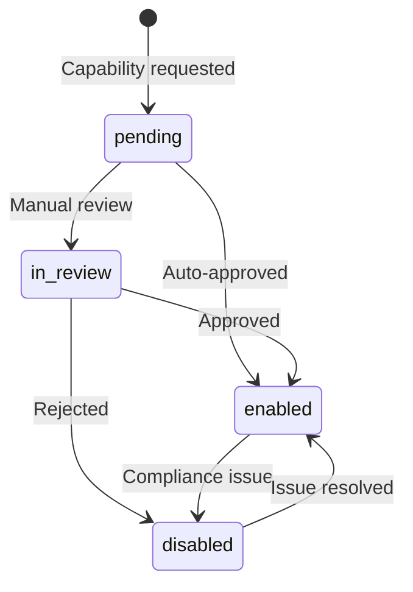
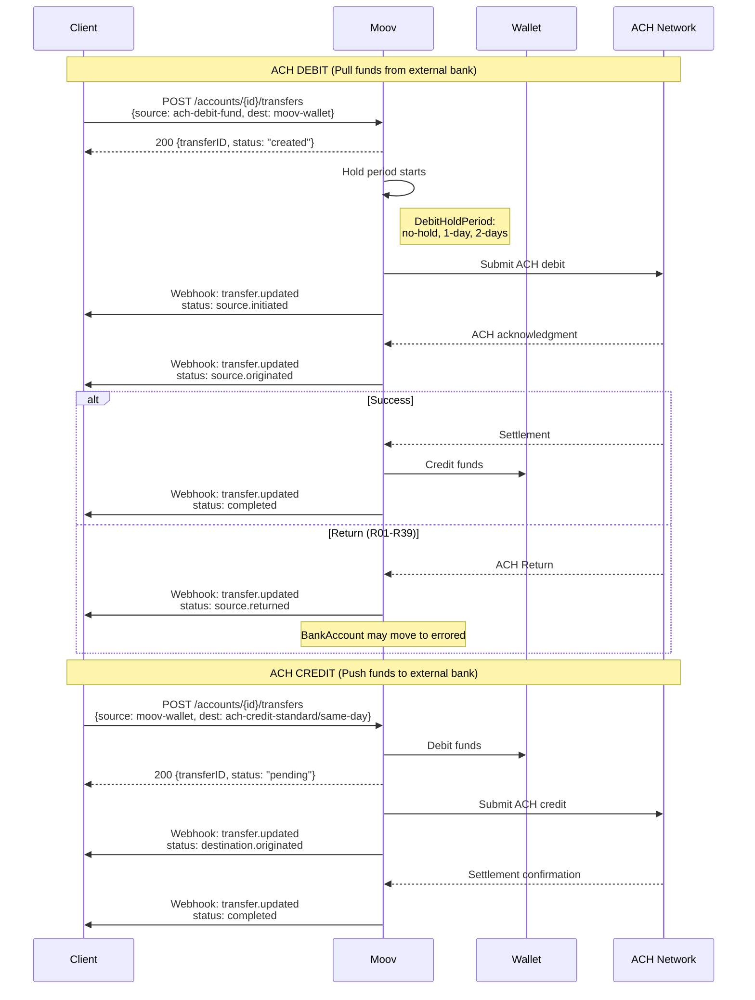
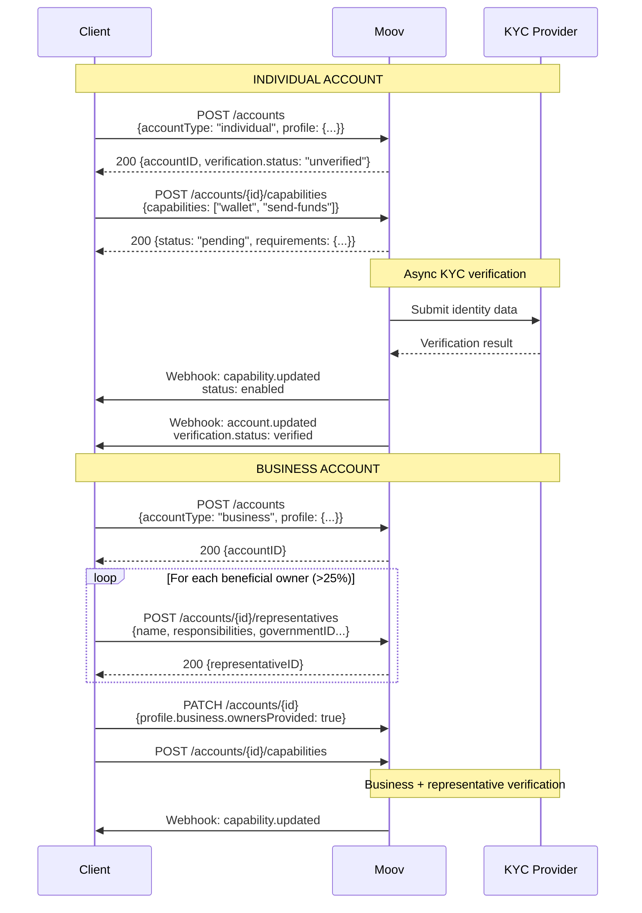
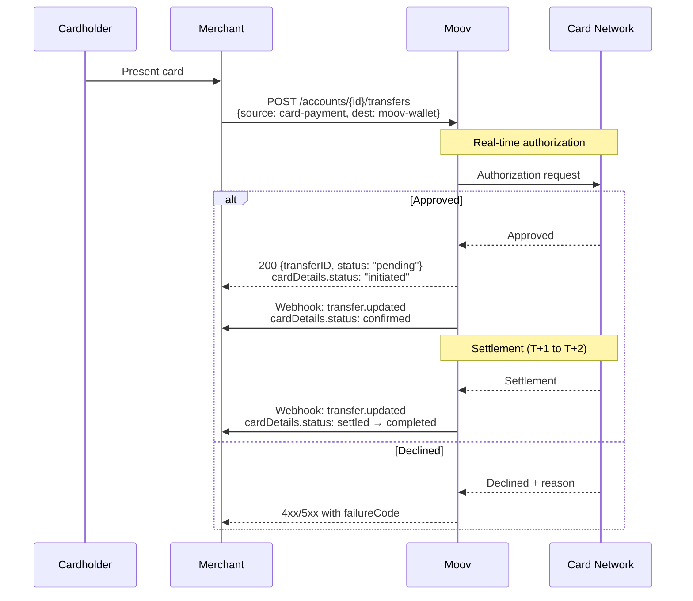
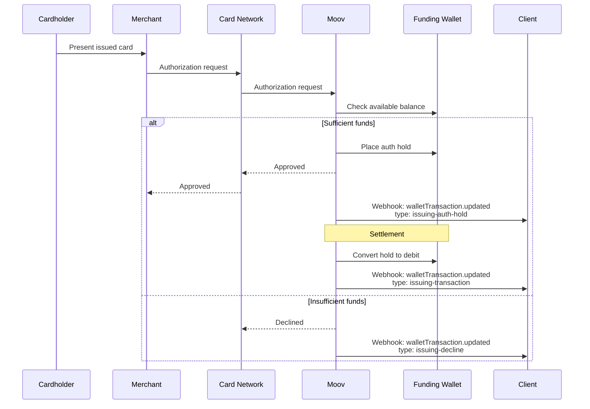

# Moov API Analysis for Cassandra Core Banking Architecture

**Provider:** Moov  
**API Version:** v2025.07.00  
**Analysis Date:** December 2024

---

## Executive Summary

Moov is a money movement platform offering a unified API for payments, with a distinctive **facilitator model** where the platform acts as an intermediary between accounts. Key architectural highlights:

- **Unified Account model** - individual/business types in single entity with capability-based feature enablement
- **Wallet-centric architecture** - Moov wallets serve as the hub for all money movement
- **Payment Method abstraction** - source/destination identified by `paymentMethodID` across all rails
- **Capabilities as feature flags** - progressive KYC unlocks specific money movement abilities

---

## 1. Entity Relationships

### ER Diagram



### Core Entities

| Entity | ID Format | Key Attributes | Relationships |
|--------|-----------|----------------|---------------|
| **Account** | UUID | `accountType` (individual/business/guest), `profile`, `verification`, `capabilities[]`, `foreignID` | Parent of all customer resources |
| **Wallet** | UUID | `availableBalance`, `status`, `walletType`, `name` | Belongs to Account; generates moov-wallet PaymentMethod |
| **BankAccount** | UUID | `fingerprint`, `status`, `holderType`, `routingNumber`, `lastFourAccountNumber` | Linked to Account; generates ACH PaymentMethods |
| **Card** | UUID | `fingerprint`, `brand`, `cardType`, `bin`, `expiration`, `cardVerification` | Linked to Account; generates card PaymentMethods |
| **Transfer** | UUID | `source`, `destination`, `amount`, `status`, `facilitatorFee`, `moovFee` | References PaymentMethods for source/destination |
| **PaymentMethod** | UUID | `paymentMethodType` (discriminated union), underlying instrument details | Generated from Wallet/BankAccount/Card |
| **Representative** | UUID | `name`, `responsibilities` (isController, isOwner, ownershipPercentage) | Belongs to business Account |
| **Capability** | Enum string | `status`, `requirements`, `disabledReason` | Attached to Account |

### Key Design Decisions

**Account Model**
- ✅ **Unified account type** with `individual` / `business` / `guest` discrimination
- Profile contains either `IndividualProfile` or `BusinessProfile` (or `GuestProfile`)
- Business accounts require Representatives for beneficial ownership
- `ownersProvided` flag indicates when all beneficial owners have been submitted

**Joint Accounts**
- ❓ **No explicit joint account support** visible in API
- Single `holderName` on BankAccount suggests single-owner model
- Multiple Representatives model ownership for businesses, not joint individuals

**Sub-accounts/Virtual Accounts**
- ✅ **Multiple Wallets per Account** supported
- Wallets have `name` and `description` for purpose differentiation
- Each Wallet generates its own `moov-wallet` PaymentMethod
- 🔶 This is the closest to virtual account functionality

**Business → Beneficial Owner Relationship**
- Representatives are separate entities linked to business Account
- `responsibilities.isOwner` + `ownershipPercentage` for equity ownership
- `responsibilities.isController` for management authority
- Maximum 7 representatives per account

**Transaction Linking**
- ✅ **Transfer Groups** via `source.transferID` - links new transfer to parent
- `refunds[]` and `cancellations[]` arrays on Transfer for reversals
- `disputes[]` for chargebacks
- `groupID` for transfer group membership
- `sweepID`, `scheduleID`, `occurrenceID` for automated transfer origins

---

## 2. State Machines

### Account Verification States



| State | Terminal? | Recoverable? | Trigger |
|-------|-----------|--------------|---------|
| `unverified` | No | - | Initial state |
| `pending` | No | - | KYC submission |
| `resubmit` | No | Yes | Missing/invalid data |
| `review` | No | - | Manual review required |
| `verified` | Yes | - | KYC approved |
| `failed` | Yes | No | KYC failed |

### Transfer States



**Transfer Status Values:** `created` → `pending` → `completed` | `failed` | `reversed` | `queued` | `canceled`

**Webhook Sub-States** (for granular tracking):
- Source: `source.initiated` → `source.originated` → `source.confirmed` → `source.settled` → `source.completed`
- Destination: `destination.initiated` → `destination.originated` → `destination.confirmed` → `destination.completed`
- Error paths: `source.returned`, `source.corrected`, `source.failed`, `source.canceled`

| State | Terminal? | Recoverable? | Notes |
|-------|-----------|--------------|-------|
| `created` | No | - | Initial state |
| `queued` | No | Yes | Scheduled transfer |
| `pending` | No | - | In-flight |
| `completed` | Semi | - | Can be reversed |
| `failed` | Yes | No | Check `failureReason` |
| `reversed` | Yes | - | Via cancellation or refund |
| `canceled` | Yes | No | Pre-completion cancellation |

**Failure Reasons:** `source-payment-error`, `destination-payment-error`, `wallet-insufficient-funds`, `rejected-high-risk`, `processing-error`

### Bank Account States



**Status Values:** `new` → `pending` → `verified` | `verificationFailed` | `errored`

**Status Reasons:** `bank-account-created`, `verification-initiated`, `micro-deposit-attempts-exceeded`, `micro-deposit-expired`, `verification-successful`, `ach-debit-return`, `ach-credit-return`, etc.

### Issued Card States



**State Values:** `inactive` → `pending-verification` → `active` ↔ `inactive` → `closed`

### Capability States



**Status Values:** `pending` → `in-review` → `enabled` | `disabled`

---

## 3. Critical Flows

### ACH Origination Flow (Credit and Debit)



**Timing (inferred)**
- ✅ Same-day ACH supported via `ach-credit-same-day` payment method type
- 🔶 Cutoff times not explicitly documented in API spec
- Debit hold period configurable: `no-hold`, `1-day`, `2-days`
- ACH return window: Standard 2-day return + extended 60-day window for unauthorized

**SEC Codes Supported:** `WEB`, `PPD`, `CCD`, `TEL`

**Return Handling**
- ACH returns reflected in `achDetails.return` with `ACHReturnCode`
- Supported return codes: R02, R03, R04, R05, R07, R08, R10, R11, R12, R13, R14, R15, R16, R17, R20, R23, R29, R34, R38, R39
- Bank account status may change to `errored` on return

### Account Opening Flow



**Individual vs Business Differences**
- Individual: Name, DOB, SSN/ITIN, Address
- Business: Legal name, EIN, business type, address + Representatives
- Business types: `soleProprietorship`, `llc`, `partnership`, `privateCorporation`, `publicCorporation`, `trust`, `unincorporatedAssociation`, `unincorporatedNonProfit`, `incorporatedNonProfit`, `governmentEntity`

**Timing**
- Account creation: Synchronous
- KYC verification: Asynchronous (no SLA documented in API)
- Capability enablement: Async, dependent on KYC + underwriting

### Card Authorization Flow (Acquiring)



**Card Transaction Status Flow:** `initiated` → `confirmed` → `settled` → `completed`

**Decline Codes:** `call-issuer`, `do-not-honor`, `processing-error`, `invalid-transaction`, `invalid-amount`, `cvv-mismatch`, `lost-or-stolen`, `insufficient-funds`, `invalid-card-number`, `expired-card`, `incorrect-pin`, `suspected-fraud`, `amount-limit-exceeded`, `velocity-limit-exceeded`, etc.

### Card Issuing Authorization Flow



**Issued Card States:** `inactive` → `pending-verification` → `active` ↔ `inactive` → `closed`

---

## 4. Notable Design Patterns

### Facilitator Model
Moov uses a **facilitator** architecture:
- Platform (facilitator) creates accounts for end users
- Accounts are "connected" to the facilitator
- `facilitatorFee` allows platform to take fees on transfers
- Scoped access tokens: `/accounts/{accountID}/transfers.write`

### Payment Method Abstraction
All money movement uses the same transfer structure:
```json
{
  "source": { "paymentMethodID": "..." },
  "destination": { "paymentMethodID": "..." },
  "amount": { "value": 10000, "currency": "USD" }
}
```

PaymentMethod types determine the rail:
- `moov-wallet` - Internal wallet transfer
- `ach-debit-fund` / `ach-debit-collect` - ACH pull
- `ach-credit-standard` / `ach-credit-same-day` - ACH push
- `rtp-credit` - Real-time payments
- `card-payment` - Card acquiring
- `push-to-card` / `pull-from-card` - Card disbursement/funding
- `apple-pay` - Apple Pay

### Wallet as Hub
- All external rails land in/originate from Moov Wallet
- Wallet balance is the source of truth for available funds
- Sweeps automate wallet → bank account movement

### X-Wait-For Header Pattern
Critical for reducing round-trips:
```
X-Wait-For: payment-method
```
Instructs Moov to wait for async PaymentMethod generation before responding.

---

## 5. Confidence Notes

| Area | Confidence | Notes |
|------|------------|-------|
| Entity relationships | ✅ Documented | Clear from schemas |
| Account states | 🔶 Partial | AccountVerificationStatus deprecated, new model unclear |
| Transfer states | ✅ Documented | Webhook sub-states provide detail |
| ACH timing/cutoffs | ❓ Unclear | Not in API spec, likely in guides |
| Card settlement timing | 🔶 Inferred | T+1 to T+2 typical |
| Joint accounts | ❓ Unclear | No explicit support visible |
| FBO account model | ❓ Unclear | Not documented in API spec |
| Wire transfers | ❓ Not found | Not in this API version |
| Same-day ACH cutoff | ❓ Unclear | Payment method exists, timing not specified |

---

## 6. Sponsor Banking Considerations

### What Moov Provides Well
1. **Capability-based progressive KYC** - enables tiered account access
2. **Unified payment method model** - consistent API across rails
3. **Wallet-centric design** - clear fund accounting
4. **Transfer groups** - parent-child transaction linking
5. **Comprehensive webhooks** - granular state transitions
6. **Sweep configuration** - automated wallet-to-bank movement
7. **Card issuing** - native card program support

### Gaps for Sponsor Banking
1. **No explicit FBO/omnibus account modeling** - would need custom abstraction
2. **No joint account support** - individual accounts only
3. **Limited GL/ledger exposure** - WalletTransaction closest to ledger entries
4. **No wire transfer support** in current API version
5. **Underwriting status deprecated** - transition to new model unclear

### Architectural Implications for Cassandra
- Moov's facilitator model aligns well with BaaS sponsor banking
- Would need to build FBO layer on top
- Capability model could map to Cassandra's program-level permissions
- Transfer groups provide foundation for complex transaction chains
- Wallet balance tracking handles fund availability