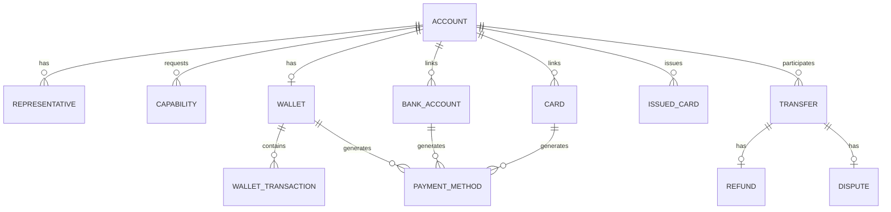
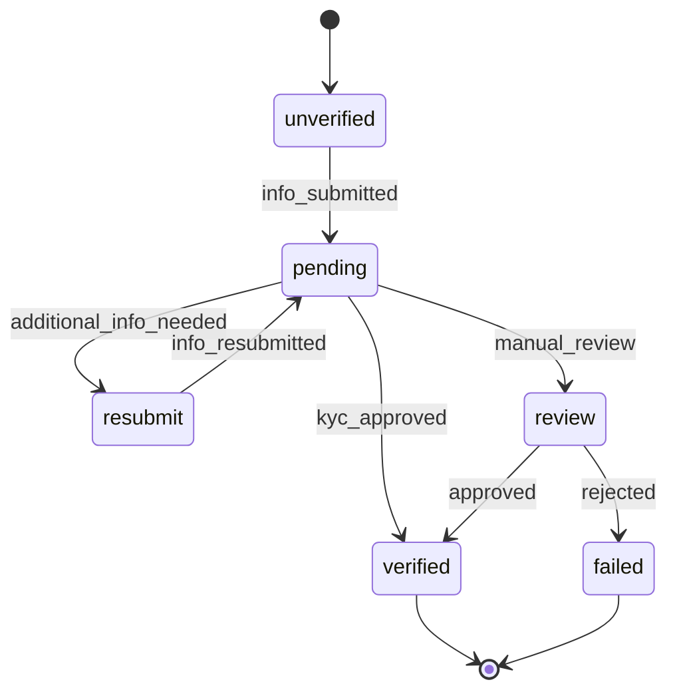
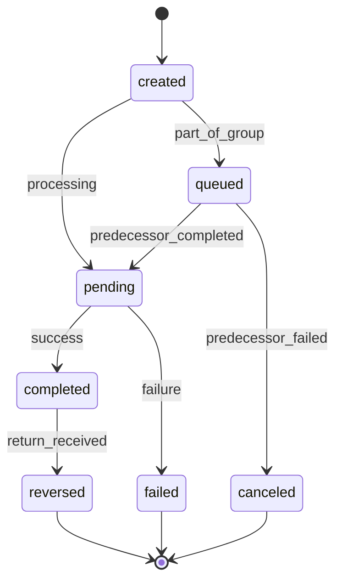
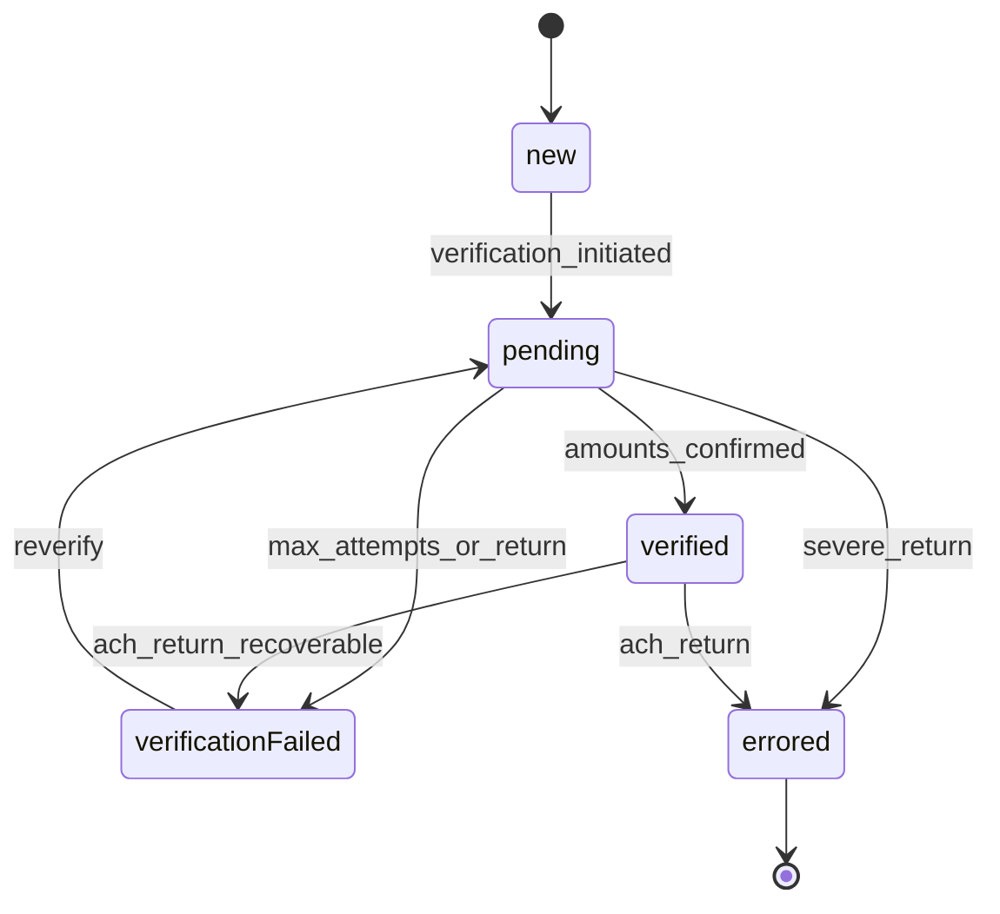
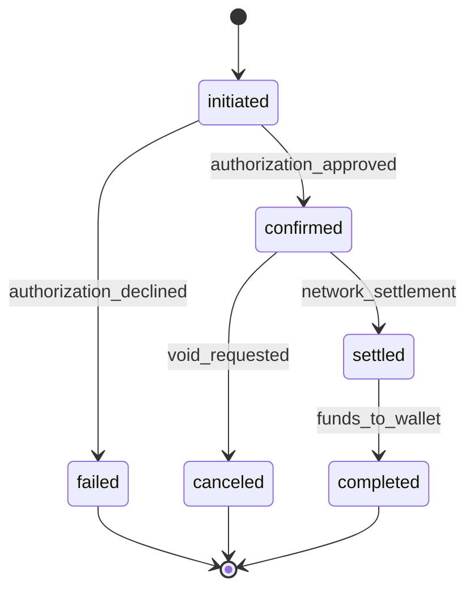
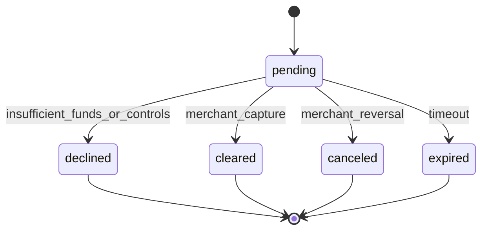
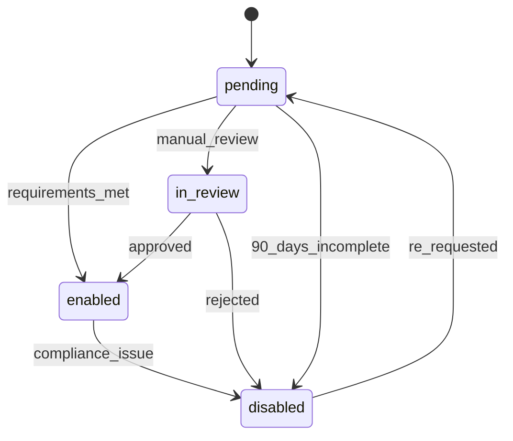
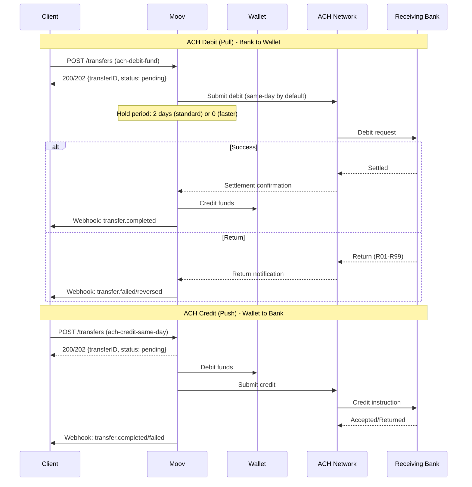
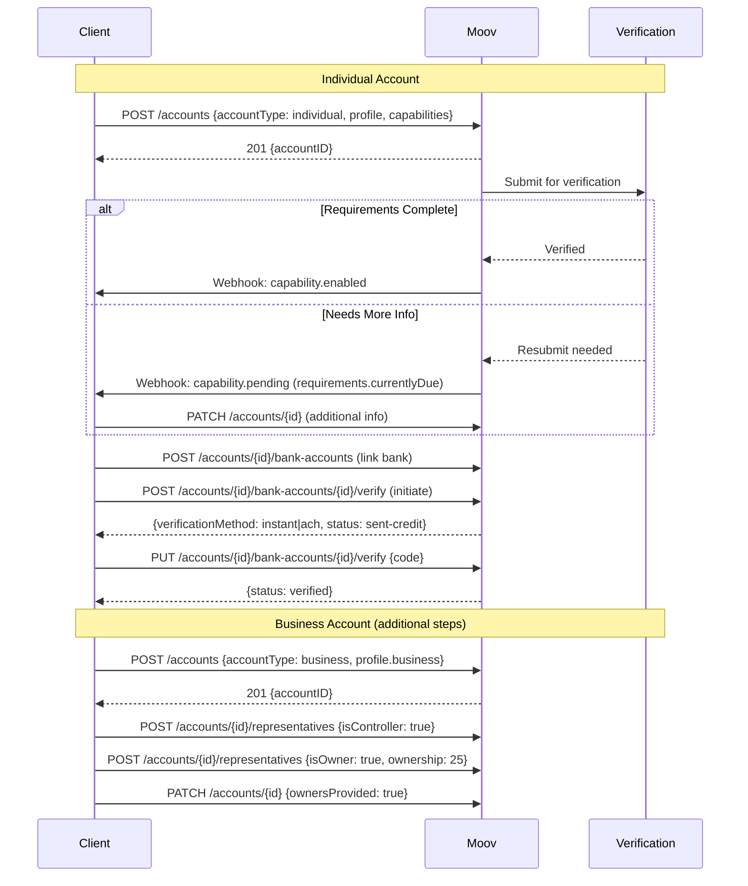
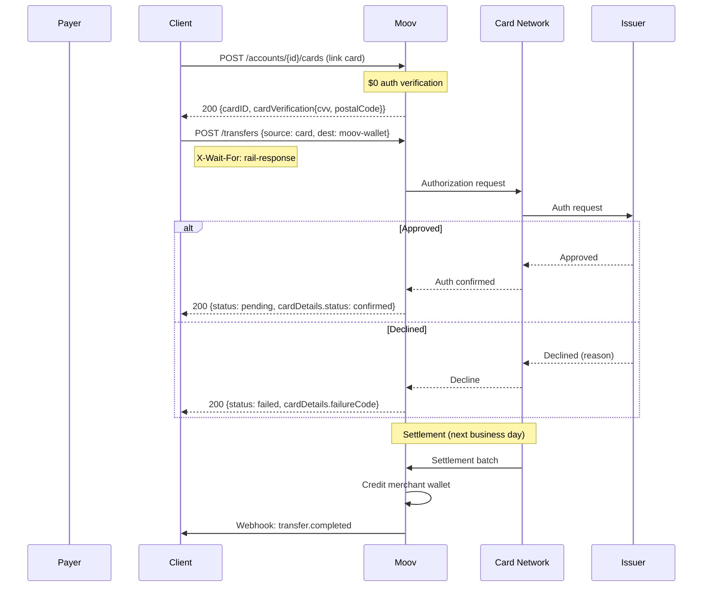

# Moov API Architecture Analysis for Cassandra

## Executive Summary

Moov is a BaaS platform that enables money movement through a unified API. Unlike traditional sponsor banking providers, Moov operates as an **intermediary platform** where all funds flow through Moov wallets before reaching external destinations. This "wallet-centric" architecture is the defining characteristic of their system.

---

## 1. Entity Relationships

### Entity Model (ER Diagram)

### Core Entities

| Entity | ID Format | Key Attributes | Connects To |
|--------|-----------|----------------|-------------|
| **Account** | UUID | `accountType` (individual/business/guest), `verification.status`, `mode` (sandbox/production), `displayName`, `foreignID` | Representative, Capability, Wallet, BankAccount, Card |
| **Wallet** | UUID | `availableBalance`, `currency` | Account (1:1), WalletTransaction, PaymentMethod |
| **Transfer** | UUID | `status`, `amount`, `source`, `destination`, `failureReason`, `createdOn` | Account (source/dest), PaymentMethod, Refund, Dispute |
| **BankAccount** | UUID | `status`, `holderType`, `routingNumber`, `statusReason`, `fingerprint` | Account, PaymentMethod |
| **Card** (linked) | UUID | `cardType`, `brand`, `fingerprint`, `domesticPushToCard`, `domesticPullFromCard` | Account, PaymentMethod |
| **IssuedCard** | UUID | `state`, `controls`, `walletID` | Account, Wallet, Authorization, CardTransaction |
| **PaymentMethod** | UUID | `paymentMethodType` (moov-wallet, ach-debit-fund, ach-credit-same-day, rtp-credit, push-to-card, etc.) | BankAccount, Card, Wallet |
| **Capability** | String enum | `status`, `requirements.currentlyDue`, `disabledReason` | Account |
| **Representative** | UUID | `isController`, `isOwner`, `ownershipPercentage`, `responsibilities` | Account (business only) |

### Key Design Decisions

**Unified Customer Model**: Moov uses a single `Account` entity for both individuals and businesses, differentiated by `accountType`. Business accounts have an additional `profile.business` object with legal entity details.

**Joint Account Support**: ❓ **Unclear** - Documentation does not explicitly address joint accounts. Accounts appear to be single-owner.

**Sub-Account/Virtual Account Model**: ✅ Moov uses **Wallets** as the virtual account layer. Every Account can have one Wallet that stores funds. The Wallet is the hub for all money movement.

**Business → Beneficial Owners**: Business accounts link to **Representatives** who can be marked as:
- `isController: true` - Required (at least one)
- `isOwner: true` - Required for ≥25% ownership
- Maximum of 7 representatives per account
- `ownersProvided` must be set to `true` after all owners are added

**Transaction Linking**: Transfers are linked through:
- `transferID` on refunds and disputes
- `groupID` for grouped/dependent transfers
- Wallet transactions contain `sourceID` linking to original transfer
- Authorization → CardTransaction via `authorizationID`

---

## 2. State Machines

### Account Verification Status

| Status | Description | Terminal? | Recoverable? |
|--------|-------------|-----------|--------------|
| `unverified` | New account, no info submitted | No | N/A |
| `pending` | Verification in progress | No | N/A |
| `resubmit` | Additional documentation needed | No | Yes |
| `review` | Manual review by Moov | No | N/A |
| `verified` | Fully verified | Yes | N/A |
| `failed` | Verification failed | Yes | No |

### Transfer Status

| Status | Description | Terminal? | Recoverable? |
|--------|-------------|-----------|--------------|
| `created` | Transfer created | No | N/A |
| `queued` | Waiting for preceding transfer (grouped) | No | N/A |
| `pending` | In progress | No | N/A |
| `completed` | Funds delivered | No* | N/A |
| `failed` | Transfer failed | Yes | No (must create new) |
| `reversed` | Completed then returned | Yes | No |
| `canceled` | Canceled (grouped transfers) | Yes | No |

*`completed` can transition to `reversed` within 60 calendar days

**Failure Reasons**: `source-payment-error`, `destination-payment-error`, `wallet-insufficient-funds`, `rejected-high-risk`, `processing-error`

### Bank Account Status

| Status | Description | Terminal? | Recoverable? |
|--------|-------------|-----------|--------------|
| `new` | Linked, can receive funds, not verified for debits | No | N/A |
| `pending` | Verification in progress | No | N/A |
| `verified` | Successfully verified for ACH debit | No | N/A |
| `verificationFailed` | Verification failed | No | Yes (reverify) |
| `errored` | Security lock or critical failure | Yes | No (new account required) |

**Status Reasons**: `bank-account-created`, `verification-initiated`, `verification-successful`, `micro-deposit-expired`, `micro-deposit-return`, `micro-deposit-attempts-exceeded`, `max-verification-failures`, `ach-debit-return`, `ach-credit-return`, `rtp-credit-failure`

### Card Payment Status (Acceptance)

| Status | Description |
|--------|-------------|
| `initiated` | Transaction created, awaiting auth |
| `confirmed` | Authorization successful, eligible for next batch |
| `settled` | Settled with issuer |
| `completed` | Funds credited to merchant wallet |
| `canceled` | Voided before settlement |
| `failed` | Authorization declined |

### Issued Card Authorization Status

| Status | Description |
|--------|-------------|
| `pending` | Authorized, funds held |
| `declined` | Request declined |
| `canceled` | Reversed by merchant |
| `cleared` | Captured, funds moved |
| `expired` | Authorization expired |

### Capability Status

| Status | Description |
|--------|-------------|
| `pending` | Requirements incomplete |
| `in-review` | Manual review by Moov |
| `enabled` | Active and usable |
| `disabled` | Disabled (with reason) |

**Capabilities**: `transfers`, `send-funds`, `collect-funds`, `wallet`, `card-issuing`

---

## 3. Critical Flows

### ACH Origination Flow

**ACH Timing**:

| Processing | Cutoff | Debit Complete | Credit Complete |
|------------|--------|----------------|-----------------|
| Standard (with 2-day hold) | 4:15 PM ET | ~2 banking days | Next morning |
| Same-Day | 4:15 PM ET | Same day | Same day |
| Faster (no hold) | 2:15 PM ET | Hours | Same day |

**Cutoff Windows**:
- 10:00 AM ET → ~1:00 PM ET completion
- 2:15 PM ET → ~4:00 PM ET completion  
- 4:15 PM ET → ~6:00 PM ET completion
- 5:30 PM ET → ~7:00 AM ET next day

**Return Handling**: Returns can occur up to 60 days post-completion. Wallet is debited for reversals.

### Account Opening Flow

**Individual Requirements** (for send/collect funds):
- Name, email/mobile, birthdate
- Address, SSN (last 4 or full)
- TOS acceptance

**Business Requirements** (additional):
- Legal name, EIN, entity type
- Address, phone
- At least 1 controller
- All owners ≥25% (or `ownersProvided: true`)
- Description or website

**Verification Timing**:
- Instant micro-deposit (RTP): Real-time
- Same-day ACH micro-deposit: Same day
- Traditional micro-deposit: 3-5 business days

### Card Authorization Flow (Acceptance)

**Card Settlement Cutoffs**:
| Network | Cutoff (ET) |
|---------|-------------|
| Visa | 9:45 PM |
| Mastercard | 11:00 PM |
| Discover | 7:00 PM |
| Amex | 7:00 PM |

**Settlement Timing**:
- Sales: Credited to wallet by 1:00 PM ET next banking day
- Refunds: Immediately debited from wallet
- Chargebacks: Immediately debited from wallet

**Decline Codes**: `call-issuer`, `do-not-honor`, `insufficient-funds`, `expired-card`, `cvv-mismatch`, `suspected-fraud`, `velocity-limit-exceeded`, etc.

---

## 4. Confidence Notes

| Area | Confidence | Notes |
|------|------------|-------|
| Account entity model | ✅ Documented | Clear individual/business split |
| Wallet architecture | ✅ Documented | Central to all money movement |
| Transfer states | ✅ Documented | Well-defined state machine |
| Bank account states | ✅ Documented | Clear verification flow |
| ACH timing/cutoffs | ✅ Documented | Detailed cutoff tables |
| Card payment flow | ✅ Documented | Authorization → settlement clear |
| Card issuing states | 🔶 Inferred | Authorization states documented, card states less clear |
| Joint accounts | ❓ Unclear | No explicit documentation |
| Sub-ledger/GL exposure | ❓ Unclear | Wallet transactions visible, but no explicit GL |
| FBO structure | ❓ Unclear | Not documented in API docs |
| Multi-tenant/program model | ❓ Unclear | Partner/connected account hierarchy exists |

---

## 5. Notable Design Decisions

**Wallet-Centric Architecture**: All external funds must flow through a Moov Wallet. This is fundamentally different from pass-through models like Increase/Column. Enables simpler money movement but requires funding wallets before sending.

**Capability-Based Permissions**: Rather than account types unlocking features, Moov uses explicit capability requests with per-capability requirements. This allows granular enablement.

**Payment Method Abstraction**: Moov generates `PaymentMethod` entities from underlying funding sources (bank accounts, cards, wallets). Transfers reference payment methods, not raw accounts. Payment method types determine the rail used.

**Sync/Async Hybrid**: The `X-Wait-For: rail-response` header allows synchronous responses from async rails. Without it, clients receive 202 and must poll or use webhooks.

**Idempotency Required**: All transfer creation requires `X-Idempotency-Key` header with UUID v4. Keys never expire.

---

## 6. Sponsor Banking Considerations

**What Moov Provides**:
- Multi-rail money movement (ACH, RTP, card networks)
- Hosted KYC/KYB through capabilities system
- Integrated card issuing (closed beta)
- Real-time disbursements (push-to-card, RTP)

**What Moov Does NOT Expose**:
- Direct ledger/GL access
- FBO account structure
- Wire transfers (not documented)
- Multi-program/sponsor bank segregation

**For Cassandra**: Moov's wallet-centric model is suitable for payment facilitation but may not align with traditional core banking where explicit ledger control is needed. Consider whether the abstraction level matches Cassandra's requirements for sponsor banking transparency.