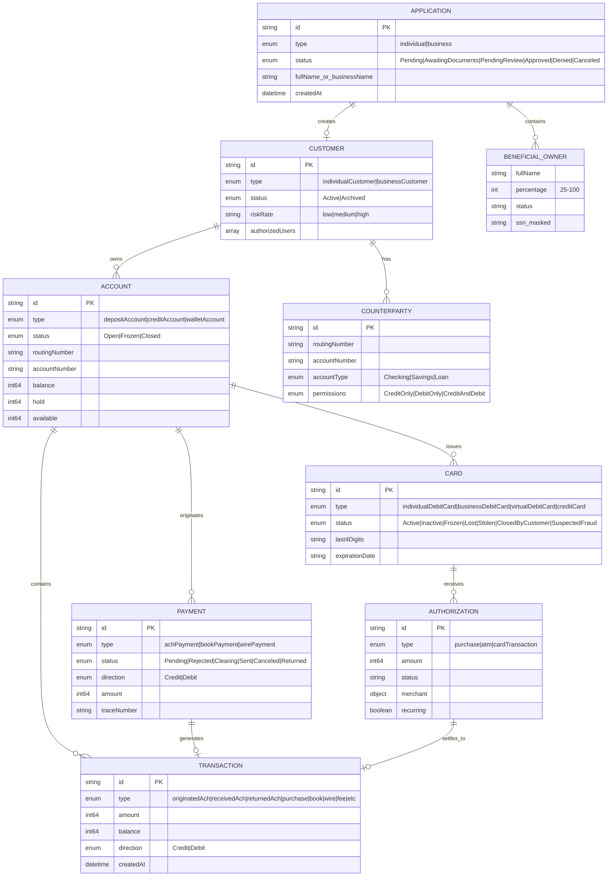
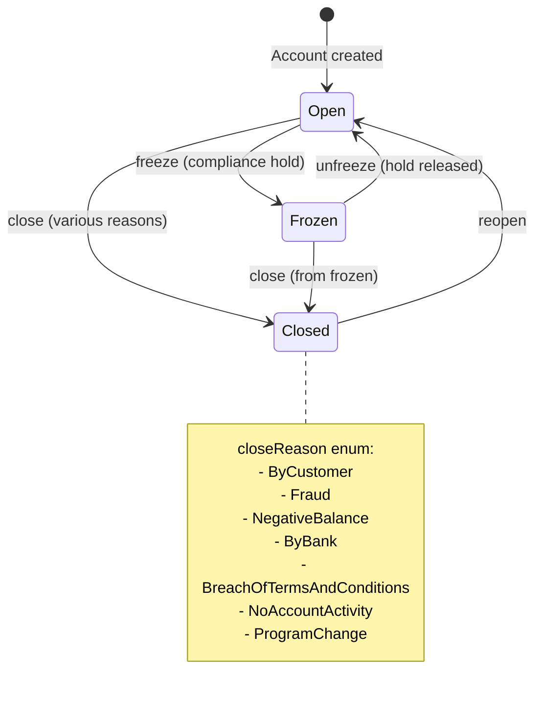
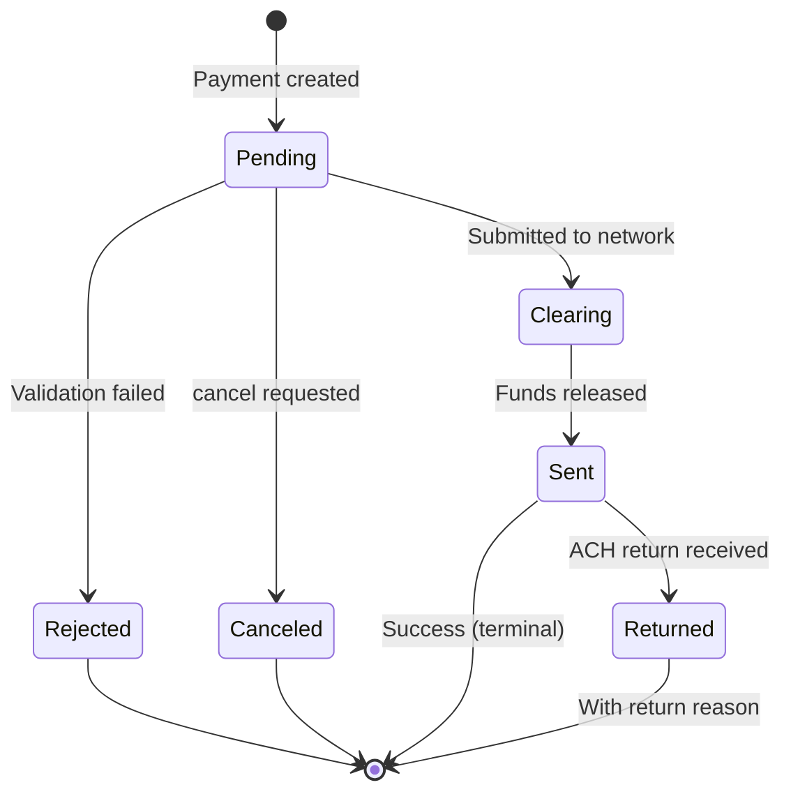
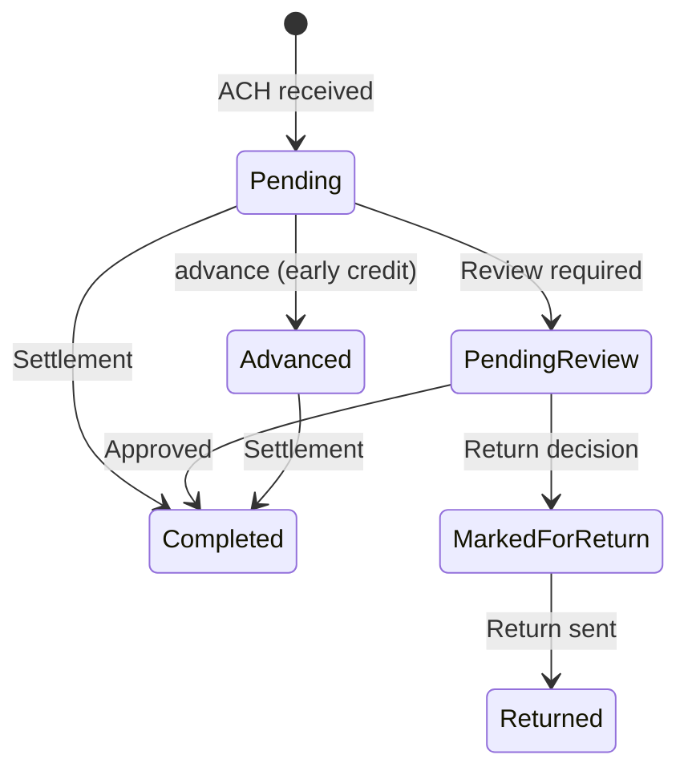
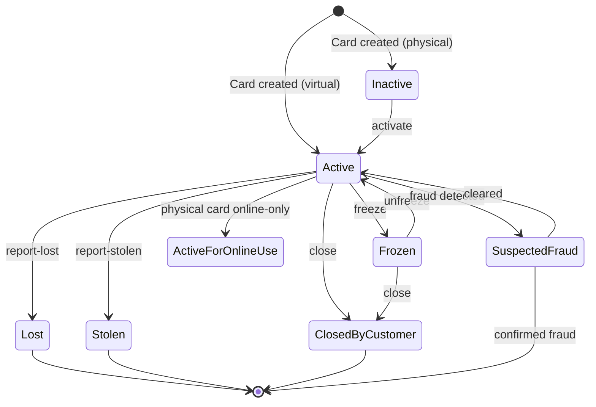
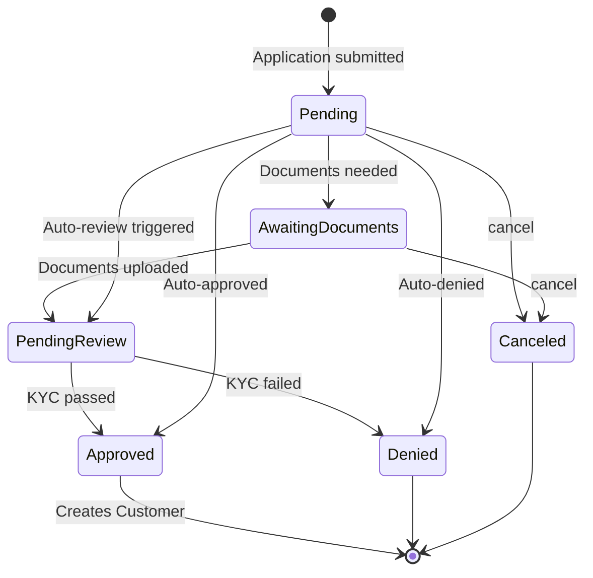
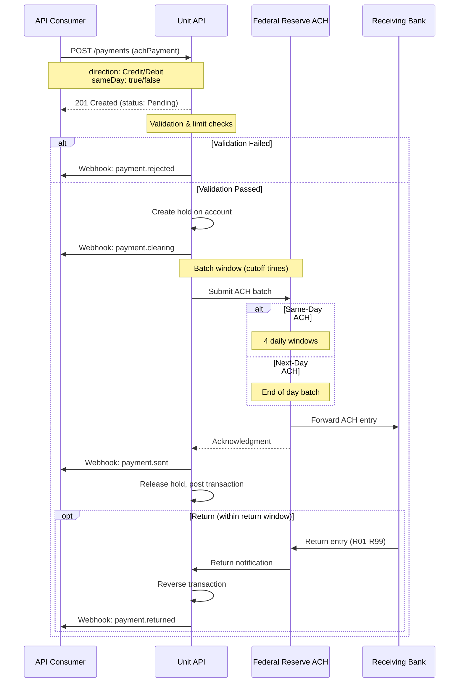
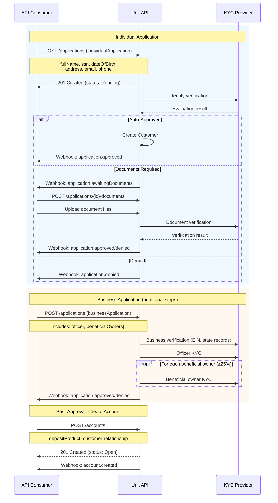
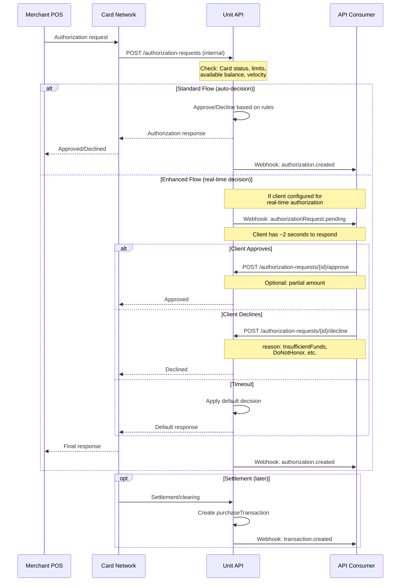

# Unit API Architecture Analysis

**Provider:** Unit  
**API Version:** 0.2.3  
**Analysis Date:** December 2024  
**Purpose:** Architectural decisions for Cassandra core banking system

---

## 1. Entity Relationships

### Entity Relationship Diagram

### Core Entity Summary

| Entity | ID Format | Key Attributes | Relationships |
|--------|-----------|----------------|---------------|
| **Application** | Numeric string | type, status, fullName/name, evaluationOutcome, riskRate | → Customer (on approval), → BeneficialOwners |
| **Customer** | Numeric string | type (individual/business), status, riskRate, authorizedUsers[] | → Application, → Accounts, → Counterparties |
| **Account** | Numeric string | type (deposit/credit/wallet), status, routingNumber, accountNumber, balance/hold/available | → Customer(s), → Transactions, → Cards |
| **Card** | Numeric string | type (debit/credit, physical/virtual), status, last4Digits, expirationDate | → Account, → Customer |
| **Payment** | Numeric string | type (ach/book/wire), status, direction, amount, traceNumber | → Account, → Transaction, → Counterparty |
| **Transaction** | Numeric string | type (30+ subtypes), amount, balance, direction | → Account, → Payment, → relatedTransaction |
| **Counterparty** | Numeric string | routingNumber, accountNumber, accountType, permissions | → Customer |
| **Authorization** | Numeric string | type, amount, status, merchant, partialApprovalAllowed | → Card, → Account, → Customer |

### Key Design Decisions

**Customer Model: Polymorphic with Discriminator**
- ✅ **Unified endpoint** (`/customers`) with type discriminator (`individualCustomer`, `businessCustomer`)
- Individual customers can also represent **sole proprietorships** (via `soleProprietorship: true` flag with optional EIN/DBA)
- Business customers require separate beneficial owner structures embedded in application

**Joint Account Support: Yes**
- ✅ **Explicitly supported** via `/accounts/{accountId}/relationships/customers` endpoint
- `AddAccountOwnersRequest` and `RemoveAccountOwnersRequest` allow multiple owners
- `CreateDepositAccount` accepts both singular `customer` and plural `customers` relationships
- Returns `DepositAccountOwners[]` array

**Sub-Account/Virtual Account Model**
- 🔶 Not a dedicated sub-account entity; uses **Wallet Accounts** for similar functionality
- Three account types: `depositAccount`, `creditAccount`, `walletAccount`
- Wallet accounts appear designed for fintech partner use cases

**Business Customer → Beneficial Owners**
- ✅ Beneficial owners embedded in **BusinessApplication** (not separate entity post-approval)
- Requires ownership percentage (25-100%)
- Each beneficial owner goes through KYC evaluation separately
- Can be updated via `/beneficial-owner/{beneficialOwnerId}`

**Transaction Linking Approach**
- ✅ **Relationship-based linking** using JSON:API relationships:
  - `relatedTransaction` - Points to related transaction (e.g., reversal → original)
  - `originalTransaction` - Points to originating transaction
  - `payment` - Links transaction to payment that caused it
- Each transaction type has specific relationships (e.g., `CardReversalTransactionRelationships` requires `relatedTransaction`)

---

## 2. State Machines

### Account States

| Transition | Trigger | API Endpoint | Notes |
|------------|---------|--------------|-------|
| → Open | Account creation | `POST /accounts` | Requires approved customer |
| Open → Frozen | Compliance hold | `POST /accounts/{id}/freeze` | Accepts `freezeReason` |
| Frozen → Open | Hold released | `POST /accounts/{id}/unfreeze` | - |
| Open → Closed | Close request | `POST /accounts/{id}/close` | Requires `closeReason` |
| Frozen → Closed | Close request | `POST /accounts/{id}/close` | Can close from frozen |
| Closed → Open | Reopen | `POST /accounts/{id}/reopen` | ✅ **Recoverable** |

**DACA (Deposit Account Control Agreement) Sub-States:**
- `Entered` → `Activated` via `/accounts/{id}/activate-daca`
- `Activated` → `Entered` via `/accounts/{id}/deactivate-daca`

### Payment/Transaction States (ACH)

| State | Description | Terminal? |
|-------|-------------|-----------|
| Pending | Created, awaiting processing | No |
| Rejected | Failed validation | Yes |
| Clearing | Submitted, funds held | No |
| Sent | Completed successfully | Yes (success) |
| Canceled | User canceled before clearing | Yes |
| Returned | ACH return received | Yes (failure) |

**Received Payment States (Incoming ACH):**

### Card States

| State | Recoverable? | Notes |
|-------|--------------|-------|
| Inactive | Yes → Active | Physical cards start here |
| Active | Yes | Normal operating state |
| Frozen | Yes → Active | Temporary hold |
| Lost | No | Terminal - must replace |
| Stolen | No | Terminal - must replace |
| ClosedByCustomer | No | Terminal |
| SuspectedFraud | Maybe | Can be cleared or become terminal |
| ActiveForOnlineUse | Yes | Physical card restricted to online use |

### Application (KYC) States

---

## 3. Critical Flows

### ACH Origination Flow (Credit & Debit)

**Timing:**
- **Sync Response:** ~200-500ms for 201 Created
- **Clearing:** Depends on same-day flag
  - Same-Day: Settlement same business day (cutoffs ~10:30am, 2:45pm, 4:45pm ET)
  - Next-Day: Settlement T+1
- **Return Window:** Up to 60 days for some return codes

**Return Handling:**
- Returns create `returnedAchTransaction` linked via `payment` relationship
- Return reason codes mapped to `AchReturnReason` enum
- Original transaction remains; return is new credit/debit entry

### Account Opening Flow

**Timing:**
- **Sync Response:** ~500ms-2s for application creation
- **Auto-Decision:** Often immediate (seconds) for clean applications
- **Manual Review:** 1-3 business days
- **Document Processing:** Hours to days depending on queue

**External Systems:**
- KYC vendor (identity verification, watchlist screening)
- State business registries (for business applications)
- Document verification services

### Card Authorization Flow

**Timing:**
- **Real-time Response SLA:** ~100-150ms for auto-decisions
- **Enhanced Auth Window:** ~2 seconds for client decision
- **Settlement:** T+1 to T+3 depending on network

**Decline Reasons Available:**
- AccountClosed
- CardExceedsAmountLimit
- DoNotHonor
- InsufficientFunds
- InvalidMerchant
- ReferToCardIssuer
- RestrictedCard
- TransactionNotPermittedToCardholder

---

## 4. Confidence Notes

| Area | Confidence | Notes |
|------|------------|-------|
| **Entity Relationships** | ✅ Documented | Clear from schema discriminators and relationships |
| **Joint Account Support** | ✅ Documented | Explicit endpoints for adding/removing owners |
| **Account States** | ✅ Documented | Explicit enum + dedicated endpoints |
| **Payment States** | ✅ Documented | Status enum in schema |
| **Card States** | ✅ Documented | PhysicalCardStatus/VirtualCardStatus enums |
| **Application States** | ✅ Documented | ApplicationStatus enum |
| **ACH Timing/Cutoffs** | 🔶 Inferred | Same-day flag exists; specific cutoffs not in OpenAPI |
| **Real-time Auth Config** | 🔶 Inferred | AuthorizationRequest endpoints exist; webhook config unclear |
| **GL Account Exposure** | ✅ Documented | GlAccount and OrgGeneralLedgerAccount schemas present |
| **Return Window Details** | ❓ Unclear | AchReturnReason enum exists; window timing not documented |
| **Settlement Timing** | 🔶 Inferred | settlementDate field exists; exact timing rules unclear |

---

## 5. Notable Design Decisions

### Strengths for Sponsor Banking

1. **Explicit Joint Account Support** - First-class multi-owner accounts
2. **Granular Card Control** - Real-time authorization hooks with partial approval
3. **Rich Transaction Taxonomy** - 30+ transaction types with clear linking
4. **GL Account Visibility** - Org-level ledger accounts exposed
5. **Flexible Counterparty Model** - Permissions-based (credit-only, debit-only, both)
6. **DACA Support** - Built-in deposit account control agreement states

### Areas to Verify

1. **FBO Account Patterns** - Not explicitly documented in OpenAPI
2. **Multi-Program Separation** - Org structure exists but tenant isolation unclear
3. **Wire Transfer Limits** - Wire payments exist but detailed rules not in spec
4. **Batch Processing Windows** - Specific ACH batch timing not documented
5. **Account Number Recycling** - Policy on reuse after closure unclear

### Interesting/Unusual

- **Sole Proprietorship as Individual** - Individual customers can have EIN/DBA (not separate type)
- **Recoverable Closed Accounts** - Reopen endpoint exists (unusual for many providers)
- **Business Wallet Customer** - Third customer type for fintech partners (bank name field)
- **Idempotency Keys** - First-class support on account/payment creation
- **Secondary Account Numbers** - Deposit accounts can have two routing/account pairs