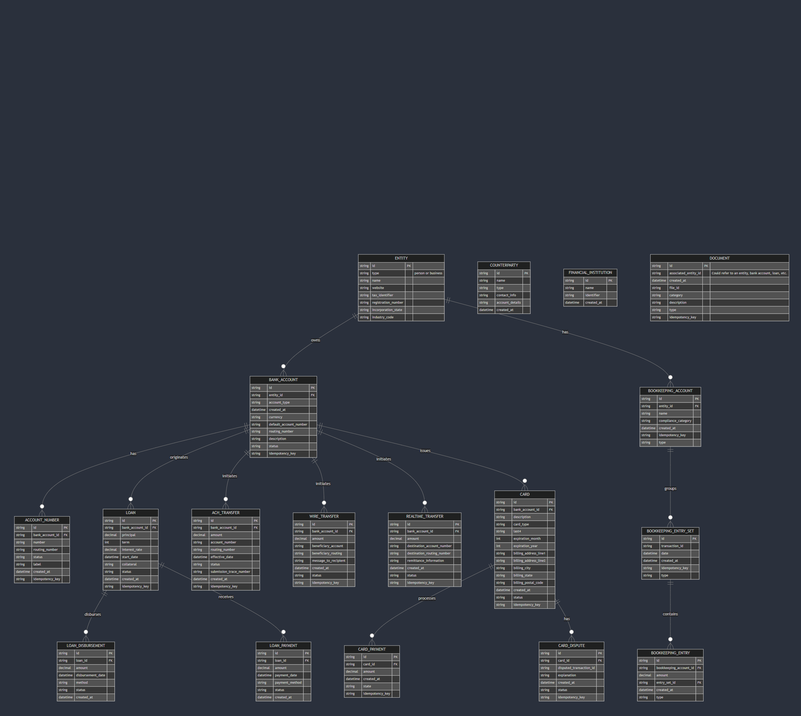
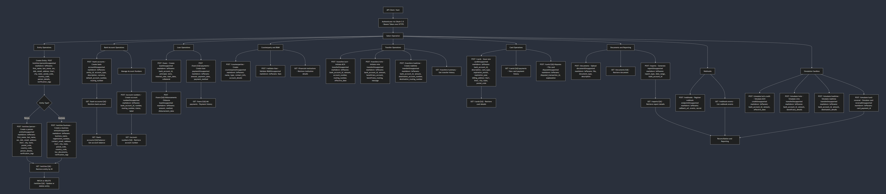

## Textual Diagram

```
Lead Bank API
├── Authentication
│   └── OAuth 2.0 (Bearer Token: sandbox/live) over HTTPS
│
├── Entity
│   ├── Person Entity Object
│   │   ├─ **Parameters:** first_name, last_name, ssn, date_of_birth, email, address (line1, city, state, postal_code, country_code), kyc_status, verification_data
│   │   ├─ **Endpoint:** POST /entities/person  (Create a person entity)
│   │   └─ **Endpoint:** PATCH /entities/person  (Update a person entity)
│   │
│   ├── Business Entity Object
│   │   ├─ **Parameters:** business_name, registration_number, contact_email, address (line1, city, state, postal_code, country_code), kyc_documents, verification_tags
│   │   ├─ **Endpoint:** POST /entities/business  (Create a business entity)
│   │   └─ **Endpoint:** PATCH /entities/business  (Update a business entity)
│   │
│   ├─ **Endpoint:** GET /entities/{id}   (Retrieve an entity by ID)
│   ├─ **Endpoint:** DELETE /entities/{id}   (Delete an entity)
│   └─ **Endpoint:** GET /entities   (List all entities)
│       └─ (Includes document submission endpoints for entity documents)
│
├── Bank Account
│   ├── Bank Account Object
│   │   ├─ **Parameters:** entity_id, account_type, description, currency, default_account_number, routing_number, etc.
│   │   ├─ **Endpoint:** POST /bank-accounts   (Create a bank account)
│   │   ├─ **Endpoint:** GET /bank-accounts   (List all bank accounts)
│   │   ├─ **Endpoint:** GET /bank-accounts/{id}   (Get a bank account by ID)
│   │   ├─ **Endpoint:** PATCH /bank-accounts/{id}   (Update a bank account)
│   │   └─ **Endpoint:** DELETE /bank-accounts/{id}   (Delete a bank account)
│   │
│   └── Account Balance
│       └─ **Endpoint:** GET /bank-accounts/{id}/balance   (Retrieve current balance)
│
├── Account Number
│   ├── Account Number Object
│   │   ├─ **Parameters:** bank_account_id, number, routing_number, status, label
│   │   ├─ **Endpoint:** POST /account-numbers   (Create an account number)
│   │   ├─ **Endpoint:** GET /account-numbers   (List account numbers)
│   │   └─ **Endpoint:** GET /account-numbers/{id}   (Retrieve an account number)
│
├── Loan
│   ├── Loan Object
│   │   ├─ **Parameters:** bank_account_id, principal, term, interest_rate, start_date, collateral, etc.
│   │   ├─ **Endpoint:** POST /loans   (Create a loan)
│   │   ├─ **Endpoint:** GET /loans   (List loans)
│   │   ├─ **Endpoint:** GET /loans/{id}   (Retrieve a loan)
│   │   └─ **Endpoint:** PATCH /loans/{id}   (Update a loan)
│   │
│   ├── Loan Disbursement
│   │   ├─ **Endpoint:** POST /loans/{id}/disbursements   (Initiate a disbursement)
│   │   ├─ **Endpoint:** GET /loans/{id}/disbursements   (List disbursements)
│   │   └─ **Endpoint:** PATCH /loans/{id}/disbursements   (Update a disbursement)
│   │
│   └── Loan Payment
│       ├─ **Endpoint:** POST /loans/{id}/payments   (Submit a payment)
│       ├─ **Endpoint:** GET /loans/{id}/payments   (List payments)
│       └─ **Endpoint:** GET /loans/{id}/all-payments   (All payment history)
│
├── Counterparty
│   ├── Counterparty Object
│   │   ├─ **Endpoint:** POST /counterparties   (Create a counterparty)
│   │   ├─ **Endpoint:** GET /counterparties   (List counterparties)
│   │   ├─ **Endpoint:** GET /counterparties/{id}   (Retrieve a counterparty)
│   │   └─ **Endpoint:** DELETE /counterparties/{id}   (Delete a counterparty)
│   │
│   ├── Financial Institution Object
│   │   └─ **Endpoint:** GET /financial-institutions   (Get institution details)
│   │
│   └── IBAN Validation
│       └─ **Endpoint:** POST /validate-iban   (Validate an IBAN)
│
├── Transfers
│   ├── ACH Transfer
│   │   ├─ **Parameters:** bank_account_id, amount, account_number, routing_number, effective_date, etc.
│   │   ├─ **Endpoint:** POST /transfers/ach   (Initiate an ACH transfer)
│   │   ├─ **Endpoint:** GET /transfers/ach   (List ACH transfers)
│   │   ├─ **Endpoint:** GET /transfers/ach/{id}   (Retrieve an ACH transfer)
│   │   ├─ **Endpoint:** POST /transfers/ach/{id}/cancel   (Cancel an ACH transfer)
│   │   └─ **Endpoint:** POST /transfers/ach/{id}/reverse   (Reverse an ACH transfer)
│   │
│   ├── Wire Transfer
│   │   ├─ **Parameters:** bank_account_id, amount, beneficiary_account, beneficiary_routing, message, etc.
│   │   ├─ **Endpoint:** POST /transfers/wire   (Initiate a wire transfer)
│   │   ├─ **Endpoint:** GET /transfers/wire   (List wire transfers)
│   │   ├─ **Endpoint:** GET /transfers/wire/{id}   (Retrieve a wire transfer)
│   │   └─ **Endpoint:** POST /transfers/wire/{id}/reverse   (Reverse a wire transfer)
│   │
│   ├── Realtime Transfer
│   │   ├─ **Endpoint:** POST /transfers/realtime   (Create a realtime transfer)
│   │   ├─ **Endpoint:** GET /transfers/realtime   (List realtime transfers)
│   │   └─ **Endpoint:** GET /transfers/realtime/{id}   (Retrieve a realtime transfer)
│   │
│   └── Transfer Summary
│       └─ **Endpoint:** GET /transfers/summary   (Get transfer history)
│
├── Cards
│   ├── Card Object
│   │   ├─ **Parameters:** bank_account_id, description, card_type, expiration_month, expiration_year, billing_address, etc.
│   │   ├─ **Endpoint:** POST /cards   (Issue a new card)
│   │   ├─ **Endpoint:** GET /cards   (List all cards)
│   │   ├─ **Endpoint:** GET /cards/{id}   (Retrieve card details)
│   │   └─ **Endpoint:** PATCH /cards/{id}   (Update card information)
│   │
│   ├── Card Payment
│   │   └─ **Endpoint:** GET /cards/{id}/payments   (View card payment history)
│   │
│   └── Card Dispute
│       └─ **Endpoint:** POST /cards/{id}/disputes   (File a card dispute)
│
├── Documents
│   ├── Document Upload
│   │   └─ **Endpoint:** POST /documents   (Upload a document)
│   └── Document Retrieve
│       └─ **Endpoint:** GET /documents/{id}   (Fetch a document)
│
├── Reporting
│   ├── Report Generation
│   │   ├─ **Endpoint:** POST /reports   (Generate a report)
│   │   └─ **Endpoint:** GET /reports/{id}   (Retrieve report details)
│   └── Report Listing
│       └─ **Endpoint:** GET /reports   (List available reports)
│
├── Webhooks
│   ├── Webhook Endpoint
│   │   ├─ **Endpoint:** POST /webhooks   (Register a webhook)
│   │   ├─ **Endpoint:** GET /webhooks   (List webhook endpoints)
│   │   ├─ **Endpoint:** PATCH /webhooks/{id}   (Update a webhook)
│   │   └─ **Endpoint:** DELETE /webhooks/{id}   (Remove a webhook)
│   └── Webhook Events
│       └─ **Endpoint:** GET /webhook-events   (List webhook events)
│
└── Simulation (Sandbox Only)
    ├─ **Endpoint:** POST /simulate/ach-credit      (Simulate an ACH credit)
    ├─ **Endpoint:** POST /simulate/wire           (Simulate a wire transfer)
    ├─ **Endpoint:** POST /simulate/realtime       (Simulate a realtime transfer)
    └─ **Endpoint:** POST /simulate/card-reversal  (Simulate a card authorization reversal)

```

## Schema 
erDiagram
    ENTITY {
      string id PK
      string type "person or business"
      string name
      string website
      string tax_identifier
      string registration_number
      string incorporation_state
      string industry_code
    }

    BANK_ACCOUNT {
      string id PK
      string entity_id FK
      string account_type
      datetime created_at
      string currency
      string default_account_number
      string routing_number
      string description
      string status
      string idempotency_key
    }

    ACCOUNT_NUMBER {
      string id PK
      string bank_account_id FK
      string number
      string routing_number
      string status
      string label
      datetime created_at
      string idempotency_key
    }

    LOAN {
      string id PK
      string bank_account_id FK
      decimal principal
      int term
      decimal interest_rate
      datetime start_date
      string collateral
      string status
      datetime created_at
      string idempotency_key
    }

    LOAN_DISBURSEMENT {
      string id PK
      string loan_id FK
      decimal amount
      datetime disbursement_date
      string method
      string status
      datetime created_at
    }

    LOAN_PAYMENT {
      string id PK
      string loan_id FK
      decimal amount
      datetime payment_date
      string payment_method
      string status
      datetime created_at
    }

    COUNTERPARTY {
      string id PK
      string name
      string type
      string contact_info
      string account_details
      datetime created_at
    }

    FINANCIAL_INSTITUTION {
      string id PK
      string name
      string identifier
      datetime created_at
    }

    ACH_TRANSFER {
      string id PK
      string bank_account_id FK
      decimal amount
      string account_number
      string routing_number
      datetime effective_date
      string status
      string submission_trace_number
      datetime created_at
      string idempotency_key
    }

    WIRE_TRANSFER {
      string id PK
      string bank_account_id FK
      decimal amount
      string beneficiary_account
      string beneficiary_routing
      string message_to_recipient
      datetime created_at
      string status
      string idempotency_key
    }

    REALTIME_TRANSFER {
      string id PK
      string bank_account_id FK
      decimal amount
      string destination_account_number
      string destination_routing_number
      string remittance_information
      datetime created_at
      string status
      string idempotency_key
    }

    CARD {
      string id PK
      string bank_account_id FK
      string description
      string card_type
      string last4
      int expiration_month
      int expiration_year
      string billing_address_line1
      string billing_address_line2
      string billing_city
      string billing_state
      string billing_postal_code
      datetime created_at
      string status
      string idempotency_key
    }

    CARD_PAYMENT {
      string id PK
      string card_id FK
      decimal amount
      datetime created_at
      string state
      string idempotency_key
    }

    CARD_DISPUTE {
      string id PK
      string card_id FK
      string disputed_transaction_id
      string explanation
      datetime created_at
      string status
      string idempotency_key
    }

    DOCUMENT {
      string id PK
      string associated_entity_id "Could refer to an entity, bank account, loan, etc."
      datetime created_at
      string file_id
      string category
      string description
      string type
      string idempotency_key
    }

    WEBHOOK {
      string id PK
      string callback_url
      string events
      datetime created_at
      string status
      string idempotency_key
    }

    EXPORT {
      string id PK
      datetime created_at
      string category
      string status
      string file_id
      string file_download_url
      string idempotency_key
      string type
    }

    BOOKKEEPING_ACCOUNT {
      string id PK
      string entity_id FK
      string name
      string compliance_category
      datetime created_at
      string idempotency_key
      string type
    }

    BOOKKEEPING_ENTRY_SET {
      string id PK
      string transaction_id
      datetime date
      datetime created_at
      string idempotency_key
      string type
    }

    BOOKKEEPING_ENTRY {
      string id PK
      string bookkeeping_account_id FK
      decimal amount
      string entry_set_id FK
      datetime created_at
      string type
    }

    OAUTH_CONNECTION {
      string id PK
      string group_id FK
      datetime created_at
      string status
      string deleted_at
      string type
    }

    GROUP {
      string id PK
      datetime created_at
      string activation_status
      string ach_debit_status
      string type
    }

    OAUTH_TOKEN {
      string access_token
      string token_type
      string type
    }

    INTRAFI_ACCOUNT_ENROLLMENT {
      string id PK
      string bank_account_id FK
      string status
      string intrafi_id
      datetime created_at
      string idempotency_key
      string type
    }

    INTRAFI_BALANCE {
      datetime effective_date
      decimal total_balance
      string currency
      string type
    }

    INTRAFI_EXCLUSION {
      string id PK
      datetime submitted_at
      datetime excluded_at
      string bank_name
      string fdic_certificate_number
      string entity_id FK
      string status
      string idempotency_key
      string type
    }

    ACH_PRENOTIFICATION {
      string id PK
      string account_number
      string routing_number
      datetime created_at
      string status
      string addendum
      string company_descriptive_date
      string company_discretionary_data
      string company_entry_description
      string company_name
      string credit_debit_indicator
      string effective_date
      string idempotency_key
      string type
    }

    %% Relationships
    ENTITY ||--o{ BANK_ACCOUNT : "owns"
    BANK_ACCOUNT ||--o{ ACCOUNT_NUMBER : "has"
    BANK_ACCOUNT ||--o{ LOAN : "originates"
    LOAN ||--o{ LOAN_DISBURSEMENT : "disburses"
    LOAN ||--o{ LOAN_PAYMENT : "receives"
    BANK_ACCOUNT ||--o{ ACH_TRANSFER : "initiates"
    BANK_ACCOUNT ||--o{ WIRE_TRANSFER : "initiates"
    BANK_ACCOUNT ||--o{ REALTIME_TRANSFER : "initiates"
    BANK_ACCOUNT ||--o{ CARD : "issues"
    CARD ||--o{ CARD_PAYMENT : "processes"
    CARD ||--o{ CARD_DISPUTE : "has"
    ENTITY ||--o{ BOOKKEEPING_ACCOUNT : "has"
    BOOKKEEPING_ACCOUNT ||--o{ BOOKKEEPING_ENTRY_SET : "groups"
    BOOKKEEPING_ENTRY_SET ||--o{ BOOKKEEPING_ENTRY : "contains"
    GROUP ||--o{ OAUTH_CONNECTION : "has"



flowchart TD
    A[API Client: Start]
    B[Authenticate via OAuth 2.0 – Bearer Token over HTTPS]
    A --> B
    B --> C[Select Operation]

    %% Entity Operations
    C --> D[Entity Operations]
    D --> D1[Create Entity: POST /entities/person  
Params: first_name, last_name, ssn, dob, email, address: line1, city, state, postal_code, country_code, person_details, verification_tags]
    D1 --> D2{Entity Type?}
    D2 -- Person --> D3[POST /entities/person – Create a person entity  
Params: first_name, last_name, ssn, dob, email, address: line1, city, state, postal_code, country_code, person_details, verification_tags]
    D2 -- Business --> D4[POST /entities/business – Create a business entity  
Params: business_name, registration_number, contact_email, address: line1, city, state, postal_code, country_code, kyc_documents, verification_tags]
    D3 & D4 --> D5[GET /entities/#123;id#125; – Retrieve entity by ID]
    D5 --> D6[PATCH or DELETE /entities/#123;id#125; – Update or delete entity]

    %% Bank Account Operations
    C --> E[Bank Account Operations]
    E --> E1[POST /bank-accounts – Create bank account  
Params: entity_id, account_type, description, currency, default_account_number, routing_number]
    E1 --> E2[GET /bank-accounts/#123;id#125; – Retrieve bank account]
    E2 --> E3[GET /bank-accounts/#123;id#125;/balance – Get account balance]
    E --> E4[Manage Account Numbers]
    E4 --> E41[POST /account-numbers – Create account number  
Params: bank_account_id, number, routing_number, status, label]
    E41 --> E42[GET /account-numbers/#123;id#125; – Retrieve account number]

    %% Loan Operations
    C --> F[Loan Operations]
    F --> F1[POST /loans – Create loan  
Params: bank_account_id, principal, term, interest_rate, start_date, collateral]
    F1 --> F2[POST /loans/#123;id#125;/disbursements – Disburse loan  
Params: amount, method, disbursement_date]
    F --> F3[POST /loans/#123;id#125;/payments – Create loan payment  
Params: amount, payment_date, payment_method]
    F3 --> F4[GET /loans/#123;id#125;/all-payments – Payment history]

    %% Counterparty and IBAN
    C --> G[Counterparty and IBAN]
    G --> G1[POST /counterparties – Create counterparty  
Params: name, type, contact_info, account_details]
    G --> G2[POST /validate-iban – Validate IBAN  
Params: iban]
    G --> G3[GET /financial-institutions – Retrieve institution details]

    %% Transfer Operations
    C --> H[Transfer Operations]
    H --> H1[POST /transfers/ach – Initiate ACH transfer  
Params: bank_account_id, amount, account_number, routing_number, effective_date]
    H --> H2[POST /transfers/wire – Initiate wire transfer  
Params: bank_account_id, amount, beneficiary_account, beneficiary_routing, message]
    H --> H3[POST /transfers/realtime – Create realtime transfer  
Params: bank_account_id, amount, destination_account_number, destination_routing_number]
    H --> H4[GET /transfers/summary – Get transfer history]

    %% Card Operations
    C --> I[Card Operations]
    I --> I1[POST /cards – Issue new card  
Params: bank_account_id, description, card_type, expiration_month, expiration_year, billing_address: line1, line2, city, state, postal_code]
    I1 --> I2[GET /cards/#123;id#125; – Retrieve card details]
    I --> I3[GET /cards/#123;id#125;/payments – View card payment history]
    I --> I4[POST /cards/#123;id#125;/disputes – File card dispute  
Params: disputed_transaction_id, explanation]

    %% Documents and Reporting
    C --> J[Documents and Reporting]
    J --> J1[POST /documents – Upload document  
Params: file, document_type, description]
    J --> J2[GET /documents/#123;id#125; – Retrieve document]
    J --> J3[POST /reports – Generate report  
Params: report_type, date_range, bank_account_id]
    J3 --> J4[GET /reports/#123;id#125; – Retrieve report details]

    %% Webhooks
    C --> K[Webhooks]
    K --> K1[POST /webhooks – Register webhook endpoint  
Params: callback_url, events, secret]
    K --> K2[GET /webhook-events – List webhook events]

    %% Simulation (Sandbox Only)
    C --> L[Simulation Sandbox]
    L --> L1[POST /simulate/ach-credit – Simulate ACH credit  
Params: bank_account_id, amount, effective_date]
    L --> L2[POST /simulate/wire – Simulate wire transfer  
Params: bank_account_id, amount, beneficiary_details]
    L --> L3[POST /simulate/realtime – Simulate realtime transfer  
Params: bank_account_id, amount, destination_details]
    L --> L4[POST /simulate/card-reversal – Simulate card reversal  
Params: card_payment_id]

    %% End Flow
    J4 --> M[Reconciliation and Reporting]
    K2 --> M
    L4 --> M
