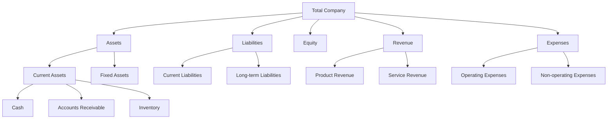
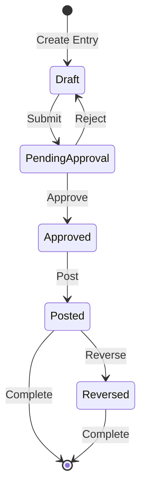
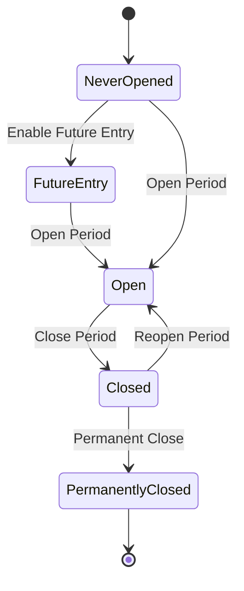
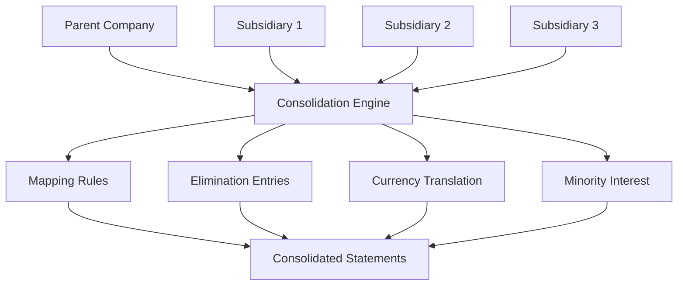
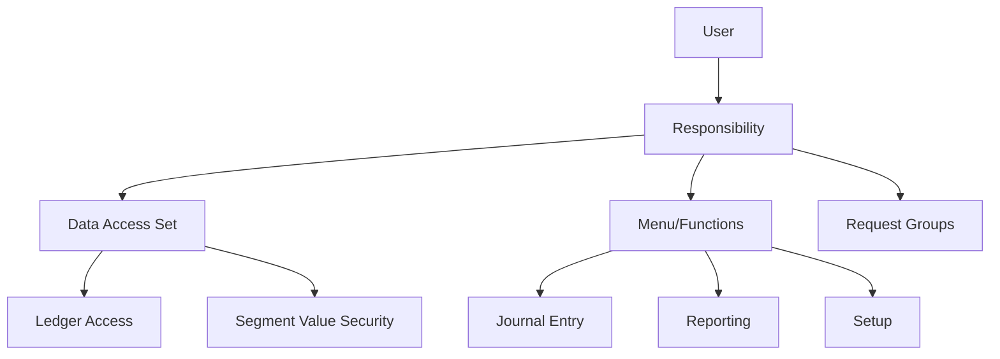
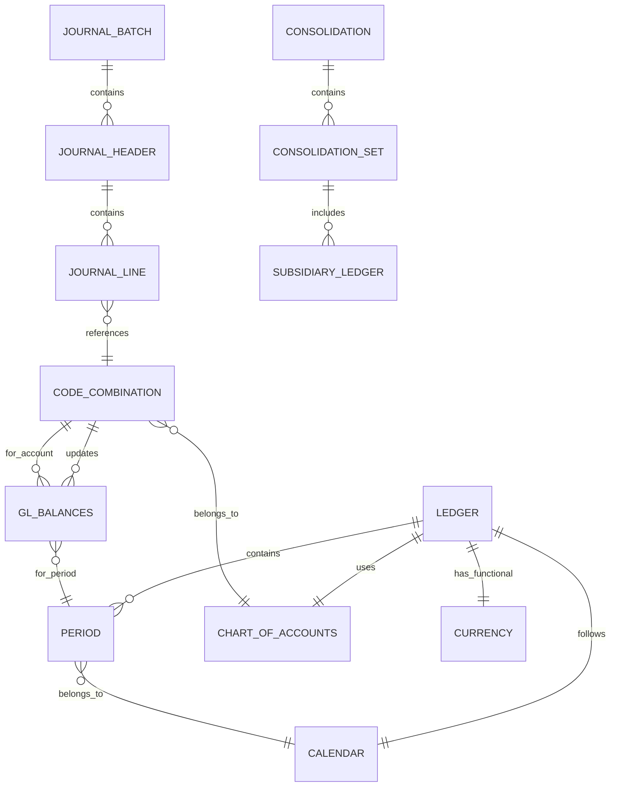

# Enterprise Accounting Ledger System Technical Specification
*Based on Oracle General Ledger Release 12.2 Architecture Analysis*

## Executive Summary

This document provides comprehensive technical requirements for designing a reliable, enterprise-grade accounting ledger system extracted from Oracle General Ledger documentation. The specification covers core architectural patterns, data models, processing frameworks, and integration requirements necessary for building a modern, cloud-native financial system.

---

## 1. Core Ledger Architecture

### 1.1 Fundamental Data Structures

#### Primary Entities
- **Ledger**: Core accounting entity containing all financial data
- **Chart of Accounts**: Flexible account structure definition  
- **Calendar**: Accounting period management system
- **Currency**: Multi-currency support framework
- **Legal Entity/Accounting Entity**: Organizational hierarchy

#### Multi-Ledger Architecture Patterns
```yaml
ledger_types:
  primary:
    purpose: "Main accounting ledger for legal entity"
    characteristics:
      - Complete journal processing
      - Full posting capabilities
      - Primary financial statements
  
  secondary:
    purpose: "Alternative accounting representations"
    characteristics:
      - Different accounting principles (GAAP vs IFRS)
      - Alternative currency representations
      - Parallel accounting treatments
  
  reporting:
    purpose: "Reporting-only ledgers"
    characteristics:
      - No direct journal entry
      - Automated translation/conversion
      - Multiple reporting currencies
```

### 1.2 Accounting Flexfield Structure

```yaml
flexfield_segments:
  balancing_segment:
    description: "Company/Entity identifier"
    properties:
      - Must balance within journals
      - Enables intercompany processing
      - Security boundary
  
  natural_account:
    description: "Account type identifier"
    properties:
      - Assets, Liabilities, Equity, Revenue, Expense
      - Drives accounting behavior
      - Financial statement mapping
  
  cost_center:
    description: "Organizational unit"
    properties:
      - Department/Division tracking
      - Management reporting
      - Budget control
  
  additional_segments:
    - product_line
    - project
    - geography
    - intercompany
    - future_use (up to 30 segments total)
```

---

## 2. Chart of Accounts Requirements

### 2.1 Segment Configuration

```yaml
segment_types:
  balancing:
    validation_rules:
      - Must be unique across ledger
      - Automatic intercompany generation
      - Security by value
    
  natural_account:
    account_types:
      asset:
        normal_balance: debit
        close_at_year_end: false
      liability:
        normal_balance: credit
        close_at_year_end: false
      equity:
        normal_balance: credit
        close_at_year_end: false
        retained_earnings_account: required
      revenue:
        normal_balance: credit
        close_at_year_end: true
      expense:
        normal_balance: debit
        close_at_year_end: true
      statistical:
        normal_balance: either
        non_monetary: true
```

### 2.2 Validation Framework

```sql
-- Cross-validation rules example
CREATE TABLE gl_cross_validation_rules (
  rule_id NUMBER PRIMARY KEY,
  rule_name VARCHAR2(150),
  segment1_low VARCHAR2(25),
  segment1_high VARCHAR2(25),
  segment2_low VARCHAR2(25),
  segment2_high VARCHAR2(25),
  include_exclude_flag CHAR(1), -- 'I' Include, 'E' Exclude
  enabled_flag CHAR(1) DEFAULT 'Y'
);

-- Dynamic insertion rules
CREATE TABLE gl_dynamic_insert_rules (
  rule_id NUMBER PRIMARY KEY,
  segment_num NUMBER,
  parent_value VARCHAR2(25),
  child_range_low VARCHAR2(25),
  child_range_high VARCHAR2(25),
  enabled_flag CHAR(1) DEFAULT 'Y'
);
```

### 2.3 Account Hierarchies



---

## 3. Journal Processing Framework

### 3.1 Journal Entry Lifecycle



### 3.2 Journal Sources and Categories

```yaml
journal_sources:
  manual:
    description: "Direct user entry"
    approval_required: true
    
  subledger:
    types:
      - accounts_payable
      - accounts_receivable
      - fixed_assets
      - inventory
      - payroll
      - projects
    approval_required: false
    
  automated:
    types:
      - recurring_journals
      - allocations
      - revaluation
      - translation
      - consolidation
    approval_required: false
```

### 3.3 Journal Batch Processing

```yaml
batch_structure:
  batch:
    attributes:
      - batch_id (PK)
      - batch_name
      - batch_description
      - period_name
      - control_total
      - status
      - posted_date
    
    contains_many: journals
    
  journal:
    attributes:
      - journal_id (PK)
      - batch_id (FK)
      - journal_name
      - journal_category
      - journal_source
      - currency_code
      - conversion_rate
      - journal_description
    
    contains_many: journal_lines
    
  journal_line:
    attributes:
      - line_id (PK)
      - journal_id (FK)
      - line_number
      - code_combination_id
      - entered_dr
      - entered_cr
      - accounted_dr
      - accounted_cr
      - description
      - reference_1 through reference_10
```

### 3.4 Posting Process

```python
# Pseudo-code for posting validation
def validate_journal_for_posting(journal):
    validations = [
        check_period_open(journal.period),
        check_balanced(journal),
        check_valid_accounts(journal.lines),
        check_currency_conversion(journal),
        check_intercompany_balanced(journal),
        check_budget_available(journal) if budgetary_control_enabled
    ]
    
    errors = [v for v in validations if not v.passed]
    if errors:
        journal.status = 'ERROR'
        journal.errors = errors
        return False
    
    return True

def post_journal(journal):
    if not validate_journal_for_posting(journal):
        return False
    
    with transaction():
        # Update balances
        for line in journal.lines:
            update_balance(line.account, line.amount, journal.period)
            
        # Create audit trail
        create_audit_entry(journal)
        
        # Update journal status
        journal.status = 'POSTED'
        journal.posted_date = current_timestamp()
        
    return True
```

---

## 4. Period Management & Calendar

### 4.1 Calendar Structure

```yaml
calendar_types:
  standard:
    periods_per_year: 12
    adjusting_periods: 1-2
    
  fiscal_5_4_4:
    periods_per_year: 12
    weeks_pattern: [5, 4, 4, 5, 4, 4, 5, 4, 4, 5, 4, 4]
    
  custom:
    periods_per_year: variable
    period_definitions: custom_table
```

### 4.2 Period Status Management



### 4.3 Year-End Processing

```yaml
year_end_procedures:
  income_statement_close:
    steps:
      1: validate_all_periods_closed
      2: calculate_net_income
      3: create_closing_entries
      4: post_to_retained_earnings
      5: zero_revenue_expense_accounts
    
  balance_sheet_rollforward:
    steps:
      1: carry_forward_balance_sheet_accounts
      2: carry_forward_encumbrances
      3: create_opening_period_entries
      4: validate_trial_balance
```

---

## 5. Multi-Currency Architecture

### 5.1 Currency Framework

```yaml
currency_types:
  functional:
    description: "Primary currency of the ledger"
    characteristics:
      - All transactions ultimately converted to this
      - Balance sheet currency
      - Statutory reporting currency
  
  foreign:
    description: "Transaction currencies"
    characteristics:
      - Requires conversion to functional
      - Exchange rate management
      - Realized/unrealized gains tracking
  
  reporting:
    description: "Additional reporting currencies"
    characteristics:
      - Parallel accounting
      - Automated translation
      - Multiple reporting views
  
  statistical:
    description: "Non-monetary units"
    characteristics:
      - Quantities, headcount, etc.
      - No currency conversion
      - Supplemental information
```

### 5.2 Conversion and Revaluation

```sql
-- Exchange rate management
CREATE TABLE gl_daily_rates (
  from_currency VARCHAR2(15),
  to_currency VARCHAR2(15),
  conversion_date DATE,
  conversion_type VARCHAR2(30),
  conversion_rate NUMBER,
  inverse_rate NUMBER,
  PRIMARY KEY (from_currency, to_currency, conversion_date, conversion_type)
);

-- Revaluation tracking
CREATE TABLE gl_revaluation_details (
  revaluation_id NUMBER PRIMARY KEY,
  period_name VARCHAR2(15),
  currency_code VARCHAR2(15),
  account_combination_id NUMBER,
  original_balance NUMBER,
  revalued_balance NUMBER,
  gain_loss_amount NUMBER,
  unrealized_gain_loss_account NUMBER
);
```

### 5.3 Translation Methods

```yaml
translation_methods:
  current_rate:
    balance_sheet: period_end_rate
    income_statement: average_rate
    equity: historical_rate
    
  temporal:
    monetary_assets_liabilities: period_end_rate
    non_monetary_assets: historical_rate
    income_statement: weighted_average_rate
    
  remeasurement:
    functional_currency_change: true
    all_accounts: current_rate
```

---

## 6. Consolidation Framework

### 6.1 Consolidation Architecture



### 6.2 Consolidation Methods

```yaml
consolidation_methods:
  balance_transfer:
    description: "Transfer balances to parent"
    process:
      - Extract subsidiary balances
      - Apply mapping rules
      - Convert currency
      - Transfer to parent ledger
      - Create elimination entries
  
  journal_transfer:
    description: "Transfer detailed journals"
    process:
      - Extract subsidiary journals
      - Map accounts to parent COA
      - Convert currencies
      - Import journals to parent
      - Post consolidation journals
```

### 6.3 Elimination Entries

```sql
-- Elimination rules configuration
CREATE TABLE gl_elimination_rules (
  rule_id NUMBER PRIMARY KEY,
  rule_name VARCHAR2(150),
  rule_type VARCHAR2(30), -- 'INTERCOMPANY', 'INVESTMENT', 'MINORITY'
  source_account_from NUMBER,
  source_account_to NUMBER,
  target_elimination_account NUMBER,
  automatic_flag CHAR(1) DEFAULT 'Y',
  enabled_flag CHAR(1) DEFAULT 'Y'
);
```

---

## 7. Security & Data Access Model

### 7.1 Access Control Framework

```yaml
security_model:
  data_access_sets:
    ledger_access:
      full_access:
        - read_write_all_ledgers
        - post_journals
        - run_reports
      
      restricted_access:
        - read_specific_ledgers
        - create_journals_no_post
        - view_reports
    
    segment_security:
      balancing_segment:
        - access_by_company
        - intercompany_restrictions
      
      cost_center:
        - departmental_access
        - hierarchical_inheritance
```

### 7.2 Responsibility Model



### 7.3 Audit Trail Requirements

```sql
-- Comprehensive audit trail
CREATE TABLE gl_audit_trail (
  audit_id NUMBER PRIMARY KEY,
  table_name VARCHAR2(30),
  record_id NUMBER,
  action VARCHAR2(10), -- 'INSERT', 'UPDATE', 'DELETE'
  changed_by NUMBER,
  changed_date TIMESTAMP,
  old_value CLOB,
  new_value CLOB,
  change_context VARCHAR2(4000)
);

-- Journal approval history
CREATE TABLE gl_journal_approval_history (
  history_id NUMBER PRIMARY KEY,
  journal_id NUMBER,
  batch_id NUMBER,
  action VARCHAR2(30), -- 'SUBMITTED', 'APPROVED', 'REJECTED', 'POSTED'
  action_by NUMBER,
  action_date TIMESTAMP,
  comments VARCHAR2(4000),
  from_status VARCHAR2(30),
  to_status VARCHAR2(30)
);
```

---

## 8. Reporting & Analytics Requirements

### 8.1 Financial Statement Generator

```yaml
fsg_components:
  row_sets:
    description: "Define report rows"
    elements:
      - account_ranges
      - calculations
      - display_options
      - row_ordering
  
  column_sets:
    description: "Define report columns"
    elements:
      - period_selection
      - amount_types (actual, budget, encumbrance)
      - calculations
      - currency_options
  
  content_sets:
    description: "Define data source"
    elements:
      - ledger_selection
      - currency_selection
      - segment_overrides
  
  report_sets:
    description: "Combine components"
    elements:
      - row_set_assignment
      - column_set_assignment
      - content_set_assignment
      - output_options
```

### 8.2 Account Analysis

```yaml
account_inquiry:
  drill_down_levels:
    1: summary_balance
    2: period_activity
    3: journal_headers
    4: journal_lines
    5: subledger_details
  
  balance_types:
    - actual
    - budget
    - encumbrance
    - statistical
  
  currency_views:
    - functional_currency
    - entered_currency
    - reporting_currency
```

### 8.3 Real-time Analytics

```sql
-- Materialized views for performance
CREATE MATERIALIZED VIEW gl_balance_summary
REFRESH COMPLETE ON DEMAND AS
SELECT 
  period_name,
  ledger_id,
  code_combination_id,
  currency_code,
  SUM(period_net_dr - period_net_cr) period_activity,
  SUM(begin_balance_dr - begin_balance_cr) + 
    SUM(period_net_dr - period_net_cr) ending_balance
FROM gl_balances
GROUP BY period_name, ledger_id, code_combination_id, currency_code;
```

---

## 9. Integration Architecture

### 9.1 Subledger Integration

```yaml
subledger_accounting_integration:
  event_model:
    accounting_event:
      - event_id
      - event_type
      - event_date
      - entity_id
      - status
    
    accounting_line:
      - line_id
      - event_id
      - accounting_class
      - debit_credit_flag
      - entered_amount
      - accounted_amount
      - account_combination
```

### 9.2 Journal Import Interface

```sql
-- GL_INTERFACE table structure (simplified)
CREATE TABLE gl_interface (
  status VARCHAR2(50),
  ledger_id NUMBER,
  accounting_date DATE,
  currency_code VARCHAR2(15),
  date_created DATE,
  created_by NUMBER,
  actual_flag CHAR(1), -- 'A'ctual, 'B'udget, 'E'ncumbrance
  user_je_category_name VARCHAR2(25),
  user_je_source_name VARCHAR2(25),
  currency_conversion_date DATE,
  user_currency_conversion_type VARCHAR2(30),
  currency_conversion_rate NUMBER,
  segment1 VARCHAR2(25),
  segment2 VARCHAR2(25),
  -- ... up to segment30
  entered_dr NUMBER,
  entered_cr NUMBER,
  accounted_dr NUMBER,
  accounted_cr NUMBER,
  reference1 VARCHAR2(240), -- Batch name
  reference2 VARCHAR2(240), -- Batch description
  reference3 VARCHAR2(240),
  reference4 VARCHAR2(240), -- Journal name
  reference5 VARCHAR2(240), -- Journal description
  -- ... up to reference10
  attribute1 VARCHAR2(240),
  -- ... up to attribute20
  context VARCHAR2(240),
  group_id NUMBER
);
```

### 9.3 Web Services & APIs

```yaml
rest_api_endpoints:
  journals:
    POST /api/v1/ledgers/{ledgerId}/journals:
      description: "Create journal entry"
      request_body: journal_object
      response: journal_id
    
    GET /api/v1/ledgers/{ledgerId}/journals/{journalId}:
      description: "Retrieve journal details"
      response: journal_object
    
    PUT /api/v1/ledgers/{ledgerId}/journals/{journalId}/post:
      description: "Post journal entry"
      response: posting_status
    
    DELETE /api/v1/ledgers/{ledgerId}/journals/{journalId}:
      description: "Reverse/cancel journal"
      response: reversal_journal_id
  
  balances:
    GET /api/v1/ledgers/{ledgerId}/balances:
      parameters:
        - period
        - account
        - currency
        - balance_type
      response: balance_details
  
  reports:
    POST /api/v1/reports/execute:
      request_body: report_parameters
      response: report_request_id
    
    GET /api/v1/reports/{requestId}/status:
      response: execution_status
    
    GET /api/v1/reports/{requestId}/output:
      response: report_output
```

---

## 10. Advanced Features

### 10.1 Allocation Framework

```yaml
allocation_types:
  recurring_journals:
    description: "Formula-based periodic allocations"
    features:
      - skeleton_entries
      - formula_calculations
      - standard_recurring
  
  mass_allocations:
    description: "Complex multi-step allocations"
    features:
      - pool_definitions
      - usage_based_distribution
      - step_down_allocations
      - looping_allocations
  
  auto_allocations:
    description: "Automated allocation processing"
    features:
      - parallel_processing
      - dependency_management
      - approval_workflow
```

### 10.2 Allocation Examples

```sql
-- Step-down allocation configuration
CREATE TABLE gl_step_down_allocations (
  allocation_id NUMBER PRIMARY KEY,
  step_number NUMBER,
  source_pool_account VARCHAR2(240),
  target_accounts VARCHAR2(4000),
  allocation_basis VARCHAR2(30), -- 'PERCENT', 'RATIO', 'AMOUNT'
  basis_account VARCHAR2(240),
  allocation_percent NUMBER,
  dependency_step NUMBER
);

-- Usage-based allocation
CREATE TABLE gl_usage_allocations (
  allocation_id NUMBER PRIMARY KEY,
  cost_pool_account VARCHAR2(240),
  usage_statistic_account VARCHAR2(240),
  target_segment VARCHAR2(30),
  allocation_formula VARCHAR2(4000)
);
```

### 10.3 Budget Control & Encumbrance

```yaml
budgetary_control:
  control_levels:
    - absolute: "Hard stop on budget exceed"
    - advisory: "Warning only"
    - none: "No control"
  
  tolerance_options:
    - percentage_tolerance
    - amount_tolerance
    - override_amount
  
  funds_checking:
    check_levels:
      - line_item
      - journal_total
      - period_total
      - ytd_total
    
    check_timing:
      - online_real_time
      - batch_processing
      - approval_submission
```

---

## 11. Performance & Scalability

### 11.1 Optimization Strategies

```yaml
performance_optimization:
  database_level:
    - partitioned_tables:
        gl_balances: by_period_and_ledger
        gl_je_lines: by_period_and_batch_id
    - indexes:
        covering_indexes: for_common_queries
        bitmap_indexes: for_low_cardinality_columns
    - materialized_views: for_summary_data
  
  application_level:
    - concurrent_processing:
        posting: parallel_by_batch
        reporting: parallel_by_entity
        consolidation: parallel_by_subsidiary
    - caching:
        account_combinations: in_memory
        exchange_rates: redis_cache
        balances: read_through_cache
  
  architecture_level:
    - microservices: domain_separation
    - event_driven: asynchronous_processing
    - cqrs: read_write_separation
```

### 11.2 Scalability Benchmarks

```yaml
performance_targets:
  transaction_processing:
    journal_creation: 1000_per_second
    posting_throughput: 10000_lines_per_second
    balance_update: sub_millisecond
  
  reporting:
    trial_balance: under_5_seconds
    financial_statements: under_10_seconds
    consolidation: under_30_seconds
  
  data_volumes:
    journal_lines_per_period: 10_million
    active_accounts: 100000
    concurrent_users: 1000
```

---

## 12. Data Model Specification

### 12.1 Core Entity Relationship Diagram



### 12.2 Detailed Table Specifications

```yaml
gl_ledgers:
  columns:
    ledger_id: NUMBER PRIMARY KEY
    name: VARCHAR2(30) NOT NULL UNIQUE
    short_name: VARCHAR2(20)
    description: VARCHAR2(240)
    ledger_category_code: VARCHAR2(30) # PRIMARY, SECONDARY, ALC
    chart_of_accounts_id: NUMBER NOT NULL
    period_set_name: VARCHAR2(15) NOT NULL
    accounted_period_type: VARCHAR2(15) NOT NULL
    currency_code: VARCHAR2(15) NOT NULL
    enable_average_balances_flag: VARCHAR2(1)
    enable_budgetary_control_flag: VARCHAR2(1)
    require_budget_journals_flag: VARCHAR2(1)
    enable_je_approval_flag: VARCHAR2(1)
    enable_automatic_tax_flag: VARCHAR2(1)
    consolidation_ledger_flag: VARCHAR2(1)
    translate_eod_flag: VARCHAR2(1)
    translate_qatd_flag: VARCHAR2(1)
    translate_yatd_flag: VARCHAR2(1)
    automatically_created_flag: VARCHAR2(1)
    bal_seg_value_option_code: VARCHAR2(1)
    bal_seg_column_name: VARCHAR2(15)
    mgt_seg_value_option_code: VARCHAR2(1)
    mgt_seg_column_name: VARCHAR2(15)
    created_by: NUMBER
    creation_date: DATE
    last_updated_by: NUMBER
    last_update_date: DATE
  
  indexes:
    - ledger_id (PRIMARY)
    - name (UNIQUE)
    - chart_of_accounts_id
    - currency_code

gl_je_batches:
  columns:
    je_batch_id: NUMBER PRIMARY KEY
    name: VARCHAR2(100) NOT NULL
    description: VARCHAR2(240)
    status: VARCHAR2(1) # U-Unposted, P-Posted, S-Selected, I-In Process
    status_verified: VARCHAR2(1)
    actual_flag: VARCHAR2(1) # A-Actual, B-Budget, E-Encumbrance
    default_period_name: VARCHAR2(15)
    default_effective_date: DATE
    ledger_id: NUMBER
    average_journal_flag: VARCHAR2(1)
    budgetary_control_status: VARCHAR2(1)
    approval_status_code: VARCHAR2(1)
    parent_je_batch_id: NUMBER
    posted_date: DATE
    posting_run_id: NUMBER
    request_id: NUMBER
    packet_id: NUMBER
    unreservation_packet_id: NUMBER
    running_total_dr: NUMBER
    running_total_cr: NUMBER
    running_total_accounted_dr: NUMBER
    running_total_accounted_cr: NUMBER
    created_by: NUMBER
    creation_date: DATE
    last_updated_by: NUMBER
    last_update_date: DATE
  
  indexes:
    - je_batch_id (PRIMARY)
    - name, ledger_id (UNIQUE)
    - status
    - default_period_name
    - posted_date

gl_je_headers:
  columns:
    je_header_id: NUMBER PRIMARY KEY
    je_batch_id: NUMBER NOT NULL
    name: VARCHAR2(100) NOT NULL
    description: VARCHAR2(240)
    ledger_id: NUMBER NOT NULL
    je_category: VARCHAR2(25) NOT NULL
    je_source: VARCHAR2(25) NOT NULL
    period_name: VARCHAR2(15) NOT NULL
    default_effective_date: DATE
    currency_code: VARCHAR2(15) NOT NULL
    status: VARCHAR2(1)
    date_created: DATE
    accrual_rev_flag: VARCHAR2(1)
    accrual_rev_period_name: VARCHAR2(15)
    accrual_rev_status: VARCHAR2(1)
    accrual_rev_je_header_id: NUMBER
    accrual_rev_change_sign_flag: VARCHAR2(1)
    multi_bal_seg_flag: VARCHAR2(1)
    actual_flag: VARCHAR2(1)
    conversion_flag: VARCHAR2(1)
    encumbrance_type_id: NUMBER
    budget_version_id: NUMBER
    balanced_je_flag: VARCHAR2(1)
    balancing_segment_value: VARCHAR2(25)
    intercompany_mode: NUMBER
    doc_sequence_id: NUMBER
    doc_sequence_value: NUMBER
    display_alc_journal_flag: VARCHAR2(1)
    je_from_sla_flag: VARCHAR2(1)
    posting_acct_seq_version_id: NUMBER
    posting_acct_seq_assign_id: NUMBER
    posting_acct_seq_value: NUMBER
    close_acct_seq_version_id: NUMBER
    close_acct_seq_assign_id: NUMBER
    close_acct_seq_value: NUMBER
    reference_date: DATE
    created_by: NUMBER
    creation_date: DATE
    last_updated_by: NUMBER
    last_update_date: DATE
  
  indexes:
    - je_header_id (PRIMARY)
    - je_batch_id
    - ledger_id, period_name
    - je_category, je_source
    - currency_code
    - status

gl_je_lines:
  columns:
    je_line_id: NUMBER PRIMARY KEY
    je_header_id: NUMBER NOT NULL
    je_line_num: NUMBER NOT NULL
    ledger_id: NUMBER NOT NULL
    code_combination_id: NUMBER NOT NULL
    period_name: VARCHAR2(15) NOT NULL
    effective_date: DATE
    status: VARCHAR2(1)
    entered_dr: NUMBER
    entered_cr: NUMBER
    accounted_dr: NUMBER
    accounted_cr: NUMBER
    description: VARCHAR2(240)
    reference_1: VARCHAR2(240)
    reference_2: VARCHAR2(240)
    reference_3: VARCHAR2(240)
    reference_4: VARCHAR2(240)
    reference_5: VARCHAR2(240)
    reference_6: VARCHAR2(240)
    reference_7: VARCHAR2(240)
    reference_8: VARCHAR2(240)
    reference_9: VARCHAR2(240)
    reference_10: VARCHAR2(240)
    stat_amount: NUMBER
    user_entered_flag: VARCHAR2(1)
    currency_code: VARCHAR2(15)
    currency_conversion_date: DATE
    currency_conversion_type: VARCHAR2(30)
    currency_conversion_rate: NUMBER
    ussgl_transaction_code: VARCHAR2(30)
    context: VARCHAR2(150)
    attribute1-20: VARCHAR2(150)
    jgzz_recon_ref: VARCHAR2(240)
    taxable_line_flag: VARCHAR2(1)
    tax_type_code: VARCHAR2(1)
    tax_code_id: NUMBER
    tax_rounding_rule_code: VARCHAR2(1)
    amount_includes_tax_flag: VARCHAR2(1)
    tax_document_identifier: VARCHAR2(50)
    tax_document_date: DATE
    tax_customer_name: VARCHAR2(240)
    tax_customer_reference: VARCHAR2(240)
    tax_registration_number: VARCHAR2(50)
    tax_line_flag: VARCHAR2(1)
    tax_group_id: NUMBER
    created_by: NUMBER
    creation_date: DATE
    last_updated_by: NUMBER
    last_update_date: DATE
  
  indexes:
    - je_line_id (PRIMARY)
    - je_header_id, je_line_num (UNIQUE)
    - code_combination_id
    - period_name
    - jgzz_recon_ref

gl_balances:
  columns:
    balance_id: NUMBER PRIMARY KEY
    ledger_id: NUMBER NOT NULL
    code_combination_id: NUMBER NOT NULL
    currency_code: VARCHAR2(15) NOT NULL
    period_name: VARCHAR2(15) NOT NULL
    actual_flag: VARCHAR2(1) NOT NULL
    budget_version_id: NUMBER
    encumbrance_type_id: NUMBER
    begin_balance_dr: NUMBER
    begin_balance_cr: NUMBER
    period_net_dr: NUMBER
    period_net_cr: NUMBER
    quarter_to_date_dr: NUMBER
    quarter_to_date_cr: NUMBER
    year_to_date_dr: NUMBER
    year_to_date_cr: NUMBER
    project_to_date_dr: NUMBER
    project_to_date_cr: NUMBER
    created_by: NUMBER
    creation_date: DATE
    last_updated_by: NUMBER
    last_update_date: DATE
  
  indexes:
    - balance_id (PRIMARY)
    - ledger_id, code_combination_id, currency_code, period_name, actual_flag (UNIQUE)
    - code_combination_id
    - period_name
```

---

## 13. Implementation Roadmap

### 13.1 MVP Features (Phase 1 - 3 months)

```yaml
mvp_features:
  core:
    - Single ledger support
    - Basic chart of accounts (5 segments)
    - Manual journal entry
    - Basic posting engine
    - Trial balance reporting
    - Simple period management
  
  technical:
    - REST API for journal operations
    - Basic authentication/authorization
    - PostgreSQL database
    - Audit trail
```

### 13.2 Extended Features (Phase 2 - 6 months)

```yaml
extended_features:
  functional:
    - Multi-ledger support
    - Subledger integration framework
    - Recurring journals
    - Basic allocations
    - Multi-currency with revaluation
    - Financial statement generator
    - Budget management
    - Basic consolidation
  
  technical:
    - Event-driven architecture
    - Microservices separation
    - Advanced security model
    - Performance optimization
    - Reporting analytics
```

### 13.3 Advanced Features (Phase 3 - 9 months)

```yaml
advanced_features:
  functional:
    - Complex allocations (MassAllocation, AutoAllocation)
    - Advanced consolidation with eliminations
    - Budgetary control with encumbrances
    - Average balance processing
    - Complete multi-currency (translation, triangulation)
    - Advanced workflow management
    - Real-time analytics
  
  technical:
    - CQRS implementation
    - Event sourcing for audit
    - Distributed processing
    - Machine learning for anomaly detection
    - Advanced caching strategies
    - Horizontal scaling
```

---

## 14. Risk Mitigation Strategies

### 14.1 Technical Risks

```yaml
technical_risks:
  data_integrity:
    risk: "Unbalanced journals, data corruption"
    mitigation:
      - Database constraints
      - Application-level validation
      - Transaction management
      - Regular integrity checks
  
  performance:
    risk: "Slow processing at scale"
    mitigation:
      - Database optimization
      - Caching strategy
      - Asynchronous processing
      - Load testing
  
  integration:
    risk: "Subledger sync issues"
    mitigation:
      - Robust error handling
      - Retry mechanisms
      - Reconciliation tools
      - Monitoring/alerting
```

### 14.2 Business Risks

```yaml
business_risks:
  compliance:
    risk: "Regulatory non-compliance"
    mitigation:
      - Configurable compliance rules
      - Complete audit trail
      - Regular compliance audits
      - Flexible reporting
  
  user_adoption:
    risk: "Complex system, poor adoption"
    mitigation:
      - Intuitive UI/UX
      - Comprehensive training
      - Phased rollout
      - Strong support model
```

---

## 15. Success Metrics

### 15.1 Performance KPIs

```yaml
performance_kpis:
  operational:
    - Journal posting time < 2 seconds
    - Report generation < 5 seconds
    - 99.99% uptime
    - Zero data loss
  
  business:
    - Month-end close time reduction: 50%
    - Manual journal errors: < 0.1%
    - Audit findings: Zero critical
    - User satisfaction: > 90%
```

### 15.2 Adoption Metrics

```yaml
adoption_metrics:
  usage:
    - Active users per month
    - Journals created per day
    - Reports generated per week
    - API calls per hour
  
  efficiency:
    - Automation percentage
    - Manual intervention rate
    - Error correction time
    - Support ticket volume
```

---

## Conclusion

This technical specification provides a comprehensive blueprint for building an enterprise-grade accounting ledger system based on proven Oracle General Ledger patterns. The architecture emphasizes:

1. **Reliability**: Through comprehensive validation, audit trails, and data integrity controls
2. **Scalability**: Via modern cloud-native architecture and performance optimization
3. **Flexibility**: Through configurable rules, multiple accounting methods, and extensive APIs
4. **Compliance**: With complete audit capabilities and regulatory adaptability
5. **Integration**: Through standardized interfaces and event-driven architecture

The phased implementation approach allows for iterative development while maintaining a clear vision of the complete system. By following these specifications, organizations can build a ledger system that meets the complex requirements of modern financial management while maintaining the reliability and auditability required for enterprise accounting.